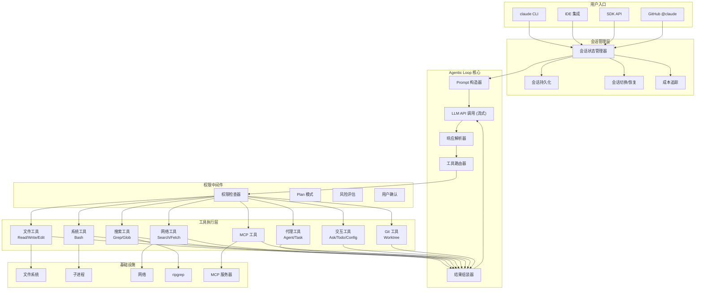
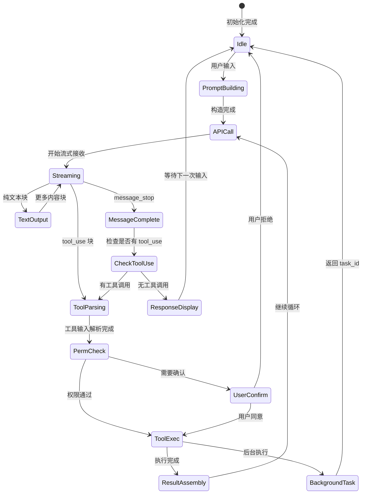
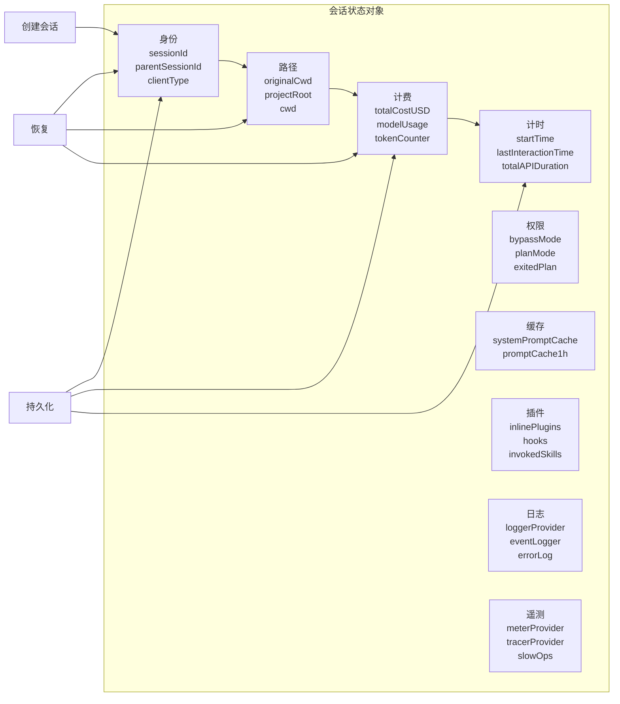
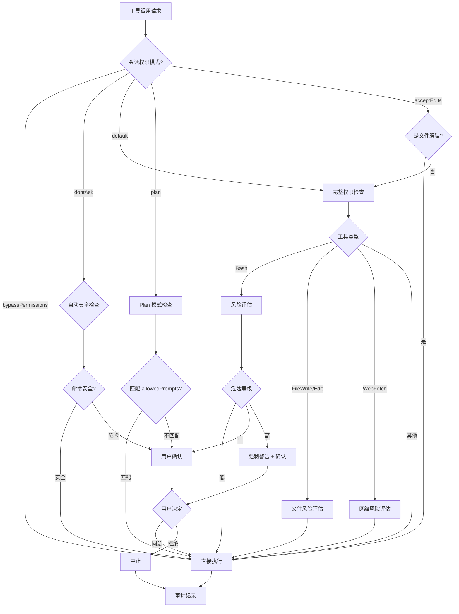

# Claude Code 2.1.88 框架架构深度拆解

## Context

本文档对 `@anthropic-ai/claude-code` 2.1.88 版本进行完整的架构拆解与设计思想分析。该项目是 Anthropic 开发的终端 AI 编码助手，核心设计围绕"Agentic Loop"（代理循环）展开 -- 即通过自然语言驱动的工具调用循环来完成编码任务。

---

## 一、项目总体架构

### 1.1 物理结构

```
anthropic-ai-claude-code-2.1.88/
+-- cli.js                 # 12MB 编译后的单文件可执行入口 (TypeScript -> JS bundled)
+-- cli.js.map             # 57MB Source Map (调试用)
+-- sdk-tools.d.ts         # 2719 行工具输入输出 TypeScript 类型定义
+-- package.json           # 包元数据、bin 入口、可选依赖
+-- bun.lock               # Bun 包管理器锁文件
+-- README.md              # 项目说明
+-- LICENSE.md              # 许可证
+-- vendor/
|   +-- ripgrep/           # 跨平台 ripgrep 二进制 (darwin/linux/win32 x arm64/x64)
|   +-- audio-capture/     # 跨平台音频捕获二进制
+-- .qoder/
    +-- repowiki/zh/       # 中文架构文档
```

### 1.2 核心设计决策

| 决策 | 选择 | 原因 |
|------|------|------|
| 分发形式 | 单文件 Bundle (cli.js) | 零运行时依赖，安装即用 |
| 运行时 | Node.js >= 18 | 广泛可用，ESM 支持成熟 |
| 包管理器 | Bun | 更快的依赖安装 |
| 模块系统 | ES Modules (`type: "module"`) | 现代标准 |
| 搜索引擎 | 内嵌 ripgrep 二进制 | 原生性能，跨平台 |
| 类型系统 | TypeScript (编译发布) | 编译时类型安全 |

---

## 二、分层架构设计

整体架构采用**五层分层设计**：

```
+----------------------------------------------------------+
|                    用户界面层 (UI Layer)                    |
|  终端 CLI | IDE 集成 | GitHub @claude | SDK API           |
+----------------------------------------------------------+
|                 会话管理层 (Session Layer)                  |
|  会话状态 | 持久化 | 切换/恢复 | 成本追踪 | 令牌计数        |
+----------------------------------------------------------+
|              Agentic Loop 层 (Core Loop)                  |
|  消息构造 -> API 调用 -> 流式解析 -> 工具分发 -> 结果回传    |
+----------------------------------------------------------+
|                  工具执行层 (Tool Layer)                    |
|  File | Bash | Grep | Glob | Web | MCP | Agent | Config  |
+----------------------------------------------------------+
|                 基础设施层 (Infra Layer)                    |
|  文件系统 | 子进程 | 网络 | MCP 协议 | ripgrep 二进制       |
+----------------------------------------------------------+
```

---

## 三、核心系统拆解

### 3.1 Agentic Loop (代理循环) -- 最核心的设计

这是整个框架最核心的运行机制。它实现了一个**工具使用循环**：

```
用户输入
    |
    v
构造消息 (system prompt + conversation history + available tools)
    |
    v
+---> 调用 LLM API (流式)
|         |
|         v
|     解析响应
|         |
|     +---+---+
|     |       |
|     v       v
|  纯文本   tool_use block(s)
|  输出     |
|  (结束)   v
|         验证工具输入 (against schema)
|             |
|             v
|         权限检查 (permission middleware)
|             |
|             v
|         执行工具
|             |
|             v
|         构造 tool_result
|             |
+-------------+ (回到 LLM 继续)
```

**设计思想**：
- **LLM 作为调度器**：不是预定义的工作流，而是让 LLM 动态决定下一步操作
- **工具即能力边界**：LLM 的能力通过可用工具集来定义和限制
- **流式处理**：使用 SSE (Server-Sent Events) 实现实时流式响应
- **循环终止条件**：当 LLM 停止请求工具（生成 `end_turn`）时循环结束

### 3.2 工具系统 (Tool System)

#### 3.2.1 类型驱动的工具契约

所有工具通过 `sdk-tools.d.ts` 定义严格的输入/输出类型：

```typescript
// 联合类型定义所有可能的工具输入
type ToolInputSchemas = AgentInput | BashInput | FileReadInput | ...

// 联合类型定义所有可能的工具输出
type ToolOutputSchemas = AgentOutput | BashOutput | FileReadOutput | ...
```

**设计思想**：**Schema-First** -- 先定义契约，再实现执行逻辑。类型定义由 JSON Schema 自动生成 TypeScript 接口。

#### 3.2.2 工具分类体系

**文件操作工具**：
- `FileRead` -- 支持文本/图片/PDF/Notebook 多格式，支持分页（offset/limit）
- `FileWrite` -- 原子写入，返回 diff
- `FileEdit` -- 精确字符串替换（old_string -> new_string），支持 replace_all
- `Glob` -- 基于 glob 模式的文件发现
- `Grep` -- 基于 ripgrep 的正则搜索，支持上下文行、输出模式、类型过滤

**系统操作工具**：
- `Bash` -- 命令执行，支持超时、后台运行、沙箱控制
- `Agent` -- 子代理生成，支持异步、模型覆盖、权限模式、worktree 隔离
- `TaskOutput` / `TaskStop` -- 后台任务监控与终止

**网络工具**：
- `WebSearch` -- 搜索引擎集成，支持域名白/黑名单
- `WebFetch` -- URL 内容抓取 + prompt 处理

**交互工具**：
- `AskUserQuestion` -- 结构化用户问答（1-4 问题，2-4 选项，支持多选）
- `TodoWrite` -- 任务列表管理
- `Config` -- 配置读写

**Git 工具**：
- `EnterWorktree` / `ExitWorktree` -- Git worktree 隔离实验

**MCP 工具**：
- `ListMcpResources` -- MCP 资源发现
- `ReadMcpResource` -- MCP 资源读取

**Notebook 工具**：
- `NotebookEdit` -- Jupyter Notebook 单元格编辑

#### 3.2.3 工具输出的多态设计

`FileReadOutput` 是多态设计的典型例子，使用**鉴别联合类型**（Discriminated Union）：

```typescript
type FileReadOutput =
  | { type: "text";           file: { filePath, content, numLines, startLine, totalLines } }
  | { type: "image";          file: { base64, type, originalSize, dimensions? } }
  | { type: "notebook";       file: { filePath, cells } }
  | { type: "pdf";            file: { filePath, base64, originalSize } }
  | { type: "parts";          file: { filePath, originalSize, count, outputDir } }
  | { type: "file_unchanged"; file: { filePath } }
```

通过 `type` 字段作为鉴别器，上层可以安全地进行类型收窄。

### 3.3 会话状态管理

#### 3.3.1 状态字段体系

会话状态是一个大型的状态对象，包含以下维度：

| 维度 | 关键字段 | 用途 |
|------|---------|------|
| 身份 | sessionId, parentSessionId, clientType | 会话标识与继承关系 |
| 路径 | originalCwd, projectRoot, cwd | 项目定位与目录追踪 |
| 计费 | totalCostUSD, modelUsage, tokenCounter, costCounter | API 成本核算 |
| 计时 | startTime, lastInteractionTime, totalAPIDuration, totalToolDuration | 性能分析 |
| 代码 | totalLinesAdded, totalLinesRemoved | 变更量化 |
| 权限 | sessionBypassPermissionsMode, hasExitedPlanMode | 安全控制 |
| 缓存 | systemPromptSectionCache, promptCache1hAllowlist | 提示优化 |
| 插件 | inlinePlugins, useCoworkPlugins, registeredHooks, invokedSkills | 扩展管理 |
| 日志 | loggerProvider, eventLogger, inMemoryErrorLog | 可观测性 |
| 遥测 | meterProvider, tracerProvider, slowOperations | 监控追踪 |
| 模型 | mainLoopModelOverride, initialMainLoopModel, mainThreadAgentType | 模型选择 |

#### 3.3.2 会话生命周期

```
创建 --> 初始化状态 --> 持久化
           |
           v
    +--- 消息循环 <---+
    |                  |
    v                  |
  工具执行 --> 状态更新 -+
    |
    v (用户退出或超时)
  清理 --> 持久化最终状态
```

**持久化策略**：
- 内存中实时状态
- 按需持久化到文件系统（`~/.claude-code/sessions/`）
- 支持会话恢复 (`--teleport SESSION_ID`)
- 可通过 `sessionPersistenceDisabled` 禁用

### 3.4 权限与安全系统

#### 3.4.1 多层权限模型

```
请求进入
    |
    v
[1] 会话级权限检查 (sessionBypassPermissionsMode)
    |
    v
[2] 工具级权限检查 (如 Bash 的 dangerouslyDisableSandbox)
    |
    v
[3] Plan 模式审批 (ExitPlanMode + allowedPrompts)
    |
    v
[4] 风险评估 (命令危险性分析)
    |
    v
[5] 用户确认 (AskUserQuestion)
    |
    v
[6] 审计记录
    |
    v
执行
```

#### 3.4.2 权限模式

| 模式 | 行为 |
|------|------|
| `default` | 标准权限检查，高风险操作需确认 |
| `plan` | 仅允许规划，执行前需审批 |
| `acceptEdits` | 自动接受文件编辑 |
| `dontAsk` | 跳过确认提示 |
| `bypassPermissions` | 跳过所有检查（危险） |

#### 3.4.3 Plan 模式设计

Plan 模式是一种**语义级权限**系统：
- 代理先生成执行计划
- 用户审查并批准计划
- `ExitPlanModeInput.allowedPrompts` 定义允许的操作类别
- 执行时按语义匹配检查是否在批准范围内

### 3.5 子代理系统 (Agent System)

#### 3.5.1 代理层次结构

```
主代理 (Main Agent)
+-- 子代理 A (subagent_type: "code-reviewer")
+-- 子代理 B (subagent_type: "explore-agent")
+-- 子代理 C (subagent_type: "plan-agent")
    +-- 背景运行 (run_in_background: true)
```

#### 3.5.2 代理配置

`AgentInput` 支持丰富的配置：

```typescript
interface AgentInput {
  description: string;          // 3-5 词任务描述
  prompt: string;              // 完整任务提示
  subagent_type?: string;      // 代理类型特化
  model?: "sonnet"|"opus"|"haiku"; // 模型覆盖
  run_in_background?: boolean; // 异步执行
  name?: string;               // 可寻址名称 (via SendMessage)
  team_name?: string;          // 团队上下文
  mode?: PermissionMode;       // 权限模式
  isolation?: "worktree";      // Git worktree 隔离
}
```

**设计思想**：
- **专业化分工**：不同 subagent_type 拥有不同的工具集和系统提示
- **可寻址通信**：通过 name 实现代理间消息传递
- **隔离执行**：worktree 模式在独立 Git 工作树中运行，不影响主分支
- **后台执行**：异步模式返回 task_id，通过 TaskOutput 监控进度

### 3.6 MCP (Model Context Protocol) 集成

#### 3.6.1 协议架构

```
Claude Code CLI (MCP Client)
        |
        | (MCP Protocol - stdio/SSE)
        |
+-------+-------+
|       |       |
v       v       v
MCP     MCP     MCP
Server  Server  Server
(quest) (genui) (custom)
```

#### 3.6.2 扩展机制

MCP 提供两种扩展点：
1. **Resources** -- 外部数据源（通过 ListMcpResources / ReadMcpResource 访问）
2. **Tools** -- 外部工具（通过 McpInput 调用，工具名格式 `mcp__serverName__toolName`）

**设计思想**：
- **开放协议**：标准化的工具扩展接口，任何人都可以编写 MCP Server
- **懒加载**：MCP 工具需要通过 LoadMcp 显式加载后才可调用
- **安全边界**：MCP 服务器由用户配置，非自动发现

### 3.7 流式消息处理

#### 3.7.1 SSE 事件流

消息处理基于 SSE (Server-Sent Events) 协议：

```
message_start           --> 初始化消息对象
content_block_start     --> 开始新的内容块（text/tool_use）
content_block_delta     --> 增量内容追加
content_block_stop      --> 内容块完成
message_delta           --> 消息级元数据更新
message_stop            --> 消息完成
```

#### 3.7.2 工具调用解析

当流式响应中出现 `tool_use` 类型的内容块时：
1. 增量接收工具名称和 JSON 输入参数
2. `content_block_stop` 时解析完整的工具输入
3. 验证输入是否符合 schema
4. 执行工具并构造 `tool_result`
5. 作为新的 user message 发回 API

### 3.8 Skill 扩展系统

#### 3.8.1 Skill 发现路径

Skills 从多个目录发现和加载：

```
.qoder/skills/              # 项目级 skills
~/.qoder/skills/            # 用户级 skills
.agents/skills/             # 兼容路径
~/.agents/skills/           # 兼容路径
```

#### 3.8.2 Skill 结构

每个 Skill 包含：
- `SKILL.md` -- 元数据（名称、描述、触发条件）和执行指令
- `assets/` -- 可选的 HTML Widget UI 资源

**设计思想**：
- **声明式定义**：通过 Markdown 文件定义 skill，降低开发门槛
- **语义触发**：基于关键词和描述匹配自动调用
- **UI 扩展**：支持 HTML Widget 提供可视化交互界面

### 3.9 配置管理系统

#### 3.9.1 配置层次

```
硬编码默认值 (cli.js 内置)
    ^
    | 覆盖
环境变量 (系统 env)
    ^
    | 覆盖
用户配置 (~/.config/claude/)
    ^
    | 覆盖
运行时参数 (命令行/API)
```

#### 3.9.2 配置项

- 模型选择 (sonnet/opus/haiku)
- 权限模式
- MCP 服务器配置
- 调试选项
- 性能阈值

---

## 四、核心设计思想总结

### 4.1 LLM-as-Orchestrator (LLM 即编排器)

传统的 CLI 工具使用预定义的命令和工作流。Claude Code 的核心创新在于：**让 LLM 作为任务编排器**，根据自然语言指令动态决定调用哪些工具、以什么顺序、如何组合。

### 4.2 Tool-Use Loop (工具使用循环)

这是 "Agentic AI" 的核心模式：
1. LLM 分析任务
2. LLM 选择并调用工具
3. 工具返回结果
4. LLM 根据结果决定下一步
5. 重复直到任务完成

### 4.3 Schema-First Design (Schema 优先设计)

所有工具接口先通过 JSON Schema 定义，然后：
- 自动生成 TypeScript 类型定义
- 自动生成 LLM 的工具描述
- 自动验证输入/输出
- 保证类型安全和 API 一致性

### 4.4 Defense in Depth (纵深防御)

安全不依赖单一检查点，而是多层叠加：
- 会话级权限模式
- 工具级沙箱控制
- Plan 模式语义审批
- 危险操作风险评估
- 用户显式确认
- 审计日志

### 4.5 Zero-Dependency Distribution (零依赖分发)

将所有代码打包为单文件：
- 无运行时依赖 (optionalDependencies 仅用于图像处理)
- 内嵌原生二进制 (ripgrep, audio-capture)
- 安装即用，无需额外配置
- 跨平台支持 (darwin/linux/win32 x arm64/x64)

### 4.6 Streaming-First (流式优先)

所有 LLM 交互都采用流式处理：
- 实时显示生成内容
- 减少首 token 延迟
- 增量解析工具调用
- 降低内存峰值

### 4.7 Hierarchical Agent Architecture (层级代理架构)

支持代理的递归派生：
- 主代理可以派生专业化子代理
- 子代理拥有独立的工具集和权限
- 支持同步/异步执行
- 支持代理间通信 (SendMessage)
- 支持 Git worktree 隔离

### 4.8 Protocol-Based Extensibility (基于协议的可扩展性)

通过 MCP 标准协议实现扩展：
- 不需要修改核心代码即可添加新能力
- 标准化的资源发现和访问接口
- 独立进程运行，故障隔离
- 社区可贡献 MCP 服务器

### 4.9 Context Compression (上下文压缩)

当对话历史超过 token 限制时：
- 自动生成对话摘要
- 用压缩版本替换历史消息
- 保持关键上下文不丢失
- 支持长时间工作会话

### 4.10 Observability by Design (可观测性设计)

内置全面的监控和追踪：
- Token 用量追踪（input/output/cache 分别计数）
- API 调用耗时统计
- 工具执行耗时统计
- 慢操作检测和追踪
- 成本累计计算
- 错误环形缓冲（最近 100 条）
- 代码变更行数统计

---

## 五、深度子系统拆解

### 5.1 Agentic Loop 深度分析

#### 5.1.1 消息构造过程

系统提示 (System Prompt) 的构造是 Agentic Loop 的起点，采用**分段缓存机制**：

```
System Prompt 构造 =
  [基础人设指令]                    # 固定不变
  + [可用工具列表及描述]             # 根据当前工具集动态生成
  + [环境信息 (cwd, platform, date)] # 每次请求动态注入
  + [systemPromptSectionCache 条目]  # 缓存的动态段落
  + [项目特定上下文 (AGENTS.md等)]   # 从 additionalDirectoriesForClaudeMd 加载
```

**缓存优化策略**：
- `systemPromptSectionCache`: Map<string, string> -- 避免重复计算 prompt 段落
- `promptCache1hAllowlist`: 1小时级别的提示缓存白名单
- `promptCache1hEligible`: 标记当前请求是否可利用1小时缓存
- Anthropic API 的 `cache_creation_input_tokens` / `cache_read_input_tokens` 直接反映缓存命中

#### 5.1.2 流式响应处理细节

```
SSE 事件流处理管线：

event: message_start
  -> 初始化 Message 对象 { id, role: "assistant", content: [] }
  -> 记录 usage.input_tokens

event: content_block_start (index=0, type="text")
  -> 创建 TextBlock { type: "text", text: "" }
  -> 追加到 message.content[0]

event: content_block_delta (index=0, type="text_delta")
  -> message.content[0].text += delta.text
  -> 实时渲染到终端

event: content_block_start (index=1, type="tool_use")
  -> 创建 ToolUseBlock { type: "tool_use", id, name, input: "" }
  -> 追加到 message.content[1]

event: content_block_delta (index=1, type="input_json_delta")
  -> 累积 JSON 字符串片段
  -> 注意：此时 JSON 可能不完整，不能解析

event: content_block_stop (index=1)
  -> JSON.parse(完整输入字符串) -> 得到工具输入对象
  -> 进入工具执行管线

event: message_delta
  -> 更新 stop_reason, usage.output_tokens

event: message_stop
  -> 消息完成，检查是否有 tool_use blocks
  -> 有 -> 执行工具，构造 tool_result，继续循环
  -> 无 -> 循环结束，输出最终响应
```

#### 5.1.3 工具并行执行

当 LLM 在一次响应中生成多个 `tool_use` blocks 时：
- **无依赖的工具调用**可以并行执行
- **有依赖的工具调用**必须串行执行
- 所有 `tool_result` 作为一个 user message 批量返回

#### 5.1.4 上下文压缩 (Compaction) 机制

当 token 数量接近模型上下文窗口限制时：

```
触发条件: input_tokens > threshold (接近模型上下文限制)
    |
    v
生成对话摘要 (用小模型或当前模型)
    |
    v
替换历史消息为摘要版本
    |
    v
保留最近 N 条消息原文
    |
    v
继续对话 (缩减后的上下文)
```

### 5.2 工具执行引擎深度分析

#### 5.2.1 Bash 工具执行细节

```
BashInput 进入
    |
    v
[1] 输入校验
    - command: 必填，非空
    - timeout: 可选，max 600000ms (10min)
    - description: 可选，5-10 词描述
    |
    v
[2] 沙箱决策
    - dangerouslyDisableSandbox == true ?
      -> 标记 sandboxDisabled = true
      -> 跳过沙箱
    - 否则进入沙箱模式
    |
    v
[3] 子进程创建
    - 创建 child_process.spawn
    - 设置 stdin/stdout/stderr 管道
    - 设置超时定时器
    |
    v
[4] 输出收集
    - stdout -> 累积到缓冲区
    - stderr -> 累积到缓冲区
    - 超大输出 -> persistedOutputPath 落盘
    |
    v
[5] 后台模式处理
    - run_in_background == true ?
      -> 不等待完成
      -> 返回 backgroundTaskId
      -> 通过 TaskOutput 工具异步获取结果
    |
    v
[6] 结果封装
    BashOutput {
      stdout, stderr, exitCode,
      interrupted, backgroundTaskId,
      sandboxDisabled,
      content: [...结构化内容块...],
      persistedOutputPath?,
      persistedOutputSize?
    }
```

#### 5.2.2 FileEdit 工具精确替换机制

```
FileEditInput { file_path, old_string, new_string, replace_all }
    |
    v
[1] 读取文件内容
    |
    v
[2] 唯一性检查
    - 搜索 old_string 在文件中的出现次数
    - replace_all == false 且出现 > 1 次 -> 报错（歧义）
    - replace_all == false 且出现 == 0 次 -> 报错（未找到）
    |
    v
[3] 执行替换
    - replace_all == true -> 全部替换
    - replace_all == false -> 替换第一个匹配
    |
    v
[4] 生成 diff
    - 计算替换前后的 git-style diff
    - 记录 linesAdded / linesRemoved
    |
    v
[5] 原子写入
    - 写入文件
    - 返回 FileEditOutput { patch, git_diff }
```

这个设计的巧妙之处：
- **old_string 唯一性约束**避免了歧义替换
- **不使用行号定位**，而使用字符串匹配，对 LLM 更友好
- **强制 read-before-edit**：必须先用 FileRead 读取文件才能编辑

#### 5.2.3 Grep 工具内部架构

底层使用 vendor 中的 **ripgrep 二进制**：

```
GrepInput
    |
    v
参数映射: GrepInput -> ripgrep CLI 参数
    pattern   -> rg <pattern>
    path      -> rg ... <path>
    glob      -> rg --glob <glob>
    type      -> rg --type <type>
    -i        -> rg -i (case insensitive)
    -n        -> rg -n (line numbers)
    -A/-B/-C  -> rg -A/-B/-C (context lines)
    multiline -> rg -U --multiline-dotall
    output_mode:
      "files_with_matches" -> rg -l
      "content"            -> rg (default)
      "count"              -> rg -c
    head_limit -> | head -N (默认 250)
    offset     -> | tail -n +N | head -N
    |
    v
执行 vendor/ripgrep/<platform>/rg 二进制
    |
    v
解析输出 -> GrepOutput
```

### 5.3 权限系统深度分析

#### 5.3.1 Plan 模式工作流

```
[1] 用户请求进入 Plan 模式
    -> EnterSpecMode 工具调用
    -> 创建 plan 文件 (.md)
    |
    v
[2] 代理探索代码库 (只读操作)
    -> 只允许 Read, Glob, Grep, Task(explore-agent)
    -> 禁止 Write, Edit, Bash (非只读)
    |
    v
[3] 代理编写计划文件
    -> 只允许编辑 plan 文件本身
    |
    v
[4] ExitPlanMode 调用
    ExitPlanModeInput {
      allowedPrompts: [
        { tool: "Bash", prompt: "run tests" },
        { tool: "Bash", prompt: "install dependencies" }
      ]
    }
    |
    v
[5] 用户审查计划
    -> 确认 -> 进入执行模式，按 allowedPrompts 限制执行
    -> 拒绝 -> 修改计划或放弃
    |
    v
[6] 执行阶段
    -> 每个 Bash 命令按语义匹配 allowedPrompts
    -> 匹配成功 -> 自动执行
    -> 匹配失败 -> 需要额外确认
```

#### 5.3.2 Bash 沙箱机制

沙箱的核心目标是**防止不可逆的危险操作**：

| 危险级别 | 示例命令 | 处理方式 |
|---------|---------|---------|
| 安全 | `ls`, `cat`, `git status` | 直接执行 |
| 中等 | `npm install`, `git commit` | 根据权限模式决定 |
| 危险 | `rm -rf /`, `git push --force` | 强制用户确认 |
| 极危险 | 包含凭证/密钥的命令 | 阻止执行 |

### 5.4 MCP 协议深度分析

#### 5.4.1 MCP 传输层

MCP 支持三种传输协议：

| 传输方式 | 适用场景 | 特点 |
|---------|---------|------|
| **stdio** | 本地进程 | 通过 stdin/stdout 通信，最简单 |
| **HTTP+SSE** | 远程服务 | HTTP 请求 + SSE 事件流 |
| **WebSocket** | 实时双向 | 全双工通信 |

#### 5.4.2 MCP 工具加载流程

```
[1] 用户配置 MCP 服务器 (settings.json)
    {
      "mcpServers": {
        "quest": { "command": "...", "args": [...] }
      }
    }
    |
    v
[2] CLI 启动时连接 MCP 服务器
    - 根据传输类型建立连接
    - 发送 initialize 请求
    - 接收服务器能力声明
    |
    v
[3] 工具发现
    - 调用 tools/list 获取可用工具
    - 每个工具: { name, description, inputSchema }
    |
    v
[4] 工具注册 (LoadMcp)
    - 将 MCP 工具注册为 mcp__<server>__<tool> 格式
    - 例: mcp__quest__search_codebase
    - 添加到 LLM 可用工具列表
    |
    v
[5] 工具调用
    - LLM 生成 tool_use { name: "mcp__quest__search_codebase", input: {...} }
    - CLI 路由到对应 MCP 服务器
    - 通过 MCP 协议发送 tools/call 请求
    - 接收结果并返回给 LLM
```

#### 5.4.3 MCP 认证体系

```
认证方式选择：

[1] Bearer Token
    -> headers: { Authorization: "Bearer <token>" }
    -> 适用于 API Key 认证

[2] OAuth 2.0
    -> 完整 OAuth 流程 (authorize -> callback -> token)
    -> 支持 PKCE 扩展
    -> Token 自动刷新

[3] 环境变量
    -> MCP 服务器进程继承环境变量
    -> 配置中指定 env: { "API_KEY": "..." }

[4] 自定义头部
    -> 配置中指定 headers: { "X-Custom-Auth": "..." }
```

### 5.5 子代理系统深度分析

#### 5.5.1 代理类型与工具集映射

| 代理类型 | 可用工具 | 用途 |
|---------|---------|------|
| `explore-agent` | Read, Glob, Grep, Bash, mcp__quest__search_* | 快速代码探索 |
| `code-reviewer` | Bash, Read, Glob, Grep, WebSearch, WebFetch | 代码审查 |
| `plan-agent` | Read, Glob, Grep, Bash, mcp__quest__search_* | 实现计划设计 |
| `general-purpose` | 所有工具 | 通用任务 |
| `browser-agent` | Read, Glob, Grep, WebFetch, WebSearch, mcp__browser-use__* | 浏览器自动化 |
| `design-agent` | Read, Write, Edit, Glob, Grep, WebFetch, WebSearch | 设计文档 |
| `qoder-guide` | Read, Glob, Grep, WebFetch, WebSearch | 使用指南 |

#### 5.5.2 子代理通信模型

```
主代理
    |
    |-- [同步调用] --> 子代理 A
    |   等待完成，获取完整结果
    |
    |-- [异步调用] --> 子代理 B (run_in_background: true)
    |   立即返回 agentId + outputFile
    |   |
    |   |-- [轮询] TaskOutput(task_id: agentId, block: true)
    |   |   等待完成获取结果
    |   |
    |   |-- [终止] TaskStop(task_id: agentId)
    |       强制停止
    |
    |-- [命名代理] --> 子代理 C (name: "reviewer")
        |
        |-- [消息传递] SendMessage(to: "reviewer", content: "...")
            实现代理间协作
```

#### 5.5.3 Worktree 隔离模式

```
EnterWorktree(name: "feature-x")
    |
    v
[1] git worktree add /tmp/worktree-feature-x -b feature-x
    -> 创建新的工作树和分支
    |
    v
[2] 切换 CLI cwd 到工作树目录
    -> 后续所有操作在工作树中执行
    |
    v
[3] 代理在隔离环境中执行任务
    -> 文件修改不影响主分支
    -> Git 操作在独立分支
    |
    v
ExitWorktree(action: "save" | "discard")
    |
    +-- save: 保留更改，可合并回主分支
    +-- discard: 删除工作树和分支
```

---

## 六、可视化架构图表

### 6.1 整体架构鸟瞰图 (Mermaid)



### 6.2 Agentic Loop 状态机 (Mermaid)



### 6.3 工具类型层次 (Mermaid)

```mermaid
classDiagram
    class ToolInputSchemas {
        <<union type>>
    }
    class ToolOutputSchemas {
        <<union type>>
    }
    
    class AgentInput {
        +description: string
        +prompt: string
        +subagent_type?: string
        +model?: sonnet|opus|haiku
        +run_in_background?: boolean
        +name?: string
        +isolation?: worktree
    }
    
    class BashInput {
        +command: string
        +timeout?: number
        +description?: string
        +run_in_background?: boolean
        +dangerouslyDisableSandbox?: boolean
    }
    
    class FileReadInput {
        +file_path: string
        +offset?: number
        +limit?: number
        +pages?: string
    }
    
    class FileEditInput {
        +file_path: string
        +old_string: string
        +new_string: string
        +replace_all?: boolean
    }
    
    class GrepInput {
        +pattern: string
        +path?: string
        +glob?: string
        +output_mode?: string
        +head_limit?: number
        +multiline?: boolean
    }
    
    class WebSearchInput {
        +query: string
        +allowed_domains?: string[]
        +blocked_domains?: string[]
    }
    
    class AgentOutput {
        +agentId: string
        +content: TextBlock[]
        +totalToolUseCount: number
        +totalTokens: number
        +status: completed|async_launched
    }
    
    class FileReadOutput {
        <<discriminated union>>
        +type: text|image|notebook|pdf|parts|file_unchanged
    }
    
    class BashOutput {
        +stdout: string
        +stderr: string
        +exitCode: number
        +interrupted: boolean
        +backgroundTaskId?: string
    }
    
    ToolInputSchemas <|-- AgentInput
    ToolInputSchemas <|-- BashInput
    ToolInputSchemas <|-- FileReadInput
    ToolInputSchemas <|-- FileEditInput
    ToolInputSchemas <|-- GrepInput
    ToolInputSchemas <|-- WebSearchInput
    
    ToolOutputSchemas <|-- AgentOutput
    ToolOutputSchemas <|-- FileReadOutput
    ToolOutputSchemas <|-- BashOutput
```



### 6.4 会话状态管理全景 (Mermaid)



### 6.5 权限检查流程 (Mermaid)



---

## 七、与其他 AI Agent 框架对比

### 7.1 对比维度总览

| 特性 | Claude Code | LangChain/LangGraph | AutoGPT | OpenAI Assistants API | Cursor/Windsurf |
|------|------------|--------------------|---------|--------------------|----------------|
| **核心模式** | Tool-Use Loop | Chain/Graph DAG | 自主循环 | Thread + Run | IDE 内嵌 |
| **编排方式** | LLM 动态决策 | 预定义 Chain/Graph | 自主目标分解 | LLM + Thread | LLM + IDE 集成 |
| **工具定义** | JSON Schema -> TypeScript | Python 函数装饰器 | Plugin 系统 | Function Calling | 内置 IDE 工具 |
| **分发形式** | 单文件 Bundle | Python 库 | Docker/Python | REST API | 桌面应用 |
| **扩展协议** | MCP (开放标准) | 自定义接口 | Plugin 协议 | 无标准协议 | 无标准协议 |
| **执行环境** | 终端/CLI | 任意 Python 环境 | Docker 容器 | 云端 | IDE 内 |
| **安全模型** | 多层权限 + Plan 模式 | 无内置安全 | Docker 隔离 | API 级别 | IDE 沙箱 |
| **会话管理** | 有状态持久化 | 内存 + 外部存储 | 内存 | Thread 持久化 | IDE 工作区 |
| **多代理** | 层级代理 + 通信 | LangGraph Multi-Agent | 无原生支持 | 无原生支持 | 无原生支持 |
| **上下文窗口** | 自动压缩 | 手动管理 | 手动管理 | 自动截断 | 自动管理 |

### 7.2 核心设计差异分析

#### 7.2.1 编排模式对比

**Claude Code -- LLM 动态编排**：
```
用户指令 -> LLM 自主决策工具序列 -> 执行 -> 反馈 -> 再决策 -> ...
```
- 优点：灵活性最高，能处理未预见的场景
- 缺点：行为不可预测，调试困难

**LangChain/LangGraph -- 预定义 DAG 编排**：
```
用户指令 -> 进入预定义的 Chain/Graph -> 按 DAG 节点顺序执行 -> 输出
```
- 优点：行为可预测，易于调试和测试
- 缺点：灵活性受限于 DAG 设计

**AutoGPT -- 自主目标分解**：
```
用户目标 -> AI 自动分解为子目标 -> 逐个执行子目标 -> 自我评估 -> ...
```
- 优点：全自主，适合长期任务
- 缺点：容易失控，成本高，准确性难保证

#### 7.2.2 工具系统对比

**Claude Code**：
- Schema-First: JSON Schema 定义 -> TypeScript 类型自动生成
- 工具与 LLM 紧耦合（工具描述直接嵌入 system prompt）
- 多态输出（Discriminated Union）

**LangChain**：
```python
@tool
def search(query: str) -> str:
    """搜索互联网"""
    return search_engine.search(query)
```
- Code-First: Python 函数 + 装饰器
- 通过 docstring 生成工具描述
- 工具与执行器解耦（可接入不同 LLM）

**关键区别**：Claude Code 是 "为一个 LLM 优化的紧耦合系统"，LangChain 是 "可接入多种 LLM 的松耦合框架"。

#### 7.2.3 安全模型对比

**Claude Code -- 纵深防御**：
```
6 层安全检查: 会话权限 -> 工具权限 -> Plan 审批 -> 风险评估 -> 用户确认 -> 审计
```
- Plan 模式：语义级权限审批（独创）
- 沙箱：Bash 命令沙箱化执行

**LangChain -- 无内置安全**：
- 开发者自行实现安全检查
- 无标准化的权限模型

**AutoGPT -- 容器隔离**：
- Docker 容器提供进程级隔离
- 无细粒度的工具权限控制

#### 7.2.4 扩展性对比

**Claude Code -- MCP 协议**：
- 标准化协议，独立进程运行
- 支持 Resources + Tools 两种扩展
- 社区驱动，服务器可独立开发和分发
- 类似浏览器与 Web 服务器的关系

**LangChain -- Python 接口**：
- 继承 BaseTool 类，实现 _run 方法
- 与 Python 生态深度集成
- 社区贡献 langchain-community 包
- 更适合快速原型

**OpenAI -- Function Calling**：
- 纯 API 层面的工具定义
- 无标准化的运行时扩展
- 需要开发者自行实现工具执行

### 7.3 设计哲学对比

| 理念 | Claude Code | LangChain | AutoGPT |
|------|------------|-----------|---------|
| **核心哲学** | "终端就是 IDE" | "LLM 是可组合的积木" | "AI 应该自主工作" |
| **用户角色** | 协作者（human-in-the-loop） | 开发者（构建 AI 应用） | 监督者（设定目标） |
| **复杂度管理** | 单文件 Bundle，零配置 | 模块化，按需组合 | 容器化，预配置 |
| **错误处理** | LLM 自动重试和调整策略 | 开发者定义错误处理链 | AI 自行评估和修正 |
| **成本控制** | 内置 token 计数和成本追踪 | 无内置成本控制 | 高成本（大量自主循环） |
| **安全优先级** | 最高（多层防御） | 开发者自行管理 | 容器隔离 |

### 7.4 适用场景对比

| 场景 | 推荐框架 | 原因 |
|------|---------|------|
| 日常编码辅助 | **Claude Code** / Cursor | 深度代码理解，工具丰富 |
| 构建 AI 产品 | **LangChain** | 灵活组合，多模型支持 |
| 自动化长期任务 | **AutoGPT** | 全自主运行 |
| API 集成 | **OpenAI Assistants** | 简单直接的 API |
| 多代理协作 | **Claude Code** / LangGraph | 原生多代理支持 |
| 安全敏感场景 | **Claude Code** | 最完善的权限系统 |
| 快速原型 | **LangChain** | Python 生态，文档丰富 |

---

## 八、关键文件清单

| 文件 | 行数 | 用途 |
|------|------|------|
| `cli.js` | ~16,667 | 编译后的完整运行时，包含所有业务逻辑 |
| `sdk-tools.d.ts` | 2,719 | 工具输入/输出的 TypeScript 类型定义 |
| `package.json` | 34 | 包元数据、二进制入口、可选依赖 |
| `vendor/ripgrep/` | - | 6 个平台的 ripgrep 二进制 |
| `vendor/audio-capture/` | - | 6 个平台的音频捕获二进制 |
| `.qoder/repowiki/zh/` | - | 中文架构文档体系 |

---

## 六、验证方式

由于这是一个分析任务（非实现任务），验证方式为：
1. 交叉比对 `sdk-tools.d.ts` 中的类型定义与文档描述的一致性
2. 通过 `cli.js` 的 source map 验证编译后代码与文档描述的架构映射
3. 运行 `claude --version` 确认版本号一致
4. 阅读 `.qoder/repowiki/` 中的详细文档补充和验证分析结果
