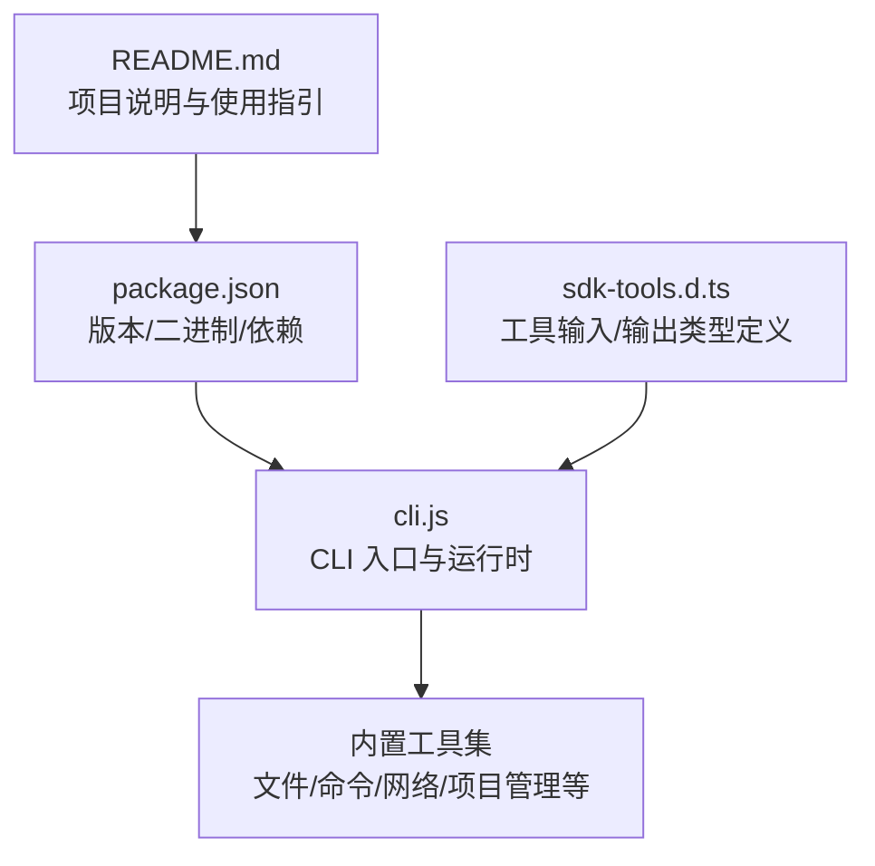
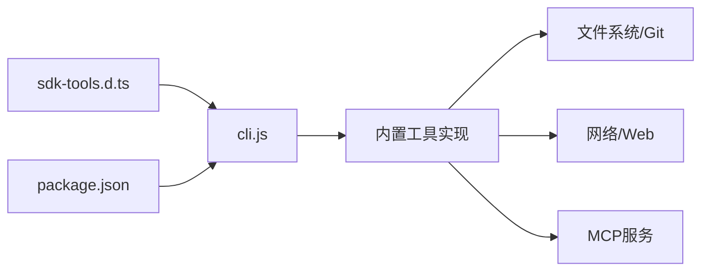

# 内置工具详解

<cite>
**本文引用的文件**
- [README.md](file://README.md)
- [package.json](file://package.json)
- [sdk-tools.d.ts](file://sdk-tools.d.ts)
- [cli.js](file://cli.js)
</cite>

## 目录
1. [简介](#简介)
2. [项目结构](#项目结构)
3. [核心组件](#核心组件)
4. [架构总览](#架构总览)
5. [详细组件分析](#详细组件分析)
6. [依赖关系分析](#依赖关系分析)
7. [性能考量](#性能考量)
8. [故障排查指南](#故障排查指南)
9. [结论](#结论)
10. [附录](#附录)

## 简介
本文件面向 Claude Code 的内置工具体系，系统性梳理其工具分类、输入输出规范、使用方式与最佳实践，并结合仓库中的类型定义与 CLI 入口文件，解释工具的实现原理、安全限制与组合使用技巧。Claude Code 是一个在终端中运行的智能编码助手，支持通过自然语言指令执行常规任务、解释复杂代码、处理 Git 工作流等。内置工具覆盖文件操作、系统命令、网络搜索、项目管理等多个方面。

## 项目结构
该仓库以类型定义为核心，配合 CLI 入口文件与包配置，形成“类型驱动”的工具接口规范与运行时入口：
- 类型定义：sdk-tools.d.ts 提供所有内置工具的输入/输出 JSON Schema 对应的 TypeScript 接口，明确各工具的参数、返回值与语义。
- CLI 入口：cli.js 提供命令行入口与运行时逻辑（消息流、工具调用、计费统计等）。
- 包配置：package.json 定义版本、二进制入口、引擎要求与可选依赖（如多平台图像处理库）。

图表来源
- [README.md:1-44](file://README.md#L1-L44)
- [package.json:1-34](file://package.json#L1-L34)
- [sdk-tools.d.ts:1-54](file://sdk-tools.d.ts#L1-L54)
- [cli.js:1-100](file://cli.js#L1-L100)

章节来源
- [README.md:1-44](file://README.md#L1-L44)
- [package.json:1-34](file://package.json#L1-L34)

## 核心组件
内置工具按功能域分为以下类别（基于类型定义）：
- 文件操作类：文件读取、写入、编辑、Glob 搜索、文本检索（Grep）
- 系统命令类：Bash 执行、任务输出查询、任务停止
- 网络搜索类：Web 搜索、网页抓取
- 项目管理类：工作树进入/退出、配置读写、计划模式退出
- 交互类：向用户提问（AskUserQuestion）
- Notebook 编辑类：Jupyter Notebook 单元格编辑
- MCP 资源类：列出资源、读取资源
- 通用类：任务输出、任务停止、Todo 写入

章节来源
- [sdk-tools.d.ts:11-33](file://sdk-tools.d.ts#L11-L33)
- [sdk-tools.d.ts:34-54](file://sdk-tools.d.ts#L34-L54)

## 架构总览
工具调用流程（概念图）：
- 用户或代理通过自然语言提出任务
- 系统解析为具体工具调用（含输入参数）
- 运行时根据工具类型执行相应逻辑（文件读写、命令执行、网络请求、Git 操作等）
- 返回标准化输出（含结构化数据与统计信息）

[此图为概念流程示意，不直接映射到具体源码文件，故无图表来源]

## 详细组件分析

### 文件操作工具

#### 文件读取（FileRead）
- 输入参数
  - file_path: 绝对路径
  - offset?: 从某行开始读取（大文件分段）
  - limit?: 读取行数
  - pages?: PDF 页面范围（如 "1-5"）
- 输出格式
  - 支持多种类型：text、image、notebook、pdf、parts、file_unchanged
  - 文本类型包含文件路径、内容、行数统计等
  - 图片类型包含 base64 数据、MIME 类型、尺寸信息
  - PDF 类型包含 base64、原始大小、页面提取信息
- 使用示例
  - 读取大文件的指定区间：设置 offset 与 limit
  - 抓取 PDF 的指定页：设置 pages
- 最佳实践
  - 大文件分段读取避免内存压力
  - PDF 分页读取控制在单次请求 20 页以内
- 安全与限制
  - 仅允许读取已授权路径
  - 图像/PDF 输出可能被转换为 base64 或临时文件路径

章节来源
- [sdk-tools.d.ts:376-393](file://sdk-tools.d.ts#L376-L393)
- [sdk-tools.d.ts:107-230](file://sdk-tools.d.ts#L107-L230)

#### 文件写入（FileWrite）
- 输入参数
  - file_path: 绝对路径
  - content: 待写入内容
- 输出格式
  - filePath、content、structuredPatch、originalFile
  - 可选 gitDiff 字段（当存在变更时）
- 使用示例
  - 覆盖写入新文件或更新现有文件
- 最佳实践
  - 避免写入敏感路径
  - 结合 Git 工作流进行受控变更
- 安全与限制
  - 仅限绝对路径
  - 变更会被记录并可生成 diff

章节来源
- [sdk-tools.d.ts:394-403](file://sdk-tools.d.ts#L394-L403)
- [sdk-tools.d.ts:2292-2332](file://sdk-tools.d.ts#L2292-L2332)

#### 文件编辑（FileEdit）
- 输入参数
  - file_path: 绝对路径
  - old_string: 待替换文本
  - new_string: 替换文本（需与 old_string 不同）
  - replace_all?: 是否替换全部匹配项（默认 false）
- 输出格式
  - 同 FileWrite 的结构化变更信息
- 使用示例
  - 小范围文本替换
- 最佳实践
  - 精确匹配 old_string，避免误替换
  - 大量替换时开启 replace_all 并谨慎核对

章节来源
- [sdk-tools.d.ts:358-375](file://sdk-tools.d.ts#L358-L375)
- [sdk-tools.d.ts:2244-2291](file://sdk-tools.d.ts#L2244-L2291)

#### Glob 搜索（Glob）
- 输入参数
  - pattern: glob 模式
  - path?: 搜索目录（未提供则使用当前工作目录）
- 输出格式
  - durationMs、numFiles、filenames、truncated
- 使用示例
  - 查找特定类型文件：pattern 为 "*.js" 或 "*.{ts,tsx}"
- 最佳实践
  - 控制结果数量，必要时配合过滤器
- 安全与限制
  - 默认限制最多返回 100 个文件

章节来源
- [sdk-tools.d.ts:404-413](file://sdk-tools.d.ts#L404-L413)
- [sdk-tools.d.ts:2333-2350](file://sdk-tools.d.ts#L2333-L2350)

#### 文本检索（Grep）
- 输入参数
  - pattern: 正则表达式
  - path?: 搜索目录/文件
  - glob?: 文件类型过滤（如 "*.js"）
  - output_mode?: "content"/"files_with_matches"/"count"
  - 上下文参数：-B/-A/-C、-n、-i、type、head_limit、offset、multiline
- 输出格式
  - mode、numFiles、filenames、content、numLines、numMatches、appliedLimit、appliedOffset
- 使用示例
  - 在代码库中查找特定函数签名
- 最佳实践
  - 使用 -n 显示行号便于定位
  - 使用 head_limit 控制输出规模

章节来源
- [sdk-tools.d.ts:414-471](file://sdk-tools.d.ts#L414-L471)
- [sdk-tools.d.ts:2351-2360](file://sdk-tools.d.ts#L2351-L2360)

### 系统命令工具

#### Bash 执行（Bash）
- 输入参数
  - command: 待执行命令
  - timeout?: 超时（毫秒，最大 600000）
  - description?: 命令描述（用于审计与解释）
  - run_in_background?: 后台执行
  - dangerouslyDisableSandbox?: 危险地禁用沙箱（仅在严格控制下使用）
- 输出格式
  - stdout、stderr、interrupted、backgroundTaskId（若后台执行）
  - isImage、dangerouslyDisableSandbox、returnCodeInterpretation、noOutputExpected、persistedOutputPath/persistedOutputSize 等
- 使用示例
  - 安装依赖：npm install
  - 清理缓存：find . -name "*.tmp" -exec rm {} \;
- 最佳实践
  - 为复杂命令提供清晰的 description
  - 长时间命令考虑 run_in_background 并稍后通过 TaskOutput 查询
- 安全与限制
  - 默认启用沙箱；仅在极少数情况下允许禁用
  - 超时上限防止长时间阻塞

章节来源
- [sdk-tools.d.ts:296-327](file://sdk-tools.d.ts#L296-L327)
- [sdk-tools.d.ts:2160-2217](file://sdk-tools.d.ts#L2160-L2217)

#### 任务输出查询（TaskOutput）
- 输入参数
  - task_id: 任务 ID
  - block: 是否等待完成
  - timeout: 最大等待时间（毫秒）
- 输出格式
  - 任务状态与结果（由具体任务类型决定）
- 使用示例
  - 获取后台 Bash 命令的最终输出

章节来源
- [sdk-tools.d.ts:328-341](file://sdk-tools.d.ts#L328-L341)

#### 任务停止（TaskStop）
- 输入参数
  - task_id?: 指定任务 ID
  - shell_id?: 兼容字段（已弃用）
- 输出格式
  - message、task_id、task_type、command（若有）

章节来源
- [sdk-tools.d.ts:471-481](file://sdk-tools.d.ts#L471-L481)

### 网络搜索工具

#### Web 搜索（WebSearch）
- 输入参数
  - query: 搜索关键词
  - allowed_domains?: 仅允许的域名列表
  - blocked_domains?: 屏蔽的域名列表
- 输出格式
  - query、results（标题/链接数组或模型生成的文本）、durationSeconds
- 使用示例
  - 快速检索技术文档或社区讨论
- 最佳实践
  - 限定 allowed_domains 提升相关性
  - 使用 blocked_domains 过滤低质量站点

章节来源
- [sdk-tools.d.ts:542-556](file://sdk-tools.d.ts#L542-L556)
- [sdk-tools.d.ts:2482-2516](file://sdk-tools.d.ts#L2482-L2516)

#### 网页抓取（WebFetch）
- 输入参数
  - url: 目标 URL
  - prompt: 对抓取内容应用的处理提示
- 输出格式
  - bytes、code、codeText、result、durationMs、url
- 使用示例
  - 抓取并摘要特定页面内容
- 最佳实践
  - 为 prompt 提供明确的抽取/总结目标
  - 注意反爬虫与速率限制

章节来源
- [sdk-tools.d.ts:532-542](file://sdk-tools.d.ts#L532-L542)
- [sdk-tools.d.ts:2456-2481](file://sdk-tools.d.ts#L2456-L2481)

### 项目管理工具

#### 工作树进入/退出（EnterWorktree/ExitWorktree）
- EnterWorktree
  - 输入：无（隐式使用当前仓库上下文）
  - 输出：worktreePath、worktreeBranch、message
- ExitWorktree
  - 输入：action（"keep"|"remove"），discard_changes（删除且有未提交变更时必需）
  - 输出：action、originalCwd、worktreePath、worktreeBranch、tmuxSessionName、discardedFiles、discardedCommits、message
- 使用示例
  - 在隔离工作树中进行实验性修改，完成后选择保留或清理
- 最佳实践
  - 删除前确认 discard_changes 选项，避免丢失工作

章节来源
- [sdk-tools.d.ts:2143-2159](file://sdk-tools.d.ts#L2143-L2159)
- [sdk-tools.d.ts:2705-2719](file://sdk-tools.d.ts#L2705-L2719)

#### 计划模式退出（ExitPlanMode）
- 输入：allowedPrompts（按工具与动作语义描述的权限）
- 输出：plan（可空）、isAgent、filePath（可选）、hasTaskTool（可选）、planWasEdited（可选）、awaitingLeaderApproval（可选）、requestId（可选）
- 使用示例
  - 在计划模式下提交/批准计划，或导出计划文件

章节来源
- [sdk-tools.d.ts:342-357](file://sdk-tools.d.ts#L342-L357)
- [sdk-tools.d.ts:2218-2244](file://sdk-tools.d.ts#L2218-L2244)

#### 配置读写（Config）
- 输入：operation（"get"|"set"）、setting、value
- 输出：success、operation、setting、value、previousValue、newValue、error（可选）
- 使用示例
  - 获取/设置运行时配置项

章节来源
- [sdk-tools.d.ts:2133-2142](file://sdk-tools.d.ts#L2133-L2142)
- [sdk-tools.d.ts:2696-2704](file://sdk-tools.d.ts#L2696-L2704)

### 交互与协作工具

#### 向用户提问（AskUserQuestion）
- 输入：questions（1-4 个问题），每个问题包含 header、options（2-4 选项）、multiSelect
- 输出：questions（原样回显）、answers（问题->答案映射）、annotations（可选预览/备注）
- 使用示例
  - 在不确定时引导用户选择方案
- 最佳实践
  - 选项描述简洁明确，提供预览内容帮助对比

章节来源
- [sdk-tools.d.ts:556-556](file://sdk-tools.d.ts#L556-L556)  // 注意：此处为占位，实际定义在后续行
- [sdk-tools.d.ts:2517-2695](file://sdk-tools.d.ts#L2517-L2695)

### Notebook 编辑工具

#### Notebook 单元格编辑（NotebookEdit）
- 输入：notebook_path、cell_id（可选）、new_source、cell_type（code/markdown，插入时必填）、edit_mode（replace/insert/delete，默认 replace）
- 输出：new_source、cell_id、cell_type、language、edit_mode、error（可选）、notebook_path、original_file、updated_file
- 使用示例
  - 修改 Jupyter Notebook 中的代码单元格
- 最佳实践
  - 插入新单元格时明确 cell_type

章节来源
- [sdk-tools.d.ts:491-512](file://sdk-tools.d.ts#L491-L512)
- [sdk-tools.d.ts:2379-2416](file://sdk-tools.d.ts#L2379-L2416)

### MCP 资源工具

#### 列举 MCP 资源（ListMcpResources）
- 输入：server（可选，按服务器过滤）
- 输出：uri、name、mimeType、description、server 数组
- 使用示例
  - 发现可用的 MCP 服务资源

章节来源
- [sdk-tools.d.ts:482-487](file://sdk-tools.d.ts#L482-L487)
- [sdk-tools.d.ts:231-252](file://sdk-tools.d.ts#L231-L252)

#### 读取 MCP 资源（ReadMcpResource）
- 输入：server、uri
- 输出：contents（uri、mimeType、text、blobSavedTo）
- 使用示例
  - 从 MCP 服务读取资源内容

章节来源
- [sdk-tools.d.ts:513-522](file://sdk-tools.d.ts#L513-L522)
- [sdk-tools.d.ts:2417-2436](file://sdk-tools.d.ts#L2417-L2436)

### 通用工具

#### Todo 写入（TodoWrite）
- 输入：todos（数组，每项包含 content、status、activeForm）
- 输出：oldTodos、newTodos、verificationNudgeNeeded（可选）
- 使用示例
  - 更新任务清单状态

章节来源
- [sdk-tools.d.ts:523-532](file://sdk-tools.d.ts#L523-L532)
- [sdk-tools.d.ts:2437-2455](file://sdk-tools.d.ts#L2437-L2455)

## 依赖关系分析
- 类型定义与运行时耦合
  - sdk-tools.d.ts 作为“契约”，约束工具输入/输出结构
  - cli.js 作为运行时，负责消息流、工具调用、计费统计与会话管理
- 外部依赖
  - 可选图像处理依赖（多平台 sharp 包），用于图片/PDF 处理能力
- 版本与入口
  - package.json 指定 Node 引擎版本与二进制入口（claude）

图表来源
- [sdk-tools.d.ts:1-54](file://sdk-tools.d.ts#L1-L54)
- [package.json:1-34](file://package.json#L1-L34)
- [cli.js:1-100](file://cli.js#L1-L100)

章节来源
- [package.json:1-34](file://package.json#L1-L34)
- [sdk-tools.d.ts:1-54](file://sdk-tools.d.ts#L1-L54)

## 性能考量
- 大文件读取与 PDF 处理
  - 建议分段读取（FileRead 的 offset/limit）与分页（pages）
  - 控制单次 PDF 页面数量不超过 20 页
- 搜索与检索
  - Grep 使用 head_limit 与 offset 控制输出规模
  - Glob 限制最多返回 100 个文件
- 命令执行
  - 设置合理 timeout，长任务使用 run_in_background 并异步轮询
- 网络请求
  - WebSearch/ WebFetch 建议限制域名范围与频率，避免触发反爬策略

[本节为通用指导，无需章节来源]

## 故障排查指南
- Bash 执行失败
  - 检查是否被沙箱限制（dangerouslyDisableSandbox 仅在特殊场景使用）
  - 查看 stdout/stderr 与 interrupted 标志
  - 使用 persistedOutputPath/persistedOutputSize 获取大输出
- 文件读取异常
  - 确认路径为绝对路径且可访问
  - 对于 PDF，检查 pages 参数是否越界
- 网络请求错误
  - WebSearch/ WebFetch 返回 code/codeText，结合 durationMs 定位问题
- 任务卡住
  - 使用 TaskOutput 查询任务状态，必要时 TaskStop 终止

章节来源
- [sdk-tools.d.ts:2160-2217](file://sdk-tools.d.ts#L2160-L2217)
- [sdk-tools.d.ts:107-230](file://sdk-tools.d.ts#L107-L230)
- [sdk-tools.d.ts:2456-2481](file://sdk-tools.d.ts#L2456-L2481)
- [sdk-tools.d.ts:328-341](file://sdk-tools.d.ts#L328-L341)
- [sdk-tools.d.ts:471-481](file://sdk-tools.d.ts#L471-L481)

## 结论
Claude Code 的内置工具以类型驱动的方式提供了统一的输入/输出契约，覆盖文件操作、系统命令、网络搜索、项目管理与交互协作等关键领域。通过合理的参数设计、输出结构与安全限制，工具能够在保证可控性的前提下高效完成复杂任务。建议在实际使用中遵循分段处理、限额控制与最小权限原则，并善用组合工具提升效率。

[本节为总结，无需章节来源]

## 附录

### 工具组合使用场景与技巧
- 文件变更流水线
  - FileRead -> FileEdit/FileWrite -> Git 变更（由输出的 gitDiff 辅助核验）
- 代码检索与修复
  - Grep 定位 -> FileEdit 精准替换 -> FileWrite 保存 -> Bash 执行测试
- 实验性开发
  - EnterWorktree 创建隔离工作树 -> NotebookEdit/ FileWrite 修改 -> ExitWorktree 选择保留或清理
- 信息收集与总结
  - WebSearch/ WebFetch -> AskUserQuestion -> TodoWrite 更新任务清单

[本节为概念性指导，无需章节来源]