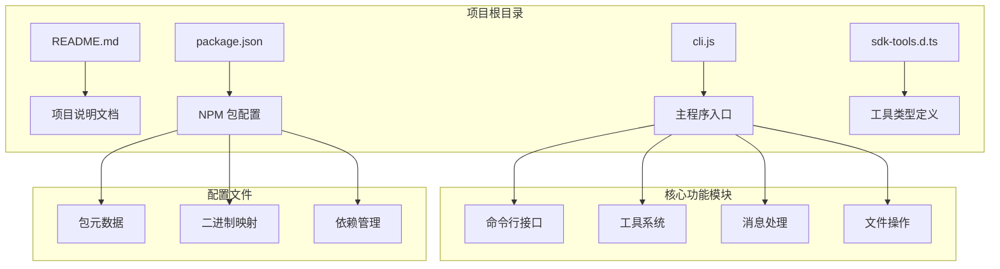
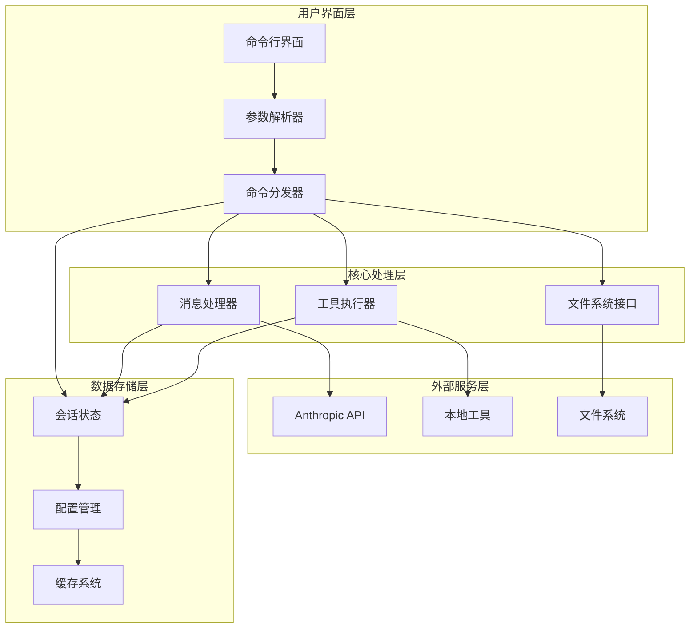
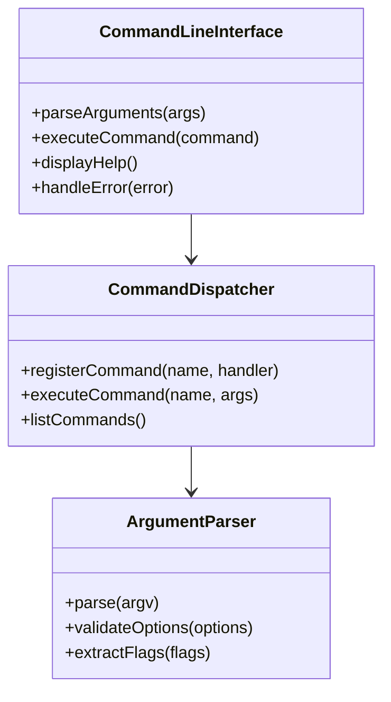
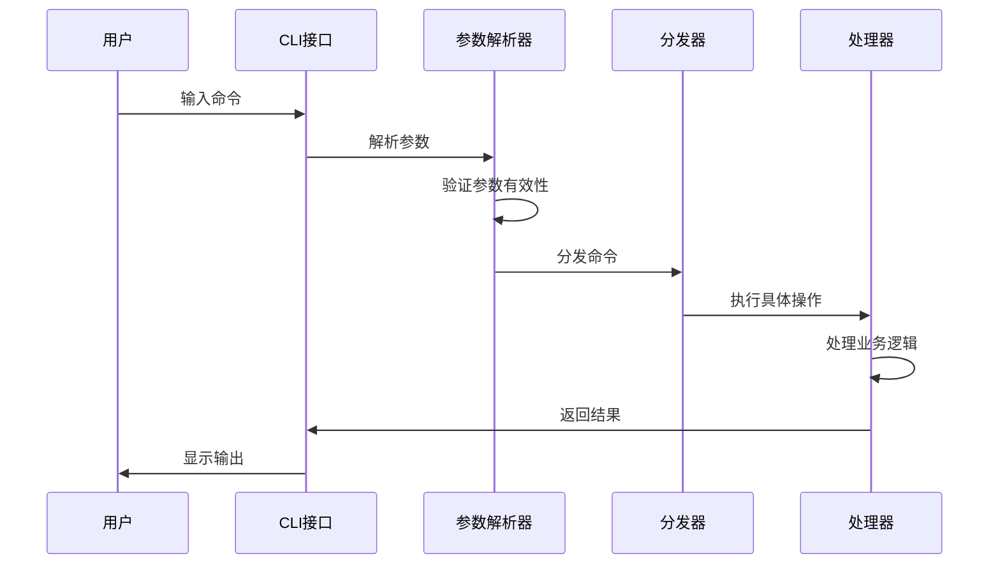
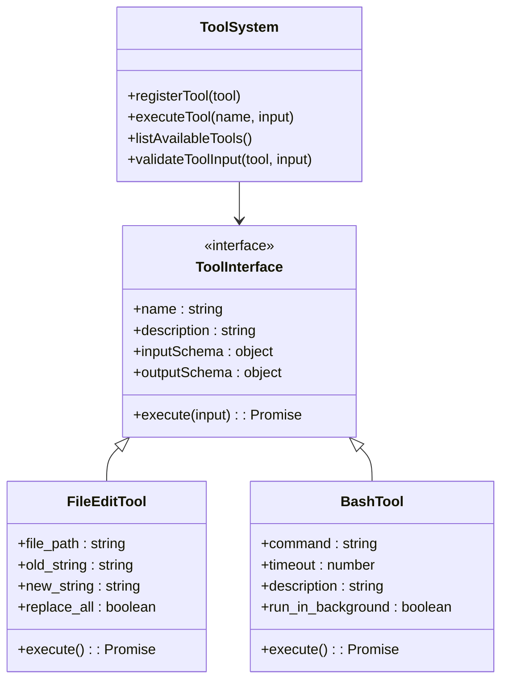
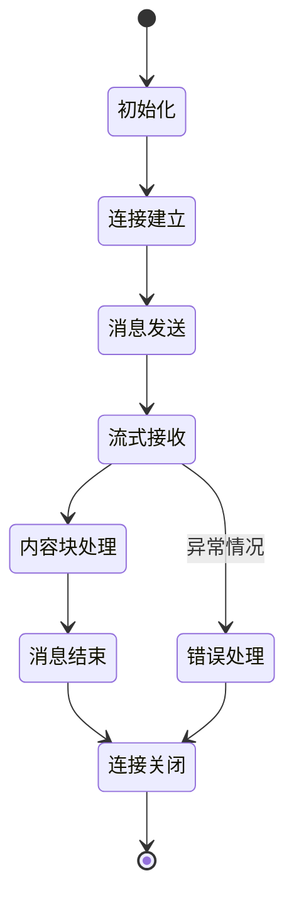
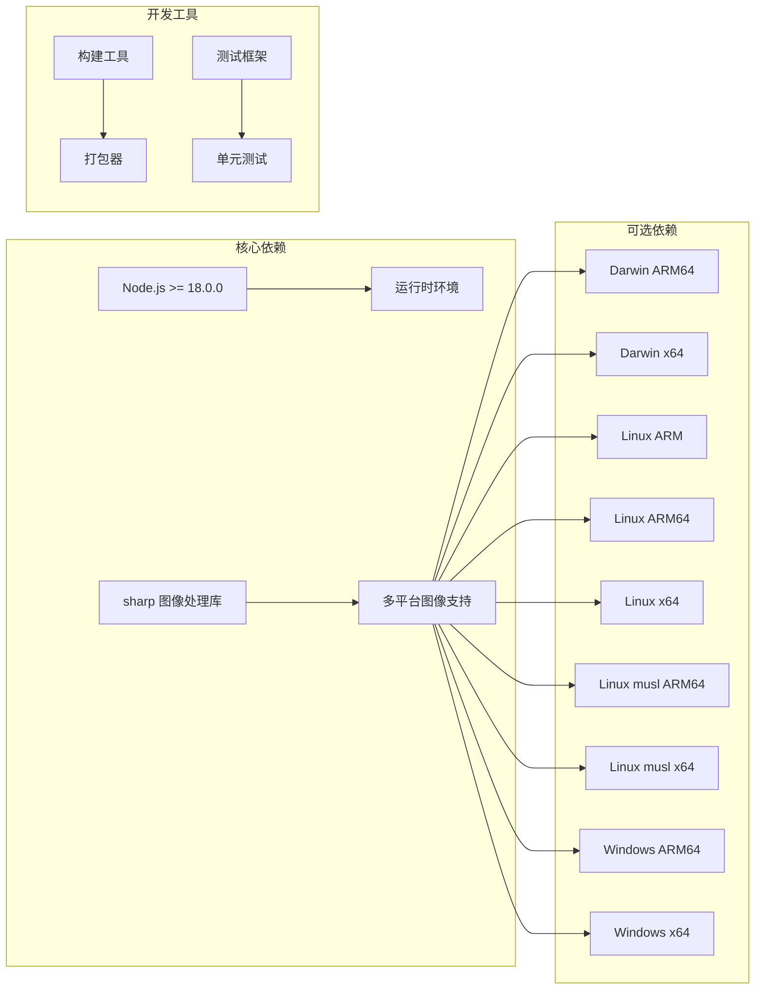
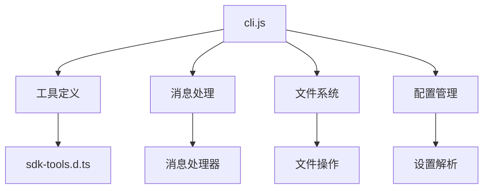
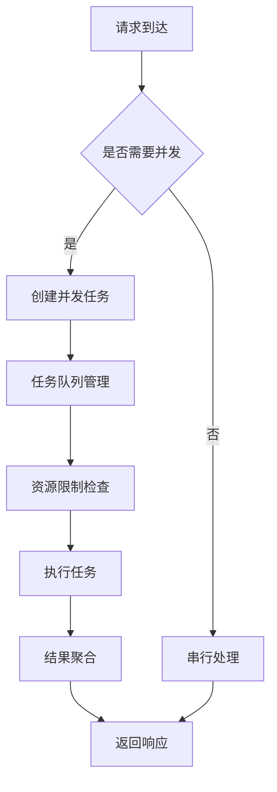
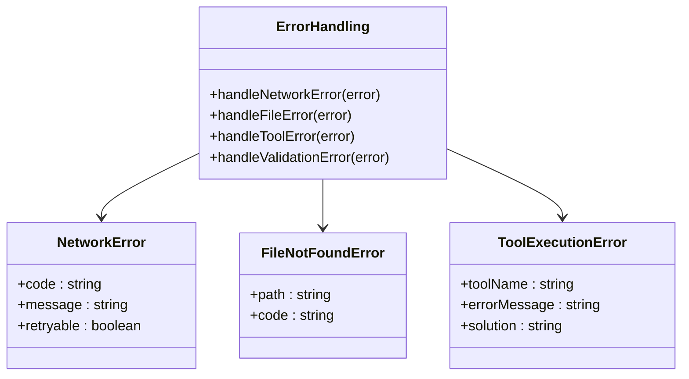

# CLI 命令参考

<cite>
**本文档引用的文件**
- [README.md](file://README.md)
- [package.json](file://package.json)
- [cli.js](file://cli.js)
- [sdk-tools.d.ts](file://sdk-tools.d.ts)
</cite>

## 目录
1. [简介](#简介)
2. [项目结构](#项目结构)
3. [核心组件](#核心组件)
4. [架构概览](#架构概览)
5. [详细组件分析](#详细组件分析)
6. [依赖关系分析](#依赖关系分析)
7. [性能考虑](#性能考虑)
8. [故障排除指南](#故障排除指南)
9. [结论](#结论)
10. [附录](#附录)

## 简介

Claude Code 是一个在终端中运行的智能编码助手，能够理解代码库、执行常规任务、解释复杂代码并处理 Git 工作流。该工具通过自然语言命令与用户交互，提供代理式编程体验。

该项目基于 Node.js 开发，支持多种操作系统和架构，包括 macOS、Windows 和 Linux 系统的 ARM64 和 x64 架构。

## 项目结构



**图表来源**
- [package.json:1-34](file://package.json#L1-L34)
- [cli.js:1-52](file://cli.js#L1-L52)

**章节来源**
- [README.md:1-44](file://README.md#L1-L44)
- [package.json:1-34](file://package.json#L1-L34)

## 核心组件

### 主要功能特性

Claude Code CLI 提供以下核心功能：

1. **智能代码编辑** - 通过自然语言指令修改和优化代码
2. **Git 工作流集成** - 自动处理分支、提交和合并操作
3. **文件系统操作** - 支持文件读写、搜索和批量处理
4. **工具链集成** - 内置多种开发工具和实用程序
5. **会话管理** - 持久化的对话历史和上下文保持

### 版本信息

当前版本：2.1.88
最低 Node.js 版本要求：18.0.0+
支持的操作系统：macOS、Windows、Linux
支持的架构：ARM64、x64

**章节来源**
- [package.json:1-34](file://package.json#L1-L34)
- [cli.js:1-52](file://cli.js#L1-L52)

## 架构概览



**图表来源**
- [cli.js:39-838](file://cli.js#L39-L838)

## 详细组件分析

### 命令行接口设计

CLI 接口采用模块化设计，支持多种命令模式：

#### 全局命令结构



**图表来源**
- [cli.js:39-52](file://cli.js#L39-L52)

#### 参数解析机制

命令行参数采用灵活的解析策略：

1. **位置参数** - 按顺序解析的必需参数
2. **命名参数** - 使用 `--option=value` 或 `-o value` 格式
3. **标志参数** - 简单的布尔开关 (`--flag`)
4. **环境变量** - 通过 `KEY=value` 形式传递

#### 命令执行流程



**图表来源**
- [cli.js:39-52](file://cli.js#L39-L52)

### 工具系统架构



**图表来源**
- [sdk-tools.d.ts:358-375](file://sdk-tools.d.ts#L358-L375)
- [sdk-tools.d.ts:296-327](file://sdk-tools.d.ts#L296-L327)

### 消息处理系统

消息处理系统支持流式响应和异步操作：



**图表来源**
- [cli.js:39-52](file://cli.js#L39-L52)

**章节来源**
- [sdk-tools.d.ts:1-800](file://sdk-tools.d.ts#L1-L800)
- [sdk-tools.d.ts:801-1600](file://sdk-tools.d.ts#L801-L1600)

## 依赖关系分析

### 外部依赖管理

项目采用模块化依赖管理策略：



**图表来源**
- [package.json:22-32](file://package.json#L22-L32)

### 内部模块依赖



**图表来源**
- [cli.js:39-52](file://cli.js#L39-L52)

**章节来源**
- [package.json:1-34](file://package.json#L1-L34)

## 性能考虑

### 内存管理

系统采用渐进式内存管理策略：

1. **流式处理** - 大文件和大量数据采用流式处理避免内存峰值
2. **垃圾回收优化** - 合理的对象生命周期管理减少 GC 压力
3. **缓存策略** - 智能缓存机制平衡内存使用和性能

### 并发处理



### 缓存机制

系统实现多层次缓存策略：

1. **会话缓存** - 保持用户会话状态
2. **模型缓存** - 缓存模型响应提高性能
3. **文件缓存** - 缓存常用文件内容

## 故障排除指南

### 常见错误类型



**图表来源**
- [cli.js:39-52](file://cli.js#L39-L52)

### 调试模式

系统提供多级别的调试支持：

1. **详细日志** - 通过 `--debug` 参数启用
2. **错误追踪** - 完整的错误堆栈信息
3. **性能监控** - 启动时间和性能指标记录

**章节来源**
- [cli.js:39-52](file://cli.js#L39-L52)

## 结论

Claude Code CLI 提供了一个功能强大且灵活的命令行接口，结合了现代 JavaScript 技术和丰富的工具生态系统。其模块化架构确保了良好的可扩展性和维护性，同时通过智能缓存和流式处理机制保证了优秀的性能表现。

该工具特别适合需要在终端环境中进行智能代码编辑和项目管理的开发者，提供了从简单文件操作到复杂 Git 工作流的一站式解决方案。

## 附录

### 环境变量配置

| 环境变量 | 类型 | 默认值 | 描述 |
|---------|------|--------|------|
| ANTHROPIC_API_KEY | 字符串 | 无 | API 密钥认证 |
| ANTHROPIC_AUTH_TOKEN | 字符串 | 无 | 认证令牌 |
| CLAUDE_CONFIG_DIR | 字符串 | ~/.claude | 配置文件目录 |
| DEBUG | 布尔值 | false | 启用调试模式 |
| NODE_OPTIONS | 字符串 | 无 | Node.js 运行时选项 |

### 命令示例

```bash
# 基本安装
npm install -g @anthropic-ai/claude-code

# 启动 Claude Code
claude

# 在项目目录中使用
cd my-project
claude
```

### 高级用法技巧

1. **批量文件操作** - 使用通配符和过滤器处理多个文件
2. **自定义工具** - 通过配置文件添加自定义工具
3. **会话持久化** - 利用会话状态保持上下文
4. **性能优化** - 合理使用缓存和流式处理