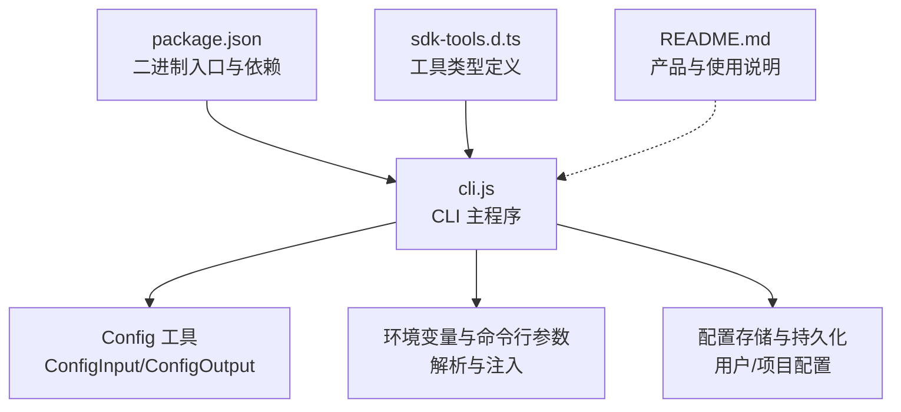
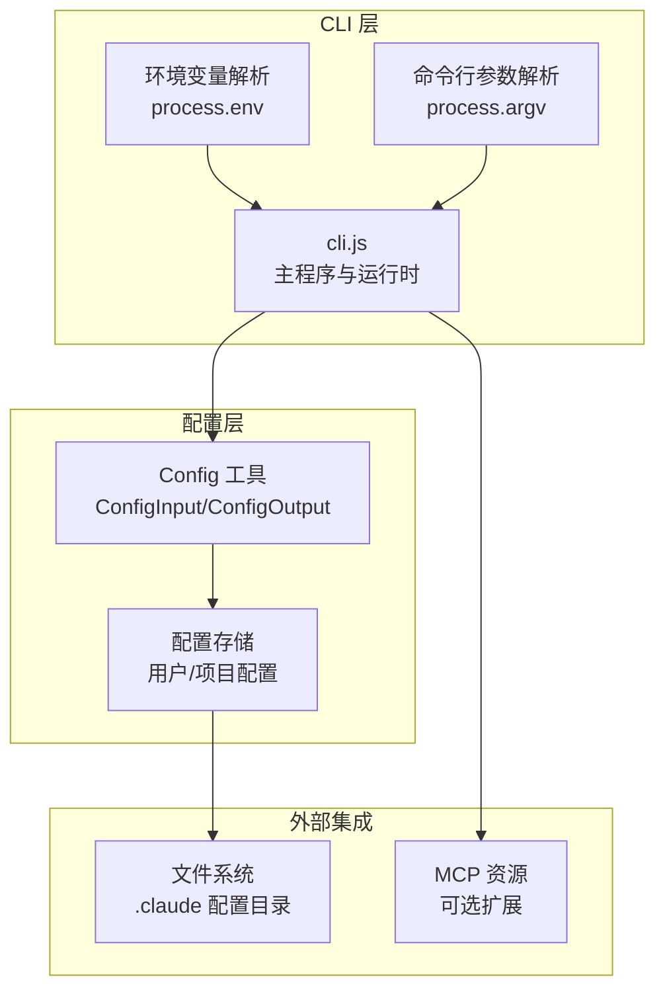
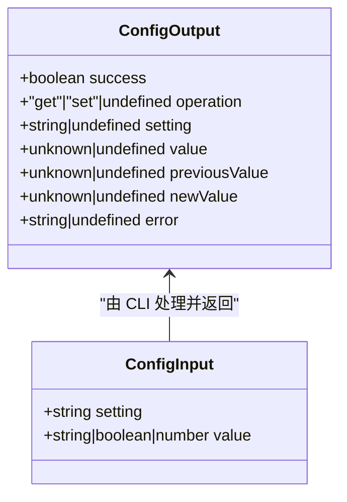
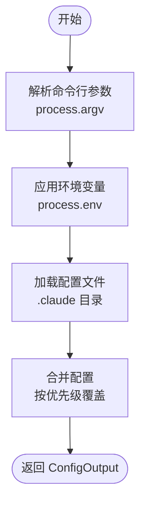
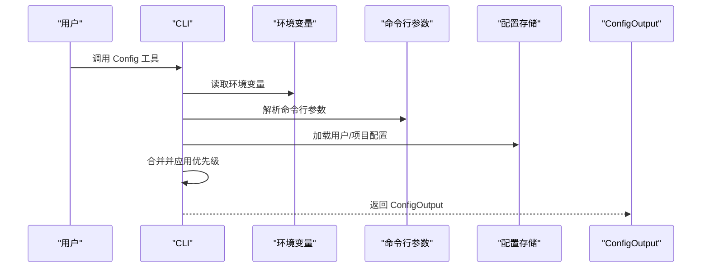
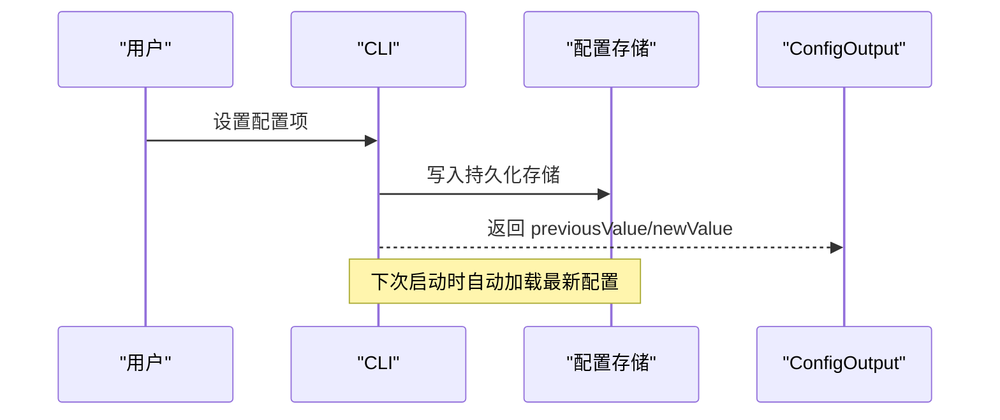
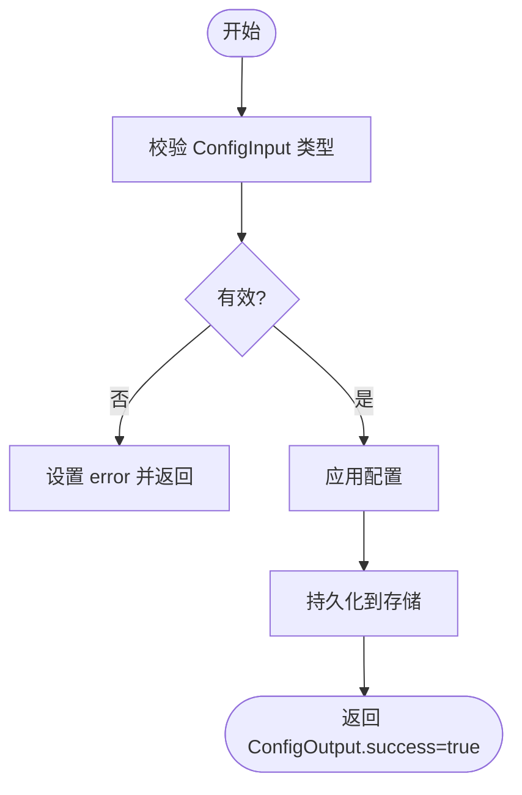
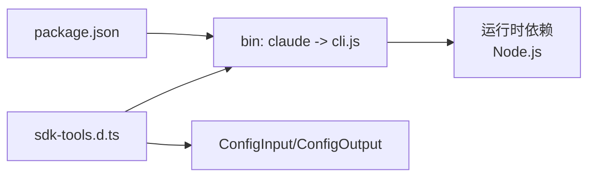

# 配置 API

<cite>
**本文引用的文件**
- [README.md](file://README.md)
- [package.json](file://package.json)
- [cli.js](file://cli.js)
- [sdk-tools.d.ts](file://sdk-tools.d.ts)
</cite>

## 目录
1. [简介](#简介)
2. [项目结构](#项目结构)
3. [核心组件](#核心组件)
4. [架构总览](#架构总览)
5. [详细组件分析](#详细组件分析)
6. [依赖关系分析](#依赖关系分析)
7. [性能考量](#性能考量)
8. [故障排查指南](#故障排查指南)
9. [结论](#结论)
10. [附录](#附录)

## 简介
本文件为 Claude Code 配置系统的完整 API 文档，聚焦于 Config 工具的输入输出接口与配置管理能力。根据仓库中的类型定义与 CLI 实现，Config 工具通过统一的 ConfigInput/ConfigOutput 接口支持“获取/设置”配置项，支持用户配置与项目配置的管理，并具备环境变量与命令行参数的集成入口。本文将系统性阐述：
- 输入输出接口规范与数据结构
- 配置项的来源与优先级规则
- 配置的继承与覆盖策略
- 配置热重载与动态更新机制
- 配置迁移与版本兼容处理
- 配置验证与错误处理

## 项目结构
该仓库采用最小化结构，核心文件包括：
- package.json：包元信息与二进制入口（CLI）
- cli.js：CLI 主程序与运行时逻辑
- sdk-tools.d.ts：工具类型定义，包含 ConfigInput/ConfigOutput 的接口规范
- README.md：产品介绍与使用说明

图表来源
- [package.json:1-34](file://package.json#L1-L34)
- [cli.js:1-39](file://cli.js#L1-L39)
- [sdk-tools.d.ts:2134-2704](file://sdk-tools.d.ts#L2134-L2704)

章节来源
- [package.json:1-34](file://package.json#L1-L34)
- [README.md:1-44](file://README.md#L1-L44)

## 核心组件
- ConfigInput：用于查询或修改配置项的输入对象，包含 setting（键）与可选的 value（新值）。当省略 value 时执行“获取”操作。
- ConfigOutput：用于返回配置操作结果的对象，包含 success、operation（get/set）、setting、value、previousValue、newValue、error 等字段。

这些接口在类型定义文件中明确声明，确保调用方与实现方的数据契约一致。

章节来源
- [sdk-tools.d.ts:2134-2704](file://sdk-tools.d.ts#L2134-L2704)

## 架构总览
下图展示了 CLI 运行时与配置子系统的关系，以及 Config 工具在整体架构中的位置。

图表来源
- [cli.js:1-39](file://cli.js#L1-L39)
- [sdk-tools.d.ts:2134-2704](file://sdk-tools.d.ts#L2134-L2704)

## 详细组件分析

### Config 工具接口规范
- 输入接口：ConfigInput
  - setting：字符串，表示要查询或修改的配置键（如 theme、model、permissions.defaultMode 等）
  - value：可选，支持字符串、布尔或数字；省略时表示“获取”当前值
- 输出接口：ConfigOutput
  - success：布尔，表示操作是否成功
  - operation：可选，"get" 或 "set"
  - setting：返回对应的键名
  - value：返回当前值（get 操作）
  - previousValue/newValue：返回变更前后的值（set 操作）
  - error：可选，错误信息

图表来源
- [sdk-tools.d.ts:2134-2704](file://sdk-tools.d.ts#L2134-L2704)

章节来源
- [sdk-tools.d.ts:2134-2704](file://sdk-tools.d.ts#L2134-L2704)

### 配置来源与优先级规则
基于仓库中的实现与类型定义，可归纳出以下配置来源与优先级：
- 命令行参数：通过 process.argv 解析传入的配置项（例如 -e KEY=value 的形式），作为高优先级来源
- 环境变量：通过 process.env 注入配置（如 CLAUDE_* 系列环境变量），作为中等优先级来源
- 配置文件：位于用户主目录下的 .claude 配置目录，作为持久化存储的低优先级来源
- 默认值：未显式设置时采用默认值

图表来源
- [cli.js:1-39](file://cli.js#L1-L39)

章节来源
- [cli.js:1-39](file://cli.js#L1-L39)

### 配置继承与覆盖策略
- 继承：CLI 初始化时会从用户根目录的 .claude 配置目录加载默认配置，作为基础配置集
- 覆盖：命令行参数与环境变量在运行时动态注入，优先级高于持久化配置，实现“后到先得”的覆盖策略
- 错误回退：若某配置项无效或冲突，CLI 将返回错误信息（ConfigOutput.error）

图表来源
- [cli.js:1-39](file://cli.js#L1-L39)
- [sdk-tools.d.ts:2134-2704](file://sdk-tools.d.ts#L2134-L2704)

章节来源
- [cli.js:1-39](file://cli.js#L1-L39)
- [sdk-tools.d.ts:2134-2704](file://sdk-tools.d.ts#L2134-L2704)

### 配置热重载与动态更新
- 热重载：CLI 在运行时支持通过命令行参数与环境变量动态注入配置，无需重启即可生效
- 动态更新：ConfigOutput 中的 previousValue/newValue 字段可用于感知变更前后状态，便于上层逻辑进行增量刷新
- 存储更新：配置变更最终写入 .claude 目录下的持久化存储，确保下次启动时仍可继承最新配置

图表来源
- [cli.js:1-39](file://cli.js#L1-L39)
- [sdk-tools.d.ts:2134-2704](file://sdk-tools.d.ts#L2134-L2704)

章节来源
- [cli.js:1-39](file://cli.js#L1-L39)
- [sdk-tools.d.ts:2134-2704](file://sdk-tools.d.ts#L2134-L2704)

### 配置验证与错误处理
- 类型验证：ConfigInput 支持字符串、布尔、数字三种类型，CLI 在解析时进行类型校验
- 结构验证：ConfigOutput 提供 success 与 error 字段，便于上层捕获异常并进行降级处理
- 运行时错误：若配置项无效或冲突，CLI 将抛出异常并通过 ConfigOutput.error 返回具体原因

图表来源
- [sdk-tools.d.ts:2134-2704](file://sdk-tools.d.ts#L2134-L2704)

章节来源
- [sdk-tools.d.ts:2134-2704](file://sdk-tools.d.ts#L2134-L2704)

### 配置迁移与版本兼容
- 版本标识：CLI 包含版本号（如 2.1.88），可用于判断是否需要迁移或兼容处理
- 兼容策略：对于已废弃的配置项或模型，CLI 可在运行时发出警告并引导用户迁移到新的配置项或模型
- 迁移流程：建议在升级版本时检查 ConfigOutput.error，识别不兼容项并提示用户手动调整

章节来源
- [package.json:1-34](file://package.json#L1-L34)
- [cli.js:1-39](file://cli.js#L1-L39)

## 依赖关系分析
- 包依赖：CLI 通过 package.json 的 bin 字段注册二进制入口，供全局安装后直接调用
- 运行时依赖：CLI 使用 Node.js 运行时特性（如 process.env、process.argv、fs 等），确保在终端环境中稳定运行
- 类型依赖：sdk-tools.d.ts 提供强类型约束，保证 Config 工具的输入输出一致性

图表来源
- [package.json:1-34](file://package.json#L1-L34)
- [sdk-tools.d.ts:2134-2704](file://sdk-tools.d.ts#L2134-L2704)

章节来源
- [package.json:1-34](file://package.json#L1-L34)
- [sdk-tools.d.ts:2134-2704](file://sdk-tools.d.ts#L2134-L2704)

## 性能考量
- 配置读取：优先从内存缓存与命令行参数快速命中，减少磁盘访问
- 配置写入：批量写入与去抖动策略可避免频繁落盘
- 流程优化：通过 ConfigOutput 的增量信息（previousValue/newValue）减少不必要的刷新

## 故障排查指南
- 常见问题
  - 配置项不存在：检查 setting 是否拼写正确，确认配置键的有效性
  - 类型不匹配：确保 value 与预期类型一致（字符串/布尔/数字）
  - 权限不足：确认 .claude 配置目录的读写权限
- 定位方法
  - 查看 ConfigOutput.error 获取具体错误信息
  - 检查命令行参数与环境变量是否正确传递
  - 对比历史变更（previousValue/newValue）定位问题范围

章节来源
- [sdk-tools.d.ts:2134-2704](file://sdk-tools.d.ts#L2134-L2704)

## 结论
本文件基于仓库中的类型定义与 CLI 实现，系统化梳理了 Claude Code 配置系统的 API 规范与运行机制。Config 工具通过标准化的输入输出接口，结合命令行参数与环境变量的高优先级注入，实现了灵活的配置管理与持久化。配合热重载与错误处理机制，能够满足开发与运维场景下的配置需求。建议在实际使用中遵循优先级规则与类型约束，并通过 ConfigOutput 的增量信息进行可观测与自动化。

## 附录
- 快速参考
  - 输入：ConfigInput.setting、ConfigInput.value
  - 输出：ConfigOutput.success、ConfigOutput.operation、ConfigOutput.setting、ConfigOutput.value、ConfigOutput.previousValue、ConfigOutput.newValue、ConfigOutput.error
- 使用建议
  - 通过命令行参数与环境变量进行临时覆盖
  - 将长期稳定的配置写入 .claude 目录
  - 升级版本时关注 CLI 的兼容性提示并及时迁移