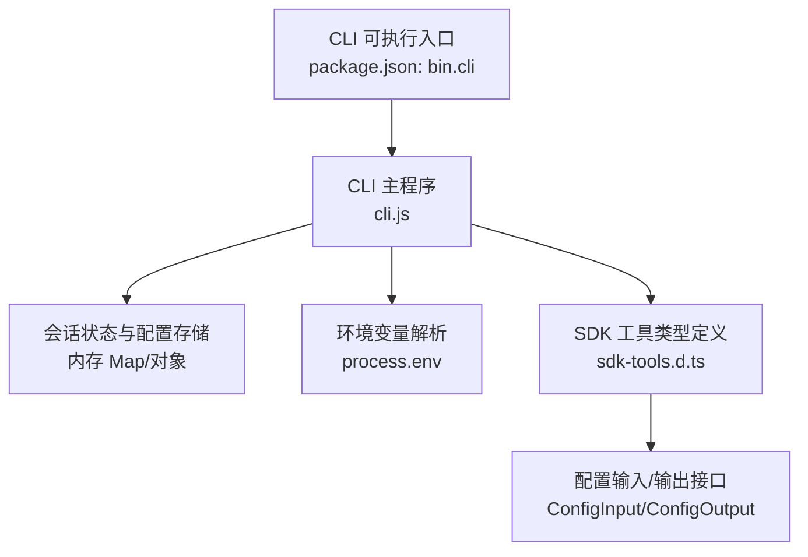
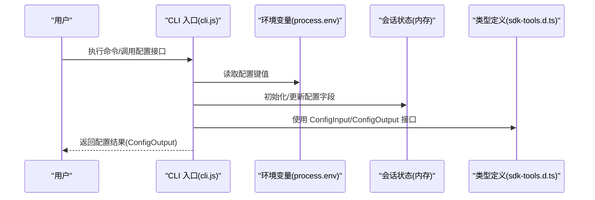
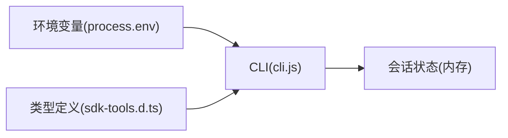

# 配置管理

<cite>
**本文引用的文件**
- [README.md](file://README.md)
- [package.json](file://package.json)
- [cli.js](file://cli.js)
- [sdk-tools.d.ts](file://sdk-tools.d.ts)
</cite>

## 目录
1. [简介](#简介)
2. [项目结构](#项目结构)
3. [核心组件](#核心组件)
4. [架构总览](#架构总览)
5. [详细组件分析](#详细组件分析)
6. [依赖关系分析](#依赖关系分析)
7. [性能考量](#性能考量)
8. [故障排查指南](#故障排查指南)
9. [结论](#结论)
10. [附录](#附录)

## 简介
本文件面向 Claude Code 的配置系统，基于仓库中的类型定义与 CLI 实现，系统性梳理配置文件的结构、位置与加载顺序，解释用户配置、项目配置与环境变量的优先级规则，并对可配置项（如模型、工具权限、界面外观与行为偏好）进行归类与说明。同时给出配置模板与最佳实践、动态更新与热重载机制、配置验证与错误处理、回滚策略、继承与覆盖机制、批量配置管理与迁移方法，以及安全与隐私保护建议。

## 项目结构
该仓库以最小化分发包形式呈现，核心入口为 CLI 入口文件，类型定义位于 SDK 类型声明文件中；配置系统在运行时通过会话状态与环境变量共同驱动。

图表来源
- [package.json:1-34](file://package.json#L1-L34)
- [cli.js:1-39](file://cli.js#L1-L39)
- [sdk-tools.d.ts:2134-2719](file://sdk-tools.d.ts#L2134-L2719)

章节来源
- [package.json:1-34](file://package.json#L1-L34)
- [cli.js:1-39](file://cli.js#L1-L39)
- [sdk-tools.d.ts:2134-2719](file://sdk-tools.d.ts#L2134-L2719)

## 核心组件
- CLI 入口与分发：通过 package.json 的 bin 字段将命令绑定到 cli.js，作为用户交互入口。
- 会话状态与配置存储：CLI 内部维护一个全局会话状态对象，包含模型、权限、计数器、日志、遥测等配置字段。
- 环境变量：通过 process.env 读取配置，支持区域、沙箱、简单模式等开关。
- SDK 工具类型：在 sdk-tools.d.ts 中定义了 ConfigInput/ConfigOutput 接口，用于配置查询与设置的标准化输入输出。

章节来源
- [package.json:4-6](file://package.json#L4-L6)
- [cli.js:1-39](file://cli.js#L1-L39)
- [sdk-tools.d.ts:2134-2719](file://sdk-tools.d.ts#L2134-L2719)

## 架构总览
下图展示配置系统在运行时的关键交互：CLI 启动后初始化会话状态，解析环境变量，暴露配置接口供外部调用或脚本使用。

图表来源
- [cli.js:1-39](file://cli.js#L1-L39)
- [sdk-tools.d.ts:2134-2719](file://sdk-tools.d.ts#L2134-L2719)

## 详细组件分析

### 配置文件结构与位置
- 用户配置目录
  - 默认路径：由环境变量 CLAUDE_CONFIG_DIR 指定，默认为用户主目录下的 .claude。
  - 解析逻辑：通过函数计算并缓存该路径，确保规范化与 NFC 归一化。
- 项目配置
  - 在当前工作目录下查找项目级配置文件（例如 teams 目录），用于团队协作场景。
- 环境变量
  - 支持多种配置键，如 AWS_REGION/AWS_DEFAULT_REGION、CLOUD_ML_REGION、CLAUDE_CODE_SIMPLE、NODE_OPTIONS 等。
  - 命令行参数：--bare 可切换“简单模式”。

章节来源
- [cli.js:1-39](file://cli.js#L1-L39)

### 配置加载顺序与优先级
- 加载顺序
  1) 环境变量（process.env）
  2) 项目配置文件（工作目录）
  3) 用户配置文件（~/.claude）
  4) CLI 默认值（内存状态初始化）
- 优先级规则
  - 环境变量 > 项目配置 > 用户配置 > CLI 默认值
  - 对于布尔值，支持多态字符串（如 "1"/"true"/"yes"/"on" 等）与反向语义（如 "0"/"false"/"no"/"off"）
  - 命令行参数（如 --bare）可覆盖默认行为

章节来源
- [cli.js:1-39](file://cli.js#L1-L39)

### 可配置选项清单与分类
以下选项来自会话状态初始化与配置接口，按类别整理：

- 模型与推理
  - 模型字符串列表：modelStrings
  - 初始主循环模型：initialMainLoopModel
  - 主循环模型覆盖：mainLoopModelOverride
- 权限与安全
  - 会话绕过权限模式：sessionBypassPermissionsMode
  - 允许的设置来源：allowedSettingSources
  - 允许的频道：allowedChannels
  - 开发通道开关：hasDevChannels
- 行为与体验
  - 是否交互式：isInteractive
  - 远程模式：isRemoteMode
  - 严格工具结果配对：strictToolResultPairing
  - SDK 代理进度摘要：sdkAgentProgressSummariesEnabled
  - 用户消息同意：userMsgOptIn
  - 问题预览格式：questionPreviewFormat
  - 定时任务开关：scheduledTasksEnabled
  - LSP 推荐提示：lspRecommendationShownThisSession
  - 头部标记（AFK/快速/缓存编辑/思考清空）：afkModeHeaderLatched/fastModeHeaderLatched/cacheEditingHeaderLatched/thinkingClearLatched
- 计数与统计
  - 会话计数器、LOC 计数器、PR 计数器、提交计数器、成本计数器、令牌计数器、活跃时间计数器
- 日志与遥测
  - 日志提供者：loggerProvider
  - 事件记录器：eventLogger
  - 计量提供者：meterProvider
  - 追踪提供者：tracerProvider
- 调试与开发
  - Chrome 标志覆盖：chromeFlagOverride
  - SDK Beta 标记：sdkBetas
  - 初始化 JSON Schema：initJsonSchema
  - 直连服务地址：directConnectServerUrl
- 会话与上下文
  - 会话 ID/父会话 ID：sessionId/parentSessionId
  - 会话来源：sessionSource
  - 会话持久化禁用：sessionPersistenceDisabled
  - 会话信任接受：sessionTrustAccepted
  - 会话项目目录：sessionProjectDir
  - 提示词缓存白名单/资格：promptCache1hAllowlist/promptCache1hEligible
  - Cron 任务：sessionCronTasks
  - 团队创建：sessionCreatedTeams
  - 代理颜色映射：agentColorMap
  - 最近交互时间：lastInteractionTime
  - 最后请求/消息/分类器请求：lastAPIRequest/lastAPIRequestMessages/lastClassifierRequests
  - 最后 API 完成时间：lastApiCompletionTimestamp
  - 缓存内容：cachedClaudeMdContent
  - 错误日志：inMemoryErrorLog
  - 内联插件：inlinePlugins
  - OAuth/API Key 来自文件描述符：oauthTokenFromFd/apiKeyFromFd
  - 标志设置路径/内联：flagSettingsPath/flagSettingsInline

章节来源
- [cli.js:1-39](file://cli.js#L1-L39)
- [sdk-tools.d.ts:2134-2719](file://sdk-tools.d.ts#L2134-L2719)

### 配置模板与最佳实践
- 配置模板（键名参考）
  - 模型：modelStrings、initialMainLoopModel、mainLoopModelOverride
  - 权限：sessionBypassPermissionsMode、allowedSettingSources、allowedChannels、hasDevChannels
  - 行为：isInteractive、isRemoteMode、strictToolResultPairing、sdkAgentProgressSummariesEnabled、userMsgOptIn、questionPreviewFormat、scheduledTasksEnabled、lspRecommendationShownThisSession
  - 统计：session、loc、pr、commit、cost、token、activeTime 计数器
  - 日志与遥测：loggerProvider、eventLogger、meterProvider、tracerProvider
  - 调试：chromeFlagOverride、sdkBetas、initJsonSchema、directConnectServerUrl
  - 会话：sessionId、parentSessionId、sessionSource、sessionPersistenceDisabled、sessionTrustAccepted、sessionProjectDir、promptCache1hAllowlist、promptCache1hEligible、sessionCronTasks、sessionCreatedTeams、agentColorMap、lastInteractionTime、lastAPIRequest/lastAPIRequestMessages/lastClassifierRequests、lastApiCompletionTimestamp、cachedClaudeMdContent、inMemoryErrorLog、inlinePlugins、oauthTokenFromFd/apiKeyFromFd、flagSettingsPath/flagSettingsInline
- 最佳实践
  - 将敏感信息（API Key/OAuth Token）置于环境变量或文件描述符注入，避免硬编码在配置文件中
  - 使用 allowedSettingSources 控制来源优先级，减少意外覆盖
  - 对生产环境启用严格的工具结果配对与权限模式
  - 合理设置定时任务与会话持久化策略，平衡性能与数据一致性

章节来源
- [cli.js:1-39](file://cli.js#L1-L39)
- [sdk-tools.d.ts:2134-2719](file://sdk-tools.d.ts#L2134-L2719)

### 动态配置更新与热重载机制
- 动态更新
  - 通过 ConfigInput/ConfigOutput 接口实现“获取/设置”操作，返回前值与新值，便于审计与回滚
  - 会话状态字段在运行时可被修改，部分变更即时生效（如 isInteractive、strictToolResultPairing 等）
- 热重载
  - CLI 未显式提供文件监听与自动重载机制；可通过外部脚本轮询配置变化并触发重新初始化
  - 对于模型与权限等关键配置，建议在新会话启动时应用，避免中途切换带来的状态不一致

章节来源
- [sdk-tools.d.ts:2134-2719](file://sdk-tools.d.ts#L2134-L2719)
- [cli.js:1-39](file://cli.js#L1-L39)

### 配置验证、错误处理与回滚策略
- 验证
  - 类型层面：ConfigInput/ConfigOutput 明确字段与类型约束
  - 布尔转换：支持多态字符串与反向语义，避免误判
- 错误处理
  - 请求错误封装为统一异常类型，包含状态码、请求 ID、错误体等
  - 流式响应解析失败时抛出明确错误，便于定位
- 回滚策略
  - 设置操作返回 previousValue/newValue，可在失败时恢复
  - 对于关键配置（如权限模式），建议在事务性会话中应用，失败时撤销

章节来源
- [sdk-tools.d.ts:2134-2719](file://sdk-tools.d.ts#L2134-L2719)
- [cli.js:1-39](file://cli.js#L1-L39)

### 配置继承与覆盖机制
- 继承
  - 子会话可继承父会话的配置（如 parentSessionId、sessionProjectDir 等）
  - 模型与行为偏好可通过 initialMainLoopModel/mainLoopModelOverride 进行继承与覆盖
- 覆盖
  - allowedSettingSources 定义来源优先级，环境变量优先于项目配置，再优先于用户配置
  - 命令行参数（如 --bare）可覆盖默认行为

章节来源
- [cli.js:1-39](file://cli.js#L1-L39)

### 批量配置管理与配置迁移
- 批量管理
  - 通过 ConfigInput/ConfigOutput 循环设置多个键，结合 previousValue/newValue 进行审计
  - 对于大规模变更，建议先在测试会话中验证，再推广到生产
- 迁移
  - 当配置键废弃或变更时，CLI 会在创建消息时发出弃用警告（如模型弃用日期提示）
  - 建议在迁移期间保留兼容层，逐步替换旧键

章节来源
- [cli.js:1-39](file://cli.js#L1-L39)

### 安全与隐私保护
- 数据收集与使用
  - 文档说明了使用数据的收集范围与用途，以及隐私保障措施
- 配置安全
  - 敏感配置（API Key、OAuth Token）应通过环境变量或文件描述符注入
  - 避免在版本控制中提交敏感配置
  - 使用 allowedSettingSources 限制来源，降低误配置风险

章节来源
- [README.md:31-43](file://README.md#L31-L43)
- [cli.js:1-39](file://cli.js#L1-L39)

## 依赖关系分析
- CLI 与类型定义
  - CLI 通过 sdk-tools.d.ts 的接口规范与外部工具/脚本交互
- CLI 与环境变量
  - CLI 解析 process.env 并将其映射到会话状态字段
- CLI 与会话状态
  - 会话状态是配置的实际承载，CLI 在运行时对其进行读写

图表来源
- [cli.js:1-39](file://cli.js#L1-L39)
- [sdk-tools.d.ts:2134-2719](file://sdk-tools.d.ts#L2134-L2719)

章节来源
- [cli.js:1-39](file://cli.js#L1-L39)
- [sdk-tools.d.ts:2134-2719](file://sdk-tools.d.ts#L2134-L2719)

## 性能考量
- 配置读取
  - 环境变量与内存状态访问开销极低，适合高频读取
- 流式响应解析
  - CLI 对 SSE/流式响应有专门解析器，注意在高并发场景下的资源释放
- 模型与权限
  - 关键配置变更建议在新会话应用，避免频繁切换导致的上下文抖动

## 故障排查指南
- 常见问题
  - 配置未生效：检查 allowedSettingSources 与环境变量优先级
  - 布尔值解析异常：确认是否使用了支持的多态字符串
  - 请求错误：查看错误类型与请求 ID，定位具体原因
- 排查步骤
  - 使用 ConfigOutput 的 error 字段与 previousValue/newValue 进行回溯
  - 检查会话状态字段是否符合预期
  - 对于流式响应，确认流已正确关闭与释放

章节来源
- [sdk-tools.d.ts:2134-2719](file://sdk-tools.d.ts#L2134-L2719)
- [cli.js:1-39](file://cli.js#L1-L39)

## 结论
本配置系统以 CLI 为核心，结合会话状态与环境变量，提供灵活的配置能力。通过类型定义规范了配置接口，借助 allowedSettingSources 实现来源优先级控制。建议在生产环境中采用严格的权限与安全策略，配合审计与回滚机制，确保配置变更的可控与可追溯。

## 附录
- 相关文件
  - [README.md](file://README.md)
  - [package.json](file://package.json)
  - [cli.js](file://cli.js)
  - [sdk-tools.d.ts](file://sdk-tools.d.ts)