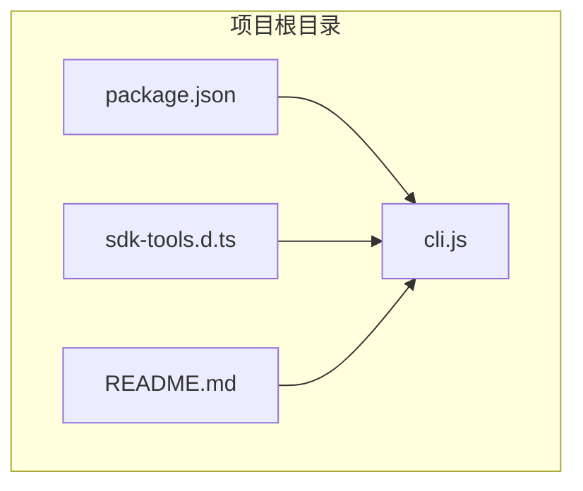
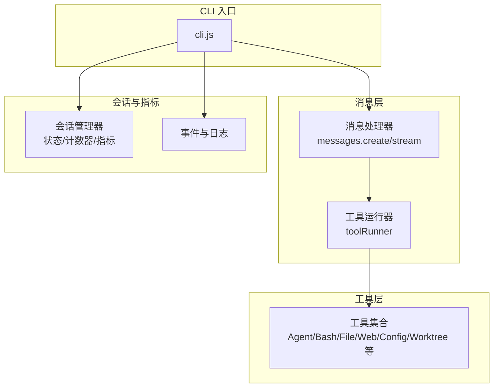
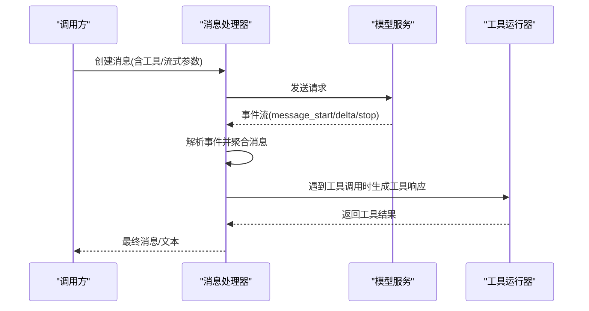
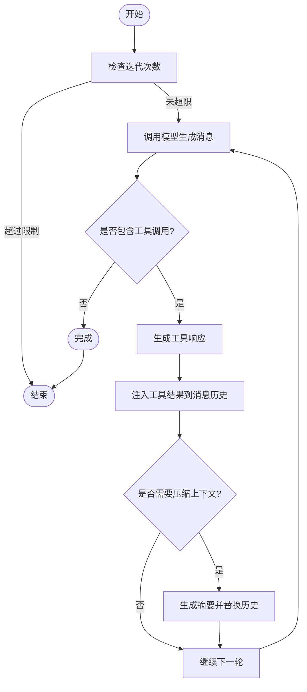
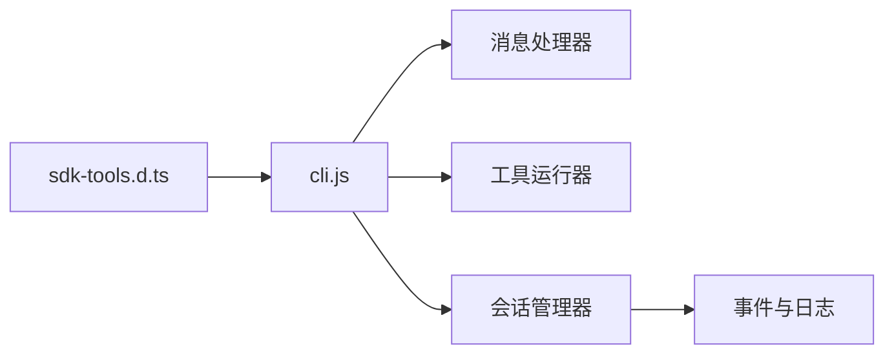

# 核心接口

<cite>
**本文引用的文件**
- [README.md](file://README.md)
- [package.json](file://package.json)
- [sdk-tools.d.ts](file://sdk-tools.d.ts)
- [cli.js](file://cli.js)
</cite>

## 目录
1. [简介](#简介)
2. [项目结构](#项目结构)
3. [核心组件](#核心组件)
4. [架构总览](#架构总览)
5. [详细组件分析](#详细组件分析)
6. [依赖关系分析](#依赖关系分析)
7. [性能考量](#性能考量)
8. [故障排查指南](#故障排查指南)
9. [结论](#结论)
10. [附录](#附录)

## 简介
本文件面向 Claude Code 的核心接口与工具系统，聚焦于消息处理器、工具执行器、会话管理器等关键能力，系统化梳理工具输入输出的通用类型定义（ToolInputSchemas 与 ToolOutputSchemas），并给出版本兼容性管理、扩展与自定义工具开发指导、错误码与异常处理规范、性能特征与限制条件，以及测试与调试方法。目标是帮助开发者在终端或 IDE 中高效、安全地使用 Claude Code 的工具链。

## 项目结构
- 包信息与运行时要求：通过包配置文件声明 Node.js 版本要求与二进制入口，便于在本地环境中安装与运行。
- 类型定义：SDK 工具类型定义集中于类型文件，覆盖所有工具输入输出的结构化描述，确保调用端与实现端的一致性。
- 命令行入口：CLI 脚本作为对外交互入口，承载消息流式处理、工具执行、会话状态管理与性能统计等核心逻辑。

图表来源
- [package.json:1-34](file://package.json#L1-L34)
- [sdk-tools.d.ts:1-800](file://sdk-tools.d.ts#L1-L800)
- [cli.js:1-120](file://cli.js#L1-L120)

章节来源
- [package.json:1-34](file://package.json#L1-L34)
- [README.md:1-44](file://README.md#L1-L44)

## 核心组件
- 消息处理器（Messages）：负责消息创建、流式响应解析、内容块增量更新、工具调用参数解析与结果回传。
- 工具执行器（Tool Runner）：封装工具调用流程，支持自动压缩上下文、生成工具响应、迭代执行直至完成。
- 会话管理器（Session Manager）：维护会话状态、计数器、指标（成本、令牌、耗时）、日志与事件记录，提供开关与持久化控制。
- 工具类型系统（ToolInputSchemas / ToolOutputSchemas）：统一的输入输出契约，覆盖代理、文件、命令、网络、问答、配置、工作树等工具族。

章节来源
- [sdk-tools.d.ts:11-54](file://sdk-tools.d.ts#L11-L54)
- [cli.js:120-240](file://cli.js#L120-L240)

## 架构总览
下图展示 CLI 入口如何组织消息流、工具执行与会话管理的关系。

图表来源
- [cli.js:120-240](file://cli.js#L120-L240)
- [sdk-tools.d.ts:258-2720](file://sdk-tools.d.ts#L258-L2720)

## 详细组件分析

### 消息处理器（Messages）
- 功能要点
  - 支持非流式与流式两种模式的消息创建。
  - 流式响应解析为事件序列（message_start、content_block_start、content_block_delta、message_stop 等），并聚合最终消息。
  - 结构化输出解析（structured outputs）支持 JSON Schema 输出格式。
  - 计数令牌接口用于估算消耗。
- 关键行为
  - 连接建立、事件监听、错误/中止处理、最终消息获取与文本提取。
  - 自动压缩上下文（可选）以降低上下文开销。
- 错误处理
  - 统一的错误类型体系，区分客户端错误、连接错误、超时、服务端错误等，并携带请求 ID 以便追踪。

图表来源
- [cli.js:120-240](file://cli.js#L120-L240)
- [cli.js:240-480](file://cli.js#L240-L480)

章节来源
- [cli.js:120-240](file://cli.js#L120-L240)
- [cli.js:240-480](file://cli.js#L240-L480)

### 工具执行器（Tool Runner）
- 功能要点
  - 自动迭代执行，支持最大迭代次数限制。
  - 在达到上下文阈值时触发压缩（生成摘要并替换历史消息）。
  - 对工具调用进行参数解析与结果回传，支持错误包装。
- 关键行为
  - 生成工具响应（对每个 tool_use 生成对应 tool_result）。
  - 将工具结果注入消息历史，继续对话直到满足终止条件。
- 异常处理
  - 工具错误统一包装为特定异常类型，便于上层捕获与提示。

图表来源
- [cli.js:480-720](file://cli.js#L480-L720)
- [sdk-tools.d.ts:258-2720](file://sdk-tools.d.ts#L258-L2720)

章节来源
- [cli.js:480-720](file://cli.js#L480-L720)

### 会话管理器（Session Manager）
- 功能要点
  - 维护会话 ID、父会话 ID、项目根路径、当前工作目录等上下文信息。
  - 提供成本、令牌、耗时、行数变更等指标的累加与查询。
  - 支持事件日志、慢操作记录、插件钩子注册、计划模式切换标记等。
- 关键行为
  - 重置/恢复状态、切换会话、持久化控制、权限模式设置。
  - 提供多种计数器（会话、代码行、PR、提交、成本、令牌、活跃时间）。
- 性能与可观测性
  - 内置慢操作窗口清理机制，避免内存膨胀。
  - 提供严格工具结果配对开关，保障工具调用与结果一一对应。

```mermaid
classDiagram
class SessionManager {
+sessionId
+parentSessionId
+projectRoot
+cwd
+modelUsage
+totalCostUSD
+totalAPIDuration
+totalToolDuration
+turnToolDurationMs
+turnHookDurationMs
+turnClassifierDurationMs
+turnToolCount
+turnHookCount
+turnClassifierCount
+startTime
+lastInteractionTime
+totalLinesAdded
+totalLinesRemoved
+hasUnknownModelCost
+loggerProvider
+eventLogger
+meterProvider
+tracerProvider
+agentColorMap
+sessionCounter
+locCounter
+prCounter
+commitCounter
+costCounter
+tokenCounter
+codeEditToolDecisionCounter
+activeTimeCounter
+inlinePlugins
+chromeFlagOverride
+useCoworkPlugins
+sessionBypassPermissionsMode
+scheduledTasksEnabled
+sessionCronTasks
+sessionCreatedTeams
+sessionTrustAccepted
+sessionPersistenceDisabled
+hasExitedPlanMode
+needsPlanModeExitAttachment
+needsAutoModeExitAttachment
+lspRecommendationShownThisSession
+initJsonSchema
+registeredHooks
+planSlugCache
+teleportedSessionInfo
+invokedSkills
+slowOperations
+sdkBetas
+mainThreadAgentType
+isRemoteMode
+systemPromptSectionCache
+lastEmittedDate
+additionalDirectoriesForClaudeMd
+allowedChannels
+hasDevChannels
+promptCache1hAllowlist
+promptCache1hEligible
+afkModeHeaderLatched
+fastModeHeaderLatched
+cacheEditingHeaderLatched
+thinkingClearLatched
+promptId
+lastMainRequestId
+lastApiCompletionTimestamp
+pendingPostCompaction
+switchSession(id, projectDir)
+regenerateSessionId(options)
+getSessionId()
+getSessionProjectDir()
+getSessionSource()
+getSessionIngressToken()
+getSessionTrustAccepted()
+getSessionBypassPermissionsMode()
+getSdkBetas()
+getMainThreadAgentType()
+getIsRemoteMode()
+getAllowedChannels()
+getHasDevChannels()
+getPromptCache1hAllowlist()
+getPromptCache1hEligible()
+getAfkModeHeaderLatched()
+getFastModeHeaderLatched()
+getCacheEditingHeaderLatched()
+getThinkingClearLatched()
+getPromptId()
+getLastMainRequestId()
+getLastApiCompletionTimestamp()
+getTotalCostUSD()
+getTotalAPIDuration()
+getTotalAPIDurationWithoutRetries()
+getTotalToolDuration()
+getTurnToolDurationMs()
+getTurnHookDurationMs()
+getTurnClassifierDurationMs()
+getTurnToolCount()
+getTurnHookCount()
+getTurnClassifierCount()
+getTotalLinesAdded()
+getTotalLinesRemoved()
+getTotalInputTokens()
+getTotalOutputTokens()
+getTotalCacheReadInputTokens()
+getTotalCacheCreationInputTokens()
+getTotalWebSearchRequests()
+getSlowOperations()
+setSessionSource(source)
+setSessionIngressToken(token)
+setSessionTrustAccepted(flag)
+setSessionBypassPermissionsMode(mode)
+setSdkBetas(betas)
+setMainThreadAgentType(type)
+setIsRemoteMode(flag)
+setAllowedChannels(channels)
+setHasDevChannels(flag)
+setPromptCache1hAllowlist(list)
+setPromptCache1hEligible(flag)
+setAfkModeHeaderLatched(flag)
+setFastModeHeaderLatched(flag)
+setCacheEditingHeaderLatched(flag)
+setThinkingClearLatched(flag)
+setPromptId(id)
+setLastMainRequestId(id)
+setLastApiCompletionTimestamp(ts)
+setProjectRoot(path)
+setCwdState(path)
+setInlinePlugins(plugins)
+setChromeFlagOverride(flag)
+setUseCoworkPlugins(flag)
+setSessionPersistenceDisabled(flag)
+setScheduledTasksEnabled(flag)
+setSessionCronTasks(tasks)
+setSessionCreatedTeams(teams)
+setSystemPromptSectionCacheEntry(key, value)
+setStrictToolResultPairing(flag)
+setSdkAgentProgressSummariesEnabled(flag)
+setUserMsgOptIn(flag)
+setTracerProvider(provider)
+setMeterProvider(provider)
+setLoggerProvider(provider)
+setEventLogger(logger)
+setMeter(meter)
+setStatsStore(store)
+setSessionCounter(counter)
+setLocCounter(counter)
+setPrCounter(counter)
+setCommitCounter(counter)
+setCostCounter(counter)
+setTokenCounter(counter)
+setCodeEditToolDecisionCounter(counter)
+setActiveTimeCounter(counter)
+setAgentColorMap(map)
+setAgentColorIndex(index)
+setLastInteractionTime(ts)
+setLastEmittedDate(date)
+setLastClassifierRequests(reqs)
+setLastAPIRequestMessages(msgs)
+setLastAPIRequest(req)
+setKairosActive(flag)
+setIsInteractive(flag)
+setInitialMainLoopModel(model)
+setMainLoopModelOverride(model)
+setModelStrings(models)
+setModelUsage(model, usage)
+setClientType(type)
+setDirectConnectServerUrl(url)
+setAdditionalDirectoriesForClaudeMd(dirs)
+setAllowedSettingSources(sources)
+setFlagSettingsPath(path)
+setFlagSettingsInline(cfg)
+setOauthTokenFromFd(fd)
+setApiKeyFromFd(fd)
+setNeedsPlanModeExitAttachment(flag)
+setNeedsAutoModeExitAttachment(flag)
+setLspRecommendationShownThisSession(flag)
+setInitJsonSchema(schema)
+setRegisteredHooks(hooks)
+setPlanSlugCache(cache)
+setTeleportedSessionInfo(info)
+setInvokedSkills(skill)
+setSlowOperations(op)
+setTotalDurationStateAndCost_FOR_TESTS_ONLY()
+setResetStateForTests()
+setResetSdkInitState()
+setResetModelStringsForTestingOnly()
+setResetCostState()
+setRemoveSessionCronTasks(ids)
+setRegisterHookCallbacks(cb)
+setRegenerateSessionId(options)
+setPreferThirdPartyAuthentication(flag)
+setOnSessionSwitch(cb)
+setHandlePlanModeTransition(from,to)
+setHandleAutoModeTransition(from,to)
+setGetUserMsgOptIn()
+setGetUseCoworkPlugins()
+setGetUsageForModel(model)
+setGetTurnToolDurationMs()
+setGetTurnToolCount()
+setGetTurnOutputTokens()
+setGetTurnHookDurationMs()
+setGetTurnHookCount()
+setGetTurnClassifierDurationMs()
+setGetTurnClassifierCount()
+setGetTracerProvider()
+setGetTotalWebSearchRequests()
+setGetTotalToolDuration()
+setGetTotalOutputTokens()
+setGetTotalLinesRemoved()
+setGetTotalLinesAdded()
+setGetTotalInputTokens()
+setGetTotalDuration()
+setGetTotalCostUSD()
+setGetTotalCacheReadInputTokens()
+setGetTotalCacheCreationInputTokens()
+setGetTotalAPIDurationWithoutRetries()
+setGetTotalAPIDuration()
+setGetTokenCounter()
+setGetThinkingClearLatched()
+setGetTeleportedSessionInfo()
+setGetSystemPromptSectionCache()
+setGetStrictToolResultPairing()
+setGetStatsStore()
+setGetSessionTrustAccepted()
+setGetSessionSource()
+setGetSessionProjectDir()
+setGetSessionIngressToken()
+setGetSessionId()
+setGetSessionCronTasks()
+setGetSessionCreatedTeams()
+setGetSessionCounter()
+setGetSessionBypassPermissionsMode()
+setGetSdkBetas()
+setGetSdkAgentProgressSummariesEnabled()
+setGetScheduledTasksEnabled()
+setGetRegisteredHooks()
+setGetQuestionPreviewFormat()
+setGetPromptId()
+setGetPromptCache1hEligible()
+setGetPromptCache1hAllowlist()
+setGetProjectRoot()
+setGetPrCounter()
+setGetPlanSlugCache()
+setGetParentSessionId()
+setGetOriginalCwd()
+setGetOauthTokenFromFd()
+setGetModelUsage()
+setGetModelStrings()
+setGetMeterProvider()
+setGetMeter()
+setGetMainThreadAgentType()
+setGetMainLoopModelOverride()
+setGetLoggerProvider()
+setGetLocCounter()
+setGetLastMainRequestId()
+setGetLastInteractionTime()
+setGetLastEmittedDate()
+setGetLastClassifierRequests()
+setGetLastApiCompletionTimestamp()
+setGetLastAPIRequestMessages()
+setGetLastAPIRequest()
+setGetKairosActive()
+setGetIsScrollDraining()
+setGetIsRemoteMode()
+setGetIsNonInteractiveSession()
+setGetIsInteractive()
+setGetInvokedSkillsForAgent()
+setGetInvokedSkills()
+setGetInlinePlugins()
+setGetInitialMainLoopModel()
+setGetInitJsonSchema()
+setGetHasDevChannels()
+setGetFlagSettingsPath()
+setGetFlagSettingsInline()
+setGetFastModeHeaderLatched()
+setGetEventLogger()
+setGetDirectConnectServerUrl()
+setGetCwdState()
+setGetCurrentTurnTokenBudget()
+setGetCostCounter()
+setGetCommitCounter()
+setGetCodeEditToolDecisionCounter()
+setGetClientType()
+setGetChromeFlagOverride()
+setGetCachedClaudeMdContent()
+setGetCacheEditingHeaderLatched()
+setGetBudgetContinuationCount()
+setGetApiKeyFromFd()
+setGetAllowedSettingSources()
+setGetAllowedChannels()
+setGetAgentColorMap()
+setGetAfkModeHeaderLatched()
+setGetAdditionalDirectoriesForClaudeMd()
+setGetActiveTimeCounter()
+setFlushInteractionTime()
+setConsumePostCompaction()
+setClearSystemPromptSectionState()
+setClearRegisteredPluginHooks()
+setClearRegisteredHooks()
+setClearInvokedSkillsForAgent()
+setClearInvokedSkills()
+setClearBetaHeaderLatches()
+setAddToTurnHookDuration(ms)
+setAddToTurnClassifierDuration(ms)
+setAddToTotalLinesChanged(add,rem)
+setAddToTotalDurationState(ms)
+setAddToTotalCostState(usd)
+setAddToToolDuration(ms)
+setAddToInMemoryErrorLog(err)
+setAddSlowOperation(op)
+setAddSessionCronTask(task)
+setAddInvokedSkill(skill)
}
```

图表来源
- [cli.js:120-240](file://cli.js#L120-L240)
- [cli.js:240-480](file://cli.js#L240-L480)

章节来源
- [cli.js:120-240](file://cli.js#L120-L240)
- [cli.js:240-480](file://cli.js#L240-L480)

### 工具类型系统（ToolInputSchemas / ToolOutputSchemas）
- 输入类型（ToolInputSchemas）
  - 覆盖代理（Agent）、Bash、任务输出、退出计划模式、文件编辑/读取/写入、通配符匹配、文本搜索、停止任务、MCP 资源列表/读取、笔记本编辑、待办写入、网页抓取/搜索、用户问答、配置、进入/退出工作树等。
- 输出类型（ToolOutputSchemas）
  - 对应上述工具的标准化输出结构，包含成功态与失败态字段，如 stdout/stderr、文件元数据、结构化补丁、搜索结果、问答答案、配置变更等。
- 设计原则
  - 明确的字段语义与可选性，便于上层解析与展示。
  - 对大体量输出提供“持久化路径”与“大小”字段，避免内存溢出。
  - 对工具调用的输入 JSON 增量解析提供容错与错误提示。

章节来源
- [sdk-tools.d.ts:11-54](file://sdk-tools.d.ts#L11-L54)
- [sdk-tools.d.ts:258-2720](file://sdk-tools.d.ts#L258-L2720)

## 依赖关系分析
- CLI 依赖类型定义文件中的工具契约，保证输入输出一致性。
- 消息处理器与工具运行器共同依赖会话管理器提供的上下文与指标。
- 事件日志与慢操作记录由会话管理器统一维护，CLI 层负责触发与上报。

图表来源
- [sdk-tools.d.ts:11-54](file://sdk-tools.d.ts#L11-L54)
- [cli.js:120-240](file://cli.js#L120-L240)

章节来源
- [sdk-tools.d.ts:11-54](file://sdk-tools.d.ts#L11-L54)
- [cli.js:120-240](file://cli.js#L120-L240)

## 性能考量
- 上下文压缩
  - 当累积输入/缓存令牌达到阈值时，自动生成摘要并替换历史消息，减少上下文长度。
- 流式处理
  - 消息与工具结果采用流式传输，降低首屏延迟与内存占用。
- 指标与监控
  - 提供每轮工具/钩子/分类器耗时与计数，便于定位热点。
- 令牌与成本估算
  - 提供计数令牌接口，结合会话管理器的成本与耗时统计，辅助预算控制。
- 限制条件
  - 命令执行存在最大超时限制；文件读取/搜索存在结果数量与页数限制；工具迭代次数可配置上限。

章节来源
- [cli.js:480-720](file://cli.js#L480-L720)
- [sdk-tools.d.ts:296-327](file://sdk-tools.d.ts#L296-L327)
- [sdk-tools.d.ts:414-471](file://sdk-tools.d.ts#L414-L471)

## 故障排查指南
- 常见错误类型
  - 客户端错误：参数校验失败、不支持的路径参数等。
  - 连接错误：网络中断、流式读取失败等。
  - 超时错误：请求超时、默认超时不足等。
  - 服务端错误：HTTP 状态码映射到具体异常类型，携带请求 ID 便于追踪。
- 排查步骤
  - 检查请求头与请求体是否符合工具契约。
  - 查看会话管理器中的请求 ID 与日志条目。
  - 使用流式迭代器的错误/中止回调定位问题阶段。
  - 对工具调用结果进行结构化解析，关注 is_error 字段与错误消息。
- 建议
  - 在高并发场景下启用流式与压缩，避免内存峰值。
  - 对长命令设置合理超时与描述，便于审计与复现。

章节来源
- [cli.js:120-240](file://cli.js#L120-L240)
- [cli.js:240-480](file://cli.js#L240-L480)

## 结论
本文件系统化梳理了 Claude Code 的核心接口与工具类型定义，明确了消息处理器、工具执行器与会话管理器的职责边界与协作方式。通过统一的输入输出契约、完善的错误处理与性能优化策略，开发者可以更安全、高效地扩展与定制工具，满足复杂工程场景下的自动化需求。

## 附录

### 版本兼容性与向后兼容策略
- 版本号与发布渠道
  - 包版本号与二进制入口在包配置中明确，便于安装与升级。
- 向后兼容
  - 工具输入输出类型保持稳定，新增字段以可选形式出现，避免破坏既有调用。
  - 结构化输出解析提供兼容性提示，避免因字段缺失导致解析失败。
- 建议
  - 在升级前检查工具契约变更，优先采用可选字段与默认值。
  - 对关键工具增加单元测试，覆盖输入边界与错误分支。

章节来源
- [package.json:1-34](file://package.json#L1-L34)
- [sdk-tools.d.ts:11-54](file://sdk-tools.d.ts#L11-L54)

### 接口扩展与自定义工具开发指导
- 扩展点
  - 注册钩子与技能版本管理，支持插件化扩展。
  - 会话管理器提供丰富的开关与状态位，便于按需启用功能。
- 开发建议
  - 严格遵循工具契约，确保输入输出字段完整且语义清晰。
  - 对大体量输出提供持久化路径与尺寸标注，避免内存压力。
  - 在工具运行器中处理工具错误并返回结构化结果，便于上层统一展示。

章节来源
- [cli.js:120-240](file://cli.js#L120-L240)
- [sdk-tools.d.ts:258-2720](file://sdk-tools.d.ts#L258-L2720)

### 错误码定义与异常处理规范
- 错误类型
  - 客户端错误：参数非法、路径参数不合法等。
  - 连接错误：流式读取失败、默认 fetch 实现不支持等。
  - 超时错误：请求超时、React Native 默认实现限制等。
  - 服务端错误：HTTP 状态码映射，携带请求 ID。
- 处理规范
  - 统一捕获与转换，保留原始原因（cause）。
  - 对工具调用错误进行包装，包含工具名与参数摘要。
  - 提供错误日志与内存日志队列，便于调试与审计。

章节来源
- [cli.js:120-240](file://cli.js#L120-L240)
- [cli.js:240-480](file://cli.js#L240-L480)

### 性能特征与限制条件
- 性能特征
  - 流式响应与增量解析降低延迟与内存占用。
  - 工具运行器支持最大迭代次数与上下文压缩，避免无限循环与上下文过长。
- 限制条件
  - 命令执行最大超时、文件读取/搜索结果数量与页数限制、工具迭代次数上限等。
- 优化建议
  - 合理设置超时与描述，提升可审计性。
  - 对大文件与长输出启用持久化路径，避免内存溢出。

章节来源
- [sdk-tools.d.ts:296-327](file://sdk-tools.d.ts#L296-L327)
- [sdk-tools.d.ts:414-471](file://sdk-tools.d.ts#L414-L471)
- [cli.js:480-720](file://cli.js#L480-L720)

### 接口测试与调试方法
- 测试方法
  - 使用工具运行器的迭代器进行端到端测试，覆盖正常与异常路径。
  - 对消息处理器进行流式断言，验证事件顺序与最终消息完整性。
  - 对会话管理器进行状态断言，验证指标与开关行为。
- 调试工具
  - 事件日志与慢操作记录，配合请求 ID 快速定位问题。
  - 工具运行器的错误包装与内存日志队列，便于复盘。

章节来源
- [cli.js:120-240](file://cli.js#L120-L240)
- [cli.js:240-480](file://cli.js#L240-L480)