# 自定义工具开发

<cite>
**本文档引用的文件**
- [README.md](file://README.md)
- [package.json](file://package.json)
- [sdk-tools.d.ts](file://sdk-tools.d.ts)
- [cli.js](file://cli.js)
</cite>

## 目录
1. [简介](#简介)
2. [项目结构](#项目结构)
3. [核心组件](#核心组件)
4. [架构概览](#架构概览)
5. [详细组件分析](#详细组件分析)
6. [依赖关系分析](#依赖关系分析)
7. [性能考虑](#性能考虑)
8. [故障排除指南](#故障排除指南)
9. [结论](#结论)
10. [附录](#附录)

## 简介

Claude Code 是一个智能代理编码工具，它在终端中运行，能够理解代码库并通过自然语言命令帮助用户更快地编写代码。该工具支持执行例行任务、解释复杂代码、处理Git工作流等功能。

本指南专注于如何创建自定义工具，包括工具接口规范、输入输出格式定义、工具注册机制、生命周期管理、错误处理和调试方法，以及权限系统和安全考虑。

## 项目结构

该项目采用模块化设计，主要包含以下核心文件：

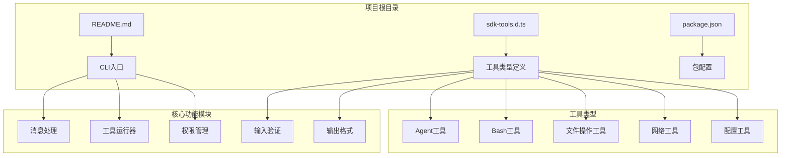

**图表来源**
- [README.md:1-44](file://README.md#L1-L44)
- [package.json:1-34](file://package.json#L1-L34)

**章节来源**
- [README.md:1-44](file://README.md#L1-L44)
- [package.json:1-34](file://package.json#L1-L34)

## 核心组件

### 工具类型系统

项目提供了完整的工具类型定义系统，涵盖了多种工具类型：

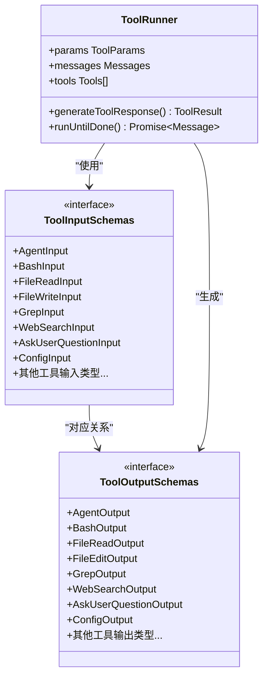

**图表来源**
- [sdk-tools.d.ts:11-54](file://sdk-tools.d.ts#L11-L54)
- [sdk-tools.d.ts:258-2719](file://sdk-tools.d.ts#L258-L2719)

### 工具运行器架构

工具运行器是整个系统的核心组件，负责协调工具的执行和生命周期管理：

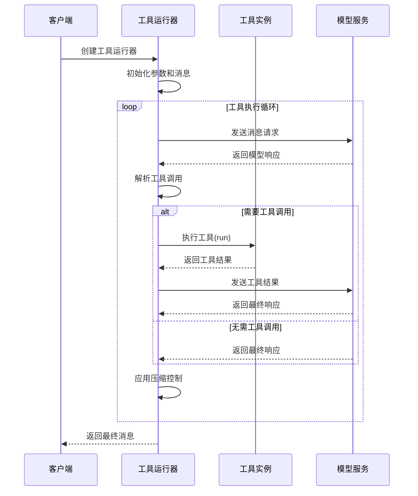

**图表来源**
- [cli.js:16000-16668](file://cli.js#L16000-L16668)

**章节来源**
- [sdk-tools.d.ts:11-54](file://sdk-tools.d.ts#L11-L54)
- [cli.js:16000-16668](file://cli.js#L16000-L16668)

## 架构概览

### 整体架构设计

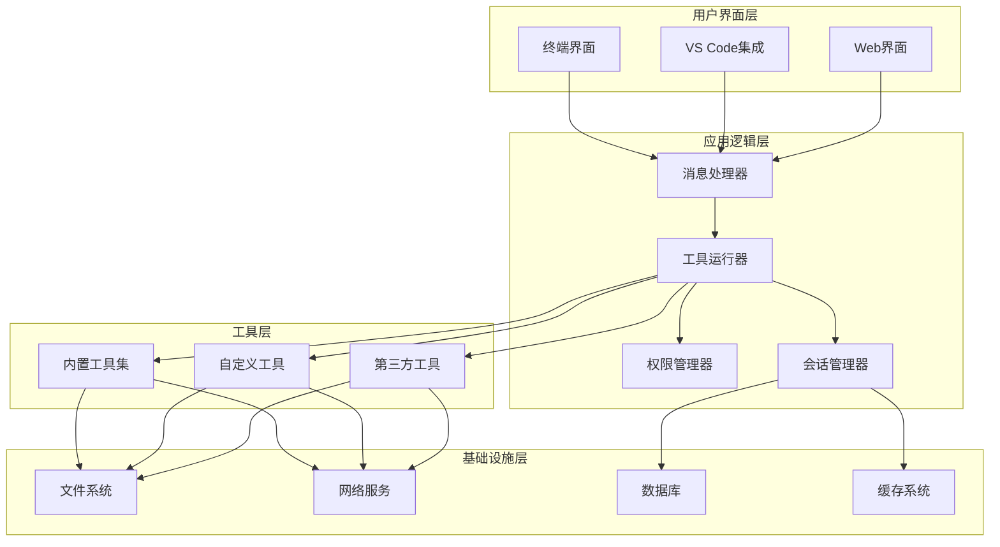

**图表来源**
- [cli.js:1-16668](file://cli.js#L1-L16668)

### 工具执行流程

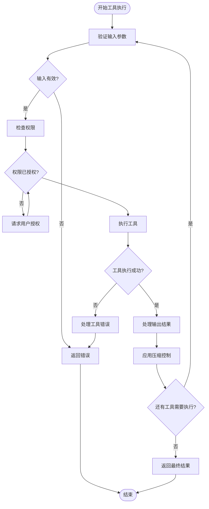

**图表来源**
- [cli.js:16000-16668](file://cli.js#L16000-L16668)

## 详细组件分析

### 工具接口规范

#### 输入接口定义

每个工具都有对应的输入接口，定义了必需和可选的参数：

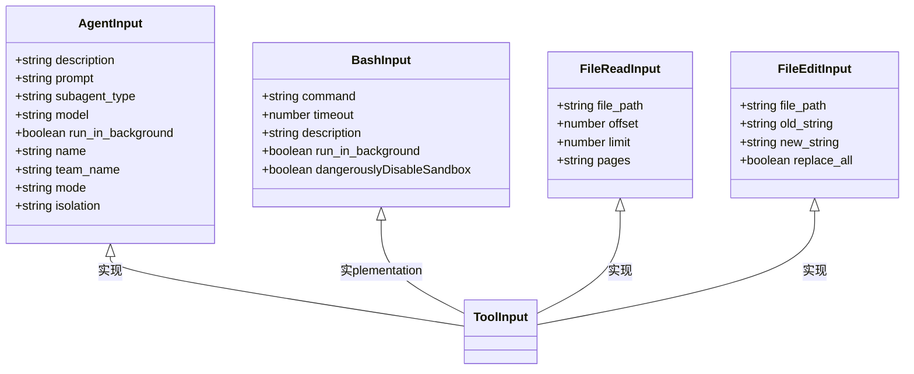

**图表来源**
- [sdk-tools.d.ts:258-403](file://sdk-tools.d.ts#L258-L403)

#### 输出接口定义

工具的输出接口定义了标准的输出格式：

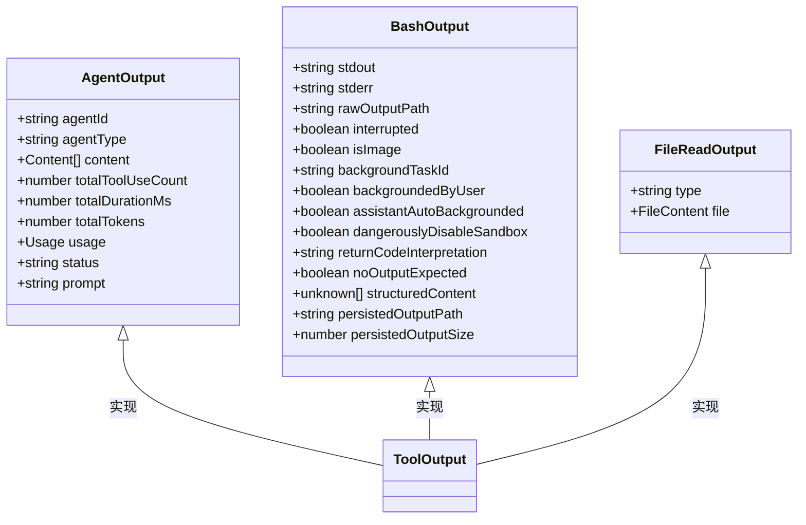

**图表来源**
- [sdk-tools.d.ts:55-230](file://sdk-tools.d.ts#L55-L230)

**章节来源**
- [sdk-tools.d.ts:258-403](file://sdk-tools.d.ts#L258-L403)
- [sdk-tools.d.ts:55-230](file://sdk-tools.d.ts#L55-L230)

### 工具注册机制

#### 工具注册流程

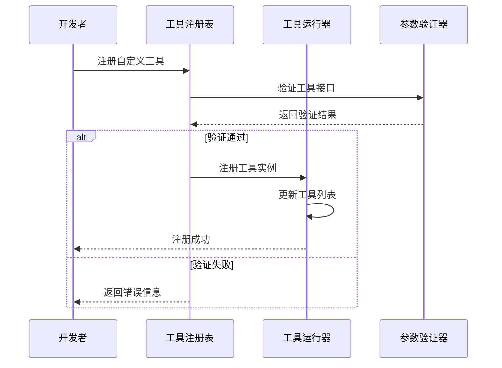

**图表来源**
- [cli.js:16000-16668](file://cli.js#L16000-L16668)

#### 工具生命周期管理

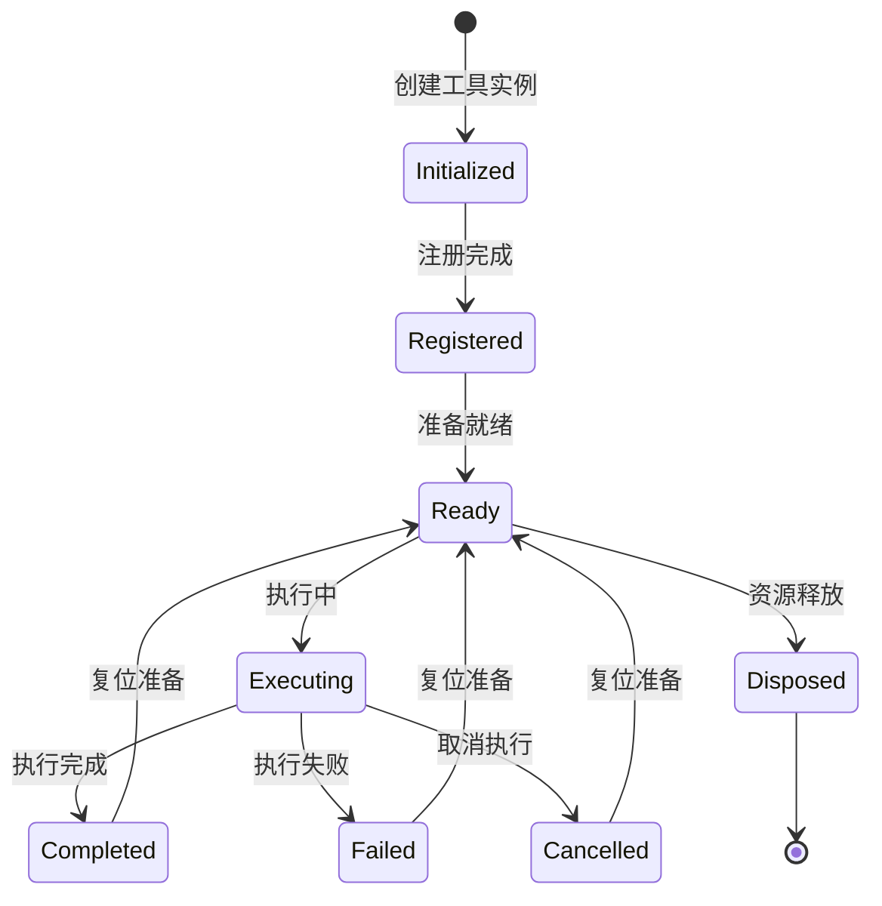

**图表来源**
- [cli.js:16000-16668](file://cli.js#L16000-L16668)

**章节来源**
- [cli.js:16000-16668](file://cli.js#L16000-L16668)

### 权限系统和安全考虑

#### 权限管理架构

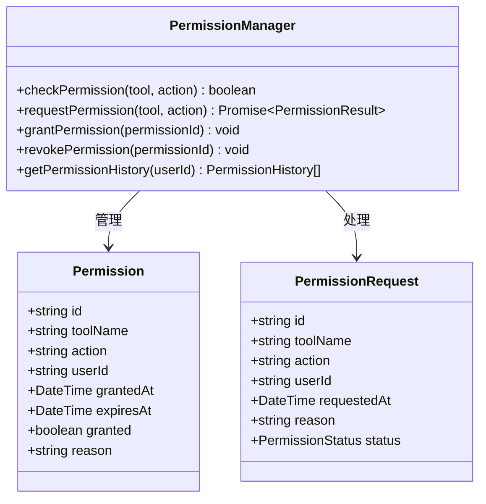

**图表来源**
- [sdk-tools.d.ts:342-357](file://sdk-tools.d.ts#L342-L357)

#### 安全沙箱机制

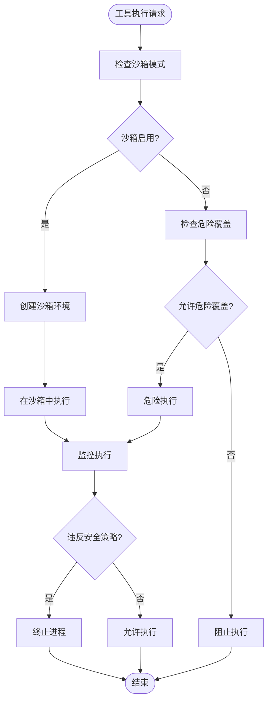

**图表来源**
- [sdk-tools.d.ts:296-327](file://sdk-tools.d.ts#L296-L327)

**章节来源**
- [sdk-tools.d.ts:342-357](file://sdk-tools.d.ts#L342-L357)
- [sdk-tools.d.ts:296-327](file://sdk-tools.d.ts#L296-L327)

### 错误处理和调试

#### 错误处理架构

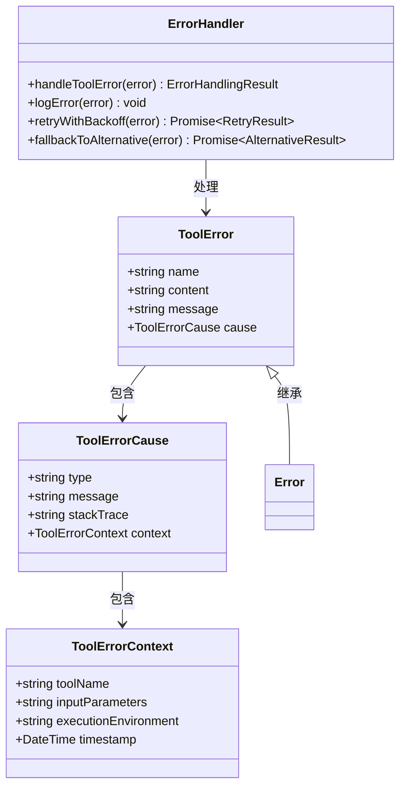

**图表来源**
- [cli.js:16000-16668](file://cli.js#L16000-L16668)

#### 调试工具和日志系统

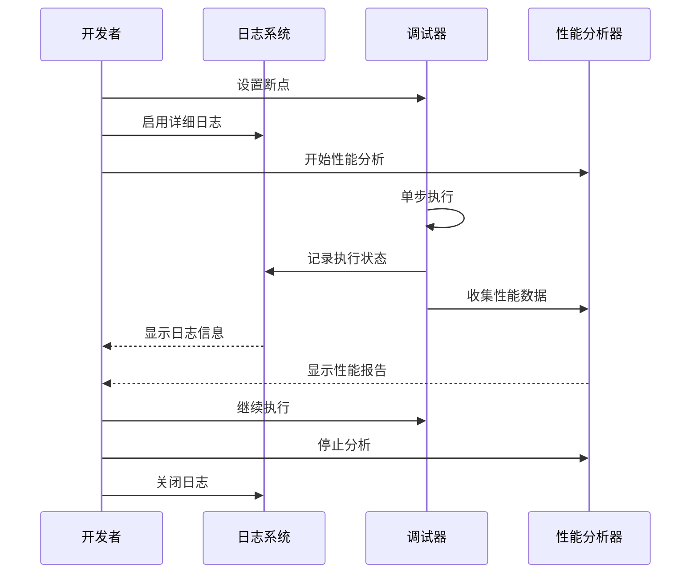

**图表来源**
- [cli.js:16000-16668](file://cli.js#L16000-L16668)

**章节来源**
- [cli.js:16000-16668](file://cli.js#L16000-L16668)

## 依赖关系分析

### 核心依赖关系

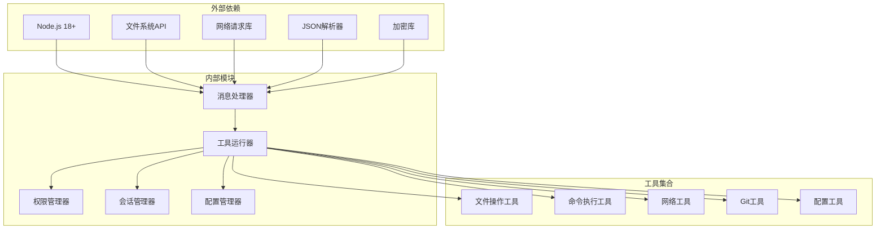

**图表来源**
- [package.json:7-9](file://package.json#L7-L9)
- [package.json:22-32](file://package.json#L22-L32)

### 版本兼容性

项目明确要求Node.js版本为18或更高版本，并包含了多个平台的可选依赖项：

- **操作系统支持**: macOS, Windows, Linux (包括musl变体)
- **架构支持**: x64, ARM64, ARM
- **Node.js版本**: >= 18.0.0

**章节来源**
- [package.json:7-9](file://package.json#L7-L9)
- [package.json:22-32](file://package.json#L22-L32)

## 性能考虑

### 工具执行优化

1. **异步执行**: 所有工具都支持异步执行，避免阻塞主线程
2. **内存管理**: 使用WeakMap和WeakSet进行内存优化
3. **流式处理**: 对于大文件和大量输出，使用流式处理减少内存占用
4. **缓存机制**: 实现了多级缓存系统，包括模型使用统计和系统提示缓存

### 性能监控

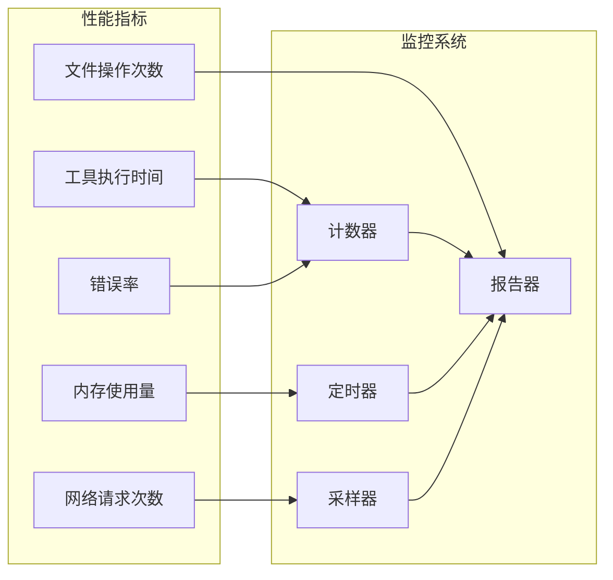

## 故障排除指南

### 常见问题诊断

1. **工具执行失败**
   - 检查工具权限设置
   - 验证输入参数格式
   - 查看错误日志和堆栈跟踪

2. **性能问题**
   - 分析工具执行时间
   - 检查内存使用情况
   - 优化工具实现

3. **权限相关问题**
   - 验证用户授权状态
   - 检查工具访问控制
   - 审计权限历史记录

### 调试技巧

- 使用详细的日志级别
- 启用性能分析器
- 实施断点调试
- 监控资源使用情况

**章节来源**
- [cli.js:16000-16668](file://cli.js#L16000-L16668)

## 结论

Claude Code 提供了一个强大而灵活的工具开发框架，支持多种工具类型和复杂的权限管理。通过遵循本文档中的规范和最佳实践，开发者可以创建高质量的自定义工具，这些工具能够无缝集成到现有的生态系统中。

关键要点：
- 遵循严格的接口规范和类型定义
- 实现完整的错误处理和权限管理
- 优化性能和资源使用
- 提供良好的调试和监控能力

## 附录

### 工具开发最佳实践

1. **接口设计**: 始终使用类型安全的接口定义
2. **错误处理**: 实现全面的错误处理和恢复机制
3. **安全性**: 始终启用沙箱模式，谨慎使用危险覆盖
4. **性能**: 优化工具执行效率，避免不必要的资源消耗
5. **测试**: 编写全面的单元测试和集成测试
6. **文档**: 提供清晰的使用文档和API参考

### 开发模板

```typescript
// 工具输入接口模板
interface CustomToolInput {
  // 必需参数
  requiredParam: string;
  
  // 可选参数
  optionalParam?: number;
  
  // 描述性字段
  description?: string;
}

// 工具输出接口模板
interface CustomToolOutput {
  // 标准输出字段
  success: boolean;
  
  // 工具特定输出
  result?: any;
  
  // 错误信息
  error?: string;
}

// 工具实现模板
class CustomTool implements ToolInterface {
  name: string = "custom-tool";
  
  async run(input: CustomToolInput): Promise<CustomToolOutput> {
    try {
      // 工具执行逻辑
      const result = await this.executeLogic(input);
      
      return {
        success: true,
        result: result
      };
    } catch (error) {
      return {
        success: false,
        error: error.message
      };
    }
  }
  
  private async executeLogic(input: CustomToolInput): Promise<any> {
    // 具体的工具实现
  }
}
```