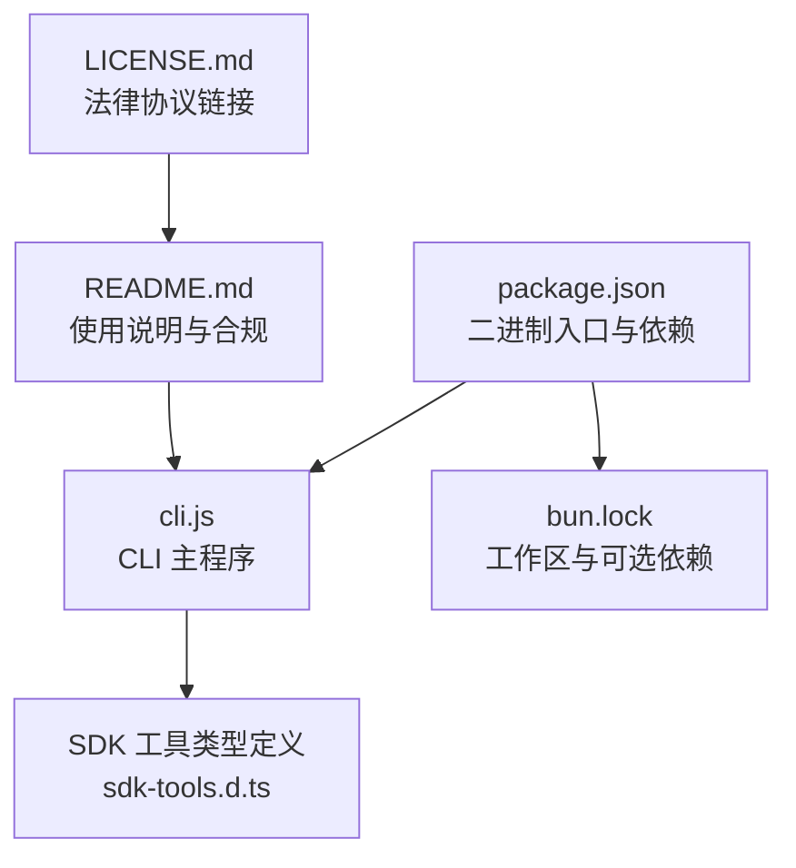
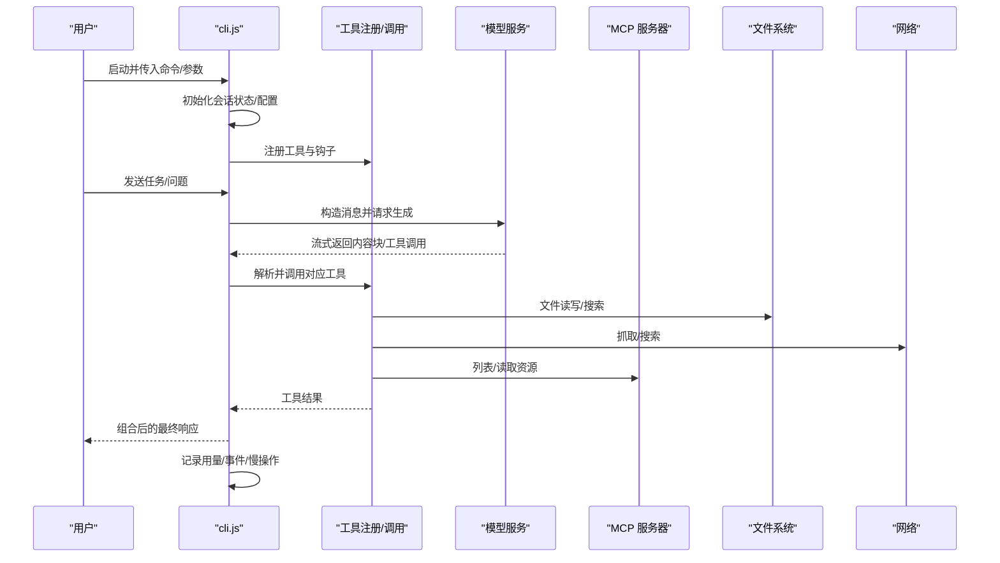
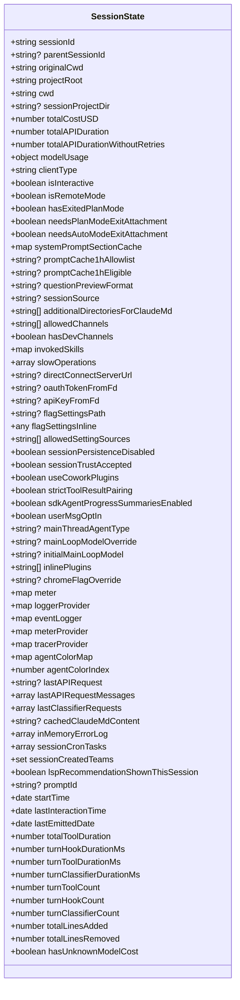
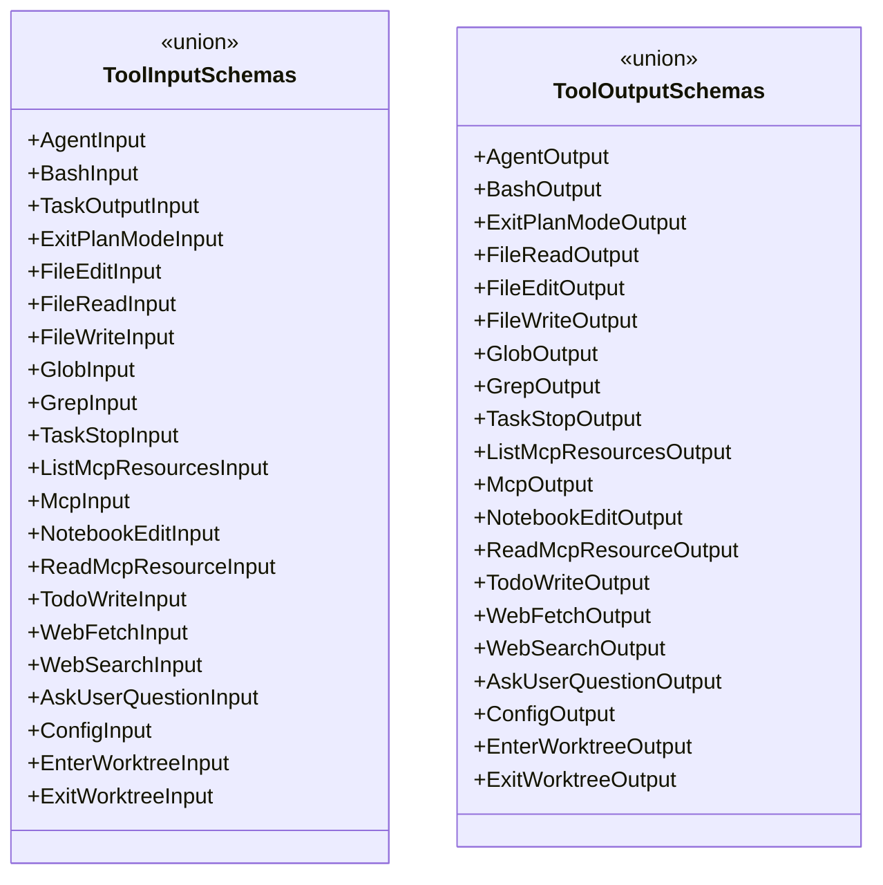
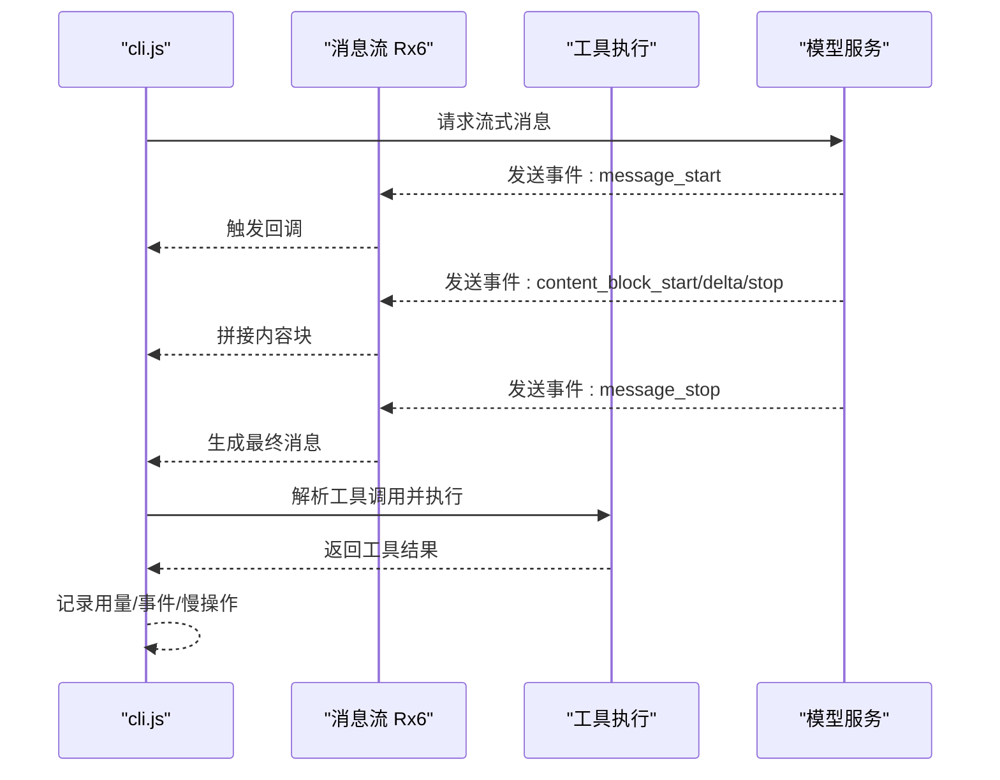
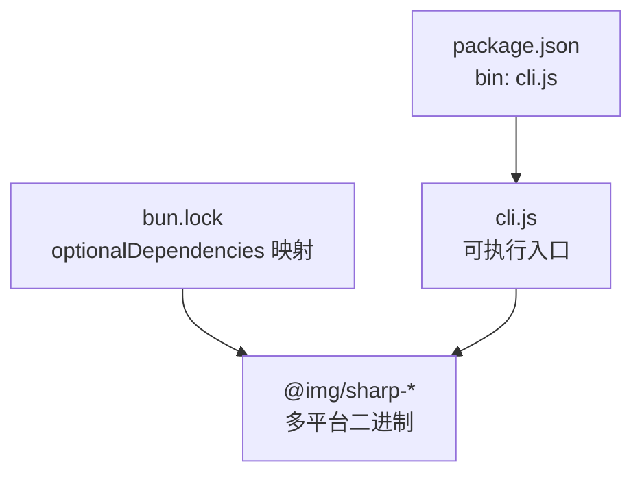

# 开发者指南

<cite>
**本文引用的文件**
- [README.md](file://README.md)
- [package.json](file://package.json)
- [cli.js](file://cli.js)
- [sdk-tools.d.ts](file://sdk-tools.d.ts)
- [bun.lock](file://bun.lock)
- [LICENSE.md](file://LICENSE.md)
</cite>

## 目录
1. [简介](#简介)
2. [项目结构](#项目结构)
3. [核心组件](#核心组件)
4. [架构总览](#架构总览)
5. [详细组件分析](#详细组件分析)
6. [依赖分析](#依赖分析)
7. [性能考虑](#性能考虑)
8. [故障排除指南](#故障排除指南)
9. [结论](#结论)
10. [附录](#附录)

## 简介
本指南面向希望参与 Claude Code 项目的开发者，系统阐述其整体架构、模块组织与关键技术决策，并提供从开发环境到贡献流程、调试与故障排除、测试策略、扩展开发、依赖与构建发布、代码审查与质量保障、以及开发效率提升等全链路实践建议。Claude Code 是一个在终端中运行的智能代理式编程工具，支持自然语言驱动的代码理解、文件编辑、命令执行与工作流处理，通过 CLI 提供统一入口。

## 项目结构
该项目采用极简的包结构：
- 包元数据与二进制入口：package.json 定义了 CLI 可执行名、Node 版本要求、脚本与可选依赖（图像处理库）。
- CLI 入口：cli.js 作为主程序入口，负责解析命令行参数、初始化会话状态、加载工具与模型交互、处理流式响应与事件。
- 类型定义：sdk-tools.d.ts 描述了 SDK 工具输入输出的完整类型体系，覆盖 Agent、Bash、文件读写、搜索、网络抓取、MCP 资源、用户问答、配置、Git 工作树等工具。
- 构建与锁文件：bun.lock 记录了工作区与可选依赖，用于跨平台二进制分发。
- 文档与许可：README.md 提供使用说明与合规信息；LICENSE.md 指向法律协议链接。

图表来源
- [package.json:1-34](file://package.json#L1-L34)
- [cli.js:1-39](file://cli.js#L1-L39)
- [sdk-tools.d.ts:1-54](file://sdk-tools.d.ts#L1-L54)
- [bun.lock:1-22](file://bun.lock#L1-L22)
- [README.md:1-44](file://README.md#L1-L44)
- [LICENSE.md:1-2](file://LICENSE.md#L1-L2)

章节来源
- [package.json:1-34](file://package.json#L1-L34)
- [cli.js:1-39](file://cli.js#L1-L39)
- [sdk-tools.d.ts:1-54](file://sdk-tools.d.ts#L1-L54)
- [bun.lock:1-22](file://bun.lock#L1-L22)
- [README.md:1-44](file://README.md#L1-L44)
- [LICENSE.md:1-2](file://LICENSE.md#L1-L2)

## 核心组件
- CLI 入口与会话状态管理
  - cli.js 通过全局会话状态对象维护项目根目录、当前工作目录、计费与用量统计、交互时间、工具计时与令牌用量、MCP 与插件注册、计划模式与权限、遥测与指标等。
  - 提供会话切换、持久化控制、统计存储、日志与事件记录、慢操作追踪、MCP 资源列表与读取、文件读写与搜索、网络抓取与搜索、用户问答、配置读写、Git 工作树进入/退出等能力。
- SDK 工具类型体系
  - sdk-tools.d.ts 定义了工具输入输出的联合类型与接口，覆盖 Agent、Bash、文件读写、Glob/Grep、MCP、笔记本编辑、Web 抓取/搜索、AskUserQuestion、Config、EnterWorktree/ExitWorktree 等。
  - 输出类型包含文本、图片、PDF、PDF 分页、笔记本、文件未变更等多形态内容，便于上层统一处理。
- 包与可选依赖
  - package.json 声明 Node 引擎版本、二进制入口、可选依赖（sharp 图像库多平台二进制），bun.lock 映射工作区与可选依赖，确保跨平台分发一致性。

章节来源
- [cli.js:1-39](file://cli.js#L1-L39)
- [sdk-tools.d.ts:11-54](file://sdk-tools.d.ts#L11-L54)
- [package.json:1-34](file://package.json#L1-L34)
- [bun.lock:1-22](file://bun.lock#L1-L22)

## 架构总览
下图展示了 CLI 启动后的主要控制流：参数解析、会话初始化、工具注册与消息循环、流式响应处理、事件与遥测上报、以及与外部服务（如模型 API、MCP 服务器、文件系统、网络）的交互。

图表来源
- [cli.js:1-39](file://cli.js#L1-L39)
- [sdk-tools.d.ts:11-54](file://sdk-tools.d.ts#L11-L54)

## 详细组件分析

### CLI 入口与会话状态
- 会话状态对象包含：
  - 路径与目录：originalCwd、projectRoot、cwd、sessionProjectDir
  - 计费与用量：totalCostUSD、totalAPIDuration、totalAPIDurationWithoutRetries、modelUsage、tokenCounter、costCounter 等
  - 交互与时间：startTime、lastInteractionTime、lastEmittedDate、activeTimeCounter
  - 工具与模型：mainLoopModelOverride、initialMainLoopModel、modelStrings、mainThreadAgentType
  - 权限与模式：isInteractive、isRemoteMode、sessionBypassPermissionsMode、planSlugCache、hasExitedPlanMode、needsPlanModeExitAttachment、needsAutoModeExitAttachment
  - 日志与遥测：loggerProvider、eventLogger、meterProvider、tracerProvider
  - 插件与钩子：inlinePlugins、useCoworkPlugins、registeredHooks、invokedSkills
  - 缓存与提示：systemPromptSectionCache、promptCache1hAllowlist/promptCache1hEligible
  - 其他：sessionId、parentSessionId、clientType、sessionSource、questionPreviewFormat、additionalDirectoriesForClaudeMd、allowedChannels、hasDevChannels 等
- 关键函数族：
  - 会话管理：N8/un8/mn8/Of/Q36/r1/Fz/aR/bb6/Vx/o58/gn8/A_5
  - 计费与用量：Fn8/O_5/Un8/fW/ay/RX6/Qn8/dn8/a58/w_5/s58/cn8/j_5/H_5/ln8/J_5/M_5/nn8/in8/X_5/d36/rn8
  - 交互与时间：c36/an8/Nj7/t58/l36/n36/bk/Gc/xb6/Ib6/sn8/P_5/W_5/D_5/f_5/Z_5/q38/qi8
  - 工具与模型：yx/hX6/YP/$i8/SX6/Bb6/CX6/gb6/G_5/Oi8/T_5/wi8/K38/Fb6/ji8/Hi8/bX6/Ub6/Ji8
  - 日志与遥测：Qb6/_38/Mi8/z38/Xi8/Y38/o36/$38
  - 权限与模式：ET/Pi8/sp/Di8/xk/v_5/fi8/k_5/sy/tp/V_5/Zi8/A38/O38/w38/xt/Gi8/IX6/Ti8/vi8/a36/ki8/Vi8/Ni8/Ei8/Li8/Ri8/N_5/db6/Lj7/hi8/Si8/y_5/Ci8/bi8/cb6/xi8/ep/Ii8/lb6/ty/nb6/ui8/s36/ib6/uX6/rb6/mi8/ob6/ab6/mX6/pi8/sb6/qE/Bi8/Ex/Tc/gi8/VZ/Fi8/Ui8/Qi8/di8/j38/It/sR/E_5/H38/Rj7/t36/tb6/eb6/J38/M38/pX6/L_5/X38/ci8/ut/hj7/Sj7/qB/vc/z5/li8/ni8/ii8/ri8/oi8/BX6/NZ/qx6/eH/kc/P38/W38/ai8/si8/ti8/eiei8/qr8/Kr8/_r8/zr8/Yr8/R_5/$r8/Ar8/Or8/Kx6/_x6
- 事件与订阅：Dz() 返回订阅/发射器，用于内部事件广播与监听。

图表来源
- [cli.js:1-39](file://cli.js#L1-L39)

章节来源
- [cli.js:1-39](file://cli.js#L1-L39)

### SDK 工具类型体系
- 输入类型（ToolInputSchemas）涵盖：
  - AgentInput、BashInput、TaskOutputInput、ExitPlanModeInput、FileEditInput、FileReadInput、FileWriteInput、GlobInput、GrepInput、TaskStopInput、ListMcpResourcesInput、McpInput、NotebookEditInput、ReadMcpResourceInput、TodoWriteInput、WebFetchInput、WebSearchInput、AskUserQuestionInput、ConfigInput、EnterWorktreeInput、ExitWorktreeInput
- 输出类型（ToolOutputSchemas）涵盖：
  - AgentOutput、BashOutput、ExitPlanModeOutput、FileReadOutput（含文本/图片/笔记本/PDF/分页）、FileEditOutput、FileWriteOutput、GlobOutput、GrepOutput、TaskStopOutput、ListMcpResourcesOutput、McpOutput、NotebookEditOutput、ReadMcpResourceOutput、TodoWriteOutput、WebFetchOutput、WebSearchOutput、AskUserQuestionOutput、ConfigOutput、EnterWorktreeOutput、ExitWorktreeOutput
- 关键字段与语义：
  - BashInput 支持超时、描述性说明、后台执行、危险禁用沙箱、返回码解释、无输出期望、结构化内容块、大输出持久化路径与大小等。
  - FileReadOutput 支持多形态：文本、图片（含尺寸）、PDF（含原始大小）、PDF 分页（含输出目录与页数）、笔记本（含单元格）、文件未变更。
  - AskUserQuestionInput 支持最多 4 个问题，每个问题 2-4 个选项，支持多选、预览、注释与元数据。
  - ConfigInput/Output 支持设置键值与获取/设置当前值、错误信息等。
  - EnterWorktree/ExitWorktree 支持命名工作树、分支、tmux 会话、丢弃文件/提交统计与消息。

图表来源
- [sdk-tools.d.ts:11-54](file://sdk-tools.d.ts#L11-L54)

章节来源
- [sdk-tools.d.ts:11-54](file://sdk-tools.d.ts#L11-L54)
- [sdk-tools.d.ts:258-2246](file://sdk-tools.d.ts#L258-L2246)

### 消息与工具执行流程
- 模型消息流式处理：
  - Rx6.createMessage 构造流式消息，监听 message_start/message_delta/content_block_start/content_block_delta/content_block_stop/message_stop 等事件，逐步拼接内容块与工具调用参数。
  - 工具执行：当收到工具调用时，根据工具名称与输入构造工具结果，支持错误包装与 JSON 参数解析。
- 批量消息与结果：
  - xx6.batches 提供批量消息创建、检索、列表、取消与结果下载（二进制流）。
- 结构化输出：
  - dt.parse 对模型返回进行结构化解析，支持 JSON Schema 输出格式与兼容旧版属性别名。

图表来源
- [cli.js:1-39](file://cli.js#L1-L39)

章节来源
- [cli.js:1-39](file://cli.js#L1-L39)

### 配置与环境变量
- Node 版本要求：>= 18
- 可选依赖：sharp 多平台二进制（Darwin/Linux/Windows），用于图像处理能力。
- 发布脚本：prepare 中检查 AUTHORIZED 环境变量，防止直接发布。

章节来源
- [package.json:7-21](file://package.json#L7-L21)

## 依赖分析
- 工作区与可选依赖映射：
  - bun.lock 定义了工作区与 optionalDependencies 的映射关系，确保不同平台的 sharp 二进制可用。
- 二进制入口：
  - package.json 的 bin 字段将 claude 指向 cli.js，实现全局可执行。

图表来源
- [package.json:4-6](file://package.json#L4-L6)
- [bun.lock:7-17](file://bun.lock#L7-L17)

章节来源
- [package.json:4-6](file://package.json#L4-L6)
- [bun.lock:7-17](file://bun.lock#L7-L17)

## 性能考虑
- 流式处理与事件驱动：消息与工具执行均采用流式与事件驱动方式，降低内存峰值与延迟。
- 用量与计时：内置 turn 级与总级的工具/钩子/分类器耗时统计与令牌用量汇总，便于性能分析与优化。
- 慢操作追踪：维护慢操作列表，定期清理过期条目，辅助定位瓶颈。
- 缓存与提示：systemPromptSectionCache、promptCache1hAllowlist/promptCache1hEligible 等缓存机制减少重复计算与请求。
- 平台二进制：通过 sharp 多平台二进制减少运行时编译成本。

章节来源
- [cli.js:1-39](file://cli.js#L1-L39)

## 故障排除指南
- 常见问题定位
  - 日志与事件：通过 Qb6/事件记录器记录请求与响应细节，便于回溯。
  - 错误收集：y_5 将错误推入内存日志队列（上限 100），支持查看最近错误。
  - 慢操作：Sj7 返回当前活跃慢操作集合，结合时间戳定位卡顿点。
  - 用量异常：fW/ay/RX6/Qn8/dn8/bk/Gc/xb6/Ib6/sn8/P_5/W_5/D_5/f_5/Z_5/q38/qi8 等接口可用于核对用量与耗时。
- 模型与工具
  - 工具错误：nX6 包装工具执行错误，便于区分工具与模型错误。
  - 结构化输出：Cr8/zz5 解析 JSON Schema 输出，失败时抛出明确错误。
- 网络与流
  - RT.fromSSEResponse/RT.fromReadableStream 支持 SSE 与可读流迭代，注意消费后不可重复迭代。
- 发布与环境
  - prepare 脚本检查 AUTHORIZED，避免非授权发布。

章节来源
- [cli.js:1-39](file://cli.js#L1-L39)
- [sdk-tools.d.ts:258-2246](file://sdk-tools.d.ts#L258-L2246)

## 结论
本指南基于仓库现有文件，系统梳理了 Claude Code 的 CLI 架构、会话状态管理、工具类型体系与消息流式处理机制。建议在后续开发中补充测试框架、CI/CD 流程与更详细的贡献规范，以进一步完善质量与协作效率。

## 附录

### 开发环境搭建
- 运行时要求
  - Node.js >= 18
- 安装与使用
  - 全局安装包后，进入项目目录运行 claude 即可启动。
- 可选依赖
  - 项目包含 sharp 多平台二进制，确保跨平台图像处理能力。

章节来源
- [package.json:7-21](file://package.json#L7-L21)
- [README.md:13-21](file://README.md#L13-L21)

### 代码贡献指南
- 提交前检查
  - 本地运行最小化验证（启动、基本命令、工具调用）
  - 通过 prepare 脚本（需要 AUTHORIZED 环境变量）进行发布前检查
- 提交流程
  - 使用分支与 Pull Request，遵循团队代码风格与审查流程
- 代码风格
  - 保持模块化与清晰的职责分离，优先使用事件与流式处理
- 测试
  - 建议新增工具或关键路径时补充单元/集成测试，覆盖错误场景与边界条件

章节来源
- [package.json:18-21](file://package.json#L18-L21)

### 调试与性能诊断
- 日志与事件
  - 使用 Qb6/eventLogger 记录请求与响应详情
  - 通过 inMemoryErrorLog 查看最近错误
- 性能指标
  - 使用 turn 级与总级计时与用量接口核对性能
  - 慢操作追踪 Sj7 辅助定位瓶颈
- 模型与工具
  - nX6 包装工具错误，Cr8/zz5 解析结构化输出

章节来源
- [cli.js:1-39](file://cli.js#L1-L39)

### 测试策略与用例编写
- 建议覆盖范围
  - 工具输入输出类型校验（sdk-tools.d.ts）
  - CLI 启动与会话状态初始化
  - 工具执行与错误处理（含 nX6）
  - 流式消息解析与事件触发
  - 用量统计与慢操作追踪
- 用例示例思路
  - 伪造 BashInput 并断言 BashOutput 形态
  - 伪造 AskUserQuestionInput 并断言 AskUserQuestionOutput
  - 断言工具调用后会话状态变化（用量、计时、慢操作）

章节来源
- [sdk-tools.d.ts:11-54](file://sdk-tools.d.ts#L11-L54)
- [sdk-tools.d.ts:258-2246](file://sdk-tools.d.ts#L258-L2246)

### 扩展开发指南
- 新增工具
  - 在 sdk-tools.d.ts 中定义输入/输出类型
  - 在 CLI 中注册工具并实现执行逻辑
  - 通过 ToolRunner 或直接消息流处理工具调用
- 工具集成
  - MCP 资源：ListMcpResourcesInput/ReadMcpResourceInput/Output
  - Git 工作树：EnterWorktree/ExitWorktree
- 插件与钩子
  - inlinePlugins/useCoworkPlugins 控制插件启用
  - registeredHooks/invokedSkills 支持钩子注册与技能调用追踪

章节来源
- [sdk-tools.d.ts:11-54](file://sdk-tools.d.ts#L11-L54)
- [cli.js:1-39](file://cli.js#L1-L39)

### 依赖管理、构建与发布
- 依赖管理
  - 使用 bun.lock 管理工作区与 optionalDependencies
- 构建与打包
  - 当前为纯 JS/TS 类型定义与 CLI 入口，无需复杂打包
- 发布机制
  - prepare 脚本检查 AUTHORIZED 环境变量，防止直接发布

章节来源
- [bun.lock:1-22](file://bun.lock#L1-L22)
- [package.json:18-21](file://package.json#L18-L21)

### 代码审查与质量保证
- 审查要点
  - 会话状态一致性与并发安全
  - 工具输入输出类型完整性与向后兼容
  - 错误处理与日志记录
  - 性能指标与慢操作追踪
- 质量保障
  - 引入单元/集成测试，覆盖关键路径
  - 使用 ESLint/Prettier 统一风格

章节来源
- [sdk-tools.d.ts:11-54](file://sdk-tools.d.ts#L11-L54)
- [cli.js:1-39](file://cli.js#L1-L39)

### 开发工具与效率提升
- 推荐工具
  - VS Code + TypeScript/ESLint 插件
  - bun（包管理与脚本）
  - Node.js 18+ 运行时
- 效率技巧
  - 使用流式与事件驱动减少内存占用
  - 利用缓存与用量统计优化长会话体验
  - 通过慢操作追踪快速定位性能瓶颈

章节来源
- [package.json:7-21](file://package.json#L7-L21)
- [cli.js:1-39](file://cli.js#L1-L39)