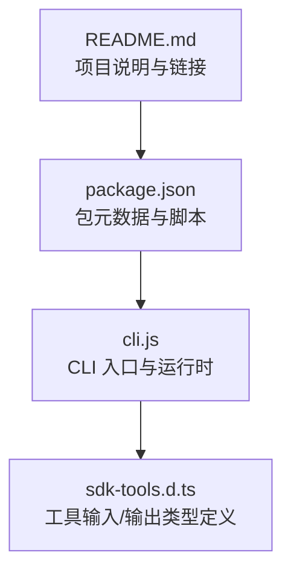
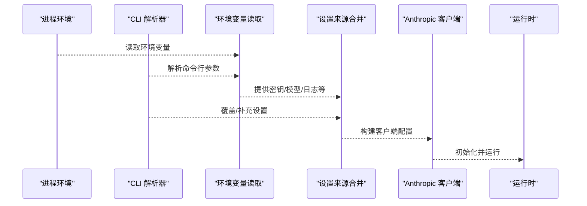
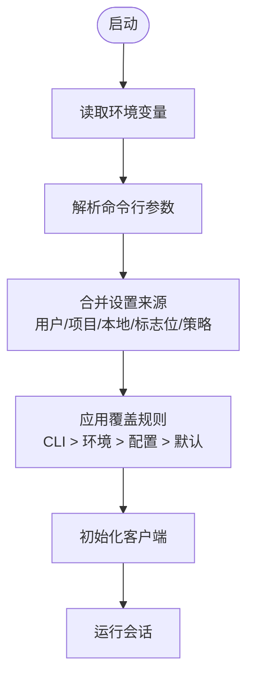
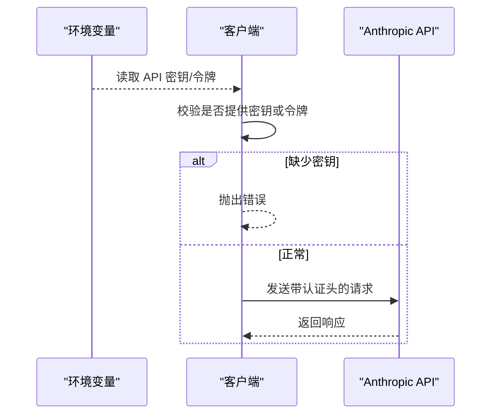
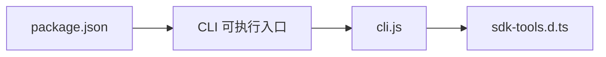

# 环境变量

<cite>
**本文档引用的文件**
- [README.md](file://README.md)
- [package.json](file://package.json)
- [cli.js](file://cli.js)
- [sdk-tools.d.ts](file://sdk-tools.d.ts)
</cite>

## 目录
1. [简介](#简介)
2. [项目结构](#项目结构)
3. [核心组件](#核心组件)
4. [架构总览](#架构总览)
5. [详细组件分析](#详细组件分析)
6. [依赖分析](#依赖分析)
7. [性能考虑](#性能考虑)
8. [故障排查指南](#故障排查指南)
9. [结论](#结论)
10. [附录](#附录)

## 简介
本文件系统性梳理 Claude Code 的环境变量体系，覆盖以下方面：
- 支持的环境变量清单（含 API 密钥、代理与网络、日志与调试、功能开关）
- 变量优先级与覆盖规则（命令行参数、环境变量、配置文件、默认值）
- 与配置文件的关系（设置来源、策略与合并顺序）
- 敏感信息的安全处理与最佳实践
- 不同操作系统下的设置示例与 Shell 配置方法
- 动态更新与热重载能力说明
- 常见组合场景与配置模板

## 项目结构
仓库采用最小化入口设计：通过 CLI 入口加载运行时逻辑，核心运行时在单个大型模块中实现；同时提供类型定义文件以描述工具输入输出。

图表来源
- [README.md](file://README.md)
- [package.json](file://package.json)
- [cli.js](file://cli.js)
- [sdk-tools.d.ts](file://sdk-tools.d.ts)

章节来源
- [README.md](file://README.md)
- [package.json](file://package.json)

## 核心组件
- CLI 入口与运行时：负责解析命令行参数、加载环境变量、初始化客户端与会话、管理 MCP 服务器与插件、处理调试与日志等。
- 客户端与认证：封装 Anthropic API 客户端，支持从环境变量读取 API 密钥或令牌，并进行头部校验与错误处理。
- 设置与配置：支持多来源设置合并（用户、项目、本地、标志位），并提供设置来源控制与覆盖策略。
- 日志与调试：统一的日志级别与输出控制，支持到文件、到标准错误等输出路径。

章节来源
- [cli.js](file://cli.js)

## 架构总览
下图展示环境变量在启动流程中的关键作用点：从进程环境读取配置，与命令行参数交互，最终影响客户端初始化与运行时行为。

图表来源
- [cli.js](file://cli.js)

## 详细组件分析

### 环境变量与配置来源
- 环境变量读取：运行时通过统一函数从进程环境读取键值，支持字符串裁剪与布尔转换。
- 设置来源：支持用户、项目、本地、标志位、策略等来源，可通过命令行参数控制启用哪些来源。
- 合并与覆盖：命令行参数通常具有最高优先级，随后是环境变量，再后是配置文件，最后是默认值。

图表来源
- [cli.js](file://cli.js)

章节来源
- [cli.js](file://cli.js)

### API 密钥与认证
- Anthropic API 密钥：从环境变量读取，用于构建请求头。
- 认证令牌：支持从环境变量读取，作为 Bearer Token 使用。
- 头部校验：若未提供密钥或令牌，将抛出错误提示。

图表来源
- [cli.js](file://cli.js)

章节来源
- [cli.js](file://cli.js)

### 代理与网络相关
- 系统证书与客户端证书：检测 NODE_EXTRA_CA_CERTS、CLAUDE_CODE_CLIENT_CERT 等环境变量，用于增强 TLS 连接安全性。
- 系统/OpenSSL CA 选择：通过 NODE_OPTIONS 参数控制使用系统或 OpenSSL CA。
- Bedrock/Vertex 认证：当启用相应功能时，会检查并可能跳过认证以提升体验。

章节来源
- [cli.js](file://cli.js)

### 日志级别与调试
- 日志级别：支持从环境变量读取调试级别，与命令行参数配合决定输出粒度。
- 调试模式：支持将调试输出写入文件或标准错误流，便于问题定位。
- 性能剖析：可启用启动阶段性能剖析，生成报告并写入文件。

章节来源
- [cli.js](file://cli.js)

### 功能开关与行为控制
- 简化模式：通过环境变量开启简化模式，禁用钩子、LSP、插件同步等。
- 模型选择：支持从环境变量指定模型别名或完整名称。
- MCP 与插件：通过环境变量控制 MCP 服务器与插件的加载与连接。
- 远程会话：支持远程会话与桥接控制，受组织策略限制。

章节来源
- [cli.js](file://cli.js)

### 配置文件与设置来源
- 设置来源控制：通过命令行参数指定启用的设置来源（用户、项目、本地）。
- 设置文件：支持从 JSON 文件或内联 JSON 字符串加载额外设置。
- 设置合并：按来源优先级合并，CLI 参数覆盖配置文件，配置文件覆盖环境变量，环境变量覆盖默认值。

章节来源
- [cli.js](file://cli.js)

### 敏感信息的安全处理
- 最小暴露原则：仅在必要时读取敏感信息，避免在日志中打印明文。
- 头部脱敏：对敏感头部（如 API Key、Authorization、Cookie）进行脱敏输出。
- 传输安全：通过系统/自定义 CA 证书与客户端证书增强传输层安全。

章节来源
- [cli.js](file://cli.js)

### 动态更新与热重载
- 设置来源动态切换：可通过命令行参数在运行时调整启用的设置来源。
- MCP 与插件：支持动态连接与断开 MCP 服务器，以及插件的启用/禁用。
- 运行时状态：会话状态与工具权限上下文可在运行时更新。

章节来源
- [cli.js](file://cli.js)

## 依赖分析
- 包元数据：声明 CLI 可执行入口与 Node 版本要求。
- 类型定义：描述工具输入/输出结构，辅助理解配置项与行为。

图表来源
- [package.json](file://package.json)
- [cli.js](file://cli.js)
- [sdk-tools.d.ts](file://sdk-tools.d.ts)

章节来源
- [package.json](file://package.json)
- [sdk-tools.d.ts](file://sdk-tools.d.ts)

## 性能考虑
- 启动性能剖析：可记录启动阶段关键时间点，生成报告用于性能优化。
- 内存与资源：远程模式下可增加 Node 堆内存上限，避免资源不足导致失败。
- 背景预取：在非交互模式下可启用后台预取以提升后续响应速度。

章节来源
- [cli.js](file://cli.js)

## 故障排查指南
- 认证失败：确认 API 密钥或令牌已正确设置，且未被头部校验拦截。
- 网络问题：检查系统证书与客户端证书配置，确保 NODE_OPTIONS 与 CA 选择符合预期。
- 日志定位：使用调试模式与输出到文件/标准错误的方式收集更多信息。
- 远程会话：确认组织策略允许远程会话与桥接控制，必要时联系管理员。

章节来源
- [cli.js](file://cli.js)

## 结论
本文件系统化梳理了 Claude Code 的环境变量体系，明确了变量清单、优先级与覆盖规则、与配置文件的关系、安全处理与最佳实践、动态更新能力，并提供了常见场景的配置模板。建议在生产环境中遵循最小暴露与传输安全原则，结合调试与性能剖析工具持续优化运行时表现。

## 附录

### 环境变量清单与用途
- 认证与安全
  - ANTHROPIC_API_KEY：Anthropic API 密钥
  - ANTHROPIC_AUTH_TOKEN：Anthropic 认证令牌
  - NODE_EXTRA_CA_CERTS：自定义 CA 证书路径
  - CLAUDE_CODE_CLIENT_CERT：客户端证书路径
  - NODE_OPTIONS：传递给 Node 的选项（如启用系统/OpenSSL CA）
- 运行模式与行为
  - CLAUDE_CODE_SIMPLE：简化模式开关
  - CLAUDE_CODE_ENVIRONMENT_KIND：环境类型（如 bridge）
  - CLAUDE_CODE_QUESTION_PREVIEW_FORMAT：问题预览格式（markdown/html）
  - CLAUDE_CODE_EXIT_AFTER_FIRST_RENDER：首次渲染后退出
  - CLAUDE_CODE_USE_BEDROCK / CLAUDE_CODE_SKIP_BEDROCK_AUTH：Bedrock 使用与认证跳过
  - CLAUDE_CODE_USE_VERTEX / CLAUDE_CODE_SKIP_VERTEX_AUTH：Vertex 使用与认证跳过
  - CLAUDE_CODE_INCLUDE_PARTIAL_MESSAGES：包含部分消息输出
  - CLAUDE_CODE_PROFILE_STARTUP：启用启动性能剖析
  - CLAUDE_CODE_DEBUG_LOG_LEVEL：调试日志级别
  - CLAUDE_CODE_DEBUG_LOGS_DIR：调试日志目录
  - CLAUDE_CODE_REMOTE：启用远程模式（会增加堆内存）
- 模型与思考
  - ANTHROPIC_MODEL：默认模型别名或完整名称
  - MAX_THINKING_TOKENS：最大思考令牌数（兼容旧变量）
- 设置与来源
  - CLAUDE_CODE_SESSION_ACCESS_TOKEN：会话访问令牌（文件下载等）
  - CLAUDE_CODE_SETTINGS_PATH：设置文件路径
  - CLAUDE_CODE_SETTING_SOURCES：启用的设置来源（逗号分隔）
- 日志与输出
  - DEBUG / DEBUG_SDK：启用调试
  - --debug / --debug-to-stderr / --debug-file：调试输出控制
  - CLAUDE_CODE_SLOW_OPERATION_THRESHOLD_MS：慢操作阈值

章节来源
- [cli.js](file://cli.js)

### 优先级与覆盖规则
- 命令行参数 > 环境变量 > 配置文件 > 默认值
- 设置来源可通过命令行参数显式控制启用范围
- MCP 与插件配置支持动态连接与覆盖

章节来源
- [cli.js](file://cli.js)

### 与配置文件的关系
- 设置来源：用户、项目、本地、标志位、策略
- 合并策略：按来源优先级合并，CLI 参数覆盖配置文件，配置文件覆盖环境变量，环境变量覆盖默认值
- 设置文件：支持 JSON 文件或内联 JSON 字符串

章节来源
- [cli.js](file://cli.js)

### 安全处理与最佳实践
- 仅在必要时读取敏感信息
- 对敏感头部进行脱敏输出
- 使用系统/自定义 CA 证书与客户端证书增强传输安全
- 在 CI/CD 环境中通过密钥管理服务注入环境变量

章节来源
- [cli.js](file://cli.js)

### 不同操作系统下的设置示例
- Linux/macOS（Shell）
  - export ANTHROPIC_API_KEY="sk-ant-xxx"
  - export CLAUDE_CODE_SIMPLE=1
  - export CLAUDE_CODE_DEBUG_LOG_LEVEL=debug
- Windows（PowerShell）
  - $env:ANTHROPIC_API_KEY="sk-ant-xxx"
  - $env:CLAUDE_CODE_SIMPLE="1"
- Docker
  - docker run -e ANTHROPIC_API_KEY=sk-ant-xxx ghcr.io/anthropic/claude-code:latest

章节来源
- [cli.js](file://cli.js)

### 动态更新与热重载
- 设置来源动态切换：通过命令行参数在运行时调整启用的设置来源
- MCP 与插件：支持动态连接与断开 MCP 服务器，以及插件的启用/禁用
- 运行时状态：会话状态与工具权限上下文可在运行时更新

章节来源
- [cli.js](file://cli.js)

### 常见环境变量组合与配置模板
- 开发调试模板
  - CLAUDE_CODE_DEBUG_LOG_LEVEL=debug
  - CLAUDE_CODE_DEBUG_LOGS_DIR=/tmp/claude
  - CLAUDE_CODE_PROFILE_STARTUP=1
- 生产安全模板
  - ANTHROPIC_API_KEY=sk-ant-xxx
  - NODE_EXTRA_CA_CERTS=/etc/ssl/certs/ca-certificates.crt
  - CLAUDE_CODE_SIMPLE=1
- 远程会话模板
  - CLAUDE_CODE_REMOTE=true
  - NODE_OPTIONS="--max-old-space-size=8192"
  - CLAUDE_CODE_SESSION_ACCESS_TOKEN=xxx

章节来源
- [cli.js](file://cli.js)