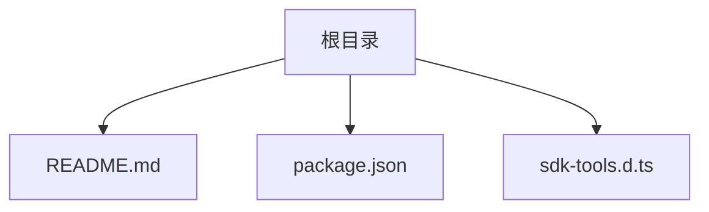
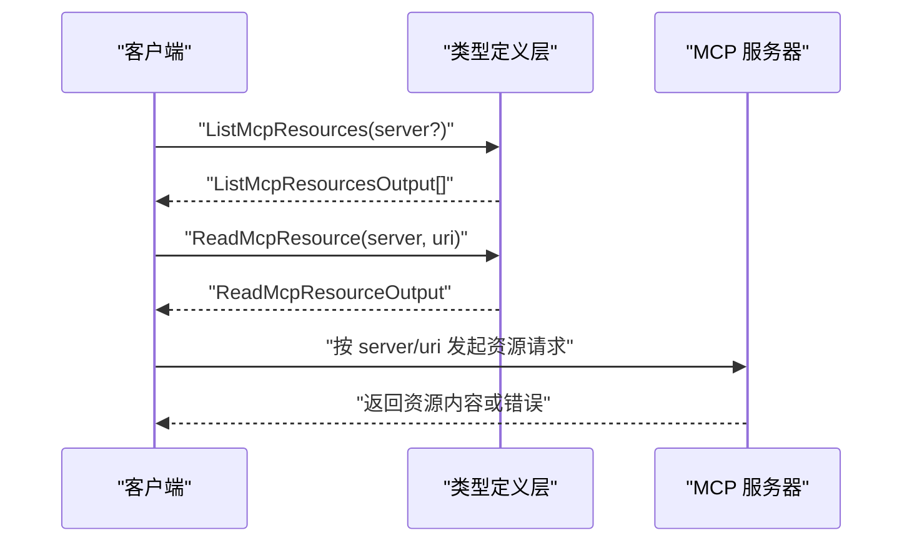
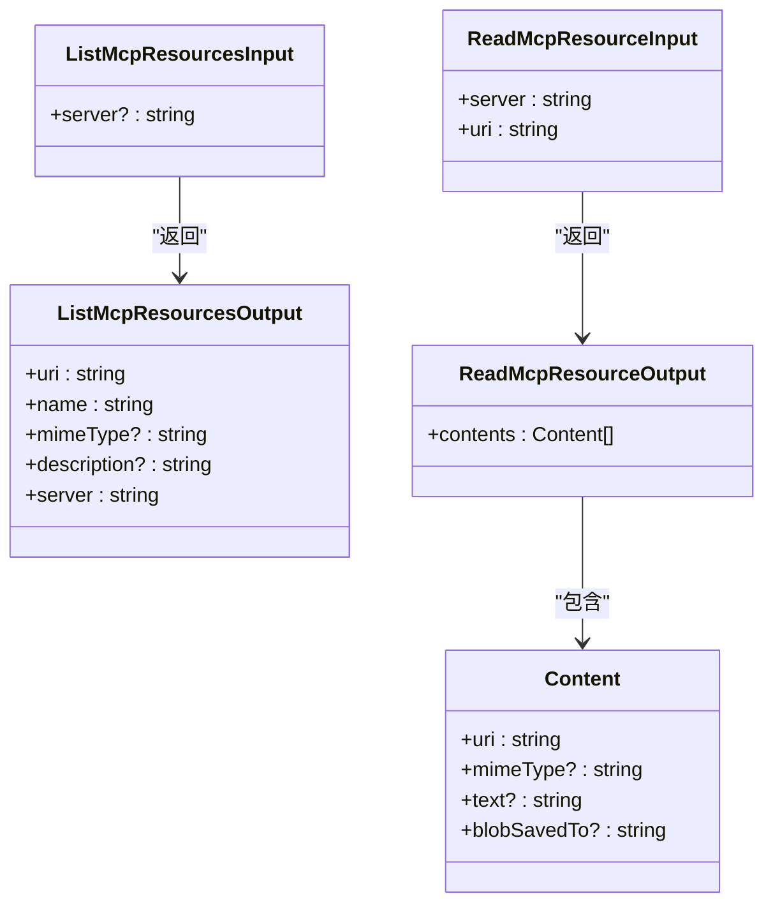
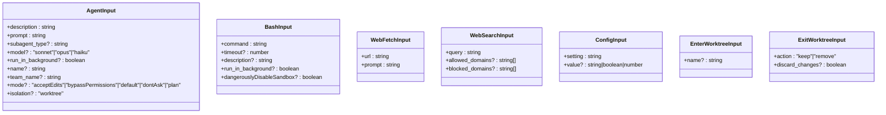
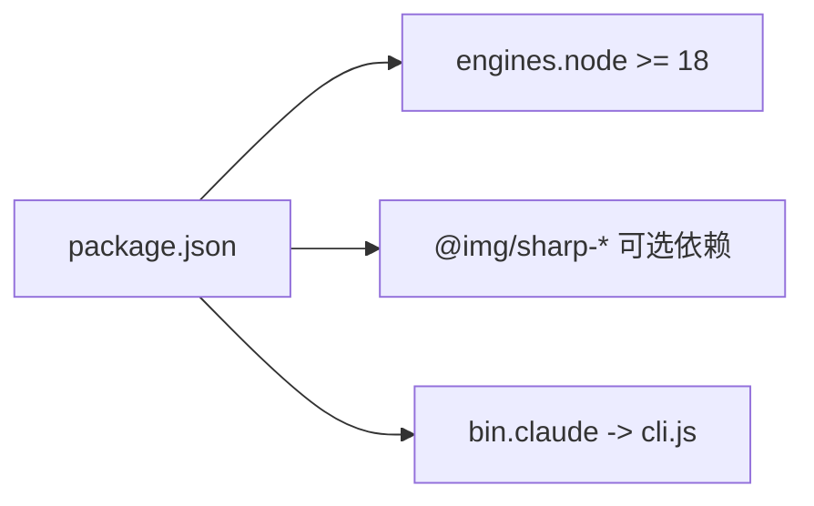

# MCP 认证与安全

<cite>
**本文引用的文件**
- [README.md](file://README.md)
- [package.json](file://package.json)
- [sdk-tools.d.ts](file://sdk-tools.d.ts)
</cite>

## 目录
1. [简介](#简介)
2. [项目结构](#项目结构)
3. [核心组件](#核心组件)
4. [架构总览](#架构总览)
5. [详细组件分析](#详细组件分析)
6. [依赖关系分析](#依赖关系分析)
7. [性能考量](#性能考量)
8. [故障排查指南](#故障排查指南)
9. [结论](#结论)
10. [附录](#附录)

## 简介
本文件面向 Claude Code 的 MCP（Model Context Protocol）认证与安全机制，结合仓库中现有的类型定义与元信息，系统化梳理 MCP 资源访问、工具输入输出、以及与安全相关的配置与约束。由于当前仓库未包含运行时实现代码，本文以类型定义与包元信息为依据，给出可操作的安全建议与最佳实践，帮助在部署与使用过程中建立安全的 MCP 环境。

## 项目结构
仓库采用极简结构，包含：
- 文档与元信息：README、package.json
- 类型定义：sdk-tools.d.ts（包含 MCP 工具输入输出与资源访问相关接口）

图表来源
- [README.md:1-44](file://README.md#L1-L44)
- [package.json:1-34](file://package.json#L1-L34)
- [sdk-tools.d.ts:1-50](file://sdk-tools.d.ts#L1-L50)

章节来源
- [README.md:1-44](file://README.md#L1-L44)
- [package.json:1-34](file://package.json#L1-L34)

## 核心组件
- MCP 资源访问接口
  - 列出 MCP 资源：ListMcpResourcesInput/Output
  - 读取 MCP 资源：ReadMcpResourceInput/Output
- 工具输入输出类型
  - AgentInput/Output
  - BashInput/Output
  - WebFetch/WebSearch 等网络工具输入输出
- 配置与工作树接口
  - ConfigInput/Output
  - EnterWorktree/ExitWorktree 输入输出

章节来源
- [sdk-tools.d.ts:231-256](file://sdk-tools.d.ts#L231-L256)
- [sdk-tools.d.ts:513-522](file://sdk-tools.d.ts#L513-L522)
- [sdk-tools.d.ts:258-295](file://sdk-tools.d.ts#L258-L295)
- [sdk-tools.d.ts:296-327](file://sdk-tools.d.ts#L296-L327)
- [sdk-tools.d.ts:533-556](file://sdk-tools.d.ts#L533-L556)
- [sdk-tools.d.ts:2134-2143](file://sdk-tools.d.ts#L2134-L2143)
- [sdk-tools.d.ts:2144-2159](file://sdk-tools.d.ts#L2144-L2159)

## 架构总览
下图展示 MCP 资源访问在类型层面的交互关系，体现“列出资源”和“读取资源”的调用路径与返回结构。

图表来源
- [sdk-tools.d.ts:482-487](file://sdk-tools.d.ts#L482-L487)
- [sdk-tools.d.ts:513-522](file://sdk-tools.d.ts#L513-L522)
- [sdk-tools.d.ts:231-252](file://sdk-tools.d.ts#L231-L252)
- [sdk-tools.d.ts:2417-2435](file://sdk-tools.d.ts#L2417-L2435)

## 详细组件分析

### 组件一：MCP 资源访问
- 列出资源
  - 输入：ListMcpResourcesInput（可选 server）
  - 输出：ListMcpResourcesOutput[]（包含 uri、name、mimeType、description、server）
- 读取资源
  - 输入：ReadMcpResourceInput（server、uri）
  - 输出：ReadMcpResourceOutput（contents 数组，含 uri、mimeType、text、blobSavedTo）

图表来源
- [sdk-tools.d.ts:482-487](file://sdk-tools.d.ts#L482-L487)
- [sdk-tools.d.ts:231-252](file://sdk-tools.d.ts#L231-L252)
- [sdk-tools.d.ts:513-522](file://sdk-tools.d.ts#L513-L522)
- [sdk-tools.d.ts:2417-2435](file://sdk-tools.d.ts#L2417-L2435)

章节来源
- [sdk-tools.d.ts:482-487](file://sdk-tools.d.ts#L482-L487)
- [sdk-tools.d.ts:513-522](file://sdk-tools.d.ts#L513-L522)
- [sdk-tools.d.ts:231-252](file://sdk-tools.d.ts#L231-L252)
- [sdk-tools.d.ts:2417-2435](file://sdk-tools.d.ts#L2417-L2435)

### 组件二：工具输入输出与 MCP 交互
- Agent/Bash/WebFetch/WebSearch 等工具通过统一的输入输出类型与 MCP 交互
- 配置与工作树工具用于环境与权限控制

图表来源
- [sdk-tools.d.ts:258-295](file://sdk-tools.d.ts#L258-L295)
- [sdk-tools.d.ts:296-327](file://sdk-tools.d.ts#L296-L327)
- [sdk-tools.d.ts:533-542](file://sdk-tools.d.ts#L533-L542)
- [sdk-tools.d.ts:543-556](file://sdk-tools.d.ts#L543-L556)
- [sdk-tools.d.ts:2134-2143](file://sdk-tools.d.ts#L2134-L2143)
- [sdk-tools.d.ts:2144-2159](file://sdk-tools.d.ts#L2144-L2159)

章节来源
- [sdk-tools.d.ts:258-295](file://sdk-tools.d.ts#L258-L295)
- [sdk-tools.d.ts:296-327](file://sdk-tools.d.ts#L296-L327)
- [sdk-tools.d.ts:533-542](file://sdk-tools.d.ts#L533-L542)
- [sdk-tools.d.ts:543-556](file://sdk-tools.d.ts#L543-L556)
- [sdk-tools.d.ts:2134-2143](file://sdk-tools.d.ts#L2134-L2143)
- [sdk-tools.d.ts:2144-2159](file://sdk-tools.d.ts#L2144-L2159)

### 组件三：MCP 认证与安全要点（基于类型与元信息的推导）
- 认证与授权
  - 当前类型定义未直接暴露 API 密钥、OAuth 令牌或证书字段；MCP 调用通过 server/uri 参数进行资源定位，具体认证细节由 MCP 服务器端实现决定。
- 数据传输与隐私
  - WebFetch/WebSearch 等网络工具存在敏感数据传输风险，需确保仅访问受信任的域并限制范围。
- 配置与权限
  - ConfigInput 支持设置主题、模型、权限模式等；EnterWorktree/ExitWorktree 提供隔离执行能力，有助于降低风险面。

章节来源
- [sdk-tools.d.ts:533-556](file://sdk-tools.d.ts#L533-L556)
- [sdk-tools.d.ts:2134-2143](file://sdk-tools.d.ts#L2134-L2143)
- [sdk-tools.d.ts:2144-2159](file://sdk-tools.d.ts#L2144-L2159)

## 依赖关系分析
- 包元信息
  - Node.js 引擎版本要求：>=18
  - 可选图像处理依赖（sharp），与 MCP 安全无直接关联
- 命令入口
  - CLI 命令名为 claude，指向 cli.js（当前仓库未包含该文件）

图表来源
- [package.json:7-9](file://package.json#L7-L9)
- [package.json:22-32](file://package.json#L22-L32)
- [package.json:4-6](file://package.json#L4-L6)

章节来源
- [package.json:1-34](file://package.json#L1-L34)

## 性能考量
- MCP 资源读取
  - 列表与读取操作应避免一次性拉取大量资源，优先使用过滤参数（如 server）与分页策略（如 head_limit）。
- 网络工具
  - WebFetch/WebSearch 应限制域名白名单与超时时间，避免长耗时请求影响整体性能。
- 配置与隔离
  - 使用 EnterWorktree 创建隔离工作区，减少对主分支的影响，提高任务执行效率与安全性。

章节来源
- [sdk-tools.d.ts:482-487](file://sdk-tools.d.ts#L482-L487)
- [sdk-tools.d.ts:533-556](file://sdk-tools.d.ts#L533-L556)
- [sdk-tools.d.ts:2144-2159](file://sdk-tools.d.ts#L2144-L2159)

## 故障排查指南
- 常见问题
  - MCP 资源不可达：确认 server 名称与 uri 是否正确，检查网络连通性与访问权限。
  - 资源过大导致内存压力：使用分页或限制 head_limit，必要时启用持久化输出路径。
  - 网络请求超时：调整超时阈值，限定允许域名，避免跨域风险。
- 日志与审计
  - 在 MCP 服务器端记录访问日志，包含请求时间、来源 IP、server/uri、状态码等，便于审计与追踪。
- 权限与隔离
  - 若出现意外修改，检查是否启用了 dangerouslyDisableSandbox 或未使用 EnterWorktree 隔离。

章节来源
- [sdk-tools.d.ts:296-327](file://sdk-tools.d.ts#L296-L327)
- [sdk-tools.d.ts:533-556](file://sdk-tools.d.ts#L533-L556)
- [sdk-tools.d.ts:2144-2159](file://sdk-tools.d.ts#L2144-L2159)

## 结论
本仓库以类型定义与元信息为主，明确了 MCP 资源访问与工具调用的接口契约。在实际部署中，应结合 MCP 服务器端的安全策略（认证、授权、TLS、IP 白名单、速率限制等）完善本地配置与运行时安全控制，确保数据传输与处理符合组织与合规要求。

## 附录

### 安全最佳实践清单（基于现有类型与元信息）
- 认证与授权
  - 明确 MCP 服务器的认证方式（如 API 密钥、OAuth、证书），并在客户端严格管理凭据。
  - 对敏感资源访问实施最小权限原则，仅授予必要权限。
- 传输安全
  - 启用 HTTPS/TLS，校验证书链与主机名，避免明文传输。
  - 限制允许域名与端口，防止 SSRF 与中间人攻击。
- 访问控制
  - 实施 IP 白名单与速率限制，阻断异常流量。
  - 对高危工具（如 Bash、WebFetch）增加额外审批或沙箱策略。
- 数据保护
  - 对敏感数据进行脱敏与最小化收集，遵循数据保留期限。
  - 使用持久化输出路径存储大体量结果，避免内存溢出。
- 配置与隔离
  - 使用 EnterWorktree 创建隔离工作区，降低误操作风险。
  - 通过 ConfigInput 调整默认权限模式与模型选择，平衡安全与可用性。
- 审计与监控
  - 记录 MCP 请求日志，包含时间戳、来源、server/uri、状态码与耗时。
  - 建立告警机制，对异常访问与失败率进行监控。

章节来源
- [sdk-tools.d.ts:258-295](file://sdk-tools.d.ts#L258-L295)
- [sdk-tools.d.ts:296-327](file://sdk-tools.d.ts#L296-L327)
- [sdk-tools.d.ts:533-556](file://sdk-tools.d.ts#L533-L556)
- [sdk-tools.d.ts:2134-2143](file://sdk-tools.d.ts#L2134-L2143)
- [sdk-tools.d.ts:2144-2159](file://sdk-tools.d.ts#L2144-L2159)