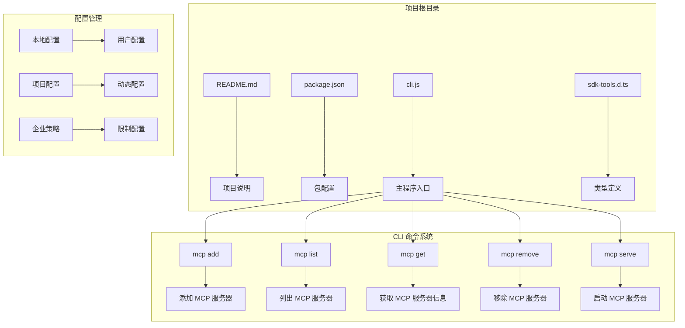
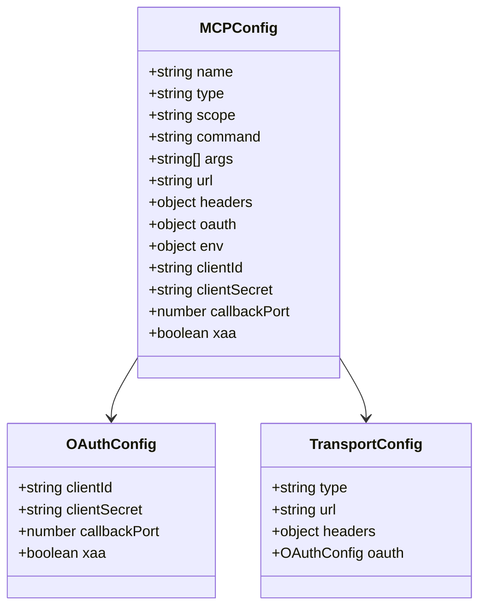
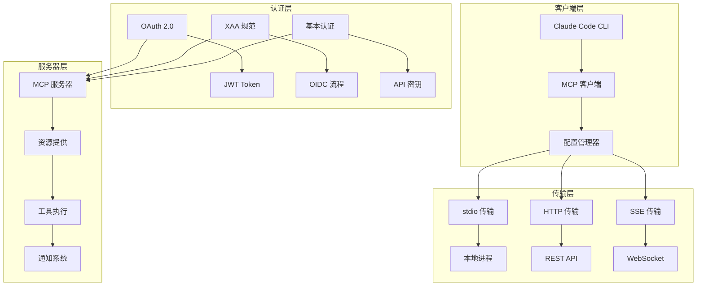

# MCP 服务器配置

<cite>
**本文档引用的文件**
- [README.md](file://README.md)
- [package.json](file://package.json)
- [cli.js](file://cli.js)
- [sdk-tools.d.ts](file://sdk-tools.d.ts)
</cite>

## 目录
1. [简介](#简介)
2. [项目结构](#项目结构)
3. [核心组件](#核心组件)
4. [架构概览](#架构概览)
5. [详细组件分析](#详细组件分析)
6. [依赖关系分析](#依赖关系分析)
7. [性能考虑](#性能考虑)
8. [故障排除指南](#故障排除指南)
9. [结论](#结论)

## 简介

Claude Code 是一个基于终端的智能编码工具，通过自然语言命令帮助用户在终端、IDE 或 GitHub 上与 Claude AI 协作进行编程工作。该项目提供了强大的 MCP（Model Context Protocol）服务器配置功能，支持本地部署、云服务和第三方提供商的多种部署场景。

本项目的核心特性包括：
- 支持多种 MCP 传输协议：stdio、HTTP、SSE
- 完整的 OAuth 认证支持（包括 XAA 规范）
- 跨平台部署能力（macOS、Windows、Linux）
- 企业级安全配置选项
- 灵活的配置管理机制

## 项目结构



**图表来源**
- [cli.js:16358-16474](file://cli.js#L16358-L16474)
- [cli.js:16446-16657](file://cli.js#L16446-L16657)

**章节来源**
- [README.md:1-44](file://README.md#L1-L44)
- [package.json:1-34](file://package.json#L1-L34)

## 核心组件

### MCP 服务器类型

项目支持三种主要的 MCP 服务器传输类型：

1. **stdio 传输**：本地进程通信，适用于自托管 MCP 服务器
2. **HTTP 传输**：标准 HTTP 请求/响应模式
3. **SSE 传输**：服务器发送事件，支持实时双向通信

### 配置参数体系



**图表来源**
- [cli.js:16358-16474](file://cli.js#L16358-L16474)

**章节来源**
- [cli.js:16358-16474](file://cli.js#L16358-L16474)

## 架构概览



**图表来源**
- [cli.js:16358-16474](file://cli.js#L16358-L16474)
- [cli.js:16446-16657](file://cli.js#L16446-L16657)

## 详细组件分析

### MCP 服务器配置命令

#### 添加 MCP 服务器

```bash
# 添加 HTTP 服务器
claude mcp add --transport http sentry https://mcp.sentry.dev/mcp

# 添加 HTTP 服务器带头部
claude mcp add --transport http corridor https://app.corridor.dev/api/mcp --header "Authorization: Bearer ..."

# 添加 stdio 服务器带环境变量
claude mcp add -e API_KEY=xxx my-server -- npx my-mcp-server

# 添加 stdio 服务器带子进程标志
claude mcp add my-server -- my-command --some-flag arg1
```

#### 配置参数详解

| 参数 | 类型 | 描述 | 示例 |
|------|------|------|------|
| `--transport` | string | 传输类型 (stdio, sse, http) | `--transport http` |
| `-e, --env` | string[] | 环境变量设置 | `-e API_KEY=secret` |
| `-H, --header` | string[] | WebSocket 头部设置 | `-H "Authorization: Bearer token"` |
| `--client-id` | string | OAuth 客户端 ID | `--client-id your-client-id` |
| `--client-secret` | string | OAuth 客户端密钥 | `--client-secret` |
| `--callback-port` | number | OAuth 回调端口 | `--callback-port 8080` |
| `--xaa` | boolean | 启用 XAA 规范 | `--xaa` |

**章节来源**
- [cli.js:16358-16474](file://cli.js#L16358-L16474)

### OAuth 认证配置

#### XAA 规范支持

```bash
# 配置 XAA IdP 连接
claude mcp xaa setup --issuer https://idp.example.com --client-id your-client-id

# 登录到 IdP
claude mcp xaa login

# 显示当前配置
claude mcp xaa show

# 清除配置
claude mcp xaa clear
```

#### OAuth 客户端配置

| 配置项 | 必需 | 描述 |
|--------|------|------|
| `--issuer` | 是 | IdP 发行者 URL |
| `--client-id` | 是 | 客户端 ID |
| `--client-secret` | 可选 | 客户端密钥（从环境变量读取） |
| `--callback-port` | 可选 | 回调端口（默认自动选择） |

**章节来源**
- [cli.js:16383-16391](file://cli.js#L16383-L16391)

### 配置文件格式

#### JSON 配置示例

```json
{
  "mcpServers": {
    "my-server": {
      "type": "http",
      "url": "https://api.example.com/mcp",
      "headers": {
        "Authorization": "Bearer YOUR_TOKEN"
      },
      "oauth": {
        "clientId": "your-client-id",
        "callbackPort": 8080
      }
    }
  }
}
```

#### 环境变量设置

| 环境变量 | 描述 | 默认值 |
|----------|------|--------|
| `CLAUDE_CODE_ENABLE_XAA` | 启用 XAA 规范 | `false` |
| `MCP_CLIENT_SECRET` | MCP 客户端密钥 | 无 |
| `CLAUDE_CONFIG_DIR` | 配置目录路径 | `~/.claude` |
| `NODE_OPTIONS` | Node.js 启动选项 | 无 |

**章节来源**
- [cli.js:16465-16474](file://cli.js#L16465-L16474)

### 命令行参数使用

#### 基本命令结构

```bash
claude mcp [command] [options] [arguments]
```

#### 常用命令选项

| 选项 | 类型 | 描述 |
|------|------|------|
| `-s, --scope` | string | 配置范围 (local, user, project) | `local` |
| `-t, --transport` | string | 传输类型 (stdio, sse, http) | 自动检测 |
| `-e, --env` | string[] | 环境变量设置 | 无 |
| `-H, --header` | string[] | 头部设置 | 无 |
| `--client-id` | string | OAuth 客户端 ID | 无 |
| `--client-secret` | string | OAuth 客户端密钥 | 无 |
| `--callback-port` | number | OAuth 回调端口 | 自动选择 |

**章节来源**
- [cli.js:16358-16474](file://cli.js#L16358-L16474)

## 依赖关系分析

```mermaid
graph TB
subgraph "外部依赖"
A[@anthropic-ai/sdk] --> B[主要 SDK]
C[node-fetch] --> D[HTTP 客户端]
E[ws] --> F[WebSocket 支持]
G[commander] --> H[命令行解析]
end
subgraph "内部模块"
I[配置管理] --> J[MCP 服务器管理]
K[认证处理] --> L[OAuth 流程]
M[传输层] --> N[连接管理]
end
B --> I
D --> M
F --> M
G --> J
H --> K
```

**图表来源**
- [package.json:22-32](file://package.json#L22-L32)

**章节来源**
- [package.json:1-34](file://package.json#L1-L34)

## 性能考虑

### 连接优化

1. **连接池管理**：支持多服务器并发连接
2. **缓存策略**：智能缓存认证令牌和服务器元数据
3. **超时配置**：可配置的请求超时时间
4. **重试机制**：自动重试失败的请求

### 资源管理

- **内存使用**：优化的内存分配策略
- **CPU 使用**：异步处理减少阻塞
- **网络带宽**：压缩传输数据

## 故障排除指南

### 常见问题诊断

#### 连接问题

```bash
# 检查 MCP 服务器状态
claude mcp list

# 获取特定服务器详细信息
claude mcp get "server-name"

# 验证配置
claude doctor
```

#### 认证问题

```bash
# 重新配置 OAuth
claude mcp xaa setup --issuer https://idp.example.com --client-id your-client-id

# 清除缓存的令牌
claude mcp xaa clear
```

#### 配置验证

```bash
# 验证 JSON 配置
claude mcp add-json --scope user "server-name" "$(cat config.json)"
```

**章节来源**
- [cli.js:16472-16474](file://cli.js#L16472-L16474)

### 日志和调试

- **调试模式**：使用 `--debug` 参数启用详细日志
- **错误报告**：自动收集错误信息用于问题诊断
- **状态检查**：定期检查服务器健康状况

## 结论

Claude Code 的 MCP 服务器配置提供了完整的企业级解决方案，支持多种部署场景和认证方式。通过灵活的配置管理和强大的 CLI 工具，用户可以轻松地在本地、云端或第三方环境中部署和管理 MCP 服务器。

关键优势包括：
- 多协议支持确保兼容性
- 完整的认证体系保障安全性
- 灵活的配置管理适应不同需求
- 强大的故障排除工具简化运维

该配置系统为企业级部署提供了坚实的基础，同时保持了对个人开发者友好的易用性。