# MCP 协议概述

<cite>
**本文档引用的文件**
- [README.md](file://README.md)
- [package.json](file://package.json)
- [cli.js](file://cli.js)
- [sdk-tools.d.ts](file://sdk-tools.d.ts)
</cite>

## 目录
1. [简介](#简介)
2. [项目结构](#项目结构)
3. [核心组件](#核心组件)
4. [架构概览](#架构概览)
5. [详细组件分析](#详细组件分析)
6. [依赖关系分析](#依赖关系分析)
7. [性能考虑](#性能考虑)
8. [故障排除指南](#故障排除指南)
9. [结论](#结论)

## 简介

Claude Code 是一个基于终端的智能编码助手，通过自然语言命令帮助开发者执行常规任务、解释复杂代码和处理 Git 工作流。该项目实现了 Model Context Protocol (MCP) 协议，为 Claude AI 引擎提供了标准化的模型上下文接口。

MCP (Model Context Protocol) 是一种开放协议，允许应用程序与各种服务进行交互，这些服务可以提供资源、工具和能力，从而扩展 Claude AI 引擎的功能。该协议通过标准化的消息格式、事件类型和通信机制，增强了 Claude Code 的 AI 服务能力。

## 项目结构

该项目采用模块化设计，主要包含以下核心组件：

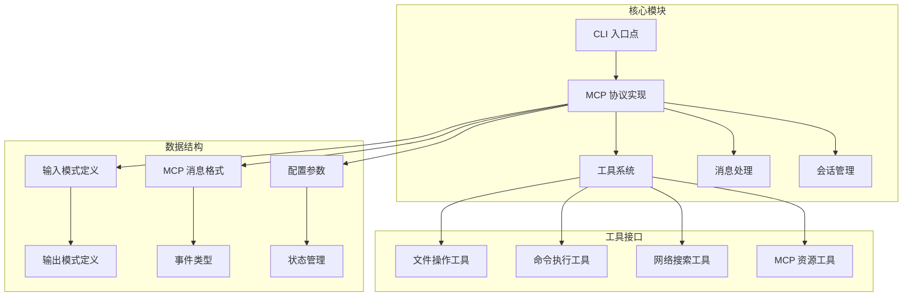

**图表来源**
- [cli.js](file://cli.js)
- [sdk-tools.d.ts](file://sdk-tools.d.ts)

**章节来源**
- [README.md:1-44](file://README.md#L1-L44)
- [package.json:1-34](file://package.json#L1-L34)

## 核心组件

### MCP 协议实现

MCP 协议在 Claude Code 中通过以下核心组件实现：

1. **MCP 客户端管理器**：负责管理与 MCP 服务器的连接和通信
2. **工具注册系统**：动态注册和管理各种 MCP 工具
3. **消息路由系统**：处理 MCP 协议的消息传递和事件分发
4. **资源发现机制**：自动发现和枚举可用的 MCP 资源

### 工具系统架构

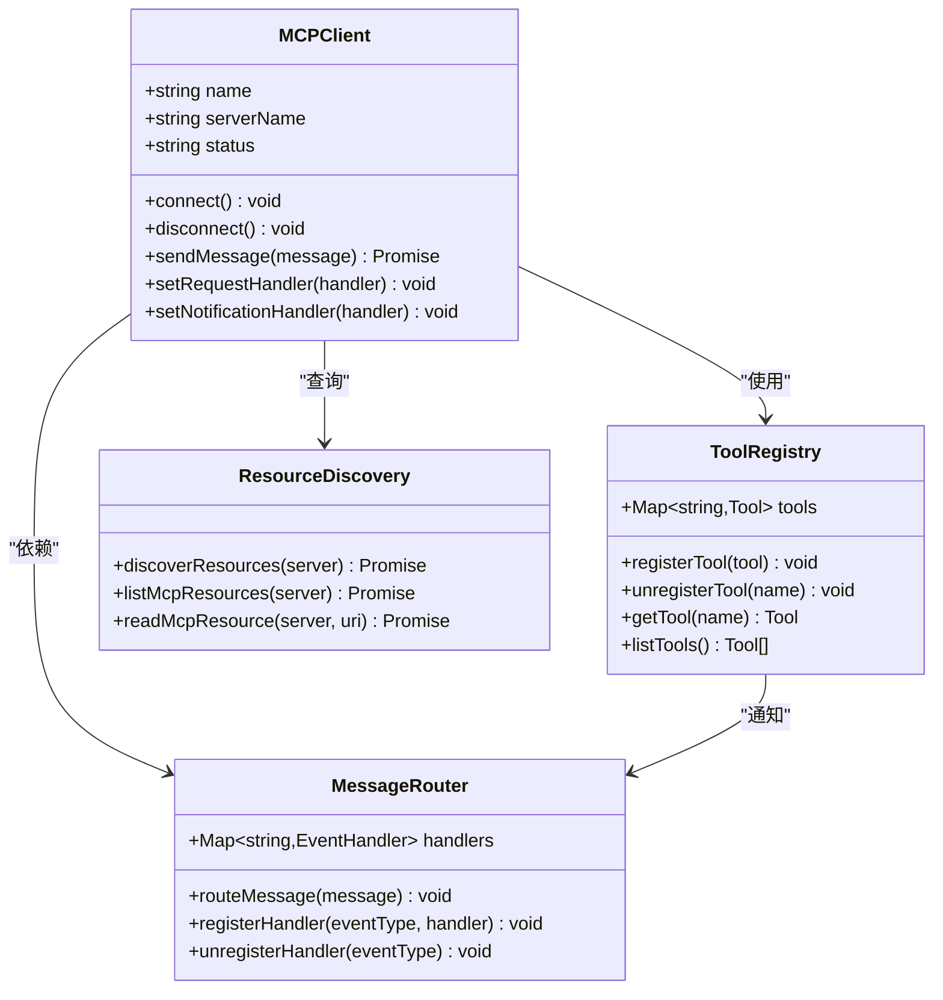

**图表来源**
- [cli.js](file://cli.js)

### 数据结构定义

项目使用 TypeScript 接口定义了完整的 MCP 协议数据结构：

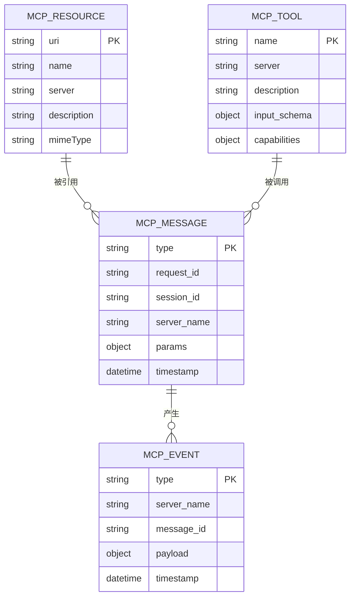

**图表来源**
- [sdk-tools.d.ts](file://sdk-tools.d.ts)

**章节来源**
- [sdk-tools.d.ts:11-54](file://sdk-tools.d.ts#L11-L54)
- [sdk-tools.d.ts:231-252](file://sdk-tools.d.ts#L231-L252)

## 架构概览

### 整体架构设计

```mermaid
graph TB
subgraph "用户界面层"
A[终端界面] --> B[命令处理器]
B --> C[消息生成器]
end
subgraph "MCP 协议层"
C --> D[MCP 客户端]
D --> E[MCP 服务器]
E --> F[MCP 工具]
end
subgraph "AI 引擎层"
G[Claude AI 引擎] <- --> D
G --> H[模型推理]
G --> I[上下文管理]
end
subgraph "工具层"
F --> J[文件操作]
F --> K[命令执行]
F --> L[网络访问]
F --> M[资源管理]
end
D --> N[MCP 消息路由]
N --> O[MCP 事件处理]
```

**图表来源**
- [cli.js](file://cli.js)

### 通信流程

MCP 协议的通信遵循严格的时序模式：

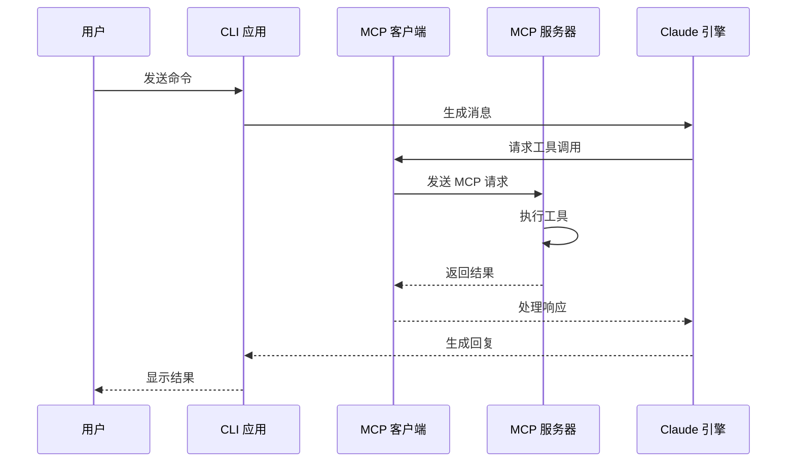

**图表来源**
- [cli.js](file://cli.js)

## 详细组件分析

### MCP 客户端管理

MCP 客户端是整个协议实现的核心组件，负责管理与 MCP 服务器的连接和通信。

#### 连接管理

客户端支持多种传输协议：
- **HTTP/SSE**: 基于 HTTP 的服务器发送事件
- **WebSocket**: 实时双向通信
- **标准输入输出**: 本地进程间通信

#### 服务器配置

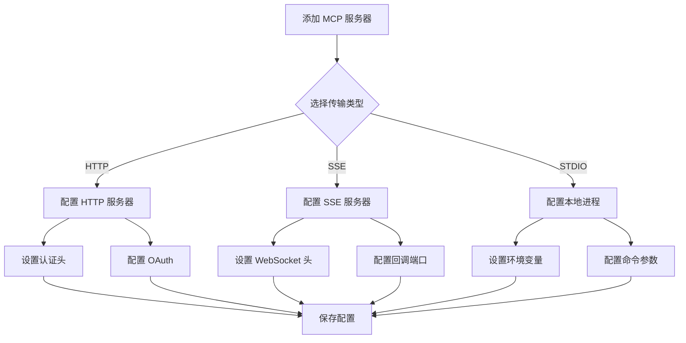

**图表来源**
- [cli.js](file://cli.js)

#### 认证机制

MCP 协议支持多种认证方式：

1. **Bearer Token**: 使用 API 密钥进行认证
2. **OAuth 2.0**: 支持完整的 OAuth 流程
3. **自定义头部**: 支持特定的认证头部
4. **环境变量**: 通过环境变量传递认证信息

### 工具系统实现

MCP 工具系统提供了丰富的功能扩展：

#### 工具注册流程

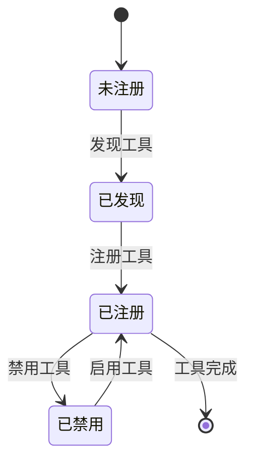

#### 工具分类

1. **文件操作工具**: 文件读写、搜索、编辑
2. **命令执行工具**: Shell 命令执行、进程管理
3. **网络工具**: Web 搜索、内容抓取、API 调用
4. **资源管理工具**: 资源发现、内容读取、元数据查询

**章节来源**
- [sdk-tools.d.ts:482-522](file://sdk-tools.d.ts#L482-L522)
- [sdk-tools.d.ts:513-522](file://sdk-tools.d.ts#L513-L522)

### 消息处理机制

MCP 协议的消息处理遵循严格的格式和生命周期：

#### 消息格式

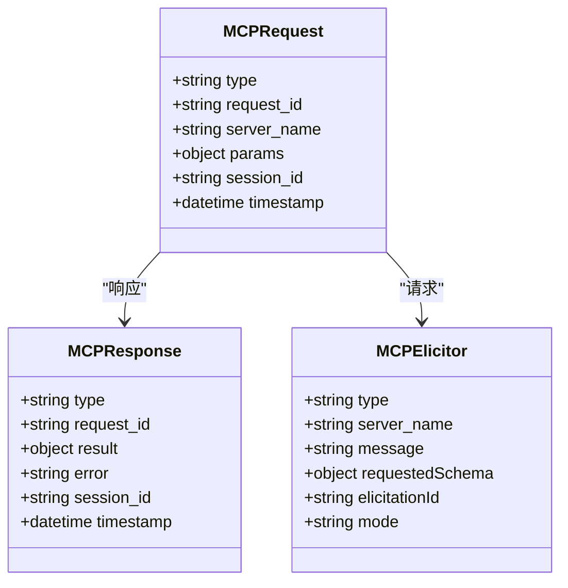

**图表来源**
- [cli.js](file://cli.js)

#### 事件处理

MCP 协议支持多种事件类型：

1. **工具调用事件**: 触发工具执行
2. **资源更新事件**: 通知资源状态变化
3. **认证事件**: 处理认证状态变更
4. **错误事件**: 报告协议错误

### 资源管理系统

MCP 协议提供了强大的资源管理能力：

#### 资源发现

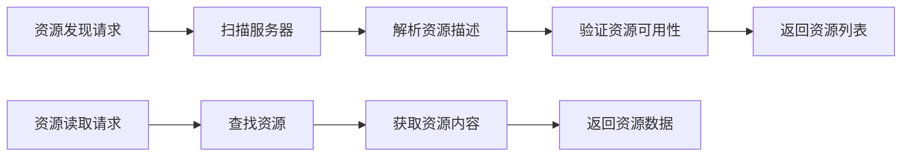

**图表来源**
- [sdk-tools.d.ts](file://sdk-tools.d.ts)

#### 资源类型

1. **文件资源**: 文本文件、二进制文件、图像文件
2. **网络资源**: URL 内容、API 端点、远程服务
3. **计算资源**: 代码片段、数据集、模型文件
4. **配置资源**: 设置文件、模板、配置项

**章节来源**
- [sdk-tools.d.ts:231-252](file://sdk-tools.d.ts#L231-L252)

## 依赖关系分析

### 外部依赖

项目的主要外部依赖包括：

```mermaid
graph TB
subgraph "核心依赖"
A[@anthropic-ai/sdk] --> B[消息处理]
A --> C[工具系统]
A --> D[认证管理]
end
subgraph "运行时依赖"
E[Node.js 18+] --> F[异步处理]
E --> G[文件系统]
E --> H[网络通信]
end
subgraph "可选依赖"
I[@img/sharp-*] --> J[图像处理]
K[其他插件] --> L[功能扩展]
end
A --> E
A --> I
A --> K
```

**图表来源**
- [package.json](file://package.json)

### 内部模块依赖

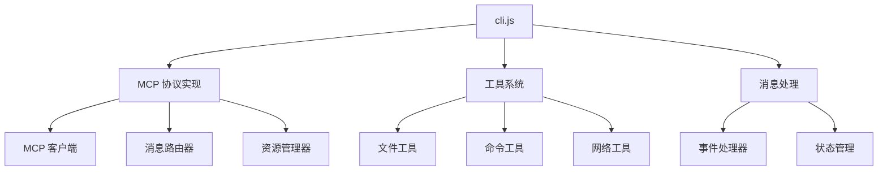

**图表来源**
- [cli.js](file://cli.js)

**章节来源**
- [package.json:22-32](file://package.json#L22-L32)

## 性能考虑

### 并发处理

MCP 协议实现了高效的并发处理机制：

1. **异步消息处理**: 支持多请求并发处理
2. **连接池管理**: 优化服务器连接复用
3. **缓存策略**: 减少重复请求和网络开销
4. **流式处理**: 支持大文件和大数据的流式传输

### 资源管理

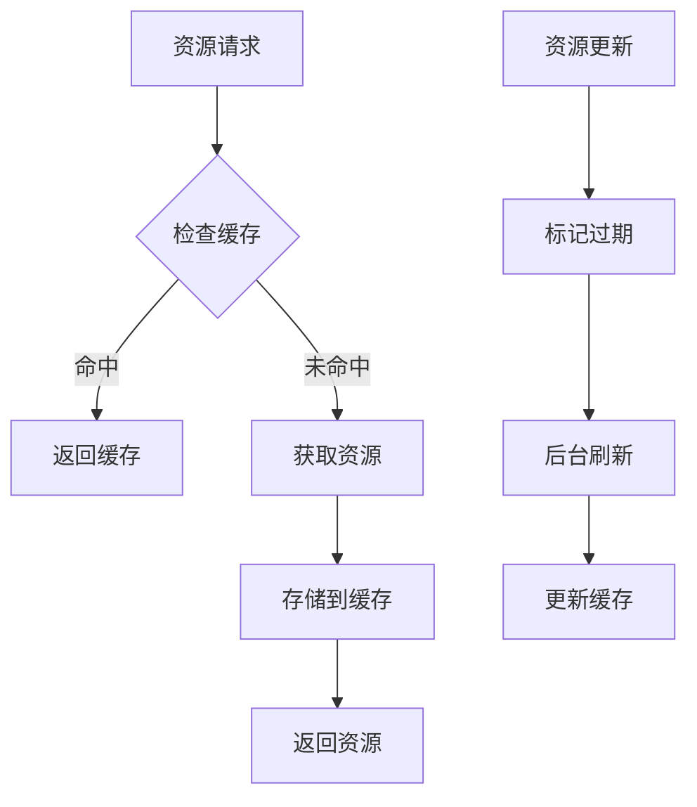

### 错误处理

MCP 协议提供了完善的错误处理机制：

1. **连接错误**: 自动重连和降级处理
2. **超时处理**: 智能超时检测和重试
3. **资源限制**: 防止内存和 CPU 泄漏
4. **异常恢复**: 自动恢复和状态同步

## 故障排除指南

### 常见问题诊断

#### MCP 服务器连接问题

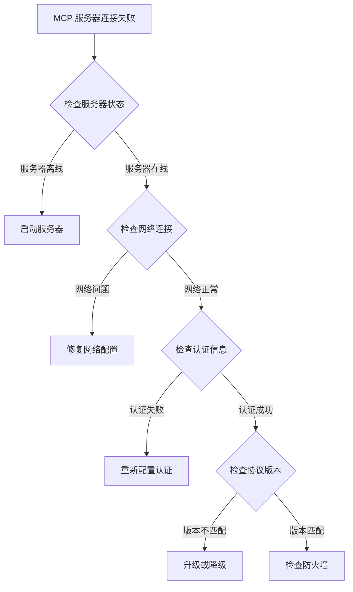

#### 工具执行问题

1. **权限不足**: 检查工具权限和沙箱配置
2. **资源限制**: 监控内存和 CPU 使用情况
3. **超时问题**: 调整超时参数和重试策略
4. **编码问题**: 确认字符编码和换行符处理

### 日志和监控

MCP 协议提供了详细的日志记录和监控功能：

1. **请求日志**: 记录所有 MCP 请求和响应
2. **性能指标**: 监控延迟、吞吐量和错误率
3. **资源使用**: 跟踪内存、CPU 和网络使用情况
4. **错误报告**: 收集和分析错误信息

**章节来源**
- [cli.js](file://cli.js)

## 结论

MCP 协议为 Claude Code 提供了一个强大而灵活的扩展框架。通过标准化的接口和消息格式，该协议实现了以下关键目标：

1. **标准化接口**: 为各种服务提供统一的访问接口
2. **增强 AI 能力**: 通过工具和资源扩展 Claude AI 的功能
3. **灵活集成**: 支持多种传输协议和认证方式
4. **高效通信**: 实现高性能的消息传递和事件处理

该实现展示了现代 AI 应用程序中协议设计的最佳实践，为开发者提供了清晰的架构模式和实用的工具系统。通过持续的优化和扩展，MCP 协议将继续为 Claude Code 生态系统提供强大的支持。