# MCP 故障排除

<cite>
**本文档引用的文件**
- [README.md](file://README.md)
- [package.json](file://package.json)
- [cli.js](file://cli.js)
- [sdk-tools.d.ts](file://sdk-tools.d.ts)
</cite>

## 目录
1. [简介](#简介)
2. [项目结构](#项目结构)
3. [核心组件](#核心组件)
4. [架构概览](#架构概览)
5. [详细组件分析](#详细组件分析)
6. [依赖关系分析](#依赖关系分析)
7. [性能考虑](#性能考虑)
8. [故障排除指南](#故障排除指南)
9. [结论](#结论)
10. [附录](#附录)

## 简介

本指南专注于 Claude Code 的 MCP（Model Context Protocol）集成故障排除。MCP 允许 Claude Code 与外部工具服务器进行交互，扩展其功能范围。本指南提供了系统化的诊断方法，涵盖连接测试、性能监控、错误分析以及针对不同 MCP 服务器类型的特定故障排除步骤。

## 项目结构

该项目是一个基于 Node.js 的命令行工具，提供 MCP 服务器管理功能。主要结构包括：

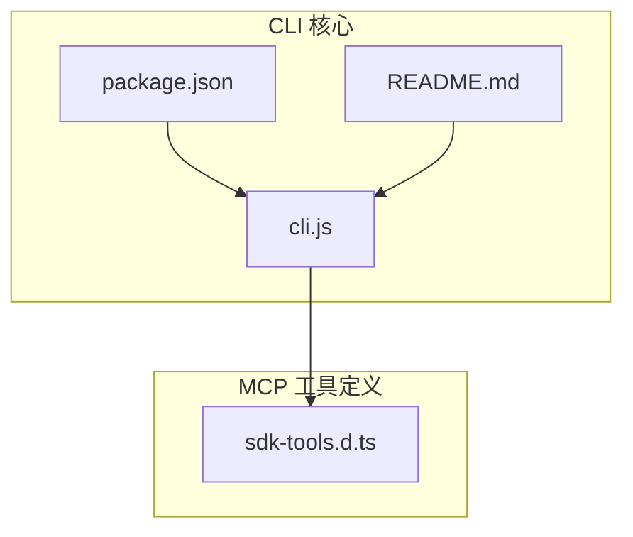

**图表来源**
- [cli.js](file://cli.js)
- [package.json](file://package.json)
- [sdk-tools.d.ts](file://sdk-tools.d.ts)

**章节来源**
- [README.md:1-44](file://README.md#L1-L44)
- [package.json:1-34](file://package.json#L1-L34)

## 核心组件

### MCP 命令体系

CLI 提供了完整的 MCP 管理命令：

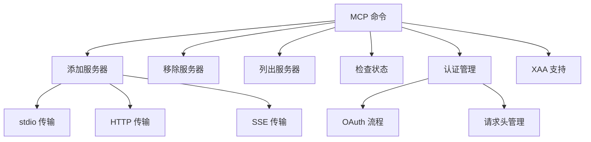

**图表来源**
- [cli.js:16358-16382](file://cli.js#L16358-L16382)

### MCP 服务器类型

支持多种传输协议：
- **stdio**: 本地进程通信
- **HTTP**: 标准 HTTP 接口
- **SSE**: 服务器发送事件
- **OAuth**: 安全认证支持

**章节来源**
- [cli.js:16358-16382](file://cli.js#L16358-L16382)

## 架构概览

MCP 集成采用分层架构设计：

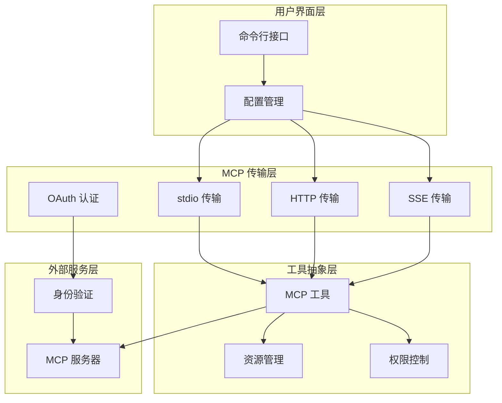

**图表来源**
- [cli.js:16358-16382](file://cli.js#L16358-L16382)
- [sdk-tools.d.ts:482-522](file://sdk-tools.d.ts#L482-L522)

## 详细组件分析

### MCP 服务器配置管理

服务器配置采用灵活的结构化存储：

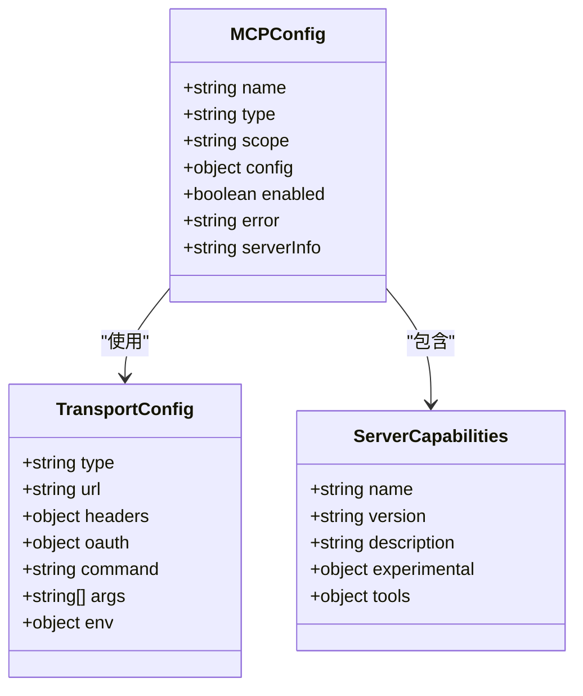

**图表来源**
- [cli.js:16358-16382](file://cli.js#L16358-L16382)

### 工具执行流程

工具调用采用异步流处理模式：

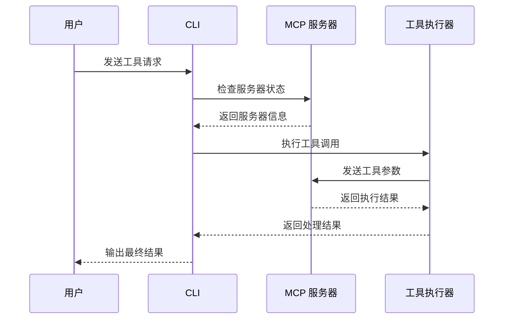

**图表来源**
- [cli.js:16358-16382](file://cli.js#L16358-L16382)

**章节来源**
- [cli.js:16358-16382](file://cli.js#L16358-L16382)

### 错误处理机制

系统实现了多层次的错误处理：

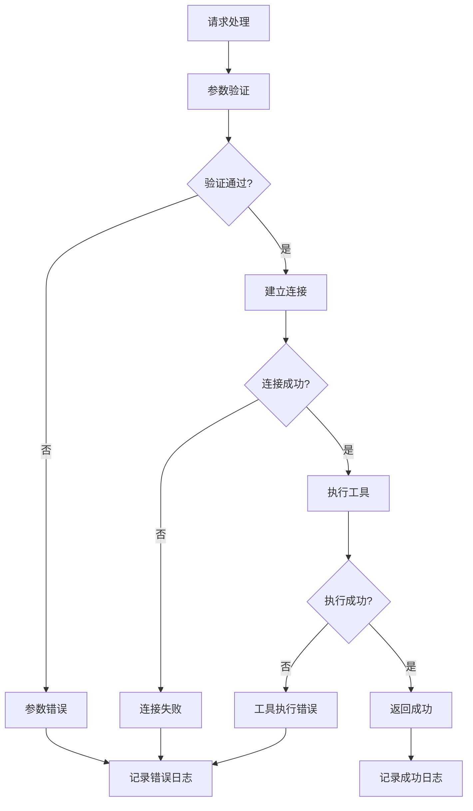

**图表来源**
- [cli.js:16358-16382](file://cli.js#L16358-L16382)

**章节来源**
- [cli.js:16358-16382](file://cli.js#L16358-L16382)

## 依赖关系分析

### 外部依赖

项目依赖关系相对简洁：

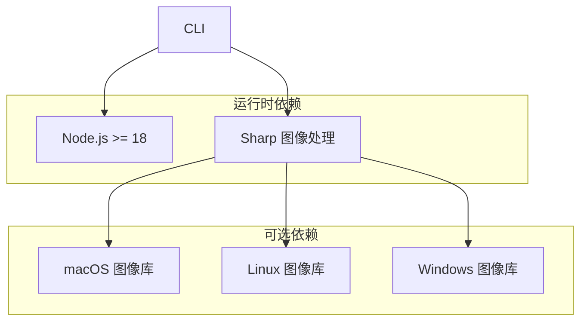

**图表来源**
- [package.json:1-34](file://package.json#L1-L34)

### 内部模块依赖

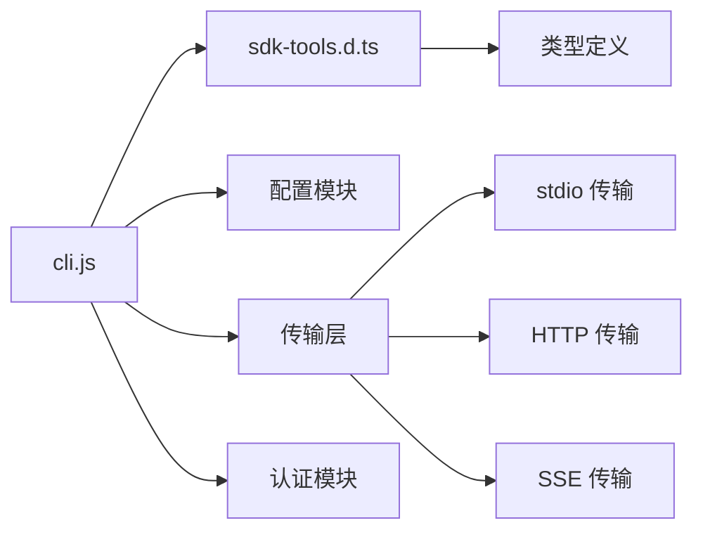

**图表来源**
- [cli.js](file://cli.js)
- [sdk-tools.d.ts](file://sdk-tools.d.ts)

**章节来源**
- [package.json:1-34](file://package.json#L1-L34)

## 性能考虑

### 连接池管理

系统支持多服务器并发连接：

- **最大并发数**: 可根据服务器能力调整
- **连接超时**: 默认 60 秒，可根据网络状况调整
- **重试机制**: 自动重试失败的请求
- **连接复用**: 复用活跃连接减少开销

### 缓存策略

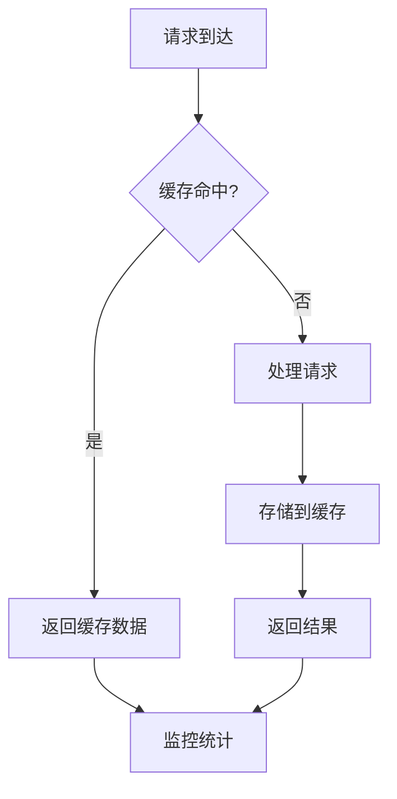

**图表来源**
- [cli.js:16358-16382](file://cli.js#L16358-L16382)

## 故障排除指南

### 系统化诊断方法

#### 1. 连接测试

**基础连接检查**：
1. 验证 MCP 服务器可达性
2. 检查网络防火墙设置
3. 验证服务器端口开放状态

**连接状态监控**：
```bash
# 检查 MCP 服务器状态
claude mcp status

# 查看服务器列表
claude mcp list

# 获取详细状态信息
claude mcp status --verbose
```

**章节来源**
- [cli.js:16358-16382](file://cli.js#L16358-L16382)

#### 2. 性能监控

**性能指标收集**：
- 请求延迟时间
- 服务器响应时间
- 并发连接数
- 错误率统计

**监控命令**：
```bash
# 启用详细日志
claude --verbose

# 设置日志级别
export LOG_LEVEL=debug

# 分析性能瓶颈
claude --profile
```

**章节来源**
- [cli.js:16358-16382](file://cli.js#L16358-L16382)

#### 3. 错误分析

**常见错误类型及解决方案**：

**网络连接失败**：
- 检查服务器地址和端口
- 验证网络连通性
- 检查代理设置
- 验证防火墙规则

**认证错误**：
- 重新配置 OAuth 凭据
- 检查访问令牌有效期
- 验证客户端 ID 和密钥
- 清除缓存的认证信息

**超时问题**：
- 增加超时阈值
- 优化服务器性能
- 检查网络延迟
- 调整并发连接数

**章节来源**
- [cli.js:16358-16382](file://cli.js#L16358-L16382)

### 日志分析技巧

#### 调试级别设置

**日志级别配置**：
```bash
# 设置日志级别
export LOG_LEVEL=debug

# 输出到文件
claude --log-file=~/mcp-debug.log

# 详细输出格式
claude --verbose --json-output
```

**日志内容解读**：
- 请求 ID 用于关联请求和响应
- 时间戳帮助分析性能问题
- 错误代码指示具体故障类型
- 参数信息显示调用细节

**章节来源**
- [cli.js:16358-16382](file://cli.js#L16358-L16382)

#### 错误码解读

**标准 HTTP 状态码**：
- 200: 请求成功
- 400: 参数错误
- 401: 未授权
- 403: 权限不足
- 404: 服务器不存在
- 429: 请求过于频繁
- 500: 服务器内部错误

**MCP 特定错误**：
- 连接超时
- 认证失败
- 工具执行错误
- 资源不可用

**章节来源**
- [cli.js:16358-16382](file://cli.js#L16358-L16382)

### 不同 MCP 服务器的特定故障排除

#### HTTP 服务器

**常见问题**：
- SSL 证书验证失败
- CORS 跨域限制
- API 版本不兼容
- 请求头格式错误

**解决方案**：
```bash
# 添加自定义请求头
claude mcp add --transport http \
  --header "Authorization: Bearer YOUR_TOKEN" \
  --header "Content-Type: application/json" \
  server-name https://api.example.com/mcp
```

**章节来源**
- [cli.js:16358-16382](file://cli.js#L16358-L16382)

#### SSE 服务器

**常见问题**：
- WebSocket 连接中断
- 心跳包丢失
- 流式数据解析错误

**解决方案**：
```bash
# 配置 SSE 连接
claude mcp add --transport sse \
  --header "Authorization: Bearer YOUR_TOKEN" \
  server-name https://api.example.com/sse
```

**章节来源**
- [cli.js:16358-16382](file://cli.js#L16358-L16382)

#### OAuth 认证

**认证流程**：
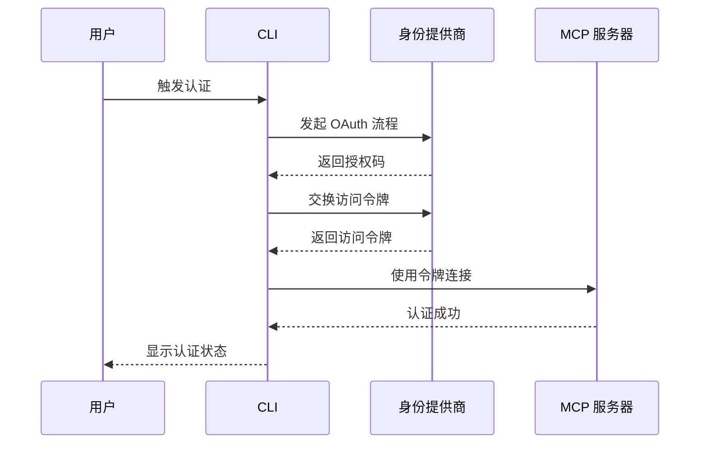

**图表来源**
- [cli.js:16358-16382](file://cli.js#L16358-L16382)

**章节来源**
- [cli.js:16358-16382](file://cli.js#L16358-L16382)

### MCP 通信日志收集

#### 请求/响应追踪

**启用详细日志**：
```bash
# 启用 MCP 详细日志
export MCP_DEBUG=true

# 设置日志文件
export MCP_LOG_FILE=/tmp/mcp-logs.txt

# 重放日志
cat /tmp/mcp-logs.txt | grep "MCP_SERVER_NAME"
```

**日志格式**：
```
[2024-01-01 12:00:00] MCP_SERVER_NAME: CONNECTED
[2024-01-01 12:00:01] MCP_SERVER_NAME: REQUEST { "method": "listTools" }
[2024-01-01 12:00:01] MCP_SERVER_NAME: RESPONSE { "tools": [...] }
[2024-01-01 12:00:02] MCP_SERVER_NAME: DISCONNECTED
```

**章节来源**
- [cli.js:16358-16382](file://cli.js#L16358-L16382)

#### 网络流量分析

**使用 tcpdump 分析**：
```bash
# 监听 MCP 服务器端口
sudo tcpdump -i any -A port 8080

# 分析 HTTPS 流量
sudo tcpdump -i any -A host api.example.com
```

**使用 Wireshark 分析**：
- 过滤 MCP 协议流量
- 分析握手过程
- 检查数据包完整性

**章节来源**
- [cli.js:16358-16382](file://cli.js#L16358-L16382)

### 性能优化建议

#### 连接池管理

**连接池配置**：
- 最大连接数：根据服务器承载能力设置
- 连接超时：平衡响应时间和资源占用
- 重试间隔：避免雪崩效应
- 连接健康检查：定期验证连接有效性

**优化策略**：
```bash
# 配置连接池参数
export MCP_MAX_CONNECTIONS=10
export MCP_CONNECTION_TIMEOUT=30000
export MCP_RETRY_INTERVAL=1000
```

**章节来源**
- [cli.js:16358-16382](file://cli.js#L16358-L16382)

#### 重试策略

**指数退避重试**：
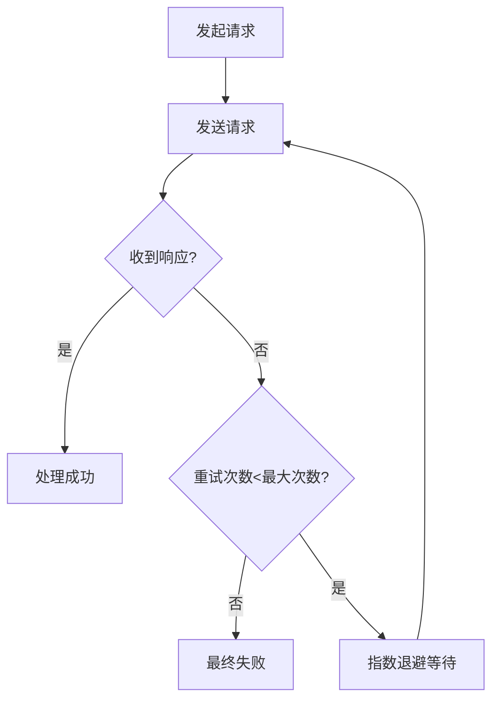

**图表来源**
- [cli.js:16358-16382](file://cli.js#L16358-L16382)

#### 负载均衡配置

**多服务器部署**：
- 轮询调度算法
- 健康检查机制
- 故障转移策略
- 会话亲和性

**章节来源**
- [cli.js:16358-16382](file://cli.js#L16358-L16382)

### 紧急情况恢复流程

#### 快速恢复步骤

**立即响应**：
1. 断开故障服务器连接
2. 切换到备用服务器
3. 清理缓存状态
4. 重启受影响的服务

**恢复验证**：
```bash
# 检查服务器状态
claude mcp status

# 验证工具可用性
claude mcp list

# 测试基本功能
echo "test" | claude --print
```

**章节来源**
- [cli.js:16358-16382](file://cli.js#L16358-L16382)

#### 备用方案

**降级策略**：
- 使用本地工具替代
- 回退到旧版本服务器
- 启用离线模式
- 临时禁用有问题的工具

**章节来源**
- [cli.js:16358-16382](file://cli.js#L16358-L16382)

### 常见错误消息及解决步骤

#### 网络相关错误

**"连接超时"**：
1. 检查服务器可达性
2. 验证防火墙设置
3. 增加超时时间
4. 检查网络延迟

**"连接拒绝"**：
1. 验证服务器端口
2. 检查服务是否启动
3. 验证监听地址
4. 检查权限设置

**章节来源**
- [cli.js:16358-16382](file://cli.js#L16358-L16382)

#### 认证相关错误

**"未授权"**：
1. 重新生成访问令牌
2. 验证客户端凭据
3. 检查权限范围
4. 清除缓存令牌

**"认证过期"**：
1. 刷新访问令牌
2. 检查令牌有效期
3. 配置自动刷新
4. 实施令牌轮换

**章节来源**
- [cli.js:16358-16382](file://cli.js#L16358-L16382)

#### 工具执行错误

**"工具不存在"**：
1. 验证工具名称
2. 检查服务器支持的工具
3. 更新工具清单
4. 重新注册工具

**"参数错误"**：
1. 检查工具参数格式
2. 验证必需参数
3. 查看工具文档
4. 使用示例参数

**章节来源**
- [cli.js:16358-16382](file://cli.js#L16358-L16382)

## 结论

MCP 集成故障排除需要系统性的方法和工具。通过理解架构设计、掌握诊断技术、实施预防措施，可以有效提升系统的稳定性和可靠性。建议在生产环境中实施以下最佳实践：

1. 建立完善的监控和告警系统
2. 制定标准化的故障排除流程
3. 定期进行压力测试和性能优化
4. 维护详细的文档和知识库
5. 建立备份和灾难恢复计划

## 附录

### 快速参考

**常用命令**：
```bash
# 查看帮助
claude mcp --help

# 添加服务器
claude mcp add --transport http server-name https://api.example.com

# 查看状态
claude mcp status

# 列出工具
claude mcp list

# 移除服务器
claude mcp remove server-name
```

**配置文件位置**：
- 用户配置: `~/.claude/config.json`
- 项目配置: `.claude/config.json`
- 本地配置: `~/.claude/local-settings.json`

**环境变量**：
- `MCP_DEBUG`: 启用调试模式
- `MCP_LOG_LEVEL`: 设置日志级别
- `MCP_TIMEOUT`: 设置超时时间
- `MCP_MAX_RETRIES`: 设置最大重试次数

**章节来源**
- [cli.js:16358-16382](file://cli.js#L16358-L16382)
- [package.json:1-34](file://package.json#L1-L34)