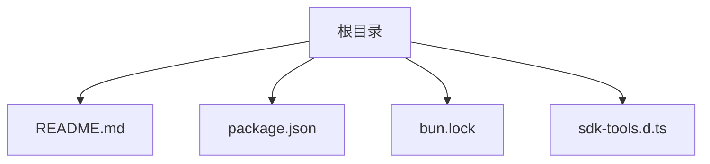
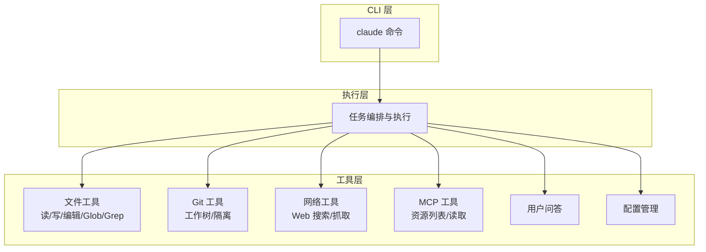
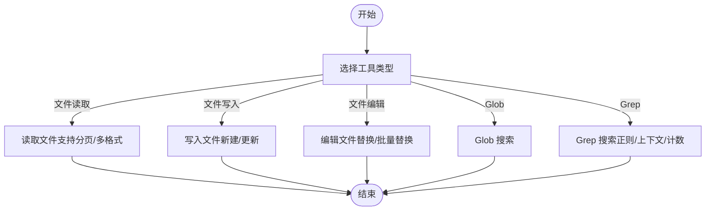
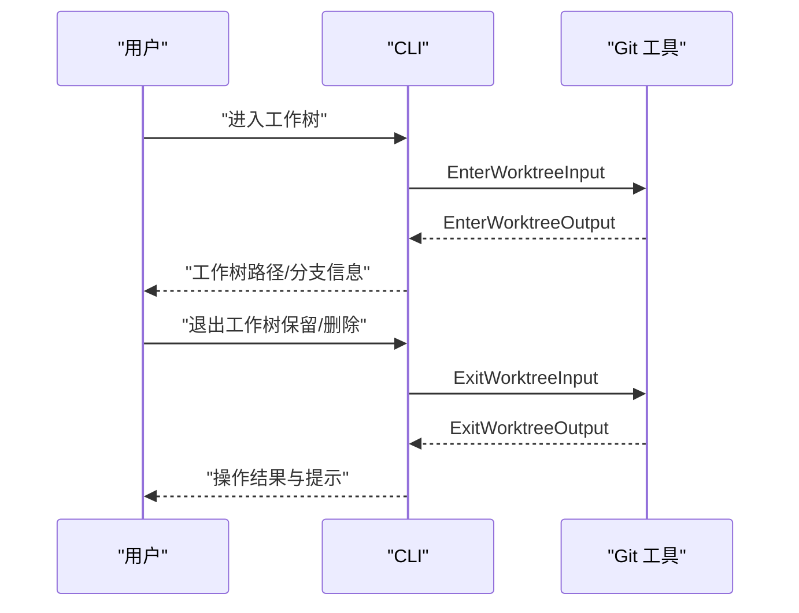
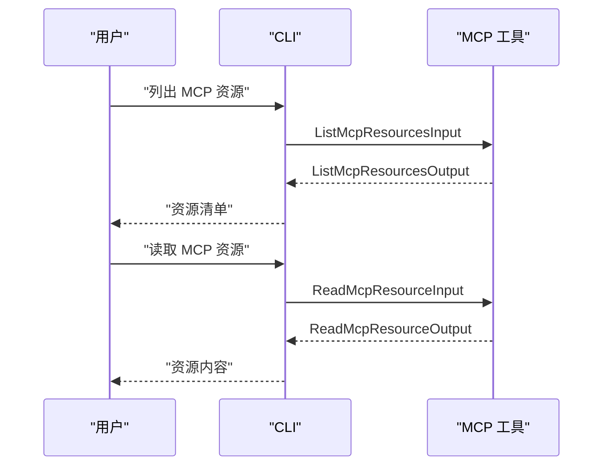
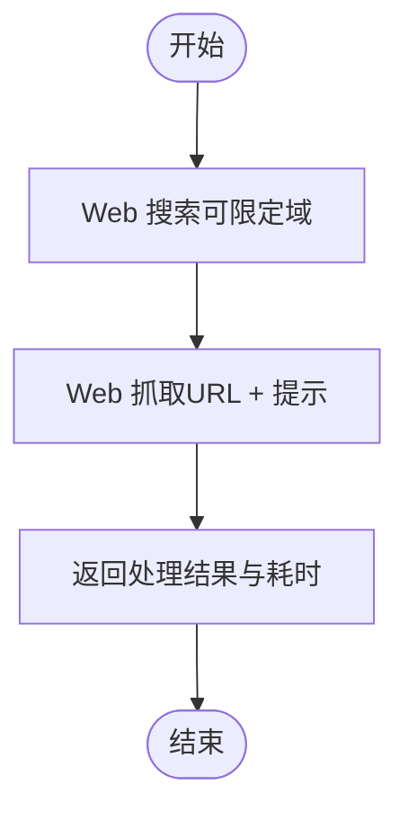
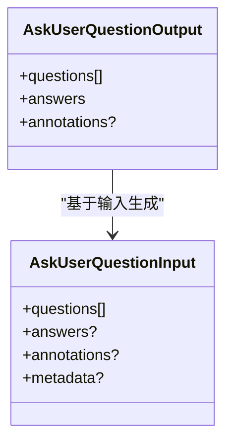
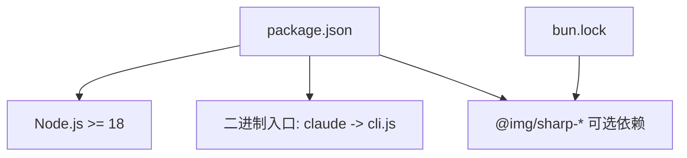

# 项目概述

<cite>
**本文档引用的文件**
- [README.md](file://README.md)
- [package.json](file://package.json)
- [bun.lock](file://bun.lock)
- [sdk-tools.d.ts](file://sdk-tools.d.ts)
</cite>

## 目录
1. [简介](#简介)
2. [项目结构](#项目结构)
3. [核心组件](#核心组件)
4. [架构总览](#架构总览)
5. [详细组件分析](#详细组件分析)
6. [依赖关系分析](#依赖关系分析)
7. [性能考虑](#性能考虑)
8. [故障排除指南](#故障排除指南)
9. [结论](#结论)
10. [附录](#附录)

## 简介
Claude Code 是一个代理式（agentic）编码助手，专为终端设计，能够理解你的代码库、通过自然语言命令执行常规任务、解释复杂代码，并处理 Git 工作流。它既可以在终端中直接使用，也可以在 IDE 中集成，或通过 GitHub 的 @claude 标签进行交互。该项目基于 Node.js 18+ 运行时，采用 Bun 作为包管理器，支持 MCP（Model Context Protocol）以扩展外部资源与工具调用能力。

- 项目主页与文档：[Claude Code 官方页面](https://claude.com/product/claude-code)，[官方文档](https://code.claude.com/docs/en/overview)
- 快速开始：全局安装后，在项目目录运行 `claude` 命令即可启动
- 数据隐私与使用策略：参见隐私政策与商业条款

**章节来源**
- [README.md:1-44](file://README.md#L1-L44)

## 项目结构
该仓库是一个极简的 CLI 包，主要包含以下文件：
- README.md：项目介绍、快速开始、问题反馈与社区链接
- package.json：包元数据、二进制入口、Node.js 版本要求、脚本与可选依赖
- bun.lock：Bun 工作区锁文件，声明了可选的平台相关图像处理依赖
- sdk-tools.d.ts：SDK 工具输入输出类型的 TypeScript 定义，涵盖文件操作、Git 工作树、MCP 资源、网络搜索与抓取等

**图表来源**
- [README.md:1-44](file://README.md#L1-L44)
- [package.json:1-34](file://package.json#L1-L34)
- [bun.lock:1-22](file://bun.lock#L1-L22)
- [sdk-tools.d.ts:1-50](file://sdk-tools.d.ts#L1-L50)

**章节来源**
- [README.md:1-44](file://README.md#L1-L44)
- [package.json:1-34](file://package.json#L1-L34)
- [bun.lock:1-22](file://bun.lock#L1-L22)
- [sdk-tools.d.ts:1-50](file://sdk-tools.d.ts#L1-L50)

## 核心组件
- CLI 入口与运行时
  - 二进制入口：`claude` 命令由 `package.json` 的 bin 字段定义
  - Node.js 要求：引擎版本 >= 18.0.0
  - 类型模块：ES 模块类型，便于现代 Node.js 开发
- 可选依赖（平台图像处理）
  - 通过 `optionalDependencies` 引入多平台的图像处理库，用于图片/PDF 等非文本文件的读取与处理
- SDK 工具类型定义
  - 提供丰富的工具输入输出类型，覆盖文件读写、编辑、Glob/Grep 搜索、Git 工作树、MCP 资源读取、Web 搜索与抓取、用户问答、配置管理等

**章节来源**
- [package.json:4-11](file://package.json#L4-L11)
- [package.json:22-32](file://package.json#L22-L32)
- [sdk-tools.d.ts:11-54](file://sdk-tools.d.ts#L11-L54)

## 架构总览
从功能视角看，Claude Code 的架构围绕“CLI 工具 + 多种工具类型 + MCP 扩展”展开：
- CLI 层：通过 `claude` 命令进入交互式会话
- 工具层：提供文件系统、Git、网络、MCP 等工具的输入输出规范
- 执行层：根据自然语言指令选择并执行相应工具，返回结构化结果

**图表来源**
- [package.json:4-6](file://package.json#L4-L6)
- [sdk-tools.d.ts:258-295](file://sdk-tools.d.ts#L258-L295)
- [sdk-tools.d.ts:296-327](file://sdk-tools.d.ts#L296-L327)
- [sdk-tools.d.ts:358-375](file://sdk-tools.d.ts#L358-L375)
- [sdk-tools.d.ts:404-471](file://sdk-tools.d.ts#L404-L471)
- [sdk-tools.d.ts:482-490](file://sdk-tools.d.ts#L482-L490)
- [sdk-tools.d.ts:513-522](file://sdk-tools.d.ts#L513-L522)
- [sdk-tools.d.ts:533-556](file://sdk-tools.d.ts#L533-L556)
- [sdk-tools.d.ts:557-720](file://sdk-tools.d.ts#L557-L720)
- [sdk-tools.d.ts:800-1027](file://sdk-tools.d.ts#L800-L1027)
- [sdk-tools.d.ts:1028-1488](file://sdk-tools.d.ts#L1028-L1488)
- [sdk-tools.d.ts:1489-1948](file://sdk-tools.d.ts#L1489-L1948)
- [sdk-tools.d.ts:1949-2101](file://sdk-tools.d.ts#L1949-L2101)
- [sdk-tools.d.ts:2134-2143](file://sdk-tools.d.ts#L2134-L2143)
- [sdk-tools.d.ts:2144-2159](file://sdk-tools.d.ts#L2144-L2159)
- [sdk-tools.d.ts:2160-2217](file://sdk-tools.d.ts#L2160-L2217)
- [sdk-tools.d.ts:2218-2244](file://sdk-tools.d.ts#L2218-L2244)
- [sdk-tools.d.ts:2245-2292](file://sdk-tools.d.ts#L2245-L2292)
- [sdk-tools.d.ts:2293-2332](file://sdk-tools.d.ts#L2293-L2332)
- [sdk-tools.d.ts:2333-2350](file://sdk-tools.d.ts#L2333-L2350)
- [sdk-tools.d.ts:2351-2360](file://sdk-tools.d.ts#L2351-L2360)
- [sdk-tools.d.ts:2361-2378](file://sdk-tools.d.ts#L2361-L2378)
- [sdk-tools.d.ts:2379-2416](file://sdk-tools.d.ts#L2379-L2416)
- [sdk-tools.d.ts:2417-2436](file://sdk-tools.d.ts#L2417-L2436)
- [sdk-tools.d.ts:2437-2455](file://sdk-tools.d.ts#L2437-L2455)
- [sdk-tools.d.ts:2456-2481](file://sdk-tools.d.ts#L2456-L2481)
- [sdk-tools.d.ts:2482-2516](file://sdk-tools.d.ts#L2482-L2516)
- [sdk-tools.d.ts:2517-2695](file://sdk-tools.d.ts#L2517-L2695)
- [sdk-tools.d.ts:2696-2720](file://sdk-tools.d.ts#L2696-L2720)

## 详细组件分析

### CLI 入口与运行时
- 二进制入口：`claude` 命令映射到 `cli.js`（由 `bin` 字段定义）
- Node.js 要求：`engines.node >= 18.0.0`
- 类型模块：`type: module`，支持 ES 模块导入导出
- 许可证与作者：许可证标注为“SEE LICENSE IN README.md”，作者为 Anthropic

**章节来源**
- [package.json:4-11](file://package.json#L4-L11)

### 文件工具链（读/写/编辑/Glob/Grep）
- 文件读取：支持按行范围读取大文件，以及对图片/PDF/笔记本等多格式文件的读取
- 文件写入：区分新建与更新，提供结构化 diff 输出
- 文件编辑：支持替换指定字符串，支持批量替换，提供结构化补丁与 Git diff
- Glob 搜索：支持模式匹配与路径过滤
- Grep 搜索：支持正则表达式、上下文行数、大小写不敏感、文件类型过滤、计数与限制输出

**图表来源**
- [sdk-tools.d.ts:376-393](file://sdk-tools.d.ts#L376-L393)
- [sdk-tools.d.ts:394-403](file://sdk-tools.d.ts#L394-L403)
- [sdk-tools.d.ts:358-375](file://sdk-tools.d.ts#L358-L375)
- [sdk-tools.d.ts:404-471](file://sdk-tools.d.ts#L404-L471)
- [sdk-tools.d.ts:404-413](file://sdk-tools.d.ts#L404-L413)

**章节来源**
- [sdk-tools.d.ts:358-375](file://sdk-tools.d.ts#L358-L375)
- [sdk-tools.d.ts:376-393](file://sdk-tools.d.ts#L376-L393)
- [sdk-tools.d.ts:394-403](file://sdk-tools.d.ts#L394-L403)
- [sdk-tools.d.ts:404-471](file://sdk-tools.d.ts#L404-L471)

### Git 工作流与隔离
- 进入工作树：支持为当前仓库创建隔离的工作树副本，便于在不受主分支影响的情况下进行实验性修改
- 退出工作树：支持保留或删除工作树与分支；当存在未提交更改或未合并提交时需要显式确认

**图表来源**
- [sdk-tools.d.ts:2144-2159](file://sdk-tools.d.ts#L2144-L2159)
- [sdk-tools.d.ts:2705-2719](file://sdk-tools.d.ts#L2705-L2719)

**章节来源**
- [sdk-tools.d.ts:2144-2159](file://sdk-tools.d.ts#L2144-L2159)
- [sdk-tools.d.ts:2705-2719](file://sdk-tools.d.ts#L2705-L2719)

### MCP（Model Context Protocol）支持
- 列表 MCP 资源：列出可用的 MCP 服务器及其资源
- 读取 MCP 资源：按服务器与 URI 读取资源内容（文本或二进制）

**图表来源**
- [sdk-tools.d.ts:482-490](file://sdk-tools.d.ts#L482-L490)
- [sdk-tools.d.ts:513-522](file://sdk-tools.d.ts#L513-L522)
- [sdk-tools.d.ts:2417-2436](file://sdk-tools.d.ts#L2417-L2436)

**章节来源**
- [sdk-tools.d.ts:482-490](file://sdk-tools.d.ts#L482-L490)
- [sdk-tools.d.ts:513-522](file://sdk-tools.d.ts#L513-L522)
- [sdk-tools.d.ts:2417-2436](file://sdk-tools.d.ts#L2417-L2436)

### 网络与知识检索
- Web 搜索：支持限定域名白名单/黑名单，返回搜索结果与注释
- Web 抓取：抓取指定 URL 内容并应用提示进行处理，返回处理结果与耗时

**图表来源**
- [sdk-tools.d.ts:543-556](file://sdk-tools.d.ts#L543-L556)
- [sdk-tools.d.ts:533-556](file://sdk-tools.d.ts#L533-L556)
- [sdk-tools.d.ts:2482-2516](file://sdk-tools.d.ts#L2482-L2516)
- [sdk-tools.d.ts:2456-2481](file://sdk-tools.d.ts#L2456-L2481)

**章节来源**
- [sdk-tools.d.ts:543-556](file://sdk-tools.d.ts#L543-L556)
- [sdk-tools.d.ts:533-556](file://sdk-tools.d.ts#L533-L556)
- [sdk-tools.d.ts:2482-2516](file://sdk-tools.d.ts#L2482-L2516)
- [sdk-tools.d.ts:2456-2481](file://sdk-tools.d.ts#L2456-L2481)

### 用户问答与权限控制
- 多轮问答：支持 1-4 个问题，每个问题 2-4 个选项，支持多选
- 权限模式：支持计划审批、默认模式、绕过权限等
- 结果结构：包含问题、选项、答案、注释与元数据

**图表来源**
- [sdk-tools.d.ts:557-720](file://sdk-tools.d.ts#L557-L720)
- [sdk-tools.d.ts:800-1027](file://sdk-tools.d.ts#L800-L1027)
- [sdk-tools.d.ts:1028-1488](file://sdk-tools.d.ts#L1028-L1488)
- [sdk-tools.d.ts:1489-1948](file://sdk-tools.d.ts#L1489-L1948)
- [sdk-tools.d.ts:1949-2101](file://sdk-tools.d.ts#L1949-L2101)
- [sdk-tools.d.ts:2517-2695](file://sdk-tools.d.ts#L2517-L2695)

**章节来源**
- [sdk-tools.d.ts:557-720](file://sdk-tools.d.ts#L557-L720)
- [sdk-tools.d.ts:800-1027](file://sdk-tools.d.ts#L800-L1027)
- [sdk-tools.d.ts:1028-1488](file://sdk-tools.d.ts#L1028-L1488)
- [sdk-tools.d.ts:1489-1948](file://sdk-tools.d.ts#L1489-L1948)
- [sdk-tools.d.ts:1949-2101](file://sdk-tools.d.ts#L1949-L2101)
- [sdk-tools.d.ts:2517-2695](file://sdk-tools.d.ts#L2517-L2695)

### 配置管理与任务控制
- 配置设置：支持获取/设置配置项，返回成功状态与值变化
- 任务停止：支持按任务 ID 停止后台任务

**章节来源**
- [sdk-tools.d.ts:2134-2143](file://sdk-tools.d.ts#L2134-L2143)
- [sdk-tools.d.ts:472-481](file://sdk-tools.d.ts#L472-L481)

## 依赖关系分析
- 包管理器：Bun（工作区 + 锁文件）
- 可选依赖：多平台图像处理库（Darwin/Linux/Windows），用于图片/PDF 等非文本文件处理
- 运行时：Node.js 18+

**图表来源**
- [package.json:7-9](file://package.json#L7-L9)
- [package.json:4-6](file://package.json#L4-L6)
- [package.json:22-32](file://package.json#L22-L32)
- [bun.lock:4-18](file://bun.lock#L4-L18)

**章节来源**
- [package.json:7-9](file://package.json#L7-L9)
- [package.json:4-6](file://package.json#L4-L6)
- [package.json:22-32](file://package.json#L22-L32)
- [bun.lock:4-18](file://bun.lock#L4-L18)

## 性能考虑
- 大文件读取：文件读取支持分页与行范围，避免一次性加载超大文件导致内存压力
- 搜索限制：Grep 支持 head_limit 与 offset，防止大规模结果集占用上下文
- 后台任务：Bash 工具支持后台执行，结合 Read 工具异步获取输出
- 图像/PDF 处理：可选依赖按平台提供，减少不必要的安装与运行时开销

[本节为通用建议，无需特定文件来源]

## 故障排除指南
- 问题反馈：可通过 Claude Code 内部的 `/bug` 命令报告问题，或在 GitHub 上提交 Issue
- 社区支持：加入 Claude Developers Discord 获取帮助与交流经验

**章节来源**
- [README.md:23-29](file://README.md#L23-L29)

## 结论
Claude Code 通过 CLI 与丰富的工具类型，将自然语言交互与代码库理解能力结合，覆盖文件操作、Git 工作流、网络检索与 MCP 扩展，形成一套完整的代理式编码助手。其简洁的包结构与明确的运行时要求，使其易于安装与集成，适合在终端、IDE 或 GitHub 场景中使用。

[本节为总结，无需特定文件来源]

## 附录

### 安装与快速开始
- 全局安装：使用 npm 将包安装为全局命令
- 启动：在项目目录下运行 `claude` 命令

**章节来源**
- [README.md:15-21](file://README.md#L15-L21)

### 技术要求与环境
- Node.js：>= 18.0.0
- 包管理器：Bun（工作区）
- 可选依赖：多平台图像处理库（按需安装）

**章节来源**
- [package.json:7-9](file://package.json#L7-L9)
- [package.json:22-32](file://package.json#L22-L32)
- [bun.lock:4-18](file://bun.lock#L4-L18)

### 数据隐私与使用策略
- 使用数据收集：包括使用数据、对话数据与通过 `/bug` 提交的反馈
- 数据用途与保护：详见数据使用政策与隐私政策
- 法律条款：商业条款与隐私政策

**章节来源**
- [README.md:31-44](file://README.md#L31-L44)