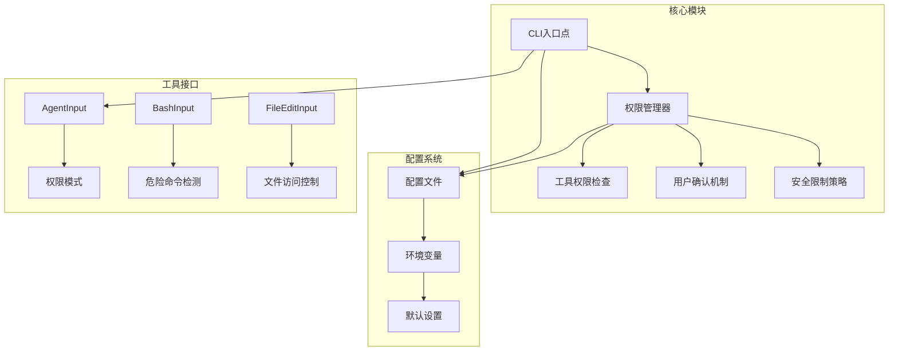
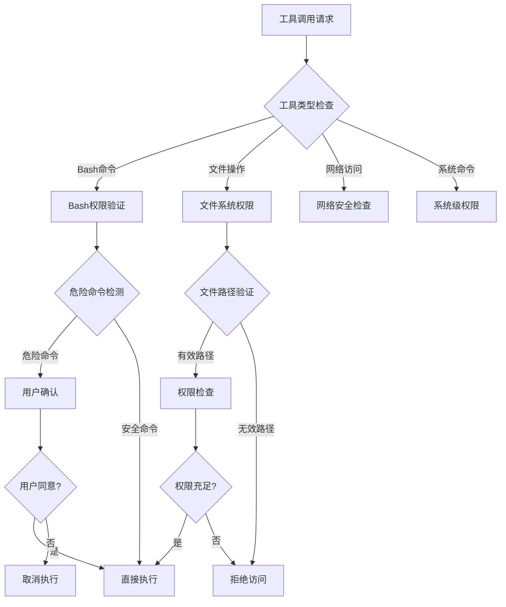
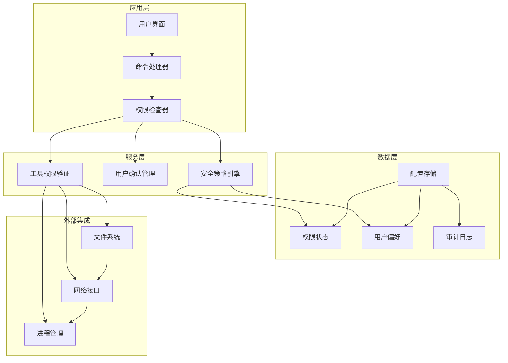
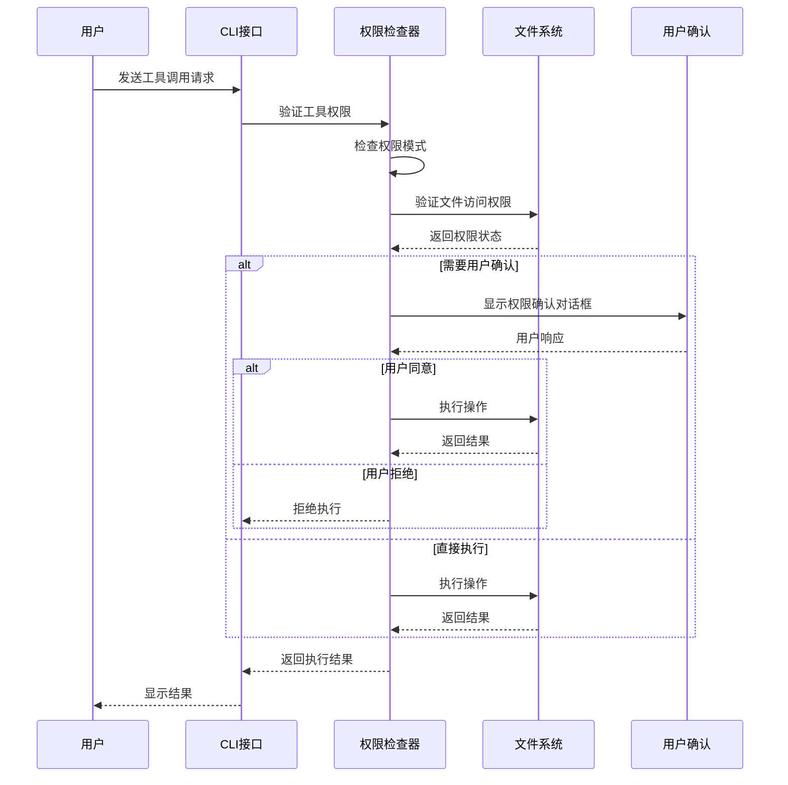
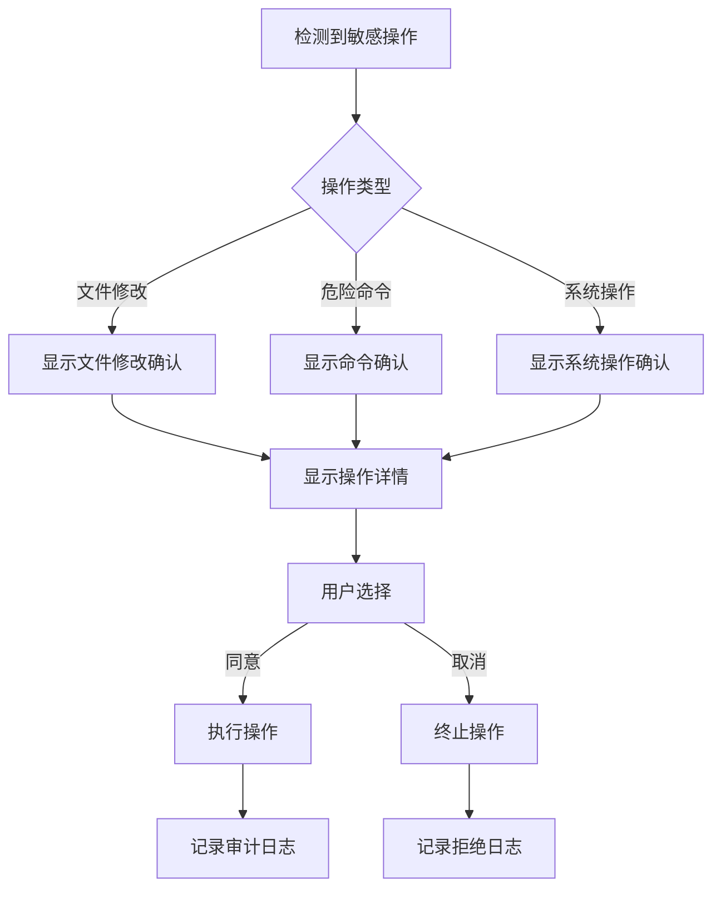
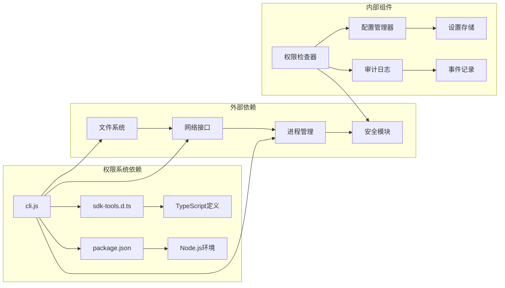

# 权限管理系统

<cite>
**本文档引用的文件**
- [README.md](file://README.md)
- [package.json](file://package.json)
- [sdk-tools.d.ts](file://sdk-tools.d.ts)
- [cli.js](file://cli.js)
</cite>

## 目录
1. [简介](#简介)
2. [项目结构](#项目结构)
3. [核心组件](#核心组件)
4. [架构概览](#架构概览)
5. [详细组件分析](#详细组件分析)
6. [依赖关系分析](#依赖关系分析)
7. [性能考虑](#性能考虑)
8. [故障排除指南](#故障排除指南)
9. [结论](#结论)

## 简介

权限管理系统是 Claude Code 2.1.88 的核心安全组件，负责控制和管理用户对各种工具和操作的访问权限。该系统提供了多层次的安全保护机制，包括权限检查流程、用户确认机制、安全限制策略等。

Claude Code 是一个在终端中运行的智能编码助手，能够理解代码库、执行常规任务、解释复杂代码并处理 Git 工作流。权限管理系统确保用户只能执行被授权的操作，同时为管理员提供必要的权限绕过功能。

## 项目结构

该项目采用模块化设计，主要包含以下关键组件：



**图表来源**
- [cli.js:1-50](file://cli.js#L1-L50)
- [sdk-tools.d.ts:258-295](file://sdk-tools.d.ts#L258-L295)

**章节来源**
- [README.md:1-44](file://README.md#L1-L44)
- [package.json:1-34](file://package.json#L1-L34)

## 核心组件

### 权限模式系统

系统支持多种权限模式，每种模式都有特定的安全级别和行为：

| 权限模式 | 描述 | 安全级别 | 主要用途 |
|---------|------|----------|----------|
| `default` | 默认权限模式，要求所有敏感操作都需要用户确认 | 高 | 日常开发工作 |
| `acceptEdits` | 允许编辑操作但需要用户批准 | 中高 | 代码编辑场景 |
| `bypassPermissions` | 绕过权限检查，管理员专用 | 最低 | 系统管理和紧急情况 |
| `dontAsk` | 不询问用户，自动执行允许的操作 | 中 | 批量自动化任务 |
| `plan` | 需要计划审批的高级权限 | 高 | 重大系统变更 |

### 工具权限检查

系统为不同类型的工具提供专门的权限检查机制：



**图表来源**
- [sdk-tools.d.ts:296-327](file://sdk-tools.d.ts#L296-L327)
- [sdk-tools.d.ts:358-375](file://sdk-tools.d.ts#L358-L375)

**章节来源**
- [sdk-tools.d.ts:258-295](file://sdk-tools.d.ts#L258-L295)
- [sdk-tools.d.ts:296-327](file://sdk-tools.d.ts#L296-L327)
- [sdk-tools.d.ts:358-375](file://sdk-tools.d.ts#L358-L375)

## 架构概览

权限管理系统采用分层架构设计，确保安全性和可扩展性：



**图表来源**
- [cli.js:1-50](file://cli.js#L1-L50)
- [cli.js:16000-16445](file://cli.js#L16000-L16445)

## 详细组件分析

### 权限检查流程

权限检查流程是整个系统的核心，确保每个操作都经过适当的安全验证：



**图表来源**
- [cli.js:16000-16445](file://cli.js#L16000-L16445)

### 用户确认机制

用户确认机制提供了多层安全保障，防止意外或恶意操作：



**图表来源**
- [sdk-tools.d.ts:557-620](file://sdk-tools.d.ts#L557-L620)

### 安全限制策略

系统实施了多层次的安全限制策略：

| 安全策略 | 实现方式 | 目标 |
|---------|----------|------|
| 文件访问限制 | 路径验证和权限检查 | 防止任意文件访问 |
| 命令执行限制 | 危险命令白名单 | 防止恶意命令执行 |
| 网络访问限制 | 域名过滤和代理 | 控制网络连接 |
| 进程管理限制 | 进程隔离和资源限制 | 防止资源滥用 |

**章节来源**
- [sdk-tools.d.ts:296-327](file://sdk-tools.d.ts#L296-L327)
- [sdk-tools.d.ts:557-620](file://sdk-tools.d.ts#L557-L620)

## 依赖关系分析

权限管理系统与项目其他组件存在紧密的依赖关系：



**图表来源**
- [cli.js:1-50](file://cli.js#L1-L50)
- [package.json:1-34](file://package.json#L1-L34)

**章节来源**
- [package.json:1-34](file://package.json#L1-L34)
- [cli.js:1-50](file://cli.js#L1-L50)

## 性能考虑

权限管理系统在保证安全性的同时，也考虑了性能优化：

### 权限缓存策略
- 缓存常用权限检查结果
- 实施权限状态预加载
- 减少重复的文件系统检查

### 异步处理机制
- 非阻塞的权限检查
- 并发权限验证
- 流式权限确认

### 内存管理
- 及时清理权限检查缓存
- 监控内存使用情况
- 实施垃圾回收策略

## 故障排除指南

### 常见权限问题

| 问题症状 | 可能原因 | 解决方案 |
|---------|----------|----------|
| 权限拒绝错误 | 权限模式设置不当 | 检查权限模式配置 |
| 用户确认不出现 | 确认机制故障 | 重启CLI或检查配置 |
| 文件访问失败 | 路径权限不足 | 验证文件路径和权限 |
| 命令执行被阻止 | 危险命令检测触发 | 检查命令内容或调整权限 |

### 调试方法

1. **启用详细日志**
   ```bash
   export DEBUG_PERMISSIONS=1
   claude --verbose
   ```

2. **检查权限状态**
   ```bash
   claude config get permissions.defaultMode
   ```

3. **查看审计日志**
   ```bash
   claude audit log
   ```

### 管理员权限

管理员可以通过以下方式获得额外权限：

1. **使用绕过模式**
   ```bash
   claude --bypass-permissions
   ```

2. **临时提升权限**
   ```bash
   claude config set permissions.adminMode true
   ```

**章节来源**
- [cli.js:16000-16445](file://cli.js#L16000-L16445)

## 结论

Claude Code 的权限管理系统通过多层次的安全策略、智能的权限检查流程和完善的用户确认机制，为开发者提供了一个既安全又灵活的编程环境。系统的设计充分考虑了易用性和安全性之间的平衡，既能保护系统免受恶意操作的影响，又能为用户提供流畅的开发体验。

该系统的主要优势包括：
- **模块化设计**：清晰的权限分离和职责划分
- **可扩展性**：支持自定义权限规则和策略
- **可观测性**：完整的审计日志和监控能力
- **用户体验**：智能的权限提示和确认机制

未来可以进一步增强的方向包括：
- 更细粒度的权限控制
- 动态权限策略
- 更强大的审计和合规功能
- 集成企业级身份认证系统