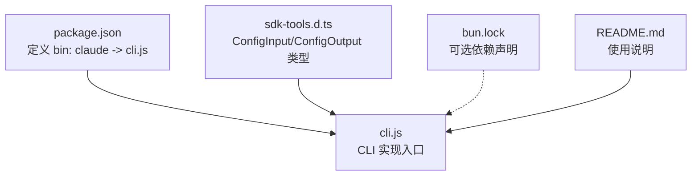
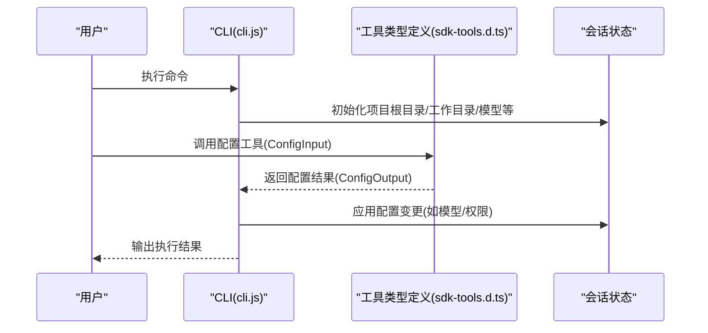
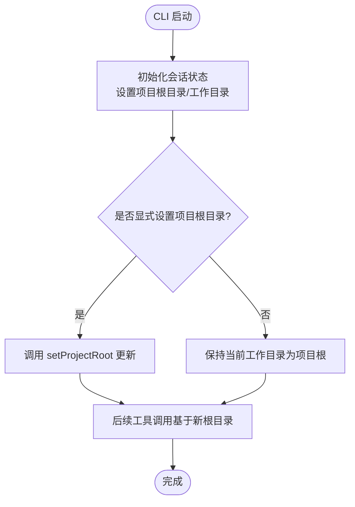
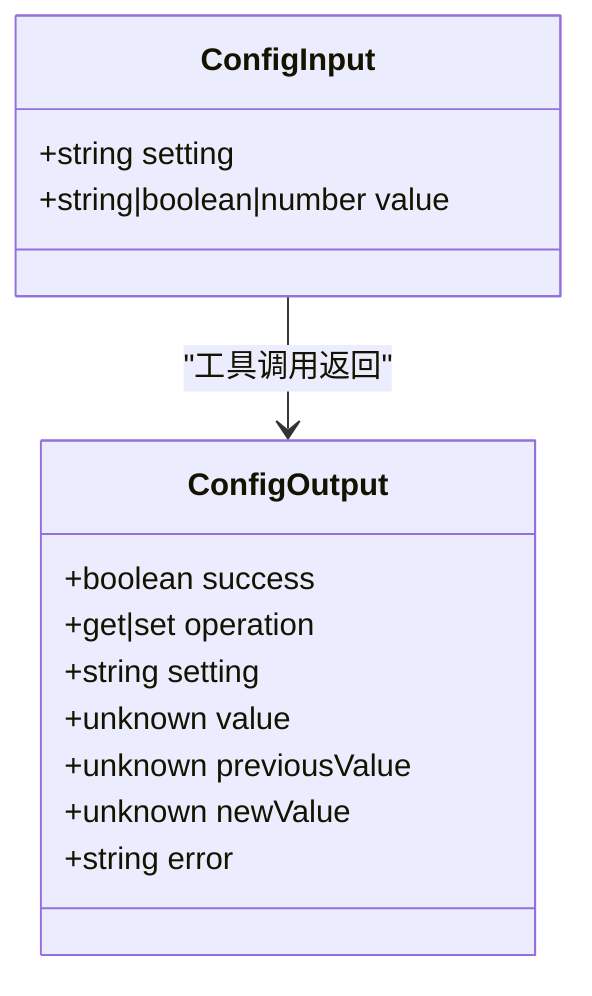
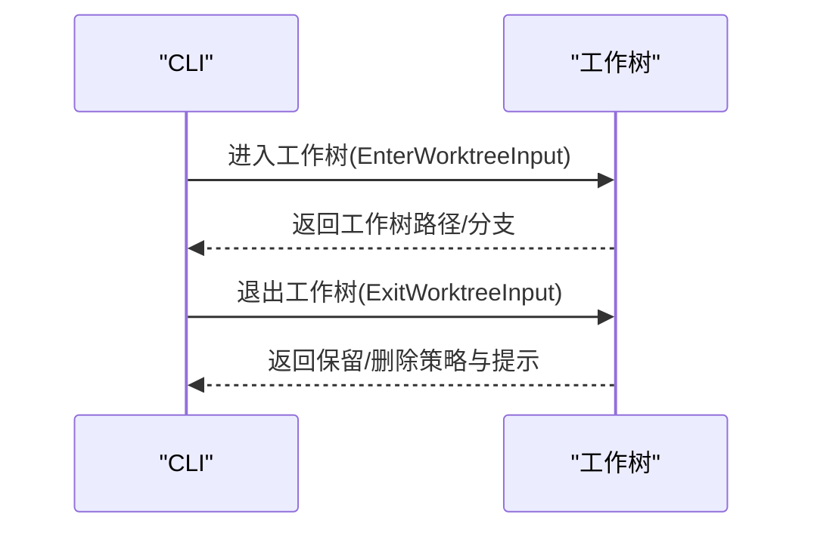
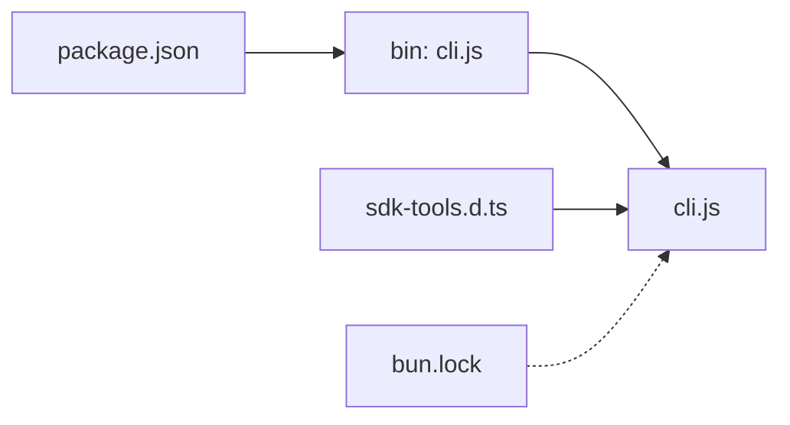

# 项目配置

<cite>
**本文引用的文件**
- [package.json](file://package.json)
- [README.md](file://README.md)
- [sdk-tools.d.ts](file://sdk-tools.d.ts)
- [cli.js](file://cli.js)
- [bun.lock](file://bun.lock)
</cite>

## 目录
1. [简介](#简介)
2. [项目结构](#项目结构)
3. [核心组件](#核心组件)
4. [架构总览](#架构总览)
5. [详细组件分析](#详细组件分析)
6. [依赖分析](#依赖分析)
7. [性能考虑](#性能考虑)
8. [故障排查指南](#故障排查指南)
9. [结论](#结论)
10. [附录](#附录)

## 简介
本文件面向 Claude Code 的项目配置系统，聚焦于“项目级配置”的定义、作用域、加载与合并规则，以及与“用户配置”的优先级关系。根据当前仓库内容，Claude Code 在该仓库中以 CLI 包形式提供，其核心入口为二进制可执行文件，通过命令行调用；同时在类型定义中暴露了“配置”相关接口，用于在运行时查询或设置配置项。

本仓库未包含项目级配置文件（例如 .claude.json 或 package.json 中的 claude 字段）。因此，本文档在“项目配置”层面主要基于现有代码证据进行抽象性说明，并给出在实际使用场景中的最佳实践与排障建议。

## 项目结构
- 根目录包含包元信息、CLI 入口、类型定义与锁文件等关键文件。
- package.json 定义了 CLI 可执行入口与引擎要求。
- cli.js 是 CLI 的实现入口，承载会话状态、配置来源与工具链交互。
- sdk-tools.d.ts 提供了配置输入输出的类型定义，表明 CLI 支持通过工具接口读取/写入配置。
- bun.lock 描述了可选依赖，与配置系统无直接关联。

**图表来源**
- [package.json](file://package.json)
- [cli.js](file://cli.js)
- [sdk-tools.d.ts](file://sdk-tools.d.ts)
- [bun.lock](file://bun.lock)
- [README.md](file://README.md)

**章节来源**
- [package.json](file://package.json)
- [cli.js](file://cli.js)
- [sdk-tools.d.ts](file://sdk-tools.d.ts)
- [bun.lock](file://bun.lock)
- [README.md](file://README.md)

## 核心组件
- CLI 入口与会话状态管理：CLI 启动后初始化会话状态，包含项目根目录、工作目录、模型字符串、计费与统计指标等。这些状态在运行期影响工具行为与权限控制。
- 配置接口类型：sdk-tools.d.ts 中定义了 ConfigInput/ConfigOutput，用于查询或设置配置项（如 theme、model、permissions.defaultMode 等），并在运行时返回操作结果与错误信息。
- 工具与工作树：CLI 还支持进入/退出工作树等能力，这些能力与项目上下文密切相关。

上述组件共同构成了“项目配置”的运行时基础：尽管仓库未提供项目级配置文件，但 CLI 的运行期状态与配置接口为项目级配置的落地提供了载体。

**章节来源**
- [cli.js](file://cli.js)
- [sdk-tools.d.ts](file://sdk-tools.d.ts)

## 架构总览
下图展示了 CLI 在启动与运行过程中与“配置”相关的交互关系：CLI 初始化会话状态，随后通过工具接口访问/修改配置；配置变更会影响后续工具调用的行为（如模型选择、权限策略等）。

**图表来源**
- [cli.js](file://cli.js)
- [sdk-tools.d.ts](file://sdk-tools.d.ts)

**章节来源**
- [cli.js](file://cli.js)
- [sdk-tools.d.ts](file://sdk-tools.d.ts)

## 详细组件分析

### 组件一：CLI 会话状态与项目根目录
- CLI 在启动时会初始化会话状态，其中包含项目根目录、原始工作目录、当前工作目录等字段。这些字段决定了工具在项目内的默认行为（如文件读写、搜索范围等）。
- 项目根目录可通过 setProjectRoot 等接口更新，从而影响后续工具调用的上下文。

**图表来源**
- [cli.js](file://cli.js)

**章节来源**
- [cli.js](file://cli.js)

### 组件二：配置接口与类型定义
- 配置接口类型定义位于 sdk-tools.d.ts，包含 ConfigInput 与 ConfigOutput：
  - ConfigInput：包含 setting（配置键）与 value（新值，省略时表示查询）。
  - ConfigOutput：包含操作结果、当前值、前值、新值与错误信息。
- 该类型定义表明 CLI 支持在运行时查询/设置配置项，例如主题、模型、权限模式等。

**图表来源**
- [sdk-tools.d.ts](file://sdk-tools.d.ts)

**章节来源**
- [sdk-tools.d.ts](file://sdk-tools.d.ts)

### 组件三：工作树与项目上下文
- CLI 支持进入/退出工作树，这与项目上下文密切相关。工作树的进入与退出会影响后续工具调用的路径与权限范围。

**图表来源**
- [sdk-tools.d.ts](file://sdk-tools.d.ts)

**章节来源**
- [sdk-tools.d.ts](file://sdk-tools.d.ts)

## 依赖分析
- 包元信息与入口：package.json 将 claude 指向 cli.js，确保用户通过 npm 全局安装后可直接运行 claude 命令。
- 可选依赖：bun.lock 展示了可选平台依赖，与配置系统无直接耦合。
- 类型定义：sdk-tools.d.ts 为 CLI 的工具接口提供类型约束，保证配置工具的输入输出规范。

**图表来源**
- [package.json](file://package.json)
- [cli.js](file://cli.js)
- [sdk-tools.d.ts](file://sdk-tools.d.ts)
- [bun.lock](file://bun.lock)

**章节来源**
- [package.json](file://package.json)
- [bun.lock](file://bun.lock)
- [sdk-tools.d.ts](file://sdk-tools.d.ts)
- [cli.js](file://cli.js)

## 性能考虑
- 配置查询与设置属于轻量级操作，通常不会引入显著开销。但在频繁切换模型或权限策略时，应避免不必要的重复设置，以减少会话状态更新成本。
- 对于大型项目，建议将项目根目录设置为精确的工程根，以缩小工具扫描范围，提升文件读写与搜索效率。

## 故障排查指南
- 配置接口返回错误
  - 若 ConfigOutput.error 存在，应检查 setting 键是否正确、value 类型是否匹配。
  - 参考类型定义中的键名与允许值范围，确保传入合法参数。
- 项目根目录不生效
  - 确认已调用 setProjectRoot 并在后续工具调用中生效。
  - 检查工作目录与项目根目录的关系，避免误设导致工具在错误路径上执行。
- 权限与工具调用异常
  - 结合会话状态中的权限字段与配置项，逐步排查权限策略是否与预期一致。
- 版本与兼容性
  - package.json 指定 Node 引擎版本要求，若环境不满足可能导致 CLI 行为异常。

**章节来源**
- [sdk-tools.d.ts](file://sdk-tools.d.ts)
- [cli.js](file://cli.js)
- [package.json](file://package.json)

## 结论
- 当前仓库未提供项目级配置文件（如 .claude.json 或 package.json 中的 claude 字段），但通过 CLI 的会话状态与配置接口类型，可以实现对项目上下文与配置项的运行时管理。
- 在实际使用中，建议将 CLI 的项目根目录设置为工程根，并通过配置接口统一管理模型与权限策略，以获得更稳定与可控的开发体验。

## 附录

### 附录A：CLI 入口与引擎要求
- package.json 中定义了 CLI 可执行入口与 Node 引擎最低版本要求，确保在满足条件的环境中正常运行。

**章节来源**
- [package.json](file://package.json)

### 附录B：使用说明与入门
- README.md 提供了安装与基本使用方式，便于快速上手。

**章节来源**
- [README.md](file://README.md)