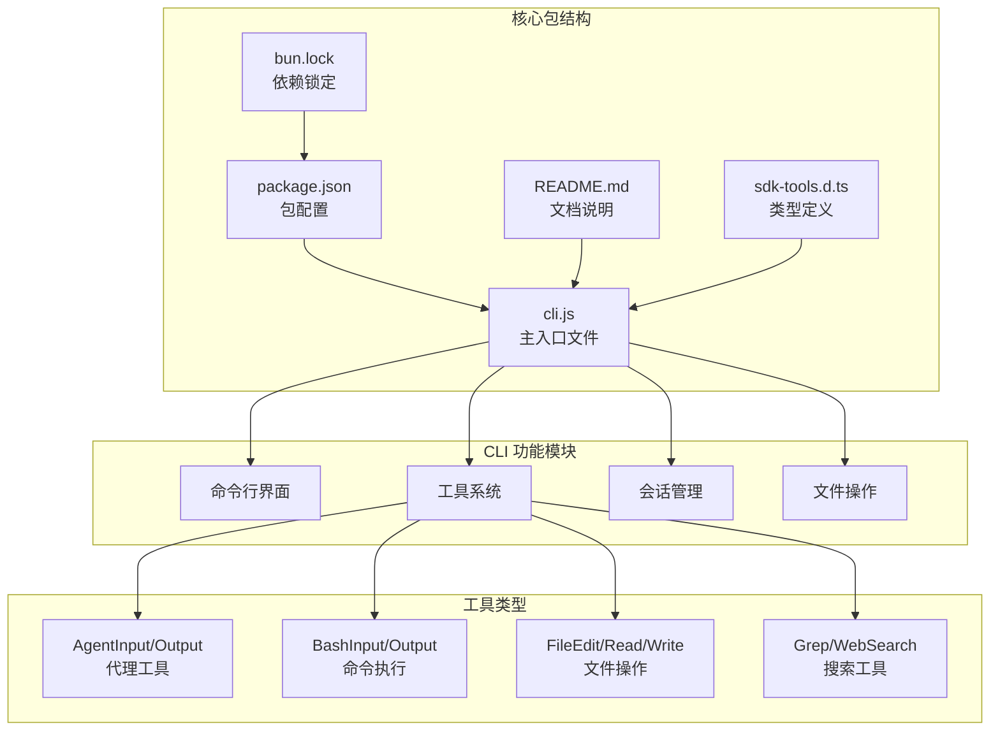
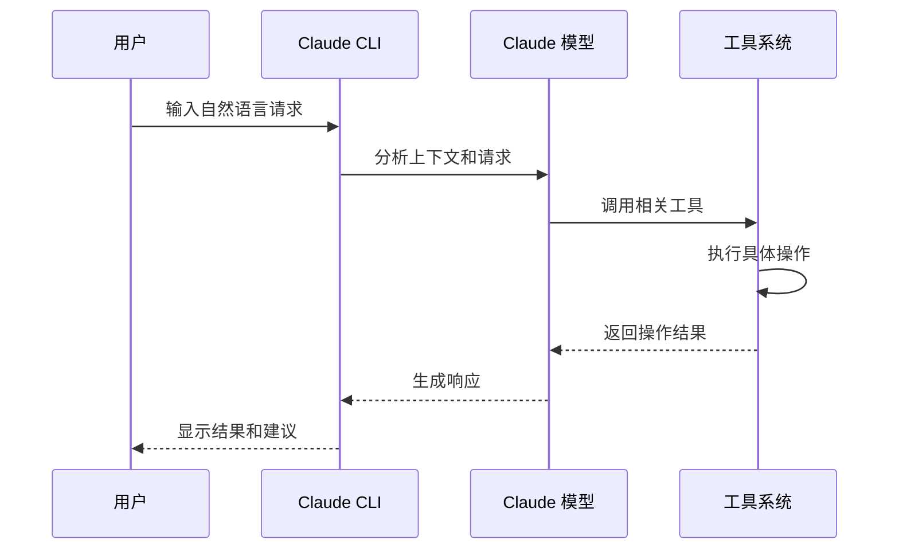
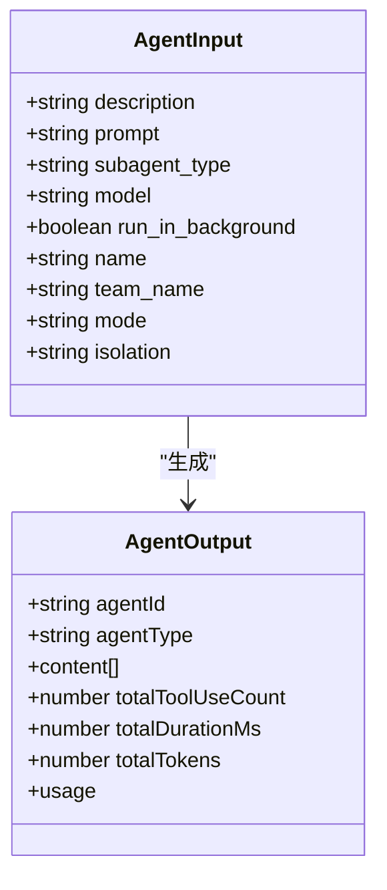
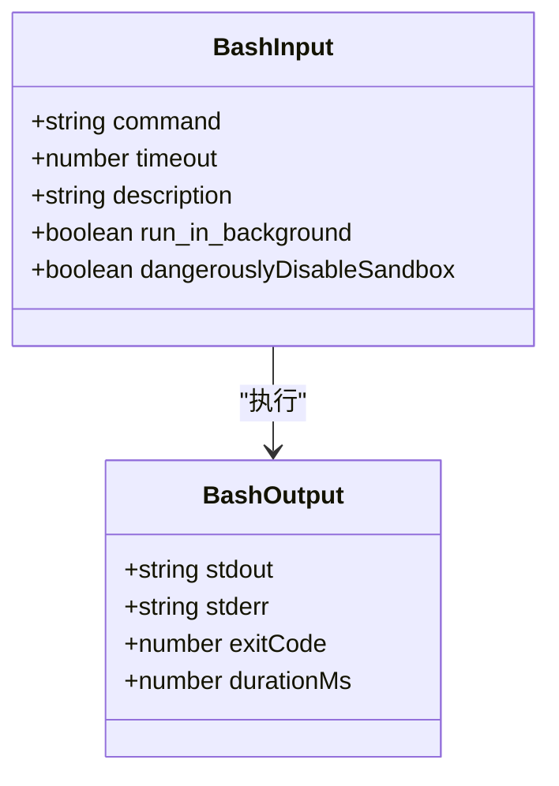
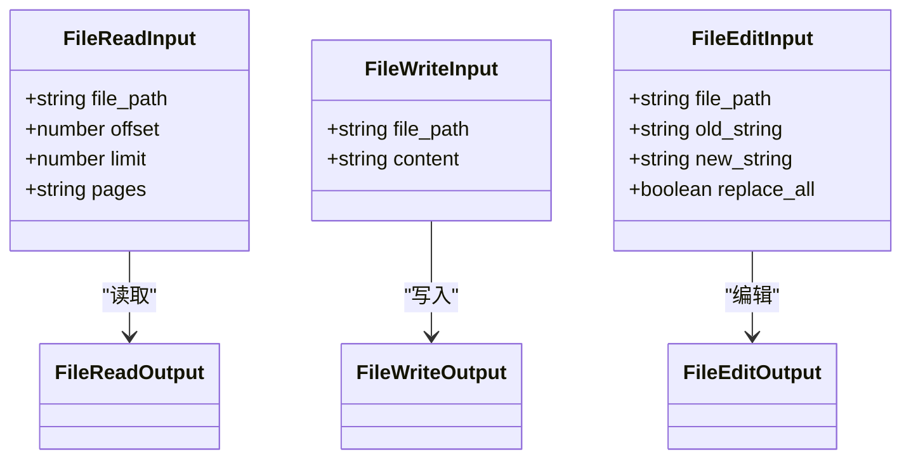

# 快速开始

<cite>
**本文档引用的文件**
- [README.md](file://README.md)
- [package.json](file://package.json)
- [cli.js](file://cli.js)
- [sdk-tools.d.ts](file://sdk-tools.d.ts)
- [bun.lock](file://bun.lock)
</cite>

## 目录
1. [简介](#简介)
2. [项目结构](#项目结构)
3. [安装与设置](#安装与设置)
4. [首次运行](#首次运行)
5. [基本使用示例](#基本使用示例)
6. [核心功能详解](#核心功能详解)
7. [环境配置要求](#环境配置要求)
8. [故障排除指南](#故障排除指南)
9. [第一个小时最佳实践](#第一个小时最佳实践)
10. [常见问题解答](#常见问题解答)

## 简介

Claude Code 是一个智能代理编码工具，它可以在终端中运行，理解你的代码库，并通过自然语言命令帮助你更快地编写代码。该工具可以执行例行任务、解释复杂代码、处理 Git 工作流，以及在终端、IDE 或 GitHub 上直接使用。

Claude Code 提供了丰富的工具集，包括：
- 代码审查和质量检查
- 问题诊断和解决
- 代码生成和重构
- 文件编辑和管理
- 终端命令执行
- 搜索和网络抓取
- 任务管理和工作流自动化

## 项目结构

该项目采用简洁的包结构设计，主要包含以下核心组件：



**图表来源**
- [package.json:1-34](file://package.json#L1-L34)
- [cli.js:1-100](file://cli.js#L1-L100)
- [sdk-tools.d.ts:1-100](file://sdk-tools.d.ts#L1-L100)

**章节来源**
- [package.json:1-34](file://package.json#L1-L34)
- [README.md:1-44](file://README.md#L1-L44)

## 安装与设置

### 系统要求

在安装 Claude Code 之前，请确保满足以下系统要求：

- **Node.js 版本**: >= 18.0.0
- **操作系统**: 支持 macOS、Windows、Linux
- **权限**: 需要全局安装权限（用于 npm 全局安装）

### 安装步骤

#### 方法一：使用 npm 全局安装（推荐）

```bash
# 全局安装 Claude Code
npm install -g @anthropic-ai/claude-code

# 验证安装
claude --version
```

#### 方法二：使用 npx 直接运行

```bash
# 直接运行而无需全局安装
npx @anthropic-ai/claude-code
```

### 验证安装

安装完成后，可以通过以下方式验证 Claude Code 是否正确安装：

```bash
# 查看版本信息
claude --version

# 查看帮助信息
claude --help

# 启动交互式会话
claude
```

**章节来源**
- [README.md:15-21](file://README.md#L15-L21)
- [package.json:7-9](file://package.json#L7-L9)

## 首次运行

### 启动 Claude Code

1. **导航到项目目录**：
   ```bash
   cd /path/to/your/project
   ```

2. **启动 Claude Code**：
   ```bash
   claude
   ```

3. **进入交互模式**：
   - 输入自然语言描述你的需求
   - Claude 会分析你的代码库并提供相应的帮助
   - 使用 `/help` 查看可用命令

### 基本交互流程



**图表来源**
- [cli.js:1-50](file://cli.js#L1-L50)
- [sdk-tools.d.ts:11-33](file://sdk-tools.d.ts#L11-L33)

## 基本使用示例

### 示例 1：代码审查

```bash
# 请求代码审查
请分析这段代码的安全性和性能问题

# 获取具体的改进建议
针对发现的问题，提供修复方案
```

### 示例 2：问题诊断

```bash
# 报告错误并寻求解决方案
运行时出现以下错误：TypeError: Cannot read property 'length' of undefined

# 请求调试建议
请分析可能的原因并提供调试步骤
```

### 示例 3：代码生成

```bash
# 生成特定功能的代码
创建一个函数来处理用户输入验证

# 指定技术栈和要求
使用 TypeScript 编写，包含单元测试
```

### 示例 4：文件操作

```bash
# 查找特定类型的文件
查找所有 .js 文件中的 TODO 注释

# 修改文件内容
替换配置文件中的数据库连接字符串
```

## 核心功能详解

### 代理工具 (Agent Tools)

代理工具允许 Claude 创建专门的代理来处理复杂的任务：



**图表来源**
- [sdk-tools.d.ts:258-295](file://sdk-tools.d.ts#L258-L295)

### 命令执行工具 (Bash Tools)

命令执行工具允许安全地在受控环境中执行系统命令：



**图表来源**
- [sdk-tools.d.ts:296-327](file://sdk-tools.d.ts#L296-L327)

### 文件操作工具

文件操作工具提供了安全的文件读写能力：



**图表来源**
- [sdk-tools.d.ts:358-403](file://sdk-tools.d.ts#L358-L403)

**章节来源**
- [sdk-tools.d.ts:11-2719](file://sdk-tools.d.ts#L11-L2719)

## 环境配置要求

### 环境变量

Claude Code 支持多种环境变量配置：

| 环境变量 | 描述 | 默认值 |
|---------|------|--------|
| `NODE_OPTIONS` | Node.js 运行时选项 | 无 |
| `AWS_REGION` | AWS 区域设置 | `us-east-1` |
| `AWS_DEFAULT_REGION` | AWS 默认区域 | `us-east-1` |
| `CLOUD_ML_REGION` | 云机器学习区域 | `us-east5` |
| `CLAUDE_CONFIG_DIR` | 配置目录路径 | `$HOME/.claude` |
| `CLAUDE_CODE_SIMPLE` | 简化模式开关 | `false` |

### 配置文件

Claude Code 会在用户主目录下创建配置文件：

```bash
# 配置文件位置
~/.claude/config.json

# 团队配置文件
~/.claude/teams/
```

### 权限要求

- **文件系统权限**: 读取项目文件和写入修改
- **网络访问**: 访问 Anthropic API 和外部资源
- **Git 权限**: 执行 Git 操作（如果项目使用 Git）

**章节来源**
- [cli.js:1000-1200](file://cli.js#L1000-L1200)

## 故障排除指南

### 常见安装问题

#### 问题：Node.js 版本过低

**症状**：
```
Error: This version of Claude Code requires Node.js >= 18.0.0
```

**解决方案**：
```bash
# 检查 Node.js 版本
node --version

# 升级到支持的版本
# 从 https://nodejs.org 下载最新 LTS 版本
```

#### 问题：权限不足

**症状**：
```
Permission denied: /usr/local/lib/node_modules/@anthropic-ai/claude-code
```

**解决方案**：
```bash
# 使用 sudo 安装（不推荐）
sudo npm install -g @anthropic-ai/claude-code

# 或者使用 npx 直接运行
npx @anthropic-ai/claude-code
```

#### 问题：网络连接问题

**症状**：
```
Error: Request failed with status code 401
```

**解决方案**：
```bash
# 检查网络连接
ping api.anthropic.com

# 设置代理（如果需要）
export HTTP_PROXY=http://proxy.example.com:8080
export HTTPS_PROXY=https://proxy.example.com:8080
```

### 运行时问题

#### 问题：API 密钥认证失败

**症状**：
```
Error: Invalid API key
```

**解决方案**：
```bash
# 设置 API 密钥
export ANTHROPIC_API_KEY=your_api_key_here

# 或者通过配置文件设置
echo '{"api_key": "your_api_key_here"}' > ~/.claude/config.json
```

#### 问题：文件权限问题

**症状**：
```
Error: Permission denied: /path/to/file
```

**解决方案**：
```bash
# 检查文件权限
ls -la /path/to/file

# 修改文件权限
chmod 644 /path/to/file
```

#### 问题：内存不足

**症状**：
```
FATAL ERROR: Reached heap limit
```

**解决方案**：
```bash
# 增加 Node.js 内存限制
export NODE_OPTIONS="--max-old-space-size=4096"

# 或者重启 Claude Code
claude --reset
```

**章节来源**
- [cli.js:1200-1500](file://cli.js#L1200-L1500)

## 第一个小时最佳实践

### 第 1-15 分钟：基础探索

1. **熟悉界面**：
   - 运行 `claude --help` 查看所有可用命令
   - 输入 `你好，Claude` 测试基本对话功能

2. **了解工具范围**：
   - 尝试简单的代码查询
   - 使用 `/help` 查看所有可用工具

3. **配置基本设置**：
   - 设置合适的模型偏好
   - 配置输出格式

### 第 15-30 分钟：实际应用

1. **代码审查练习**：
   - 选择一个小的代码片段进行审查
   - 关注代码质量和潜在问题

2. **问题解决实践**：
   - 遇到具体问题时寻求解决方案
   - 记录有用的调试技巧

3. **文件操作实验**：
   - 尝试查找和修改文件
   - 学习安全的文件编辑方法

### 第 30-45 分钟：高级功能

1. **代理工具使用**：
   - 创建专门的代理处理复杂任务
   - 学习多代理协作模式

2. **批量操作**：
   - 尝试批量文件处理
   - 学习自动化工作流

3. **集成开发**：
   - 与现有开发工具集成
   - 设置自定义工作流程

### 第 45-60 分钟：优化和扩展

1. **性能优化**：
   - 学习如何优化 Claude Code 的性能
   - 了解内存和资源使用

2. **自定义配置**：
   - 配置高级参数
   - 设置个性化偏好

3. **团队协作**：
   - 学习团队共享配置
   - 设置项目特定设置

## 常见问题解答

### 如何更新 Claude Code？

```bash
# 更新到最新版本
npm update -g @anthropic-ai/claude-code

# 查看当前版本
claude --version
```

### 如何卸载 Claude Code？

```bash
# 卸载全局包
npm uninstall -g @anthropic-ai/claude-code

# 清理缓存
npm cache clean --force
```

### 如何重置配置？

```bash
# 备份当前配置
cp ~/.claude/config.json ~/.claude/config.json.backup

# 删除配置文件
rm ~/.claude/config.json

# 重新启动 Claude Code
claude
```

### 如何查看日志？

```bash
# 启用详细日志
claude --verbose

# 查看配置目录
ls -la ~/.claude/
```

### 如何获取技术支持？

1. **内置帮助**：
   ```bash
   claude /help
   ```

2. **社区支持**：
   - 加入 Claude Developers Discord
   - 在 GitHub 上提交 Issue

3. **官方文档**：
   - 访问 Claude Code 官方文档
   - 查看 API 参考和示例

**章节来源**
- [README.md:23-44](file://README.md#L23-L44)