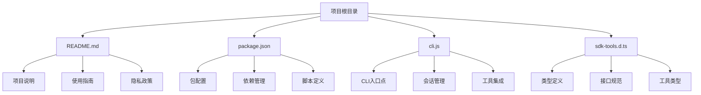
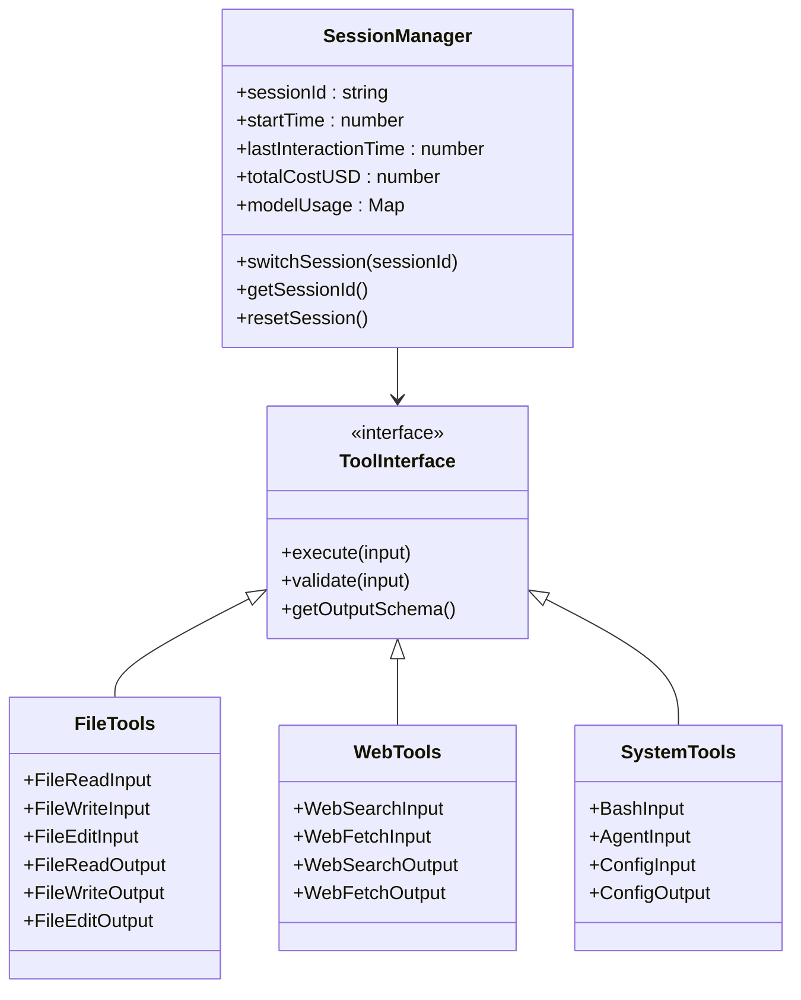
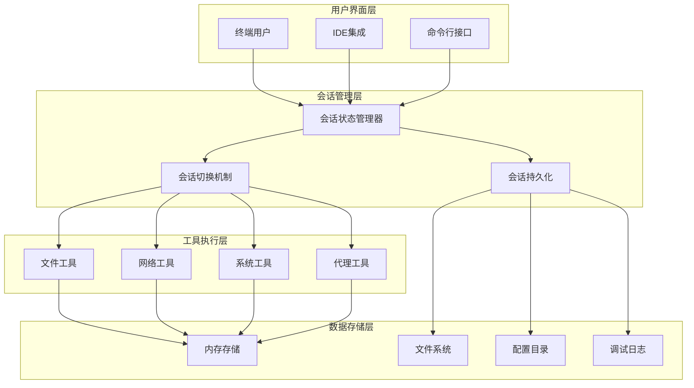
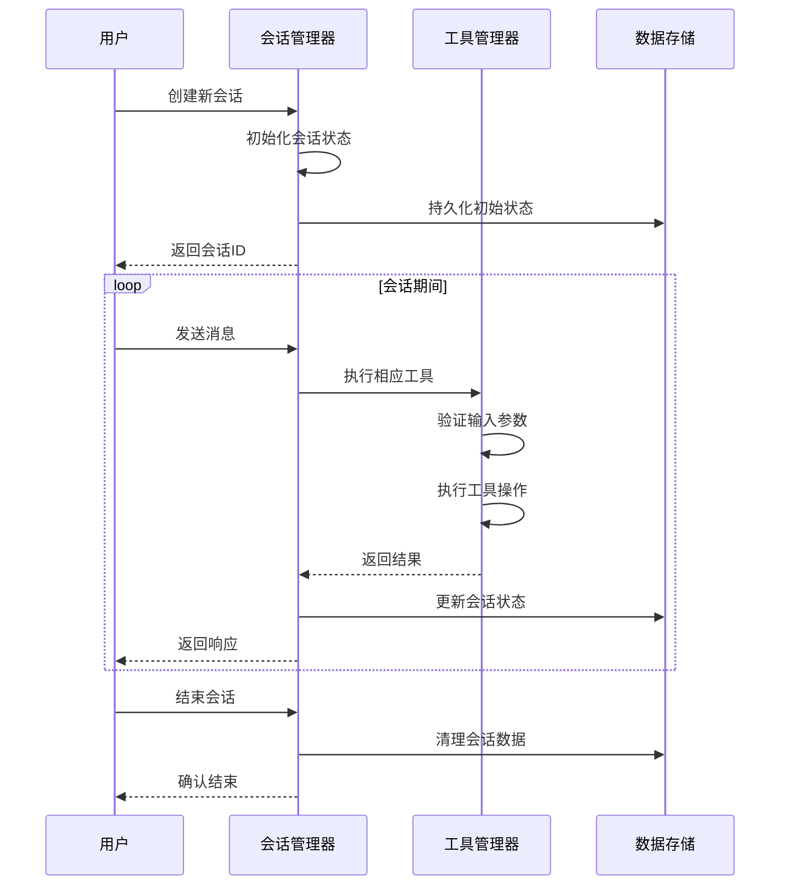
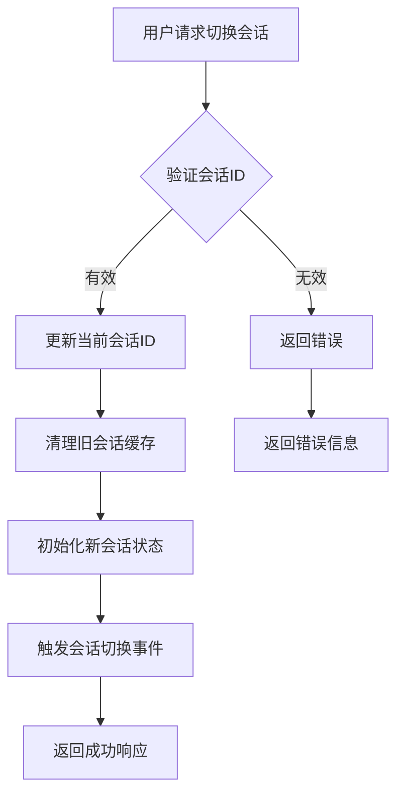
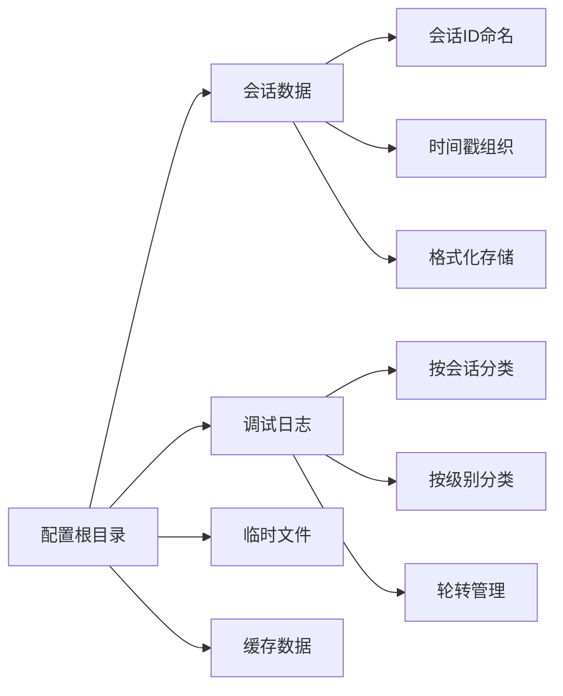
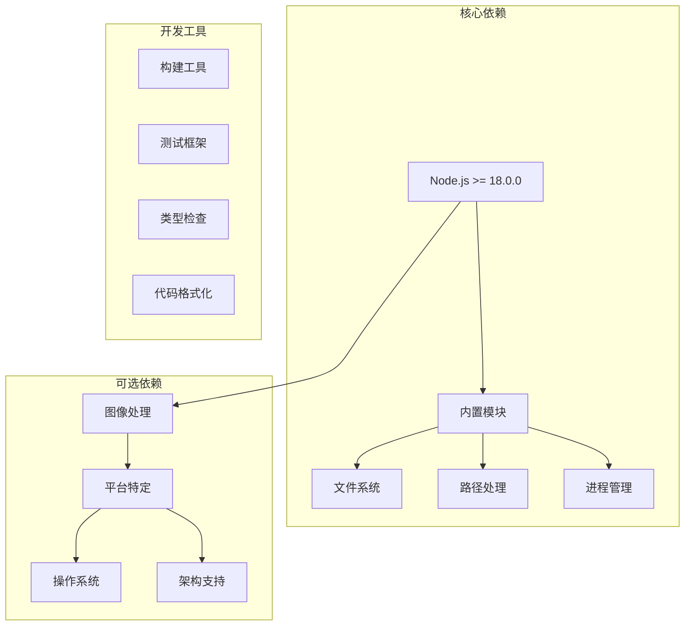
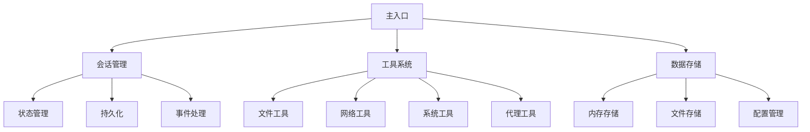

# 会话管理

<cite>
**本文档引用的文件**
- [README.md](file://README.md)
- [package.json](file://package.json)
- [cli.js](file://cli.js)
- [sdk-tools.d.ts](file://sdk-tools.d.ts)
</cite>

## 目录
1. [简介](#简介)
2. [项目结构](#项目结构)
3. [核心组件](#核心组件)
4. [架构概览](#架构概览)
5. [详细组件分析](#详细组件分析)
6. [依赖关系分析](#依赖关系分析)
7. [性能考虑](#性能考虑)
8. [故障排除指南](#故障排除指南)
9. [结论](#结论)

## 简介

Claude Code 是一个基于终端的智能编码助手，能够理解代码库并帮助用户通过自然语言命令执行例行任务、解释复杂代码以及处理 Git 工作流。该系统的核心是会话管理系统，它负责维护用户与 AI 助手之间的交互状态。

根据项目元数据，这是一个 Node.js 包，版本为 2.1.88，提供了一个名为 `claude` 的二进制可执行文件。该工具集成了多种功能，包括文件编辑、代码搜索、网络请求等能力。

## 项目结构

该项目采用模块化设计，主要包含以下核心文件：

**图表来源**
- [package.json:1-34](file://package.json#L1-L34)
- [cli.js:1-52](file://cli.js#L1-L52)

**章节来源**
- [package.json:1-34](file://package.json#L1-L34)
- [README.md:1-44](file://README.md#L1-L44)

## 核心组件

### 会话状态管理器

系统的核心是一个会话状态管理器，负责维护用户的交互状态。该管理器提供了丰富的状态跟踪功能：

- **会话标识符管理**：使用 UUID 生成唯一的会话 ID
- **时间戳跟踪**：记录会话开始时间和最后交互时间
- **成本统计**：跟踪 API 使用成本和令牌消耗
- **模型使用情况**：记录不同模型的使用统计
- **交互计数器**：跟踪各种操作的执行次数

### 工具集成层

系统集成了多种工具类型，每种工具都有特定的功能和输出格式：

**图表来源**
- [cli.js:40-52](file://cli.js#L40-L52)
- [sdk-tools.d.ts:1-2492](file://sdk-tools.d.ts#L1-L2492)

### 数据持久化机制

系统实现了多层次的数据持久化策略：

- **内存状态存储**：实时会话状态保存在内存中
- **文件系统备份**：支持将会话数据写入文件系统
- **配置目录管理**：使用标准的配置目录结构
- **调试日志系统**：提供详细的调试信息记录

**章节来源**
- [cli.js:53-66](file://cli.js#L53-L66)
- [cli.js:40-52](file://cli.js#L40-L52)

## 架构概览

### 整体架构设计

**图表来源**
- [cli.js:1-52](file://cli.js#L1-L52)
- [sdk-tools.d.ts:1-333](file://sdk-tools.d.ts#L1-L333)

### 会话生命周期管理

系统实现了完整的会话生命周期管理：

**图表来源**
- [cli.js:1-52](file://cli.js#L1-L52)
- [sdk-tools.d.ts:258-2719](file://sdk-tools.d.ts#L258-L2719)

## 详细组件分析

### 会话状态管理器

会话状态管理器是整个系统的核心组件，负责维护所有会话相关的状态信息：

#### 状态字段结构

| 状态字段 | 类型 | 描述 | 默认值 |
|---------|------|------|--------|
| sessionId | string | 唯一会话标识符 | 自动生成 |
| startTime | number | 会话开始时间戳 | 当前时间 |
| lastInteractionTime | number | 最后交互时间戳 | 当前时间 |
| totalCostUSD | number | 总成本（美元） | 0 |
| totalAPIDuration | number | 总API调用时长 | 0 |
| totalToolDuration | number | 总工具执行时长 | 0 |
| totalLinesAdded | number | 总新增代码行数 | 0 |
| totalLinesRemoved | number | 总删除代码行数 | 0 |
| modelUsage | object | 模型使用统计 | 空对象 |
| isInteractive | boolean | 是否交互模式 | false |
| clientType | string | 客户端类型 | "cli" |

#### 关键功能实现

**会话切换机制**：

**图表来源**
- [cli.js:1-52](file://cli.js#L1-L52)

**章节来源**
- [cli.js:1-52](file://cli.js#L1-L52)

### 工具系统架构

系统提供了多种工具类型的统一接口：

#### 文件操作工具

文件工具支持多种文件操作：

- **文件读取**：支持文本文件、图片、PDF、笔记本等多种格式
- **文件写入**：支持创建新文件和更新现有文件
- **文件编辑**：支持精确的字符串替换和批量修改

#### 网络操作工具

网络工具提供了强大的互联网访问能力：

- **网页搜索**：集成搜索引擎进行内容检索
- **网页抓取**：直接获取网页内容并应用用户提示
- **域名过滤**：支持白名单和黑名单域名控制

#### 系统操作工具

系统工具提供了底层操作系统访问：

- **命令执行**：安全的 shell 命令执行环境
- **配置管理**：动态配置项的读取和设置
- **代理服务**：智能代理工具的管理和调度

**章节来源**
- [sdk-tools.d.ts:166-2492](file://sdk-tools.d.ts#L166-L2492)

### 数据存储与持久化

系统采用了分层的数据存储策略：

#### 内存存储层

- **实时状态**：会话的实时状态信息
- **临时缓存**：频繁访问的数据缓存
- **性能优化**：减少磁盘 I/O 操作

#### 文件系统存储层

- **会话数据**：完整的会话历史记录
- **配置文件**：用户自定义的配置信息
- **调试日志**：详细的系统运行日志

#### 配置目录管理

系统遵循标准的配置目录约定：

**图表来源**
- [cli.js:53-66](file://cli.js#L53-L66)

**章节来源**
- [cli.js:53-66](file://cli.js#L53-L66)

## 依赖关系分析

### 外部依赖管理

系统使用了多种外部依赖来增强功能：

**图表来源**
- [package.json:1-34](file://package.json#L1-L34)

### 内部模块依赖

系统内部模块之间存在清晰的依赖关系：

**图表来源**
- [cli.js:1-52](file://cli.js#L1-L52)
- [sdk-tools.d.ts:1-333](file://sdk-tools.d.ts#L1-L333)

**章节来源**
- [package.json:1-34](file://package.json#L1-L34)

## 性能考虑

### 内存管理优化

系统采用了多种内存管理策略来确保高性能运行：

- **惰性加载**：只在需要时加载相关模块
- **缓存策略**：对频繁访问的数据建立缓存
- **垃圾回收**：定期清理不再使用的会话数据
- **内存监控**：实时监控内存使用情况

### 并发处理机制

系统支持多会话并发处理：

- **会话隔离**：每个会话拥有独立的状态空间
- **资源池管理**：共享资源的池化管理
- **异步操作**：非阻塞的异步操作处理
- **超时控制**：防止长时间阻塞的操作

### I/O 优化

为了提高 I/O 性能，系统实现了以下优化：

- **批量写入**：合并多个小的写操作
- **缓冲区管理**：智能的缓冲区大小调整
- **压缩存储**：对大文件进行压缩存储
- **增量更新**：只更新变化的部分数据

## 故障排除指南

### 常见问题诊断

#### 会话连接问题

当遇到会话连接问题时，可以按照以下步骤进行诊断：

1. **检查网络连接**：确认网络连接正常
2. **验证认证信息**：检查 API 密钥或令牌
3. **查看防火墙设置**：确认端口未被阻止
4. **检查服务器状态**：确认服务端正常运行

#### 性能问题排查

如果系统运行缓慢，可以检查：

1. **内存使用情况**：监控内存占用是否过高
2. **磁盘 I/O**：检查磁盘读写性能
3. **CPU 使用率**：确认 CPU 资源充足
4. **网络延迟**：测量网络响应时间

#### 数据一致性问题

当出现数据不一致时：

1. **检查事务完整性**：确认数据库事务正确提交
2. **验证数据校验**：检查数据完整性约束
3. **查看日志信息**：分析错误日志
4. **执行修复程序**：运行数据修复工具

### 调试工具使用

系统提供了丰富的调试工具：

- **详细日志**：启用详细级别的日志记录
- **性能分析**：使用性能分析工具识别瓶颈
- **内存泄漏检测**：监控内存使用模式
- **网络监控**：跟踪网络请求和响应

**章节来源**
- [README.md:31-44](file://README.md#L31-L44)

## 结论

Claude Code 的会话管理系统展现了现代 AI 辅助工具的先进设计理念。通过精心设计的架构和完善的工具集，该系统能够为用户提供高效、可靠的编程辅助体验。

系统的主要优势包括：

1. **模块化设计**：清晰的组件分离和职责划分
2. **扩展性强**：支持多种工具类型和自定义扩展
3. **性能优化**：高效的内存管理和 I/O 优化
4. **可靠性保障**：完善的数据持久化和错误处理机制
5. **用户体验**：直观的接口设计和丰富的功能特性

未来的发展方向可能包括：

- **增强的 AI 集成**：更深入的机器学习模型集成
- **云原生支持**：更好的云端部署和管理能力
- **协作功能**：多人协作和代码审查功能
- **自动化工作流**：更智能的任务自动化和编排

通过持续的优化和改进，Claude Code 会话管理系统将继续为开发者提供卓越的编程辅助体验。