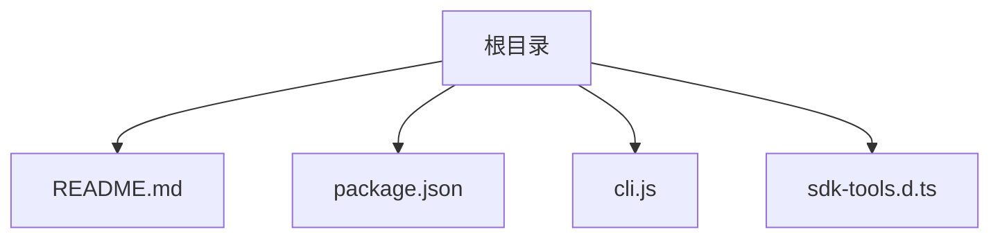
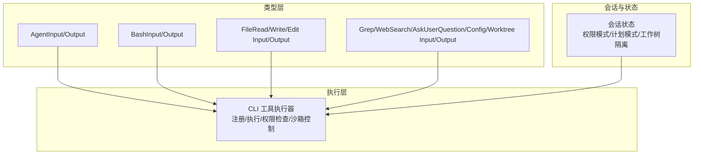
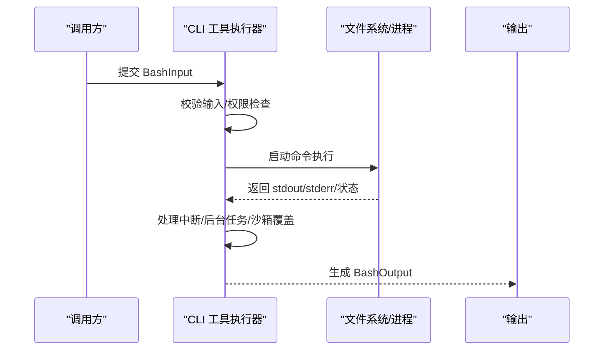
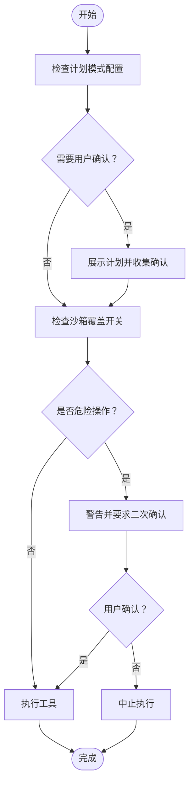
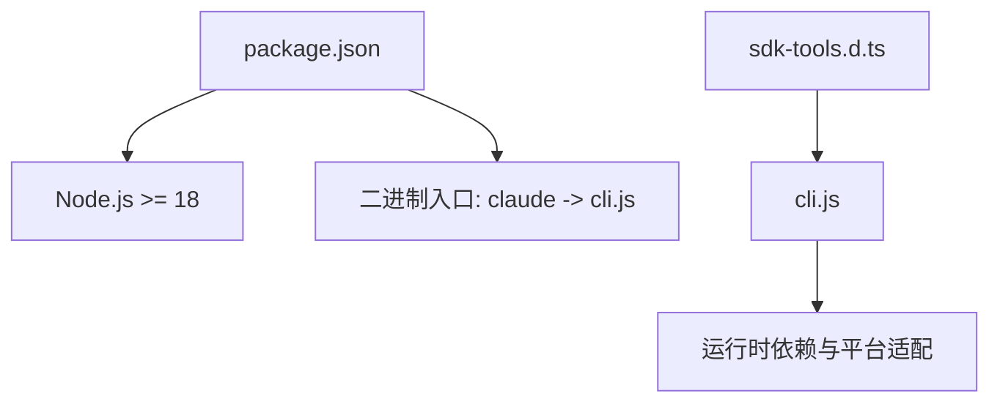

# 工具系统

<cite>
**本文档引用的文件**
- [README.md](file://README.md)
- [package.json](file://package.json)
- [cli.js](file://cli.js)
- [sdk-tools.d.ts](file://sdk-tools.d.ts)
</cite>

## 目录
1. [简介](#简介)
2. [项目结构](#项目结构)
3. [核心组件](#核心组件)
4. [架构总览](#架构总览)
5. [详细组件分析](#详细组件分析)
6. [依赖关系分析](#依赖关系分析)
7. [性能考虑](#性能考虑)
8. [故障排除指南](#故障排除指南)
9. [结论](#结论)
10. [附录](#附录)

## 简介
本项目是 Claude Code 的工具系统，旨在在终端中以自然语言方式执行常规任务、解释复杂代码并处理 Git 工作流。该系统通过工具（工具输入/输出）与 AI 模型进行交互，支持文件操作、系统命令执行、网络搜索等多种能力，并提供权限管理与安全控制。

## 项目结构
- 根目录包含项目说明、包配置与工具类型定义文件：
  - README.md：项目介绍与使用说明
  - package.json：包元信息、二进制入口与运行时依赖
  - cli.js：CLI 主程序（含工具执行、权限控制、日志与调试）
  - sdk-tools.d.ts：工具输入/输出的 TypeScript 类型定义（描述工具协议与数据模型）

**图表来源**
- [package.json:1-34](file://package.json#L1-L34)
- [cli.js:1-52](file://cli.js#L1-L52)
- [sdk-tools.d.ts:1-80](file://sdk-tools.d.ts#L1-L80)

**章节来源**
- [README.md:1-44](file://README.md#L1-L44)
- [package.json:1-34](file://package.json#L1-L34)

## 核心组件
- 工具输入/输出类型系统：通过 sdk-tools.d.ts 定义了 Agent、Bash、FileRead、FileWrite、Grep、WebSearch、AskUserQuestion、Config、EnterWorktree、ExitWorktree 等工具的输入输出结构，确保调用方与执行器之间的契约一致。
- CLI 执行器：cli.js 提供工具注册、执行、权限检查、沙箱控制、后台任务管理、调试日志与错误处理等能力。
- 包与运行时：package.json 声明二进制入口与 Node.js 运行时要求，便于在终端直接使用。

**章节来源**
- [sdk-tools.d.ts:11-54](file://sdk-tools.d.ts#L11-L54)
- [cli.js:1-52](file://cli.js#L1-L52)
- [package.json:4-10](file://package.json#L4-L10)

## 架构总览
工具系统采用“类型驱动 + CLI 执行器”的架构：
- 类型层：sdk-tools.d.ts 定义工具输入输出的严格结构，保证跨组件一致性。
- 执行层：cli.js 负责解析工具请求、执行具体逻辑（如文件读写、命令执行、网络请求）、生成结果或错误。
- 权限层：通过工具输入中的权限字段（如 Bash 的 dangerouslyDisableSandbox、ExitPlanMode 的 allowedPrompts）与会话状态（如 sessionBypassPermissionsMode）共同决定是否允许执行及如何提示用户确认。

**图表来源**
- [sdk-tools.d.ts:258-2244](file://sdk-tools.d.ts#L258-L2244)
- [cli.js:1-52](file://cli.js#L1-L52)

## 详细组件分析

### 工具输入/输出标准与数据模型
- 工具输入类型（部分示例）
  - AgentInput：描述任务、子代理类型、模型覆盖、后台运行、团队与隔离模式等
  - BashInput：命令、超时、描述、后台运行、沙箱覆盖开关等
  - FileReadInput/FileWriteInput/FileEditInput：文件路径、偏移/限制、替换文本等
  - GrepInput：正则表达式、路径、glob、输出模式、上下文、大小限制等
  - WebSearchInput/WebFetchInput：查询、域名白黑名单、URL 获取后处理等
  - AskUserQuestionInput：多轮问题、选项、预览与注释、元数据等
  - ConfigInput：设置键与新值
  - EnterWorktreeInput/ExitWorktreeInput：工作树名称与清理策略
- 工具输出类型（部分示例）
  - AgentOutput：状态、统计、异步启动信息等
  - BashOutput：stdout/stderr、中断标志、后台任务ID、沙箱覆盖标记、结构化内容等
  - FileReadOutput：文本/图片/笔记本/PDF/分页提取等多形态返回
  - ExitPlanModeOutput：计划内容、是否编辑、审批请求ID等

```mermaid
classDiagram
class AgentInput {
+string description
+string prompt
+string subagent_type
+string model
+boolean run_in_background
+string name
+string team_name
+string mode
+string isolation
}
class BashInput {
+string command
+number timeout
+string description
+boolean run_in_background
+boolean dangerouslyDisableSandbox
}
class FileReadInput {
+string file_path
+number offset
+number limit
+string pages
}
class GrepInput {
+string pattern
+string path
+string glob
+string output_mode
+number context
+boolean multiline
+number head_limit
+number offset
}
class WebSearchInput {
+string query
+string[] allowed_domains
+string[] blocked_domains
}
class AskUserQuestionInput {
+questions[]
+answers?
+annotations?
+metadata?
}
class ConfigInput {
+string setting
+string|boolean|number value?
}
class EnterWorktreeInput {
+string name?
}
class ExitWorktreeInput {
+string action
+boolean discard_changes?
}
class AgentOutput
class BashOutput
class FileReadOutput
class ExitPlanModeOutput
```

**图表来源**
- [sdk-tools.d.ts:258-2244](file://sdk-tools.d.ts#L258-L2244)

**章节来源**
- [sdk-tools.d.ts:11-54](file://sdk-tools.d.ts#L11-L54)
- [sdk-tools.d.ts:258-2244](file://sdk-tools.d.ts#L258-L2244)

### 工具执行流程（以 Bash 为例）
- 输入校验：检查命令、超时、描述、后台运行与沙箱覆盖开关
- 权限检查：根据会话状态与工具输入决定是否需要用户确认或绕过权限
- 执行与输出：执行命令，收集 stdout/stderr，处理中断、后台任务ID、结构化内容等
- 结果封装：按 BashOutput 格式返回

**图表来源**
- [sdk-tools.d.ts:296-327](file://sdk-tools.d.ts#L296-L327)
- [sdk-tools.d.ts:2160-2217](file://sdk-tools.d.ts#L2160-L2217)
- [cli.js:1-52](file://cli.js#L1-L52)

**章节来源**
- [sdk-tools.d.ts:296-327](file://sdk-tools.d.ts#L296-L327)
- [sdk-tools.d.ts:2160-2217](file://sdk-tools.d.ts#L2160-L2217)
- [cli.js:1-52](file://cli.js#L1-L52)

### 权限系统与安全控制
- 计划模式退出：ExitPlanModeInput 允许基于语义提示声明允许的动作类别；系统据此生成计划并等待用户确认或团队审批
- 沙箱覆盖：BashInput 支持 dangerouslyDisableSandbox，用于危险场景下的沙箱禁用，需明确风险提示
- 会话级权限：通过 sessionBypassPermissionsMode 等会话状态影响工具执行策略
- 用户确认：AskUserQuestionInput 支持多轮问题、选项预览与注释，便于在高风险操作前收集用户决策

**图表来源**
- [sdk-tools.d.ts:342-356](file://sdk-tools.d.ts#L342-L356)
- [sdk-tools.d.ts:296-327](file://sdk-tools.d.ts#L296-L327)
- [sdk-tools.d.ts:2100-2133](file://sdk-tools.d.ts#L2100-L2133)
- [cli.js:1-52](file://cli.js#L1-L52)

**章节来源**
- [sdk-tools.d.ts:342-356](file://sdk-tools.d.ts#L342-L356)
- [sdk-tools.d.ts:296-327](file://sdk-tools.d.ts#L296-L327)
- [sdk-tools.d.ts:2100-2133](file://sdk-tools.d.ts#L2100-L2133)
- [cli.js:1-52](file://cli.js#L1-L52)

### 内置工具功能概览
- 文件操作工具
  - FileRead：支持大文件分段读取、PDF 分页提取、图片/笔记本/PDF 多形态返回
  - FileWrite：写入指定文件
  - FileEdit：精确替换文本，支持全局替换
- 系统命令工具
  - Bash：执行任意命令，支持超时、后台运行、沙箱覆盖、结构化输出
- 搜索与网络工具
  - WebSearch：带域名白/黑名单的网页搜索
  - WebFetch：抓取 URL 并对内容执行后续提示处理
- 交互与配置工具
  - AskUserQuestion：多轮问题与选项选择
  - Config：读取/修改设置项
- 工作树工具
  - EnterWorktree/ExitWorktree：在隔离工作树中执行任务并清理

**章节来源**
- [sdk-tools.d.ts:376-471](file://sdk-tools.d.ts#L376-L471)
- [sdk-tools.d.ts:394-403](file://sdk-tools.d.ts#L394-L403)
- [sdk-tools.d.ts:358-375](file://sdk-tools.d.ts#L358-L375)
- [sdk-tools.d.ts:533-556](file://sdk-tools.d.ts#L533-L556)
- [sdk-tools.d.ts:543-556](file://sdk-tools.d.ts#L543-L556)
- [sdk-tools.d.ts:2134-2143](file://sdk-tools.d.ts#L2134-L2143)
- [sdk-tools.d.ts:2144-2159](file://sdk-tools.d.ts#L2144-L2159)
- [sdk-tools.d.ts:2150-2159](file://sdk-tools.d.ts#L2150-L2159)

### 自定义工具开发指南
- 定义类型
  - 在 sdk-tools.d.ts 中新增工具输入/输出类型，遵循现有命名与字段风格
  - 明确输入参数、可选字段与输出结构，保持与现有工具一致的健壮性
- 注册与执行
  - 在 CLI 执行器中添加工具解析与执行分支，参考现有 Bash/文件/搜索等工具的实现模式
  - 实现输入校验、权限检查、沙箱控制与错误处理
- 数据模型与契约
  - 输出必须符合对应 Output 类型，以便上层组件正确消费
  - 对于大输出，提供持久化路径与大小字段，避免内存溢出
- 测试与调试
  - 使用调试日志与慢操作阈值记录工具耗时与异常
  - 提供最小可复现示例，便于回归测试

**章节来源**
- [sdk-tools.d.ts:11-54](file://sdk-tools.d.ts#L11-L54)
- [sdk-tools.d.ts:258-2244](file://sdk-tools.d.ts#L258-L2244)
- [cli.js:1-52](file://cli.js#L1-L52)

## 依赖关系分析
- CLI 作为主程序，负责工具执行、权限与会话状态管理
- 类型定义文件为工具契约提供强类型保障，确保调用与实现一致
- 运行时依赖（optionalDependencies）与 Node.js 版本要求由 package.json 约束

**图表来源**
- [package.json:7-10](file://package.json#L7-L10)
- [package.json:4-6](file://package.json#L4-L6)
- [sdk-tools.d.ts:1-80](file://sdk-tools.d.ts#L1-L80)
- [cli.js:1-52](file://cli.js#L1-L52)

**章节来源**
- [package.json:1-34](file://package.json#L1-L34)
- [sdk-tools.d.ts:1-80](file://sdk-tools.d.ts#L1-L80)
- [cli.js:1-52](file://cli.js#L1-L52)

## 性能考虑
- 大文件与长输出
  - FileRead/Grep 等工具支持分段读取与大小限制，避免一次性加载过多内容
  - BashOutput 提供 persistedOutputPath/persistedOutputSize，便于处理超大输出
- 超时与后台任务
  - BashInput 支持超时控制；run_in_background 可将长时间任务转为后台执行
- 缓存与统计
  - CLI 维护会话级计数器与耗时统计，便于性能分析与优化

**章节来源**
- [sdk-tools.d.ts:376-471](file://sdk-tools.d.ts#L376-L471)
- [sdk-tools.d.ts:2160-2217](file://sdk-tools.d.ts#L2160-L2217)
- [cli.js:1-52](file://cli.js#L1-L52)

## 故障排除指南
- 常见错误类型
  - Shell 命令失败：包含 stdout/stderr/code/interrupted 字段，便于定位问题
  - 配置解析错误：ConfigParseError，包含文件路径与默认配置
  - 网络/连接错误：APIError、APIConnectionError、APIConnectionTimeoutError 等
- 调试建议
  - 启用调试日志与慢操作阈值，观察工具耗时与异常堆栈
  - 使用 persistedOutputPath 查看超大输出的落盘内容
  - 检查权限模式与计划模式配置，确认是否需要用户确认或团队审批

**章节来源**
- [cli.js:1-52](file://cli.js#L1-L52)
- [sdk-tools.d.ts:2160-2217](file://sdk-tools.d.ts#L2160-L2217)

## 结论
该工具系统通过严格的类型定义与 CLI 执行器实现了统一的工具协议与强大的权限控制。内置工具覆盖文件操作、系统命令、网络搜索与交互配置等常见场景，同时提供自定义工具扩展能力与完善的调试与故障排除方法。结合会话状态与计划模式，系统在保证安全性的同时提升了自动化效率。

## 附录
- 使用示例与最佳实践
  - 在自然语言指令中明确描述工具用途与预期行为，便于生成清晰的工具输入
  - 对高风险操作（如 Bash）优先启用计划模式与用户确认
  - 对大文件与长输出任务，合理设置分段读取与超时参数