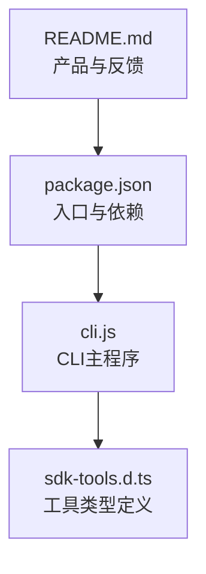
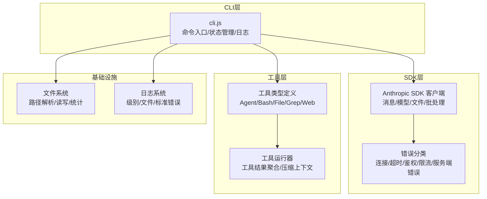
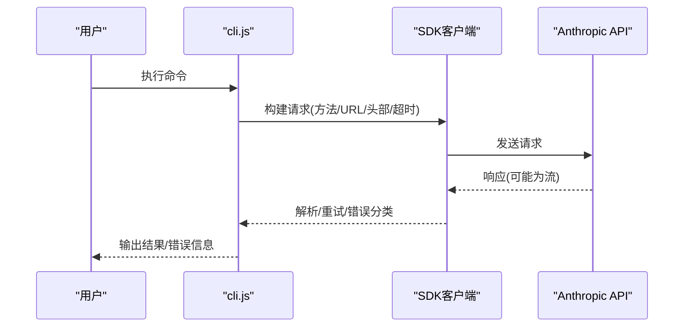
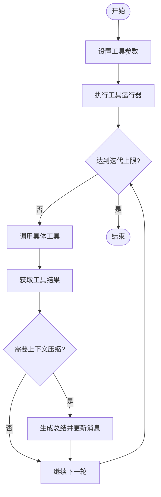
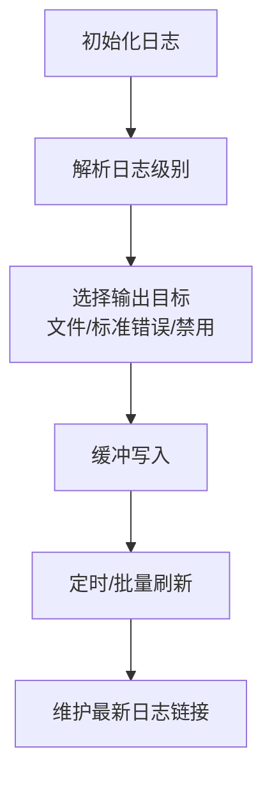
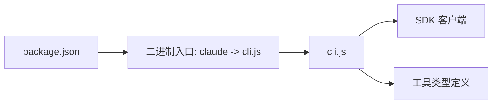

# 故障排除

<cite>
**本文档引用的文件**
- [README.md](file://README.md)
- [package.json](file://package.json)
- [cli.js](file://cli.js)
- [sdk-tools.d.ts](file://sdk-tools.d.ts)
</cite>

## 目录
1. [简介](#简介)
2. [项目结构](#项目结构)
3. [核心组件](#核心组件)
4. [架构总览](#架构总览)
5. [详细组件分析](#详细组件分析)
6. [依赖关系分析](#依赖关系分析)
7. [性能考虑](#性能考虑)
8. [故障排除指南](#故障排除指南)
9. [结论](#结论)
10. [附录](#附录)

## 简介
本指南面向使用 Claude Code 的开发者与用户，提供系统化的故障排除方法，覆盖安装问题、启动失败、功能异常、网络连接问题、权限问题、配置错误、性能问题以及紧急数据恢复与系统修复建议。文档基于仓库中的 CLI 入口、工具类型定义与包元信息进行分析，帮助快速定位与解决问题。

## 项目结构
该仓库包含以下关键文件：
- README.md：产品介绍、安装与反馈渠道
- package.json：包元信息、二进制入口、引擎版本与可选依赖
- cli.js：CLI 主程序（含 SDK 客户端、日志、网络请求、工具执行等）
- sdk-tools.d.ts：工具输入输出的 TypeScript 类型定义

**图表来源**
- [README.md](file://README.md)
- [package.json](file://package.json)
- [cli.js](file://cli.js)
- [sdk-tools.d.ts](file://sdk-tools.d.ts)

**章节来源**
- [README.md](file://README.md)
- [package.json](file://package.json)

## 核心组件
- CLI 入口与运行时
  - 二进制入口为 claude，指向 cli.js
  - Node.js 引擎要求 >= 18
- SDK 客户端
  - 内置 Anthropic SDK 客户端，负责消息、模型、文件等 API 调用
  - 支持流式响应、重试、超时、头部校验与错误分类
- 工具系统
  - 通过工具类型定义描述 Agent、Bash、FileRead/Write、Grep、WebFetch/Search、AskUserQuestion 等工具的输入输出
- 日志与调试
  - 支持调试日志级别、调试文件输出、调试到标准错误、调试目录与最新链接
- 文件系统与路径解析
  - 提供安全的路径解析、符号链接处理、文件读写与统计

**章节来源**
- [package.json](file://package.json)
- [cli.js](file://cli.js)
- [sdk-tools.d.ts](file://sdk-tools.d.ts)

## 架构总览
下图展示 CLI 启动后与 SDK、工具系统、日志与文件系统的交互关系：

**图表来源**
- [cli.js](file://cli.js)
- [sdk-tools.d.ts](file://sdk-tools.d.ts)

## 详细组件分析

### 组件A：SDK 客户端与错误处理
- 功能要点
  - 请求构建：URL 拼接、查询参数、默认头部、鉴权头生成
  - 流式响应：支持 SSE/ReadableStream 解析与迭代
  - 重试机制：基于响应头与状态码判断是否重试，指数退避与随机抖动
  - 错误分类：连接错误、超时、鉴权失败、速率限制、服务端错误等
- 关键行为
  - 非流式请求超时计算与长请求提示
  - 头部校验：必须提供 API Key 或 Bearer Token，或显式省略
  - 请求日志：包含请求 ID、耗时、状态码、响应体摘要

**图表来源**
- [cli.js](file://cli.js)

**章节来源**
- [cli.js](file://cli.js)

### 组件B：工具系统与工具运行器
- 功能要点
  - 工具类型定义：Agent、Bash、FileRead/Write、Grep、WebFetch/Search、AskUserQuestion 等
  - 工具运行器：自动调用工具、聚合工具结果、在需要时触发消息压缩（上下文紧凑）
- 关键行为
  - 工具输入输出结构化，支持 JSON 解析与错误包装
  - 迭代执行与最大迭代次数控制
  - 在达到阈值时触发“总结”以减少上下文长度

**图表来源**
- [cli.js](file://cli.js)
- [sdk-tools.d.ts](file://sdk-tools.d.ts)

**章节来源**
- [cli.js](file://cli.js)
- [sdk-tools.d.ts](file://sdk-tools.d.ts)

### 组件C：日志系统与调试
- 功能要点
  - 支持 verbose/debug/info/warn/error 级别
  - 可输出到文件（按会话命名）、标准错误或禁用
  - 支持环境变量与命令行参数控制
- 关键行为
  - 自动维护 latest 链接
  - 缓冲写入与异步刷新
  - 与调试开关联动（如 DEBUG、DEBUG_SDK、--debug、--debug-file）

**图表来源**
- [cli.js](file://cli.js)

**章节来源**
- [cli.js](file://cli.js)

### 组件D：文件系统与路径解析
- 功能要点
  - 安全路径解析：处理符号链接、相对路径、绝对路径与根目录
  - 文件读写：支持字节读取、追加、复制、链接、软硬链接
  - 目录操作：递归创建、删除、重命名、空目录检测
- 关键行为
  - 跨平台路径规范化（NFC）
  - 对 FIFO、Socket、字符/块设备跳过处理
  - 读取大文件尾部内容与逐行读取

**章节来源**
- [cli.js](file://cli.js)

## 依赖关系分析
- 包入口与运行时
  - 二进制入口 claude 指向 cli.js
  - Node.js 引擎要求 >= 18
  - 可选依赖包含多平台 sharp 图像库，用于图片处理能力
- CLI 与 SDK
  - CLI 内置 SDK 客户端，负责与 Anthropic API 通信
- CLI 与工具系统
  - 通过工具类型定义与工具运行器协作完成任务编排

**图表来源**
- [package.json](file://package.json)
- [cli.js](file://cli.js)
- [sdk-tools.d.ts](file://sdk-tools.d.ts)

**章节来源**
- [package.json](file://package.json)
- [cli.js](file://cli.js)
- [sdk-tools.d.ts](file://sdk-tools.d.ts)

## 性能考虑
- 超时与长请求
  - 非流式请求存在最大耗时限制，超过需改用流式
  - 长请求场景建议使用流式接口
- 重试策略
  - 基于响应头与状态码决定是否重试
  - 指数退避 + 随机抖动，避免雪崩
- 日志与 I/O
  - 调试日志启用时建议使用文件输出，避免阻塞标准输出
  - 大文件读取采用分块读取与缓冲刷新策略
- 工具运行器
  - 控制最大迭代次数，避免无限循环
  - 达到阈值时触发上下文压缩，降低后续请求成本

[本节为通用指导，无需特定文件引用]

## 故障排除指南

### 1. 安装与环境问题
- 症状
  - 安装报错或无法运行
- 排查步骤
  - 检查 Node.js 版本是否满足 >= 18
  - 使用全局安装命令验证安装是否成功
  - 若出现 sharp 相关安装失败，确认系统图像库依赖
- 预防措施
  - 升级 Node.js 至推荐版本
  - 在 CI 环境中固定 Node.js 版本与缓存策略

**章节来源**
- [package.json](file://package.json)
- [README.md](file://README.md)

### 2. 启动失败
- 症状
  - 执行 claude 报错或无响应
- 排查步骤
  - 使用 --debug 或 --debug-file 查看调试日志
  - 检查 CLI 是否正确解析工作目录与项目根目录
  - 确认会话 ID 生成与会话状态初始化正常
- 预防措施
  - 在启动前设置必要的环境变量（如 API Key）
  - 使用 --debug-to-stderr 快速定位问题

**章节来源**
- [cli.js](file://cli.js)

### 3. 功能异常（工具执行失败）
- 症状
  - Bash/文件/搜索等工具调用失败
- 排查步骤
  - 查看工具类型定义，确认输入参数格式
  - 检查工具运行器是否达到最大迭代次数
  - 观察是否触发了上下文压缩逻辑
- 预防措施
  - 明确工具输入输出规范，避免非法参数
  - 合理设置迭代上限与上下文阈值

**章节来源**
- [sdk-tools.d.ts](file://sdk-tools.d.ts)
- [cli.js](file://cli.js)

### 4. 网络连接问题
- 症状
  - 请求超时、连接被拒、鉴权失败、429/5xx
- 排查步骤
  - 检查 SDK 的超时与重试配置
  - 确认 API Key 或 Bearer Token 设置正确
  - 分析错误分类：连接错误、超时、鉴权失败、速率限制、服务端错误
- 预防措施
  - 在网络不稳定环境下启用重试
  - 使用流式接口处理长请求
  - 合理设置超时时间与并发度

**章节来源**
- [cli.js](file://cli.js)

### 5. 权限相关问题
- 症状
  - 文件读写失败、目录访问受限
- 排查步骤
  - 检查工作目录与项目根目录解析是否正确
  - 确认符号链接与路径规范化处理
  - 使用最小权限原则，确保对必要路径有读写权限
- 预防措施
  - 在 CI 中预设工作目录与权限
  - 避免在只读文件系统上写入

**章节来源**
- [cli.js](file://cli.js)

### 6. 配置错误
- 症状
  - 未设置 API Key、鉴权头缺失、请求头冲突
- 排查步骤
  - SDK 会在缺少必要认证头时抛出错误
  - 检查环境变量与命令行参数是否正确传入
- 预防措施
  - 在 CI 中统一注入密钥与配置
  - 使用显式省略头的方式避免冲突

**章节来源**
- [cli.js](file://cli.js)

### 7. 日志分析与错误解读
- 症状
  - 不清楚错误来源或上下文
- 排查步骤
  - 启用 --debug 或 --debug-file，查看请求 ID 与响应摘要
  - 使用 --debug-to-stderr 将调试输出到标准错误
  - 结合错误分类快速定位问题类型
- 预防措施
  - 生产环境保留关键日志但避免敏感信息泄露
  - 使用日志轮转与清理策略

**章节来源**
- [cli.js](file://cli.js)

### 8. 性能问题识别与优化
- 症状
  - 响应慢、CPU 占用高、内存增长
- 排查步骤
  - 使用性能标记与报告生成启动性能日志
  - 检查工具运行器迭代次数与上下文压缩触发频率
  - 评估文件读取与日志写入对 I/O 的影响
- 优化建议
  - 启用流式接口与合理的超时设置
  - 控制工具迭代上限，避免冗余调用
  - 减少不必要的日志级别与输出

**章节来源**
- [cli.js](file://cli.js)

### 9. 紧急情况：数据恢复与系统修复
- 数据恢复
  - 使用文件系统工具进行备份与恢复
  - 对关键会话日志与调试文件进行归档
- 系统修复
  - 清理无效的会话状态与临时文件
  - 重新初始化 CLI 状态（如会话 ID、计数器等）
  - 检查并修复权限与路径问题

**章节来源**
- [cli.js](file://cli.js)

## 结论
本指南提供了从安装、启动、功能、网络、权限、配置到性能与紧急修复的系统化故障排除方法。建议在日常使用中开启调试日志、合理设置超时与重试、遵循最小权限原则，并定期备份关键数据与日志，以便快速定位与解决问题。

## 附录
- 社区支持与问题报告
  - 使用内置 /bug 命令或在 GitHub 提交 Issue
  - 加入 Claude 开发者 Discord 获取帮助与交流

**章节来源**
- [README.md](file://README.md)