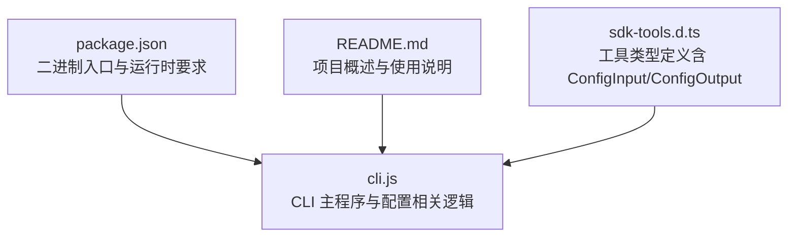
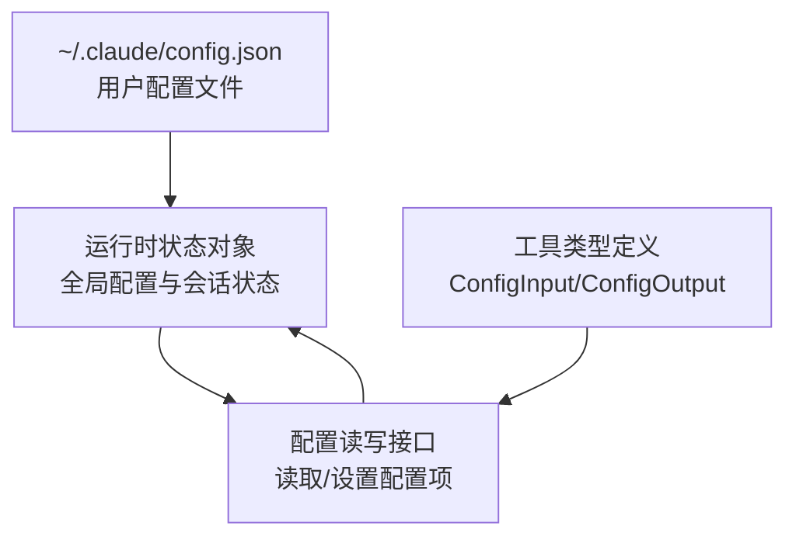
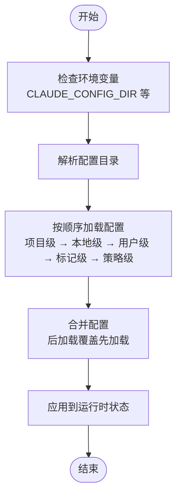
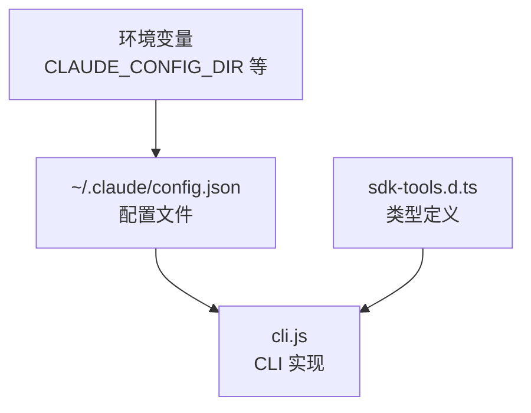

# 用户配置

<cite>
**本文档引用的文件**
- [README.md](file://README.md)
- [package.json](file://package.json)
- [cli.js](file://cli.js)
- [sdk-tools.d.ts](file://sdk-tools.d.ts)
</cite>

## 目录
1. [简介](#简介)
2. [项目结构](#项目结构)
3. [核心组件](#核心组件)
4. [架构总览](#架构总览)
5. [详细组件分析](#详细组件分析)
6. [依赖关系分析](#依赖关系分析)
7. [性能考量](#性能考量)
8. [故障排查指南](#故障排查指南)
9. [结论](#结论)
10. [附录](#附录)

## 简介
本文件面向 Claude Code 的用户配置系统，聚焦于用户级配置文件的存储位置、结构与加载顺序，覆盖默认模型设置、工具权限配置、界面偏好与行为参数等。文档同时阐述配置的 JSON 格式、字段语义与取值范围，提供完整配置项参考（含必填与可选项），并说明配置验证机制与错误处理策略。此外，还包含配置迁移指南与版本兼容性说明，并给出常见配置场景示例与最佳实践。

## 项目结构
- 包管理与入口
  - 包定义与二进制入口：通过 package.json 指定二进制命令与运行时要求。
  - CLI 入口：二进制命令指向 cli.js，该文件包含完整的 CLI 实现与配置相关逻辑。
- 文档与说明
  - README.md 提供项目概述与使用说明。
  - sdk-tools.d.ts 定义了工具输入输出类型，其中包含 ConfigInput/ConfigOutput 接口，用于理解配置读写交互。

**图表来源**
- [package.json:1-33](file://package.json#L1-L33)
- [cli.js:1-52](file://cli.js#L1-L52)
- [sdk-tools.d.ts:2134-2698](file://sdk-tools.d.ts#L2134-L2698)

**章节来源**
- [package.json:1-33](file://package.json#L1-L33)
- [README.md:1-44](file://README.md#L1-L44)
- [sdk-tools.d.ts:2134-2698](file://sdk-tools.d.ts#L2134-L2698)

## 核心组件
- 配置文件位置与命名
  - 默认路径：用户主目录下的隐藏目录 ~/.claude/config.json。
  - 作用域：用户级配置，优先级高于项目级或本地级配置。
- 配置加载顺序（从低到高）
  1) 项目级配置（projectSettings）
  2) 本地级配置（localSettings）
  3) 用户级配置（userSettings）
  4) 标记级配置（flagSettings）
  5) 策略级配置（policySettings）
- 配置项类型与用途
  - 模型设置：默认模型、主循环模型覆盖、初始主循环模型、模型字符串等。
  - 权限控制：权限模式、工具使用许可、旁路权限模式等。
  - 行为参数：思考配置（如自适应思考）、计划/自动模式切换、快速模式头等。
  - 界面与体验：主题、问题预览格式、事件日志、指标记录器等。
  - 调试与诊断：调试日志级别、调试文件输出、启动性能报告等。
  - 会话与上下文：会话 ID、父会话 ID、会话来源、工作目录、项目根目录等。
  - 工具与插件：内联插件、MCP 服务器、技能与代理定义等。
  - 统计与计量：令牌用量、成本统计、工具耗时、慢操作记录等。

**章节来源**
- [cli.js:16000-16445](file://cli.js#L16000-L16445)

## 架构总览
用户配置系统围绕“配置文件 + 运行时状态 + 工具类型”展开，形成如下交互：

**图表来源**
- [cli.js:16000-16445](file://cli.js#L16000-L16445)
- [sdk-tools.d.ts:2134-2698](file://sdk-tools.d.ts#L2134-L2698)

## 详细组件分析

### 配置文件位置与加载顺序
- 位置
  - 默认用户配置目录：~/.claude
  - 配置文件：config.json
- 加载顺序
  - 项目级 → 本地级 → 用户级 → 标记级 → 策略级
  - 后加载的配置会覆盖先前的同名键值
- 关键环境变量
  - CLAUDE_CONFIG_DIR：可覆盖默认配置目录
  - CLAUDE_CODE_DEBUG_LOGS_DIR：可覆盖调试日志输出目录
  - DEBUG/DEBUG_SDK/--debug/--debug-file 等：控制调试输出与文件落盘

**图表来源**
- [cli.js:16000-16445](file://cli.js#L16000-L16445)

**章节来源**
- [cli.js:16000-16445](file://cli.js#L16000-L16445)

### 配置项参考（按类别）

- 模型与推理
  - modelStrings：模型字符串集合
  - initialMainLoopModel：初始主循环模型
  - mainLoopModelOverride：主循环模型覆盖
  - modelUsage：各模型用量统计
  - hasUnknownModelCost：是否未知模型成本
  - strictToolResultPairing：严格工具结果配对
  - sdkAgentProgressSummariesEnabled：启用代理进度摘要
  - thinking 配置：自适应/禁用/启用等
- 权限与安全
  - permissions.defaultMode：默认权限模式
  - allowedSettingSources：允许的设置来源列表
  - sessionBypassPermissionsMode：会话旁路权限模式
  - inlinePlugins：内联插件列表
  - useCoworkPlugins：是否使用协作插件
- 界面与体验
  - theme：界面主题
  - questionPreviewFormat：问题预览格式
  - agentColorMap：代理颜色映射
  - lspRecommendationShownThisSession：LSP 建议是否已展示
- 会话与上下文
  - sessionId：会话 ID
  - parentSessionId：父会话 ID
  - sessionSource：会话来源
  - cwd/projectRoot/originalCwd：工作目录与项目根目录
  - sessionProjectDir：会话项目目录
- 工具与插件
  - mcp 服务器配置与状态
  - 技能与代理定义
  - 工具选择与执行统计
- 统计与计量
  - totalCostUSD、totalAPIDuration、totalToolDuration
  - totalLinesAdded/Removed、modelUsage 细项
  - tokenCounter、costCounter、activeTimeCounter 等
- 调试与诊断
  - debug 日志级别与文件输出
  - 启动性能报告与内存占用
  - 慢操作记录与事件日志

**章节来源**
- [cli.js:16000-16445](file://cli.js#L16000-L16445)

### 配置验证与错误处理
- 验证机制
  - 类型校验：确保数值、布尔、字符串等字段类型正确
  - 取值范围：整数必须为非负；枚举值需在允许范围内
  - JSON 解析：对字符串进行 JSON.parse 并捕获异常
  - 空对象与空值：对空对象与空值进行特殊处理
- 错误处理
  - 配置解析错误：抛出 ConfigParseError，包含文件路径与默认配置
  - 文件系统错误：根据错误码区分 ENOENT/EACCES/EPERM/ENOTDIR/ELOOP 等
  - 网络与超时：连接错误、超时错误、重试策略
  - 工具错误：ToolError 封装工具调用失败内容
- 典型错误场景
  - 配置文件格式不合法
  - 权限不足导致无法读取/写入配置
  - 环境变量格式错误（如 -e 参数）

**章节来源**
- [cli.js:16000-16445](file://cli.js#L16000-L16445)

### 配置迁移与版本兼容
- 版本兼容
  - 不同版本间配置字段可能调整，建议保留备份后再升级
  - 对于弃用模型与功能，CLI 会在创建消息时发出警告
- 迁移示例
  - opus/sonnet 模型迁移：将旧模型名迁移到新模型名或对应变体
  - 自动更新策略迁移：将自动更新偏好迁移到用户设置并设置环境变量
  - MCP 服务器批准字段迁移：将 enableAllProjectMcpServers、enabledMcpjsonServers、disabledMcpjsonServers 等字段迁移到 localSettings
- 迁移流程
  - 备份现有配置
  - 升级 CLI
  - 执行迁移脚本或手动调整
  - 验证配置生效与功能正常

**章节来源**
- [cli.js:16000-16445](file://cli.js#L16000-L16445)

### 常见配置场景与最佳实践
- 场景一：设置默认模型
  - 在用户配置中设置 model 字段为期望的模型标识
  - 如需临时覆盖，使用 mainLoopModelOverride 或 initialMainLoopModel
- 场景二：开启自适应思考
  - 设置 thinking.type 为 adaptive
  - 注意：某些模型组合下可能有性能影响，建议在测试环境中评估
- 场景三：配置 MCP 服务器
  - 使用 mcp add 命令添加服务器，指定传输方式（stdio/sse/http）
  - 对于需要认证的服务器，使用 --client-id/--client-secret 或回调端口
- 场景四：启用调试与性能分析
  - 使用 --debug/--debug-file 输出调试日志
  - 启动性能报告可用于定位启动瓶颈
- 最佳实践
  - 保持配置文件最小化，仅设置必要项
  - 使用标记级配置进行临时覆盖，避免永久修改用户配置
  - 定期备份配置，以便回滚
  - 在团队共享项目时，优先使用项目级或本地级配置，减少对用户级配置的依赖

**章节来源**
- [cli.js:16000-16445](file://cli.js#L16000-L16445)

## 依赖关系分析
- CLI 与配置
  - CLI 通过运行时状态对象统一管理配置，配置变更通过状态更新传播到各模块
- 类型与配置
  - sdk-tools.d.ts 中的 ConfigInput/ConfigOutput 接口定义了配置读写的契约，CLI 实现遵循该契约
- 环境变量与配置
  - CLAUDE_CONFIG_DIR 等环境变量影响配置文件位置解析
  - 调试相关环境变量影响日志输出与文件落盘

**图表来源**
- [cli.js:16000-16445](file://cli.js#L16000-L16445)
- [sdk-tools.d.ts:2134-2698](file://sdk-tools.d.ts#L2134-L2698)

**章节来源**
- [cli.js:16000-16445](file://cli.js#L16000-L16445)
- [sdk-tools.d.ts:2134-2698](file://sdk-tools.d.ts#L2134-L2698)

## 性能考量
- 配置读取与合并
  - 采用顺序加载与覆盖策略，避免重复解析
  - 对大配置文件建议分块读取与增量合并
- 日志与调试
  - 调试日志可能带来 I/O 开销，建议在生产环境关闭或降低级别
  - 启动性能报告有助于识别瓶颈，但频繁生成会影响启动时间
- 工具与插件
  - MCP 服务器与插件数量增加会提升初始化与运行时开销
  - 合理配置 inlinePlugins 与 useCoworkPlugins，避免不必要的加载

[本节为通用指导，无需具体文件分析]

## 故障排查指南
- 配置文件无法读取
  - 检查 CLAUDE_CONFIG_DIR 是否正确
  - 确认文件权限与路径是否存在
- 配置项无效
  - 检查字段类型与取值范围
  - 查看 CLI 输出的警告与错误信息
- MCP 服务器连接失败
  - 检查传输方式与认证参数
  - 使用调试日志定位网络问题
- 性能问题
  - 关闭调试或降低日志级别
  - 分析启动性能报告，优化初始化流程

**章节来源**
- [cli.js:16000-16445](file://cli.js#L16000-L16445)

## 结论
用户配置系统通过明确的文件位置、清晰的加载顺序与严格的类型验证，为 Claude Code 提供了稳定可靠的用户级配置能力。结合迁移指南与最佳实践，用户可以在不同版本间平滑过渡，并根据自身需求灵活定制模型、权限、界面与行为参数，从而获得更高效、更可控的开发体验。

[本节为总结性内容，无需具体文件分析]

## 附录
- 相关文件
  - package.json：包定义与二进制入口
  - README.md：项目概述与使用说明
  - cli.js：CLI 实现与配置相关逻辑
  - sdk-tools.d.ts：工具类型定义（含 ConfigInput/ConfigOutput）

**章节来源**
- [package.json:1-33](file://package.json#L1-L33)
- [README.md:1-44](file://README.md#L1-L44)
- [cli.js:16000-16445](file://cli.js#L16000-L16445)
- [sdk-tools.d.ts:2134-2698](file://sdk-tools.d.ts#L2134-L2698)