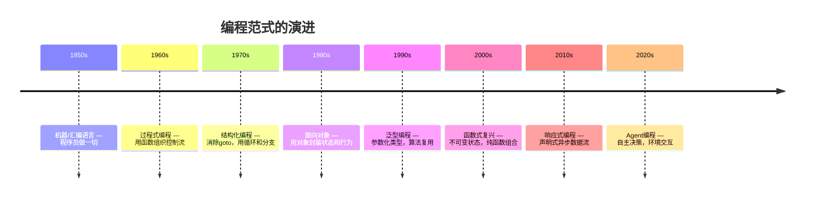
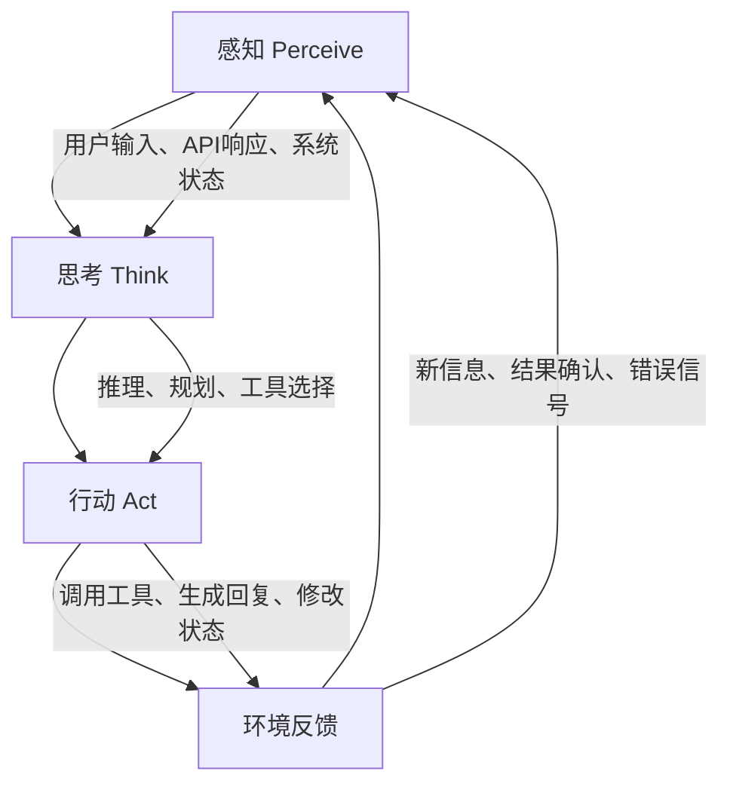
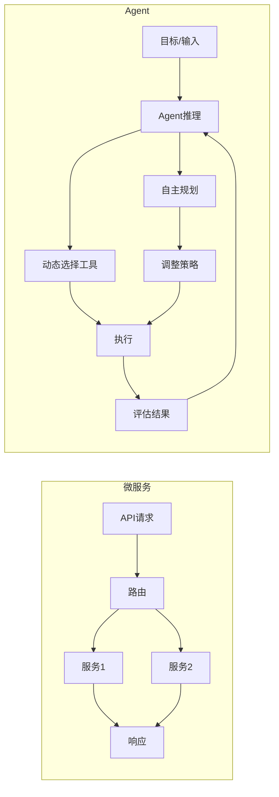

# 第3章：Agent编程范式

## 概述

如果说面向对象编程（OOP）教会了我们用"对象"来组织代码，函数式编程（FP）教会了我们用"纯函数"来管理副作用，那么 Agent 编程则代表了一种全新的思维范式——**让程序拥有自主决策和与环境交互的能力**。本章将深入探讨 Agent 编程范式的本质，从编程范式的历史演变出发，剖析 Agent 编程与传统范式的根本区别，并系统地介绍 Agent 编程的核心抽象、设计原则和实践方法。

读完本章，你将理解：Agent 编程为何不同于你之前接触过的任何编程范式；如何用感知-思考-行动（Perceive-Think-Act）的循环来组织 Agent 逻辑；以及在实际项目中如何选择合适的编程语言和框架来实现 Agent 系统。

## 3.1 从函数式到 Agent式：编程范式的演变

### 3.1.1 范式演进的驱动力

编程范式（Programming Paradigm）不是凭空产生的，而是对不断增长的软件复杂度的回应。每一次范式跃迁，都伴随着对"谁来做决策"这个根本问题的重新回答。



**过程式编程**的核心理念是"按照步骤来"：先做A，再做B，条件C成立就做D。程序员完全控制每一步的执行顺序。

**面向对象编程**将数据和操作封装在对象中，通过消息传递实现对象间协作。对象拥有了"行为"，但仍然是程序员预先定义好的——对象不会"思考"。

**函数式编程**追求纯函数和不可变状态，通过函数组合构建复杂逻辑。它解决了并发状态管理的问题，但函数本身不会主动"决定"做什么。

**Agent 编程**引入了一个根本性的变化：**决策权从程序员转移到了程序本身**。程序不再是被动执行指令的工具，而是能够根据环境状态、目标函数和可用工具，自主决定下一步行动的智能实体。

### 3.1.2 Agent范式的独特特征

Agent 编程与之前所有范式的核心区别可以总结为三个关键词：**自主性（Autonomy）**、**目标导向（Goal-orientation）**和**环境交互（Environmental Interaction）**。

| 特征 | 传统编程 | Agent编程 |
|------|---------|----------|
| 决策者 | 程序员（硬编码） | Agent（运行时推理） |
| 控制流 | 预定义（if/else、循环） | 动态生成（LLM推理） |
| 行为确定性 | 确定性（相同输入→相同输出） | 非确定性（可能选择不同策略） |
| 错误处理 | 异常捕获、错误码 | 自我反思、策略调整 |
| 扩展方式 | 修改代码 | 添加工具/提示词 |
| 环境感知 | 无（或有限） | 持续感知并响应变化 |

```python
# 传统编程：硬编码决策
def process_user_query(query: str) -> str:
    if "天气" in query:
        return weather_api.get_weather(query)
    elif "翻译" in query:
        return translate_api.translate(query)
    else:
        return "抱歉，我不理解你的问题。"

# Agent编程：自主决策
async def agent_process(query: str, agent: Agent) -> str:
    # Agent自行分析意图、选择工具、规划步骤
    plan = await agent.plan(query)          # 感知 + 思考
    results = await agent.execute(plan)      # 行动
    return await agent.synthesize(results)   # 综合输出
```

### 3.1.3 为什么现在需要Agent范式

Agent 编程并非突然出现，而是技术积累到一定程度的自然产物：

1. **LLM 推理能力**：GPT-4、Claude 等模型具备了足够的理解和推理能力，可以作为 Agent 的"大脑"
2. **工具调用标准化**：Function Calling / Tool Use 协议的普及，使 LLM 能可靠地与外部系统交互
3. **基础设施成熟**：向量数据库、API 网关、云服务等基础设施完善，为 Agent 提供了丰富的"感官"和"工具"
4. **复杂任务需求**：传统编程在处理开放式、多步骤、需要判断力的任务时力不从心

## 3.2 Agent编程的核心要素

### 3.2.1 感知-思考-行动循环

Agent 编程的基石是 **Perceive-Think-Act（PTA）循环**，它与军事领域的 OODA Loop（Observe-Orient-Decide-Act）有异曲同工之妙。



```python
from dataclasses import dataclass
from typing import Protocol, Any
from abc import ABC, abstractmethod

@dataclass
class Perception:
    """感知数据：Agent从环境中获取的信息"""
    user_input: str
    context: dict[str, Any]
    history: list[dict[str, str]]
    available_tools: list[str]

@dataclass
class Thought:
    """思考结果：Agent的推理和规划"""
    reasoning: str           # 推理过程
    plan: list[str]          # 行动计划
    tool_calls: list[dict]   # 工具调用决策

@dataclass
class Action:
    """行动：Agent执行的具体操作"""
    tool_name: str
    tool_args: dict[str, Any]
    expected_outcome: str

class AgentLoop(ABC):
    """Agent核心循环"""
    
    def __init__(self, max_iterations: int = 10):
        self.max_iterations = max_iterations
    
    async def run(self, user_input: str) -> str:
        """主循环：感知→思考→行动→反馈"""
        perception = await self.perceive(user_input)
        
        for i in range(self.max_iterations):
            thought = await self.think(perception)
            
            if thought.is_final_answer:
                return thought.final_answer
            
            action = await self.plan_action(thought)
            result = await self.act(action)
            perception = await self.update_perception(perception, result)
        
        return "抱歉，我无法在限定步骤内完成任务。"
    
    @abstractmethod
    async def perceive(self, input_data: str) -> Perception:
        """感知：收集和整理环境信息"""
        ...
    
    @abstractmethod
    async def think(self, perception: Perception) -> Thought:
        """思考：推理和规划"""
        ...
    
    @abstractmethod
    async def act(self, action: Action) -> dict:
        """行动：执行工具调用"""
        ...
```

### 3.2.2 目标函数与奖励信号

与传统程序的"输入-处理-输出"不同，Agent 需要一个**目标函数（Objective Function）**来指导其行为。目标可以是显式的（用户指令），也可以是隐式的（系统优化目标）。

```python
from enum import Enum
from typing import Callable

class GoalType(Enum):
    TASK_COMPLETE = "task_complete"       # 完成指定任务
    MAXIMIZE_SCORE = "maximize_score"     # 最大化某个分数
    MINIMIZE_COST = "minimize_cost"       # 最小化成本
    MAINTAIN_STATE = "maintain_state"     # 维持某个状态

@dataclass
class AgentGoal:
    """Agent的目标定义"""
    description: str                   # 目标描述（自然语言）
    goal_type: GoalType                # 目标类型
    success_criteria: Callable         # 成功判断函数
    max_steps: int = 20                # 最大步骤
    budget: dict[str, float] | None = None  # 资源预算（token、时间等）
    
    def is_achieved(self, state: dict) -> bool:
        return self.success_criteria(state)

# 示例：定义一个数据分析Agent的目标
data_analysis_goal = AgentGoal(
    description="分析销售数据，找出Top3产品并生成报告",
    goal_type=GoalType.TASK_COMPLETE,
    success_criteria=lambda s: (
        s.get("top_products_count", 0) >= 3 and
        s.get("report_generated", False) is True
    ),
    max_steps=15,
    budget={"max_tokens": 50000, "max_time_seconds": 120}
)
```

### 3.2.3 反馈循环与自我修正

Agent 编程区别于传统编程的一个重要特征是**内置的反馈循环**。Agent 不仅执行操作，还会评估操作结果，并根据反馈调整策略。

```python
class SelfReflectiveAgent:
    """具备自我反思能力的Agent"""
    
    async def execute_with_reflection(
        self, 
        task: str,
        max_retries: int = 3
    ) -> str:
        for attempt in range(max_retries):
            # 执行任务
            result = await self.execute_task(task)
            
            # 自我评估
            evaluation = await self.self_evaluate(task, result)
            
            if evaluation.score >= 0.8:
                return result  # 质量达标
            
            # 根据评估反馈修正
            feedback = evaluation.feedback
            task = self.revise_approach(task, feedback)
            
            print(f"尝试 {attempt + 1} 质量不达标（分数: {evaluation.score}），修正中...")
        
        return result  # 返回最后结果并标注质量警告
    
    async def self_evaluate(self, task: str, result: str) -> Evaluation:
        """让Agent评估自己的输出质量"""
        prompt = f"""
        任务: {task}
        结果: {result}
        
        请评估以上结果的完成度和质量，给出：
        1. 完成度分数 (0-1)
        2. 质量分数 (0-1)  
        3. 改进建议
        """
        return await self.llm.evaluate(prompt)
```

## 3.3 声明式 vs 命令式 Agent 编程

### 3.3.1 两种风格对比

Agent 编程存在两种主要风格，类似于传统编程中的声明式与命令式之分：

**命令式 Agent 编程**：明确指定 Agent 的每一步操作，类似于编写详细的操作手册。

```python
# 命令式：精确控制每一步
async def imperative_search_agent(query: str):
    # 步骤1：调用搜索API
    search_results = await search_tool.search(query)
    
    # 步骤2：提取前5条结果
    top_results = search_results[:5]
    
    # 步骤3：逐一访问网页
    contents = []
    for url in top_results:
        content = await web_tool.scrape(url)
        contents.append(content)
    
    # 步骤4：综合回答
    answer = await llm.summarize(query, contents)
    return answer
```

**声明式 Agent 编程**：描述目标和约束，让 Agent 自主规划执行路径。

```python
# 声明式：描述目标和约束
search_agent = Agent(
    name="research_assistant",
    goal="帮用户深入研究问题，提供全面的答案",
    tools=[search_tool, web_tool, summarizer],
    constraints=[
        "至少引用3个来源",
        "信息必须来自可信来源",
        "回答要结构化、有引用"
    ],
    planning_strategy="plan_and_execute"  # Agent自主规划
)

result = await search_agent.run("什么是量子计算？")
```

### 3.3.2 各自的适用场景

| 场景 | 推荐风格 | 原因 |
|------|---------|------|
| 简单、确定性任务 | 命令式 | 步骤固定，不需要推理 |
| 关键业务流程 | 命令式 | 需要精确控制，降低风险 |
| 开放式探索任务 | 声明式 | 需要灵活性和创造力 |
| 复杂多步骤任务 | 声明式 | 步骤组合空间大，人工规划成本高 |
| 快速原型 | 声明式 | 开发效率高 |
| 生产环境 | 混合式 | 关键路径命令式，辅助路径声明式 |

### 3.3.3 混合式：渐进式自主

在实际项目中，最常见的是混合式——**渐进式自主（Progressive Autonomy）**：核心流程用命令式确保可靠性，非核心环节让 Agent 自主决策。

```python
class HybridAgent:
    """混合式Agent：关键步骤命令式，其余声明式"""
    
    def __init__(self):
        self.mandatory_steps = [
            ("validate_input", self.validate),
            ("execute_core_logic", self.core_logic),
            ("format_output", self.format),
        ]
        self.autonomous_agent = Agent(
            tools=[db_tool, api_tool, calc_tool],
            strategy="react"
        )
    
    async def run(self, task: str) -> str:
        # 命令式：验证输入
        validated = await self.validate(task)
        
        # 声明式：Agent自主完成核心任务
        result = await self.autonomous_agent.run(
            f"完成以下任务：{validated}\n"
            f"约束：{validated.constraints}"
        )
        
        # 命令式：格式化输出
        return await self.format(result)
```

## 3.4 事件驱动与响应式 Agent

### 3.4.1 事件驱动架构在 Agent 中的角色

事件驱动架构（EDA）与 Agent 编程天然契合——Agent 需要对环境变化做出实时响应，而事件正是环境变化的载体。

```python
import asyncio
from datetime import datetime
from typing import Any

class Event:
    def __init__(self, type: str, data: Any, source: str):
        self.type = type
        self.data = data
        self.source = source
        self.timestamp = datetime.now()

class EventDrivenAgent:
    """事件驱动的Agent"""
    
    def __init__(self):
        self.event_queue: asyncio.Queue[Event] = asyncio.Queue()
        self.handlers: dict[str, list[Callable]] = {}
        self.state: dict[str, Any] = {}
    
    def on(self, event_type: str, handler: Callable):
        """注册事件处理器"""
        if event_type not in self.handlers:
            self.handlers[event_type] = []
        self.handlers[event_type].append(handler)
    
    async def emit(self, event: Event):
        """发射事件"""
        await self.event_queue.put(event)
    
    async def event_loop(self):
        """事件处理主循环"""
        while True:
            event = await self.event_queue.get()
            handlers = self.handlers.get(event.type, [])
            for handler in handlers:
                await handler(self, event)

# 使用示例
agent = EventDrivenAgent()

@agent.on("user_message")
async def handle_message(agent: EventDrivenAgent, event: Event):
    """处理用户消息"""
    response = await agent.process_message(event.data)
    await agent.emit(Event("send_response", response, "agent"))

@agent.on("schedule_reminder")
async def handle_reminder(agent: EventDrivenAgent, event: Event):
    """处理定时提醒"""
    # 等待到指定时间后触发
    await asyncio.sleep(event.data["delay_seconds"])
    await agent.emit(Event("notification", 
        f"提醒：{event.data['message']}", "scheduler"))
```

### 3.4.2 Reactive Agent vs Proactive Agent

Agent 按行为模式可分为两种：

- **Reactive Agent（反应式）**：被动等待事件触发，类似事件监听器
- **Proactive Agent（主动式）**：主动发起行动，持续朝目标推进

```python
class ReactiveAgent:
    """反应式Agent：被动响应"""
    
    async def run(self):
        while True:
            event = await self.wait_for_event()  # 阻塞等待
            response = await self.handle(event)
            await self.send(response)

class ProactiveAgent:
    """主动式Agent：持续朝目标推进"""
    
    async def run(self):
        goal = self.load_goal()
        while not goal.is_achieved(self.state):
            # 主动感知环境
            situation = await self.assess_environment()
            
            # 主动规划下一步
            next_action = await self.plan_next(situation, goal)
            
            # 主动执行
            await self.execute(next_action)
            
            # 短暂等待，避免忙等
            await asyncio.sleep(self.poll_interval)

class HybridEventAgent:
    """混合型Agent：同时支持主动和被动"""
    
    async def run(self):
        active_goal = self.get_active_goal()
        
        while True:
            # 使用wait_for实现主动轮询 + 被动响应
            done, pending = await asyncio.wait(
                [self.poll_environment(), self.wait_for_event()],
                timeout=self.poll_interval,
                return_when=asyncio.FIRST_COMPLETED
            )
            
            for task in done:
                result = task.result()
                await self.handle_result(result, active_goal)
```

## 3.5 Agent编程的核心抽象

Agent 编程有三个核心抽象概念：**工具（Tool）**、**记忆（Memory）** 和 **规划器（Planner）**。它们共同构成了 Agent 的"手脚"、"大脑"和"智慧"。

### 3.5.1 Tool抽象

工具是 Agent 与外部世界交互的接口。在 Agent 编程范式中，工具不是简单的函数调用，而是一个带有丰富元数据的抽象。

```python
from pydantic import BaseModel, Field
from typing import Any, TypeVar, Generic

T = TypeVar('T')

class ToolParameter(BaseModel):
    """工具参数定义"""
    name: str
    type: str
    description: str
    required: bool = True
    default: Any = None
    enum: list[str] | None = None  # 枚举值约束

class ToolResult(BaseModel):
    """工具执行结果"""
    success: bool
    data: Any
    error: str | None = None
    metadata: dict[str, Any] = {}  # token消耗、执行时间等

class Tool(Generic[T]):
    """工具抽象基类"""
    
    def __init__(self, name: str, description: str):
        self.name = name
        self.description = description
        self.parameters: list[ToolParameter] = []
    
    def param(self, name: str, type: str, description: str, 
              required: bool = True, **kwargs) -> 'Tool':
        """链式定义参数"""
        self.parameters.append(ToolParameter(
            name=name, type=type, description=description, **kwargs
        ))
        return self
    
    @abstractmethod
    async def execute(self, **kwargs) -> ToolResult:
        """执行工具"""
        ...
    
    def to_schema(self) -> dict:
        """转换为LLM Function Calling格式"""
        return {
            "type": "function",
            "function": {
                "name": self.name,
                "description": self.description,
                "parameters": {
                    "type": "object",
                    "properties": {
                        p.name: {"type": p.type, "description": p.description}
                        for p in self.parameters
                    },
                    "required": [p.name for p in self.parameters if p.required]
                }
            }
        }

# 使用示例
search_tool = Tool("web_search", "搜索互联网获取最新信息") \
    .param("query", "string", "搜索关键词") \
    .param("num_results", "integer", "返回结果数量", required=False, default=5)

async def search_execute(**kwargs) -> ToolResult:
    results = await search_api(kwargs["query"], kwargs.get("num_results", 5))
    return ToolResult(success=True, data=results)

search_tool.execute = search_execute
```

### 3.5.2 Memory抽象

记忆是 Agent 保持上下文连续性的关键。Agent 的记忆分为短期和长期两个层次。

```python
from dataclasses import dataclass, field
from datetime import datetime
import json

@dataclass
class MemoryEntry:
    content: str
    timestamp: datetime
    importance: float = 0.5  # 重要性评分 0-1
    tags: list[str] = field(default_factory=list)
    metadata: dict = field(default_factory=dict)

class AgentMemory:
    """Agent记忆系统"""
    
    def __init__(self, short_term_limit: int = 20, 
                 long_term_db: Any = None):
        self.short_term: list[MemoryEntry] = []  # 短期记忆（对话历史）
        self.long_term = long_term_db             # 长期记忆（向量数据库）
        self.short_term_limit = short_term_limit
    
    def add(self, content: str, importance: float = 0.5,
            tags: list[str] | None = None) -> MemoryEntry:
        """添加记忆"""
        entry = MemoryEntry(
            content=content,
            timestamp=datetime.now(),
            importance=importance,
            tags=tags or []
        )
        
        # 短期记忆直接添加
        self.short_term.append(entry)
        
        # 重要记忆存入长期存储
        if importance > 0.7 and self.long_term:
            self.long_term.store(entry)
        
        return entry
    
    def get_context(self, max_tokens: int = 4000) -> str:
        """获取上下文（智能裁剪）"""
        # 按重要性和时间综合排序
        scored = [
            (entry, self._relevance_score(entry))
            for entry in self.short_term
        ]
        scored.sort(key=lambda x: x[1], reverse=True)
        
        context_parts = []
        total_tokens = 0
        for entry, score in scored:
            tokens = len(entry.content) // 2  # 粗略估算
            if total_tokens + tokens > max_tokens:
                break
            context_parts.append(entry.content)
            total_tokens += tokens
        
        return "\n".join(context_parts)
    
    async def recall(self, query: str, top_k: int = 5) -> list[MemoryEntry]:
        """从长期记忆中检索相关内容"""
        if not self.long_term:
            return []
        return await self.long_term.search(query, top_k=top_k)
    
    def _relevance_score(self, entry: MemoryEntry) -> float:
        """综合评分：时间衰减 + 重要性"""
        age_hours = (datetime.now() - entry.timestamp).total_seconds() / 3600
        time_decay = 1.0 / (1.0 + age_hours * 0.1)
        return entry.importance * time_decay
```

### 3.5.3 Planner抽象

规划器是 Agent 的"战略大脑"，负责将高层目标分解为可执行步骤。

```python
from enum import Enum

class PlanningStrategy(Enum):
    REACT = "react"                    # 边思考边行动
    PLAN_AND_EXECUTE = "plan_execute"  # 先规划后执行
    TREE_OF_THOUGHT = "tot"            # 思维树探索
    REFLEXION = "reflexion"            # 带反思的规划

class Planner:
    """规划器抽象"""
    
    def __init__(self, strategy: PlanningStrategy, llm: Any):
        self.strategy = strategy
        self.llm = llm
    
    async def plan(self, task: str, context: dict) -> list[Action]:
        if self.strategy == PlanningStrategy.REACT:
            return await self._react_plan(task, context)
        elif self.strategy == PlanningStrategy.PLAN_AND_EXECUTE:
            return await self._full_plan(task, context)
        elif self.strategy == PlanningStrategy.TREE_OF_THOUGHT:
            return await self._tot_plan(task, context)
        elif self.strategy == PlanningStrategy.REFLEXION:
            return await self._reflexion_plan(task, context)
    
    async def _react_plan(self, task: str, context: dict) -> list[Action]:
        """ReAct: 生成一个下一步行动"""
        prompt = f"""
        任务: {task}
        上下文: {json.dumps(context, ensure_ascii=False)}
        
        请思考下一步应该做什么。回答格式：
        思考: [你的推理]
        行动: [工具名(参数)]
        """
        response = await self.llm.generate(prompt)
        return [self._parse_action(response)]
    
    async def _full_plan(self, task: str, context: dict) -> list[Action]:
        """Plan-and-Execute: 生成完整计划"""
        prompt = f"""
        任务: {task}
        可用工具: {json.dumps(context.get('available_tools', []))}
        
        请制定一个完整的执行计划，分解为具体步骤。
        每一步应指定要调用的工具和参数。
        """
        response = await self.llm.generate(prompt)
        return self._parse_plan(response)
    
    async def _tot_plan(self, task: str, context: dict) -> list[Action]:
        """Tree of Thought: 探索多条推理路径"""
        # 生成多个候选推理路径
        candidates = await self._generate_candidates(task, context, n=3)
        
        # 评估每条路径的可行性
        scored = []
        for candidate in candidates:
            score = await self._evaluate_path(candidate, task)
            scored.append((candidate, score))
        
        # 选择最优路径
        scored.sort(key=lambda x: x[1], reverse=True)
        return scored[0][0]
```

## 3.6 Agent编程与微服务/函数计算的对比

### 3.6.1 核心差异

虽然 Agent 编程与微服务和 Serverless 有相似之处（都是模块化、可组合的），但它们在本质上截然不同。



| 维度 | 微服务 | Serverless | Agent编程 |
|------|--------|-----------|----------|
| **编排方式** | 固定编排（API Gateway） | 事件触发 | 自主决策 |
| **流程确定性** | 高（预定义路由） | 中（事件映射） | 低（动态推理） |
| **扩展方式** | 水平扩展实例 | 自动扩缩容 | 添加工具/知识 |
| **状态管理** | 外部存储（DB/Redis） | 无状态 | 内置记忆系统 |
| **错误处理** | 重试、熔断 | 重试、DLQ | 自我反思、策略调整 |
| **适用场景** | 标准化业务流程 | 事件驱动任务 | 开放式复杂任务 |

### 3.6.2 互补关系

三者并非互斥，而是互补的。在实际架构中：

- **微服务**提供 Agent 的"工具层"——搜索服务、数据分析服务、文件处理服务等
- **Serverless**适合作为 Agent 工具的执行环境——按需调用，成本可控
- **Agent**作为"编排大脑"，智能地组合调用这些服务

```python
# Agent + 微服务 + Serverless 的混合架构
class ProductionAgent:
    def __init__(self):
        # 微服务作为工具
        self.tools = {
            "search": MicroserviceTool("search-service", "/api/search"),
            "analytics": MicroserviceTool("analytics-service", "/api/analyze"),
            "email": MicroserviceTool("notification-service", "/api/send"),
            # Serverless函数作为工具
            "report_gen": ServerlessTool("report-generator", 
                                          provider="aws_lambda"),
            "image_process": ServerlessTool("img-proc",
                                             provider="cloud_functions"),
        }
        self.agent = Agent(tools=self.tools, strategy="react")
```

## 3.7 Agent编程语言与框架的选择

### 3.7.1 语言生态对比

```python
# ===== Python 生态 =====
# LangChain - 最流行的Agent框架
from langchain.agents import create_react_agent, AgentExecutor
from langchain.tools import tool

@tool
def search(query: str) -> str:
    """搜索互联网"""
    return search_api(query)

agent = create_react_agent(llm, [search], prompt)
executor = AgentExecutor(agent=agent, tools=[search])
result = executor.invoke({"input": "查询最新AI新闻"})

# AutoGen - 微软的多Agent框架
import autogen
assistant = autogen.AssistantAgent("assistant", llm_config)
user_proxy = autogen.UserProxyAgent("user_proxy")
user_proxy.initiate_chat(assistant, message="帮我分析数据")
```

```typescript
// ===== TypeScript 生态 =====
// Vercel AI SDK - 轻量级Agent工具
import { generateText, tool } from 'ai';
import { z } from 'zod';

const result = await generateText({
  model: openai('gpt-4-turbo'),
  tools: {
    search: tool({
      description: '搜索互联网',
      parameters: z.object({ query: z.string() }),
      execute: async ({ query }) => searchAPI(query),
    }),
  },
  maxSteps: 5,
  prompt: '查询最新的AI新闻',
});
```

### 3.7.2 选型决策矩阵

| 考量因素 | Python | TypeScript | Rust/Go |
|---------|--------|-----------|---------|
| 生态成熟度 | ⭐⭐⭐⭐⭐ | ⭐⭐⭐ | ⭐⭐ |
| 开发效率 | ⭐⭐⭐⭐⭐ | ⭐⭐⭐⭐ | ⭐⭐ |
| 运行性能 | ⭐⭐ | ⭐⭐⭐ | ⭐⭐⭐⭐⭐ |
| Web集成 | ⭐⭐ | ⭐⭐⭐⭐⭐ | ⭐⭐⭐ |
| 生产部署 | ⭐⭐⭐ | ⭐⭐⭐⭐ | ⭐⭐⭐⭐⭐ |
| 框架选择 | LangChain, AutoGen, CrewAI | Vercel AI SDK, LangChain.js | 稀少 |
| 适用场景 | 原型、后端、数据分析 | Web应用、全栈 | 高性能服务 |

**推荐策略**：
- **原型验证阶段**：Python（生态最丰富，迭代最快）
- **Web前端Agent**：TypeScript（与前端生态无缝集成）
- **高性能后端**：Python核心逻辑 + Rust/Go性能关键路径
- **生产部署**：TypeScript（全栈统一）或 Python + 容器化

## 最佳实践

### 1. 从小处着手，渐进增强
不要一开始就构建复杂的全自主 Agent。从命令式控制开始，逐步增加 Agent 的自主决策范围。

### 2. 明确定义工具边界
每个工具应该职责单一、输入输出清晰。避免"万能工具"——它会让 Agent 的选择变得困难且不可预测。

### 3. 设计可观测性
Agent 的非确定性使得调试变得困难。从一开始就为每一步决策记录日志：思考过程、工具选择原因、执行结果。

### 4. 设置护栏（Guardrails）
无论 Agent 多"智能"，都要设置硬性约束：最大步骤数、工具调用频率限制、敏感操作确认机制、成本上限。

### 5. 分层记忆策略
短期记忆保持最近的对话上下文，长期记忆存储重要事实和用户偏好。两者配合使用，避免上下文溢出。

## 常见陷阱

### 1. 过度自主
**问题**：给 Agent 太大的自主权，导致它做出意料之外的操作。
**解决**：对关键操作（删除、支付、发送邮件等）要求人工确认。

### 2. 工具爆炸
**问题**：注册了太多工具（>20个），Agent 选择困难，响应变慢。
**解决**：工具分级（常用/偶尔/罕见），只向 Agent 暴露当前任务相关的工具子集。

### 3. 忽略成本
**问题**：Agent 在探索阶段消耗大量 token，成本失控。
**解决**：设置 token 预算，使用更小的模型做规划，大模型做关键决策。

### 4. 忘记记忆管理
**问题**：对话变长后，重要信息被截断遗忘。
**解决**：实现主动记忆管理——重要信息提取、摘要压缩、长期记忆检索。

## 小结

Agent 编程范式代表了软件开发的一次根本性转变：从"告诉程序怎么做"到"告诉程序做什么"。通过感知-思考-行动循环、工具/记忆/规划器三大抽象，以及声明式与命令式的灵活组合，开发者可以构建出真正智能的软件系统。

理解 Agent 编程范式，是掌握后续所有 Agent 技术（多 Agent 协作、RAG、Function Calling 等）的基础。在接下来的章节中，我们将深入探讨这些核心概念的具体实现。

## 延伸阅读

1. **论文**: "ReAct: Synergizing Reasoning and Acting in Language Models" (Yao et al., 2022) — 经典的 Agent 推理框架
2. **论文**: "Toolformer: Language Models Can Teach Themselves to Use Tools" (Schick et al., 2023) — 工具学习的理论基础
3. **论文**: "Generative Agents: Interactive Simulacra of Human Behavior" (Park et al., 2023) — Agent 自主行为的开创性研究
4. **书籍**: "Designing Agentive Technology" (Christopher Noessel) — 代理式技术的设计哲学
5. **框架文档**: LangChain Agents Guide — https://python.langchain.com/docs/modules/agents/
6. **框架文档**: Microsoft AutoGen — https://microsoft.github.io/autogen/
7. **文章**: "The Landscape of Emerging AI Agent Architectures" — Agent 架构全景分析
