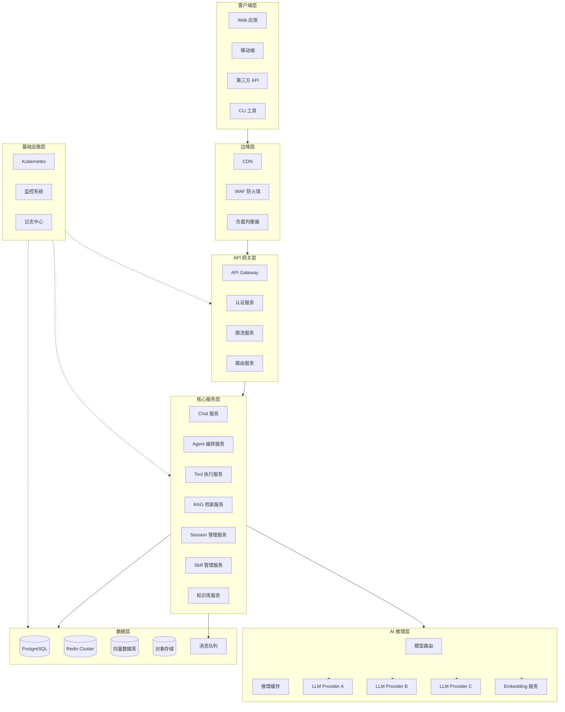
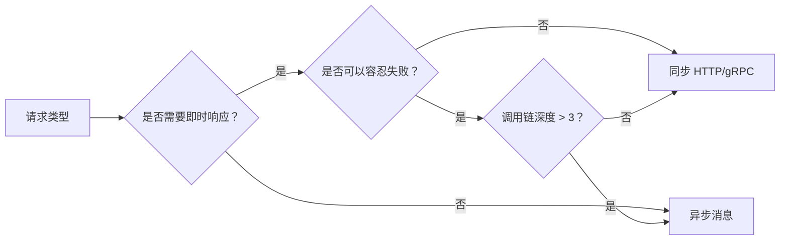
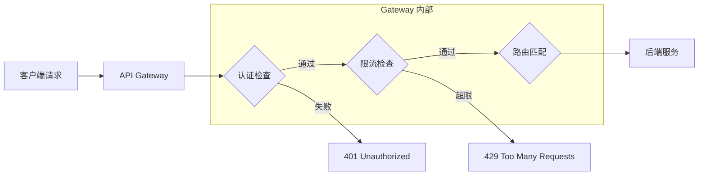
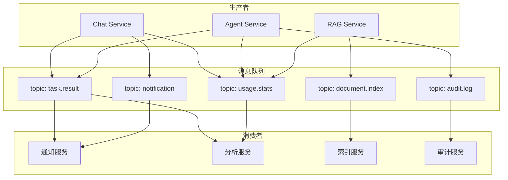
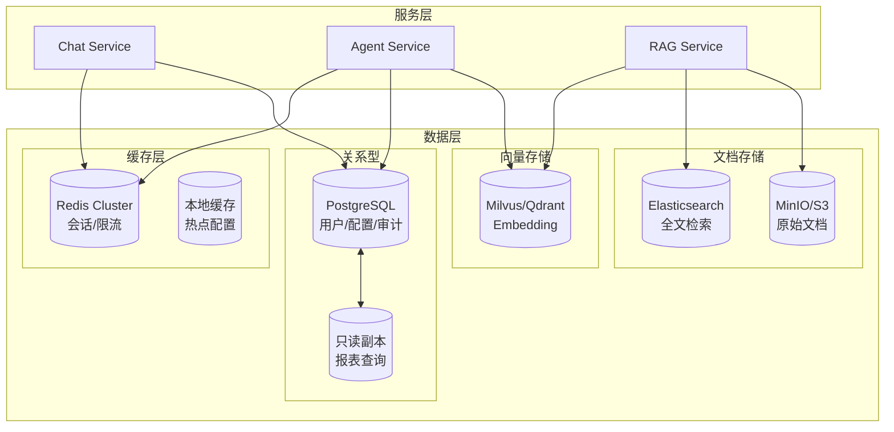
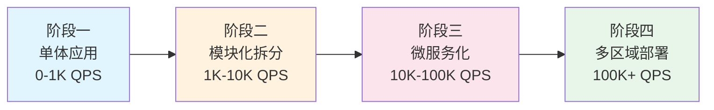

# 第36章 生产环境架构设计

> "架构不是画出来的，是演进出来的。但好的初始设计，能让演进更顺畅。" —— 一位匿名架构师

## 36.1 概述：从原型到生产的跨越

将一个 Agent 系统从实验室推向生产环境，绝不仅仅是"多加几台服务器"这么简单。生产环境意味着你面对的是一个真实、复杂、不可预测的世界：用户流量忽高忽低、上游 LLM 服务偶尔不稳定、数据需要持久化和加密、不同租户之间的数据必须隔离、每次发布都可能引入新的风险。

本章将从架构设计的角度，系统地讨论如何构建一个生产级的 Agent 平台。我们的讨论将围绕以下几个核心问题展开：

1. **服务应该如何拆分？** —— 微服务 vs. 单体 vs. 模块化单体
2. **请求如何路由？** —— API Gateway 的设计哲学
3. **组件之间如何通信？** —— 同步调用 vs. 异步消息
4. **数据如何存储？** —— 多种数据引擎的协作
5. **多租户如何隔离？** —— 数据隔离与资源隔离的策略

在深入具体设计之前，我们先看一个典型的生产级 Agent 平台的整体架构图。

### 36.1.1 全局架构总览



这个架构图展示了一个完整的生产级 Agent 平台的各个层次。接下来，我们将逐层深入分析。

## 36.2 微服务架构下的 Agent 服务

### 36.2.1 服务拆分原则

Agent 系统的服务拆分需要遵循领域驱动设计（DDD）的原则，同时考虑实际运维的复杂度。过早的微服务化会导致运维成本急剧上升，而过晚的拆分则可能让系统陷入"大泥球"。

**推荐策略：先模块化单体，再按需拆分**

```
阶段一：模块化单体（0-1K QPS）
┌─────────────────────────────────────┐
│           Agent Platform             │
│  ┌─────────┬──────────┬───────────┐ │
│  │  Chat   │  Agent   │  Session  │ │
│  │ Module  │  Module  │  Module   │ │
│  ├─────────┼──────────┼───────────┤ │
│  │   RAG   │  Skill   │  Tool     │ │
│  │ Module  │  Module  │  Module   │ │
│  └─────────┴──────────┴───────────┘ │
└─────────────────────────────────────┘

阶段二：核心服务拆分（1K-10K QPS）
┌──────────┐  ┌──────────┐  ┌──────────┐
│Chat Svc  │  │Agent Svc │  │RAG Svc   │
└────┬─────┘  └────┬─────┘  └────┬─────┘
     │              │              │
┌────┴──────────────┴──────────────┴────┐
│         共享模块（Session/Skill/Tool）  │
└───────────────────────────────────────┘

阶段三：完全微服务化（10K+ QPS）
每个核心能力独立部署，通过消息队列和 API 通信
```

**服务拆分的具体建议：**

| 服务 | 职责 | 拆分时机 | 数据库策略 |
|------|------|----------|-----------|
| Chat Service | 处理用户对话请求 | 启动时即独立 | 独立 Schema |
| Agent Orchestrator | Agent 编排和任务调度 | QPS > 500 | 独立 Schema |
| RAG Service | 检索增强生成 | 知识库功能上线时 | 共享向量库 |
| Tool Execution | 工具调用执行 | 工具数量 > 20 | 独立 Schema |
| Session Manager | 会话状态管理 | 需要跨服务共享状态 | Redis + PG |
| Skill Registry | 技能注册与管理 | 技能系统上线时 | 独立 Schema |
| Knowledge Base | 知识库管理 | RAG 上线时 | 独立 Schema |
| Model Router | LLM 模型路由 | 多模型支持时 | 配置存储 |

### 36.2.2 服务间通信

在微服务架构中，服务间通信是最关键的设计决策之一。

**同步通信 vs. 异步通信的选择矩阵：**



**具体实践：**

1. **同步调用（HTTP/gRPC）**：适用于需要即时响应的场景
   - 用户发送消息 → Chat Service → Agent Service → 返回响应
   - 推荐使用 gRPC 进行内部服务间调用，性能优于 HTTP/JSON

2. **异步消息（MQ）**：适用于不需要即时响应的场景
   - Agent 执行结果通知
   - 知识库文档索引构建
   - 使用统计和分析
   - 审计日志收集

**gRPC 服务定义示例：**

```protobuf
// agent_service.proto
syntax = "proto3";
package agent.v1;

service AgentService {
  // 执行 Agent 任务
  rpc ExecuteTask(ExecuteTaskRequest) returns (stream TaskResponse);
  
  // 获取任务状态
  rpc GetTaskStatus(TaskStatusRequest) returns (TaskStatus);
  
  // 取消任务
  rpc CancelTask(CancelTaskRequest) returns (CancelResponse);
}

message ExecuteTaskRequest {
  string session_id = 1;
  string user_message = 2;
  string agent_type = 3;  // "chat", "rag", "tool_call"
  map<string, string> context = 4;
  int32 timeout_seconds = 5;
}

message TaskResponse {
  string task_id = 1;
  oneof payload {
    ChunkResponse chunk = 2;
    ToolCallResponse tool_call = 3;
    FinalResponse final = 4;
    ErrorResponse error = 5;
  }
}

message FinalResponse {
  string content = 1;
  int32 total_tokens = 2;
  float latency_ms = 3;
  repeated ToolCallResult tool_results = 4;
}
```

### 36.2.3 服务治理

**服务注册与发现配置示例（Consul）：**

```yaml
# consul-agent.hcl
datacenter = "agent-platform"
data_dir = "/opt/consul/data"
server = true
bootstrap_expect = 3

services {
  id = "agent-service-1"
  name = "agent-service"
  tags = ["v2.1.0", "production"]
  port = 50051
  
  check {
    id = "agent-health"
    name = "Agent Service Health"
    http = "http://localhost:8080/health"
    interval = "10s"
    timeout = "3s"
  }
}
```

**Service Mesh 选型建议：**

| 方案 | 适用场景 | 优势 | 劣势 |
|------|----------|------|------|
| Istio | 大规模集群（>100 节点） | 功能全面 | 运维复杂 |
| Linkerd | 中小规模集群 | 轻量、易用 | 功能较少 |
| 不使用 Service Mesh | 团队 < 10 人 | 简单直接 | 缺少流量治理 |

**建议**：对于 Agent 平台初期的团队规模，推荐先不引入 Service Mesh，通过 API Gateway + 服务注册中心实现基本的流量管理。

## 36.3 API Gateway 设计

### 36.3.1 Gateway 的核心职责

API Gateway 是整个 Agent 平台的统一入口，承担着流量管理、认证授权、限流熔断等关键职责。



### 36.3.2 Gateway 架构选型

**主流 API Gateway 对比：**

| 方案 | 语言 | 性能 | 可扩展性 | 运维复杂度 |
|------|------|------|----------|-----------|
| Kong + Lua | Lua | 高 | 高（插件丰富） | 中 |
| APISIX | Lua | 极高 | 高（原生 Nginx） | 中 |
| Tyk | Go | 高 | 中 | 低 |
| 自研 Gateway | Go/Rust | 最高 | 完全可控 | 高 |

**推荐方案**：APISIX 或自研轻量 Gateway。对于 Agent 平台的特殊需求（如 SSE 流式响应、Token 级别的限流），自研 Gateway 可能是更好的选择。

**自研 Gateway 核心代码示例（Go）：**

```go
// gateway/main.go
package main

import (
    "context"
    "io"
    "net/http"
    "strings"
    "sync"
    "time"
    "github.com/redis/go-redis/v9"
)

type AgentGateway struct {
    router          *http.ServeMux
    authService     AuthService
    rateLimiter     *TokenRateLimiter
    circuitBreakers map[string]*CircuitBreaker
    config          *GatewayConfig
}

type GatewayConfig struct {
    ListenAddr      string        `yaml:"listen_addr"`
    AuthServiceAddr string        `yaml:"auth_service_addr"`
    Routes          []RouteConfig `yaml:"routes"`
    RateLimits      RateLimitConfig `yaml:"rate_limits"`
}

type RouteConfig struct {
    Path        string `yaml:"path"`
    Upstream    string `yaml:"upstream"`
    StripPrefix bool   `yaml:"strip_prefix"`
    Timeout     int    `yaml:"timeout_ms"`
    MaxRetries  int    `yaml:"max_retries"`
}

func (gw *AgentGateway) handleChat(w http.ResponseWriter, r *http.Request) {
    start := time.Now()
    
    // 1. 认证
    userID, _, err := gw.authService.Authenticate(r)
    if err != nil {
        http.Error(w, "Unauthorized", http.StatusUnauthorized)
        return
    }
    
    // 2. Token 级别限流
    if !gw.rateLimiter.Allow(userID, "chat") {
        w.Header().Set("Retry-After", "60")
        http.Error(w, "Rate limit exceeded", http.StatusTooManyRequests)
        return
    }
    
    // 3. 熔断检查
    cb := gw.circuitBreakers["agent-service"]
    if !cb.Allow() {
        http.Error(w, "Service unavailable", http.StatusServiceUnavailable)
        return
    }
    
    // 4. 转发请求（支持 SSE 流式）
    gw.proxyChatRequest(w, r, userID)
    
    _ = time.Since(start).Seconds() // 记录延迟指标
}

// proxyChatRequest 代理聊天请求，支持 SSE 流式传输
func (gw *AgentGateway) proxyChatRequest(w http.ResponseWriter, r *http.Request, userID string) {
    upstream := gw.config.Routes[0].Upstream
    
    ctx, cancel := context.WithTimeout(r.Context(), 5*time.Minute)
    defer cancel()
    
    proxyReq, _ := http.NewRequestWithContext(ctx, r.Method, upstream+r.URL.Path, r.Body)
    proxyReq.Header = r.Header.Clone()
    proxyReq.Header.Set("X-User-ID", userID)
    
    resp, err := http.DefaultClient.Do(proxyReq)
    if err != nil {
        http.Error(w, "Upstream error", http.StatusBadGateway)
        return
    }
    defer resp.Body.Close()
    
    contentType := resp.Header.Get("Content-Type")
    if strings.Contains(contentType, "text/event-stream") {
        w.Header().Set("Content-Type", "text/event-stream")
        w.Header().Set("Cache-Control", "no-cache")
        w.Header().Set("Connection", "keep-alive")
        
        flusher, _ := w.(http.Flusher)
        buf := make([]byte, 4096)
        for {
            n, err := resp.Body.Read(buf)
            if n > 0 {
                w.Write(buf[:n])
                flusher.Flush()
            }
            if err == io.EOF {
                break
            }
            if err != nil {
                break
            }
        }
    } else {
        w.Header().Set("Content-Type", contentType)
        io.Copy(w, resp.Body)
    }
}
```

### 36.3.3 限流策略

Agent 平台的限流需要考虑多个维度：

```yaml
# rate_limit_config.yaml
rate_limits:
  global:
    requests_per_second: 10000
    burst: 15000
  
  user:
    free_tier:
      requests_per_minute: 20
      tokens_per_day: 100000
      max_concurrent: 2
    pro_tier:
      requests_per_minute: 100
      tokens_per_day: 2000000
      max_concurrent: 10
    enterprise_tier:
      requests_per_minute: 500
      tokens_per_day: -1  # 无限制
      max_concurrent: 50
  
  api:
    /api/v1/chat:
      requests_per_minute: 60
      token_cost_multiplier: 1.0
    /api/v1/agent/execute:
      requests_per_minute: 30
      token_cost_multiplier: 1.5
    /api/v1/rag/search:
      requests_per_minute: 120
      token_cost_multiplier: 0.3
```

**Token 级别限流实现（Python + Redis）：**

```python
# rate_limiter.py
import time
import redis

class TokenAwareRateLimiter:
    """基于 Token 消耗的限流器"""
    
    def __init__(self, redis_client: redis.Redis):
        self.redis = redis_client
        self._lua_script = """
        local key = KEYS[1]
        local limit = tonumber(ARGV[1])
        local window = tonumber(ARGV[2])
        local cost = tonumber(ARGV[3])
        local now = tonumber(ARGV[4])
        
        local window_start = now - window
        redis.call('ZREMRANGEBYSCORE', key, 0, window_start)
        local current = tonumber(redis.call('ZCARD', key))
        
        if current + cost <= limit then
            redis.call('ZADD', key, now, now .. ':' .. cost)
            redis.call('EXPIRE', key, window)
            return {1, limit - current - cost, now + window}
        else
            local oldest = tonumber(
                redis.call('ZRANGE', key, 0, 0, 'WITHSCORES')[2])
            local retry_after = oldest + window - now
            return {0, 0, now + window, retry_after}
        end
        """
    
    def check(self, user_id: str, token_cost: int = 1,
              limit_type: str = "minute") -> dict:
        """检查请求是否被允许"""
        configs = {
            "minute": (f"rl:{user_id}:minute", 60),
            "day":    (f"rl:{user_id}:day", 86400),
        }
        key, window = configs.get(limit_type, configs["minute"])
        
        # 根据用户等级获取不同限额
        limit = self._get_user_limit(user_id, limit_type)
        
        result = self.redis.eval(
            self._lua_script, 1, key, limit, window,
            token_cost, time.time()
        )
        return {
            "allowed": bool(result[0]),
            "remaining": int(result[1]),
            "reset_at": float(result[2]),
            "retry_after": float(result[3]) if len(result) > 3 else None
        }
    
    def _get_user_limit(self, user_id: str, limit_type: str) -> int:
        """获取用户限额（从配置或数据库中读取）"""
        tier = self._get_user_tier(user_id)
        limits = {
            "free":       {"minute": 20, "day": 100000},
            "pro":        {"minute": 100, "day": 2000000},
            "enterprise": {"minute": 500, "day": 999999999},
        }
        return limits.get(tier, limits["free"]).get(limit_type, 60)
```

## 36.4 消息队列集成

### 36.4.1 消息队列在 Agent 平台中的作用

Agent 系统的许多操作具有天然异步性：文档索引、任务执行结果通知、使用统计分析、审计日志收集等。消息队列将这些操作解耦，提升系统的可靠性和响应速度。



### 36.4.2 消息队列选型

| 方案 | 吞吐量 | 延迟 | 持久化 | 适用场景 |
|------|--------|------|--------|----------|
| Kafka | 极高（百万/秒） | 中 | 强 | 审计日志、使用统计 |
| RabbitMQ | 高（万/秒） | 低 | 可选 | 任务通知、事件驱动 |
| Redis Streams | 高 | 极低 | 可选 | 轻量级实时通知 |
| NATS | 极高 | 极低 | JetStream | 高性能内部通信 |

**推荐组合**：Kafka 用于高吞吐量的数据流（审计、统计），RabbitMQ 用于任务分发和事件通知。

### 36.4.3 事件消息格式设计

统一的事件消息格式是系统可靠性的基础：

```json
{
  "event_id": "evt_8f7d2a1b3c4d",
  "event_type": "agent.task.completed",
  "event_version": "1.0",
  "timestamp": "2026-04-01T00:00:00.000Z",
  "source": "agent-service",
  "correlation_id": "corr_5e6f7a8b9c0d",
  "data": {
    "task_id": "task_abc123",
    "session_id": "sess_def456",
    "user_id": "user_ghi789",
    "agent_type": "rag_agent",
    "status": "completed",
    "result": {
      "response": "根据检索结果...",
      "sources": ["doc_1", "doc_3"],
      "tokens_used": 1523,
      "latency_ms": 2340
    }
  },
  "metadata": {
    "schema_version": "1.0",
    "partition_key": "user_ghi789",
    "retry_count": 0
  }
}
```

### 36.4.4 消息消费者幂等性

生产环境中，消息可能被重复投递。消费者必须实现幂等性：

```python
import hashlib
import json
import redis
from datetime import datetime
from typing import Any, Callable

class IdempotentConsumer:
    """幂等消息消费者"""
    
    def __init__(self, redis_client: redis.Redis, handler: Callable):
        self.redis = redis_client
        self.handler = handler
    
    def consume(self, message: dict) -> dict:
        event_id = message["event_id"]
        msg_hash = self._compute_hash(message)
        
        # 检查是否已处理
        if self._is_processed(event_id, msg_hash):
            return {"status": "duplicate", "event_id": event_id}
        
        # 获取处理锁（防止并发重复处理）
        lock_key = f"lock:msg:{event_id}"
        if not self.redis.set(lock_key, "1", nx=True, ex=300):
            return {"status": "locked", "event_id": event_id}
        
        try:
            # Double check
            if self._is_processed(event_id, msg_hash):
                return {"status": "duplicate", "event_id": event_id}
            
            result = self.handler(message)
            self._mark_processed(event_id, msg_hash, result)
            return {"status": "processed", "result": result}
        except Exception as e:
            return {"status": "error", "error": str(e)}
        finally:
            self.redis.delete(lock_key)
    
    def _compute_hash(self, message: dict) -> str:
        canonical = json.dumps(message["data"], sort_keys=True)
        return hashlib.sha256(canonical.encode()).hexdigest()[:16]
    
    def _is_processed(self, event_id: str, msg_hash: str) -> bool:
        key = f"processed:msg:{event_id}"
        stored = self.redis.hget(key, "hash")
        return stored == msg_hash.encode() if stored else False
    
    def _mark_processed(self, event_id, msg_hash, result):
        key = f"processed:msg:{event_id}"
        self.redis.hset(key, mapping={
            "hash": msg_hash,
            "processed_at": datetime.utcnow().isoformat(),
            "result_summary": str(result)[:200]
        })
        self.redis.expire(key, 86400 * 7)
```

## 36.5 数据层设计

Agent 平台的数据层需要支持多种数据模型：结构化数据（用户、配置）、半结构化数据（会话历史）、向量数据（Embedding）、缓存数据（热数据）以及大对象（文档、模型文件）。

### 36.5.1 多引擎数据架构



### 36.5.2 数据库设计

**核心表结构（PostgreSQL）：**

```sql
-- 用户表
CREATE TABLE users (
    id UUID PRIMARY KEY DEFAULT gen_random_uuid(),
    email VARCHAR(255) UNIQUE NOT NULL,
    display_name VARCHAR(100),
    tier VARCHAR(20) DEFAULT 'free'
        CHECK (tier IN ('free', 'pro', 'enterprise')),
    created_at TIMESTAMPTZ DEFAULT NOW(),
    updated_at TIMESTAMPTZ DEFAULT NOW(),
    last_login_at TIMESTAMPTZ,
    is_active BOOLEAN DEFAULT true
);

-- 租户表（多租户支持）
CREATE TABLE tenants (
    id UUID PRIMARY KEY DEFAULT gen_random_uuid(),
    name VARCHAR(100) NOT NULL,
    slug VARCHAR(50) UNIQUE NOT NULL,
    plan VARCHAR(20) DEFAULT 'starter',
    config JSONB DEFAULT '{}',
    rate_limit_config JSONB DEFAULT '{}',
    created_at TIMESTAMPTZ DEFAULT NOW()
);

-- 会话表
CREATE TABLE sessions (
    id UUID PRIMARY KEY DEFAULT gen_random_uuid(),
    user_id UUID NOT NULL REFERENCES users(id),
    tenant_id UUID REFERENCES tenants(id),
    title VARCHAR(500),
    agent_type VARCHAR(50) DEFAULT 'chat',
    metadata JSONB DEFAULT '{}',
    created_at TIMESTAMPTZ DEFAULT NOW(),
    updated_at TIMESTAMPTZ DEFAULT NOW(),
    is_archived BOOLEAN DEFAULT false
);

-- 消息表（按时间范围分区）
CREATE TABLE messages (
    id UUID PRIMARY KEY DEFAULT gen_random_uuid(),
    session_id UUID NOT NULL REFERENCES sessions(id) ON DELETE CASCADE,
    role VARCHAR(20) NOT NULL
        CHECK (role IN ('user', 'assistant', 'system', 'tool')),
    content TEXT NOT NULL,
    token_count INTEGER DEFAULT 0,
    model VARCHAR(50),
    metadata JSONB DEFAULT '{}',
    created_at TIMESTAMPTZ DEFAULT NOW(),
    is_starred BOOLEAN DEFAULT false
) PARTITION BY RANGE (created_at);

-- 按月分区
CREATE TABLE messages_2026_04 PARTITION OF messages
    FOR VALUES FROM ('2026-04-01') TO ('2026-05-01');
CREATE TABLE messages_2026_05 PARTITION OF messages
    FOR VALUES FROM ('2026-05-01') TO ('2026-06-01');

-- 关键索引
CREATE INDEX idx_messages_session
    ON messages (session_id, created_at DESC);
CREATE INDEX idx_sessions_user
    ON sessions (user_id, updated_at DESC);

-- Token 使用统计表（分区）
CREATE TABLE token_usage (
    id BIGSERIAL PRIMARY KEY,
    user_id UUID NOT NULL REFERENCES users(id),
    tenant_id UUID REFERENCES tenants(id),
    session_id UUID REFERENCES sessions(id),
    model VARCHAR(50) NOT NULL,
    prompt_tokens INTEGER NOT NULL,
    completion_tokens INTEGER NOT NULL,
    total_tokens INTEGER NOT NULL,
    cost_usd DECIMAL(10, 6),
    created_at TIMESTAMPTZ DEFAULT NOW()
) PARTITION BY RANGE (created_at);

CREATE INDEX idx_token_usage_user_date
    ON token_usage (user_id, created_at);
CREATE INDEX idx_token_usage_tenant_date
    ON token_usage (tenant_id, created_at);
```

### 36.5.3 缓存策略

```python
# cache_manager.py
import json
import hashlib
import redis
from dataclasses import dataclass
from functools import wraps
from typing import Optional

@dataclass
class CacheConfig:
    session_ttl: int = 3600          # 会话缓存 1小时
    context_ttl: int = 1800          # 上下文缓存 30分钟
    embedding_ttl: int = 86400 * 7   # Embedding 缓存 7天
    config_ttl: int = 300            # 配置缓存 5分钟
    tool_result_ttl: int = 600       # 工具结果缓存 10分钟

class AgentCacheManager:
    """Agent 平台统一缓存管理"""
    
    def __init__(self, redis_client: redis.Redis, config: CacheConfig):
        self.redis = redis_client
        self.config = config
    
    def get_session_context(self, session_id: str) -> Optional[dict]:
        """获取会话上下文"""
        key = f"session:ctx:{session_id}"
        data = self.redis.get(key)
        return json.loads(data) if data else None
    
    def set_session_context(self, session_id: str, context: dict):
        """设置会话上下文"""
        key = f"session:ctx:{session_id}"
        self.redis.setex(
            key, self.config.session_ttl, json.dumps(context)
        )
    
    def get_embedding_cache(self, text: str) -> Optional[list]:
        """获取 Embedding 缓存"""
        h = hashlib.md5(text.encode()).hexdigest()[:16]
        data = self.redis.get(f"embedding:{h}")
        return json.loads(data) if data else None
    
    def set_embedding_cache(self, text: str, embedding: list):
        """设置 Embedding 缓存"""
        h = hashlib.md5(text.encode()).hexdigest()[:16]
        self.redis.setex(
            f"embedding:{h}",
            self.config.embedding_ttl,
            json.dumps(embedding)
        )
    
    def cached(self, key_prefix: str, ttl: Optional[int] = None):
        """缓存装饰器"""
        def decorator(func):
            @wraps(func)
            def wrapper(*args, **kwargs):
                arg_str = json.dumps(args, default=str)
                kwarg_str = json.dumps(kwargs, sort_keys=True, default=str)
                raw = f"{key_prefix}:{func.__name__}:{arg_str}:{kwarg_str}"
                cache_key = f"cache:{hashlib.md5(raw.encode()).hexdigest()[:24]}"
                
                cached = self.redis.get(cache_key)
                if cached:
                    return json.loads(cached)
                
                result = func(*args, **kwargs)
                if result is not None:
                    self.redis.setex(
                        cache_key, ttl or self.config.config_ttl,
                        json.dumps(result)
                    )
                return result
            return wrapper
        return decorator
```

### 36.5.4 向量数据库设计

```python
# vector_store.py
from typing import List, Optional

@dataclass
class VectorSearchResult:
    id: str
    score: float
    metadata: dict
    content: str

class VectorStoreManager:
    """向量数据库管理（基于 Milvus）"""
    
    def create_collection(self, name: str, dim: int = 1536):
        """创建向量集合"""
        from pymilvus import (
            CollectionSchema, FieldSchema, DataType, Collection
        )
        fields = [
            FieldSchema(name="id", dtype=DataType.VARCHAR,
                        is_primary=True, max_length=64),
            FieldSchema(name="embedding", dtype=DataType.FLOAT_VECTOR, dim=dim),
            FieldSchema(name="content", dtype=DataType.VARCHAR, max_length=65535),
            FieldSchema(name="metadata", dtype=DataType.JSON),
            FieldSchema(name="tenant_id", dtype=DataType.VARCHAR, max_length=64),
        ]
        schema = CollectionSchema(fields=fields, description=name)
        collection = Collection(name=name, schema=schema)
        
        # IVF_FLAT 索引适合中等规模
        collection.create_index(
            field_name="embedding",
            index_params={
                "index_type": "IVF_FLAT",
                "metric_type": "COSINE",
                "params": {"nlist": 1024}
            }
        )
        return collection
    
    def hybrid_search(self, query_embedding: List[float],
                      tenant_id: str, top_k: int = 10,
                      vector_weight: float = 0.7,
                      keyword: Optional[str] = None
                      ) -> List[VectorSearchResult]:
        """混合检索：向量相似度 + 关键词匹配（RRF 融合）"""
        vector_results = self._vector_search(
            query_embedding, tenant_id, top_k * 2
        )
        keyword_results = (
            self._keyword_search(keyword, tenant_id, top_k * 2)
            if keyword else []
        )
        return self._reciprocal_rank_fusion(
            vector_results, keyword_results, top_k, vector_weight
        )
    
    def _reciprocal_rank_fusion(self, vector_results, keyword_results,
                                 top_k, vector_weight):
        """RRF 结果融合"""
        scores = {}
        k = 60
        for rank, r in enumerate(vector_results):
            scores.setdefault(r.id, 0)
            scores[r.id] += vector_weight / (k + rank + 1)
        for rank, r in enumerate(keyword_results):
            scores.setdefault(r.id, 0)
            scores[r.id] += (1 - vector_weight) / (k + rank + 1)
        
        all_results = {r.id: r for r in vector_results + keyword_results}
        sorted_ids = sorted(scores, key=scores.get, reverse=True)[:top_k]
        return [all_results[i] for i in sorted_ids if i in all_results]
```

## 36.6 多租户架构

### 36.6.1 租户隔离策略

多租户是 Agent 平台的必经之路。不同的租户（企业客户）需要数据隔离、配置隔离和资源隔离。

```
隔离级别光谱：
最小隔离 ←————————————————————————→ 最大隔离

共享数据库    共享 Schema    独立 Schema    独立实例
共享表        行级隔离       命名空间       物理隔离
成本最低 ←————————————————————————→ 成本最高
运维最简 ←————————————————————————→ 运维最复杂
```

**推荐方案：共享数据库 + Schema 隔离 + 资源配额**

### 36.6.2 租户管理实现

```python
# tenant_manager.py
from dataclasses import dataclass
from typing import Optional
from enum import Enum

class TenantPlan(Enum):
    STARTER = "starter"
    PROFESSIONAL = "professional"
    ENTERPRISE = "enterprise"

PLAN_LIMITS = {
    TenantPlan.STARTER: {
        "max_sessions": 100,
        "max_tokens_per_day": 500_000,
        "max_documents": 1_000,
        "max_concurrent": 3,
        "allowed_models": ["gpt-4o-mini", "claude-3-haiku"],
    },
    TenantPlan.PROFESSIONAL: {
        "max_sessions": 10_000,
        "max_tokens_per_day": 10_000_000,
        "max_documents": 100_000,
        "max_concurrent": 20,
        "allowed_models": ["gpt-4o", "claude-3-sonnet", "claude-3-haiku"],
    },
    TenantPlan.ENTERPRISE: {
        "max_sessions": -1,       # 无限制
        "max_tokens_per_day": -1,
        "max_documents": -1,
        "max_concurrent": 100,
        "allowed_models": ["*"],   # 全部模型
    },
}

class TenantManager:
    """多租户管理器"""
    
    def check_quota(self, tenant_id: str, resource: str) -> bool:
        """检查租户配额"""
        plan = self._get_tenant_plan(tenant_id)
        limits = PLAN_LIMITS[plan]
        limit = limits[resource]
        if limit == -1:
            return True  # 无限制
        usage = self._get_current_usage(tenant_id, resource)
        return usage < limit
    
    def enforce_tenant_isolation(self, query, tenant_id: str):
        """在查询中强制加入租户隔离条件"""
        # 所有涉及租户数据的查询都必须加入 tenant_id 过滤
        if hasattr(query, 'where'):
            query = query.where(tenant_id=tenant_id)
        return query
```

### 36.6.3 资源配额执行

```yaml
# tenant_resource_quota.yaml
tenant_quotas:
  - tenant_id: "tenant_acme"
    plan: "professional"
    resources:
      sessions:
        limit: 10000
        current: 4523
        alert_threshold: 0.8  # 80%时告警
      tokens_daily:
        limit: 10000000
        current: 6500000
        alert_threshold: 0.9
      concurrent_requests:
        limit: 20
        current: 8
      knowledge_base:
        documents_limit: 100000
        storage_limit_gb: 50
        current_documents: 23456
        current_storage_gb: 12.3
```

## 36.7 架构演进路线

### 36.7.1 演进阶段



**各阶段关键决策点：**

| 阶段 | QPS | 关键变化 | 基础设施 |
|------|-----|----------|----------|
| 阶段一 | 0-1K | 单体部署，共享数据库 | 单台服务器 + RDS |
| 阶段二 | 1K-10K | 核心服务拆分，Redis 缓存 | K8s 集群（3-5 节点） |
| 阶段三 | 10K-100K | 完全微服务，消息队列 | K8s 集群（10+ 节点）+ 专线 |
| 阶段四 | 100K+ | 多区域部署，全球路由 | 多云 + CDN + Anycast |

### 36.7.2 架构决策记录（ADR）模板

每次重大架构决策都应该留下记录：

```markdown
# ADR-001: 选择 gRPC 作为内部服务间通信协议

## 状态
已采纳

## 背景
Agent 平台的服务间通信需要高性能、强类型的协议。

## 决策
使用 gRPC + Protocol Buffers 作为内部服务间通信协议。

## 理由
1. 性能：比 HTTP/JSON 快 5-10 倍（Protobuf 序列化）
2. 流式支持：原生支持 Server Streaming（适配 SSE 响应）
3. 强类型：Protobuf 提供编译时类型检查
4. 代码生成：自动生成多语言客户端代码

## 后果
- 正面：性能提升、类型安全、开发效率
- 负面：调试比 REST 困难、浏览器不支持 gRPC
- 缓解：保留 HTTP/REST 用于外部 API

## 决策人
@架构组 2026-03-15
```

### 36.7.3 技术债务管理

生产环境中不可避免会产生技术债务。关键是要有意识地管理它：

```markdown
# 技术债务看板

## 高优先级
- [ ] Agent Service 的同步调用链过长（最大深度 7）→ 引入异步编排
- [ ] 消息表缺少分区策略 → 按月分区

## 中优先级
- [ ] 缓存失效策略不一致 → 统一 CacheManager
- [ ] 部分服务缺少健康检查端点 → 统一健康检查框架

## 低优先级
- [ ] API 版本管理不够规范 → 制定版本策略
- [ ] 日志格式不完全统一 → 引入结构化日志标准
```

## 36.8 部署架构示例

### 36.8.1 Kubernetes 部署配置

```yaml
# k8s/agent-platform-deployment.yaml
apiVersion: apps/v1
kind: Deployment
metadata:
  name: agent-service
  namespace: agent-platform
  labels:
    app: agent-service
    version: v2.1.0
spec:
  replicas: 3
  strategy:
    type: RollingUpdate
    rollingUpdate:
      maxSurge: 1
      maxUnavailable: 0  # 零停机
  selector:
    matchLabels:
      app: agent-service
  template:
    metadata:
      labels:
        app: agent-service
        version: v2.1.0
      annotations:
        prometheus.io/scrape: "true"
        prometheus.io/port: "9090"
    spec:
      containers:
      - name: agent-service
        image: registry.example.com/agent-service:v2.1.0
        ports:
        - containerPort: 8080
          name: http
        - containerPort: 9090
          name: metrics
        resources:
          requests:
            cpu: "500m"
            memory: "512Mi"
          limits:
            cpu: "2000m"
            memory: "2Gi"
        env:
        - name: DATABASE_URL
          valueFrom:
            secretKeyRef:
              name: agent-secrets
              key: database-url
        - name: REDIS_URL
          valueFrom:
            secretKeyRef:
              name: agent-secrets
              key: redis-url
        - name: JWT_SECRET
          valueFrom:
            secretKeyRef:
              name: agent-secrets
              key: jwt-secret
        livenessProbe:
          httpGet:
            path: /health/live
            port: 8080
          initialDelaySeconds: 30
          periodSeconds: 10
        readinessProbe:
          httpGet:
            path: /health/ready
            port: 8080
          initialDelaySeconds: 5
          periodSeconds: 5
        volumeMounts:
        - name: config
          mountPath: /app/config
      volumes:
      - name: config
        configMap:
          name: agent-config
---
apiVersion: v1
kind: Service
metadata:
  name: agent-service
  namespace: agent-platform
spec:
  selector:
    app: agent-service
  ports:
  - port: 80
    targetPort: 8080
  type: ClusterIP
```

### 36.8.2 基础设施即代码（Terraform）

```hcl
# terraform/main.tf
terraform {
  required_version = ">= 1.5"
  required_providers {
    kubernetes = {
      source  = "hashicorp/kubernetes"
      version = "~> 2.23"
    }
    rediscloud = {
      source  = "rediscloud/rediscloud"
      version = "~> 0.13"
    }
  }
}

# Redis Cluster 配置
resource "rediscloud_subscription" "agent_platform" {
  name            = "agent-platform-cache"
  payment_method  = "credit-card"
  memory_storage  = "ram"
  redis_version   = "7.2"
  
  plan {
    memory_limit_in_gb = 10
    quantity           = 3  # 3节点集群
    throughput_measurement {
      by = "operations-per-second"
      value = 50000
    }
  }
}

# PostgreSQL 数据库
resource "aws_db_instance" "agent_platform" {
  identifier     = "agent-platform-db"
  engine         = "postgres"
  engine_version = "16.1"
  instance_class = "db.r6g.xlarge"
  
  allocated_storage     = 500
  max_allocated_storage = 1000
  storage_type          = "gp3"
  
  multi_az               = true
  db_subnet_group_name   = aws_db_subnet_group.agent.name
  vpc_security_group_ids = [aws_security_group.db.id]
  
  backup_retention_period = 30
  backup_window          = "03:00-04:00"
  maintenance_window     = "Mon:04:00-Mon:05:00"
  
  skip_final_snapshot = false
  final_snapshot_identifier = "agent-platform-final"
  
  tags = {
    Project = "agent-platform"
    Env     = "production"
  }
}
```

## 36.9 本章小结

本章从全局视角介绍了生产级 Agent 平台的架构设计，涵盖了以下核心内容：

1. **微服务架构**：采用"先模块化单体，再按需拆分"的渐进式策略
2. **API Gateway**：作为统一入口处理认证、限流、路由等横切关注点
3. **消息队列**：通过异步解耦提升系统的可靠性和响应速度
4. **数据层设计**：多引擎协作（PostgreSQL + Redis + 向量库 + 对象存储）
5. **多租户架构**：通过 Schema 隔离和资源配额实现安全的租户隔离
6. **架构演进**：从单体到微服务再到多区域部署的清晰路线图

架构设计没有银弹。关键是要根据团队规模、业务阶段和技术能力做出合理的选择，并持续演进。下一章我们将深入讨论可扩展性与高可用的具体实现策略。

