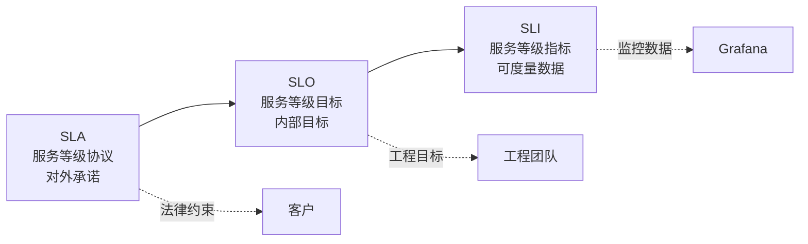

# 第38章 监控与告警体系

> "你不能管理你没有度量的东西。" —— Peter Drucker

## 38.1 概述：可观测性三支柱

监控是生产环境的"眼睛和耳朵"。对于 Agent 平台而言，监控不仅要覆盖传统的系统指标（CPU、内存、延迟），还要覆盖 Agent 特有的指标（Token 消耗、模型调用延迟、Prompt 成功率、工具执行成功率）。

可观测性（Observability）由三支柱组成：

```mermaid
graph TB
    Obs[可观测性]
    Obs --> Logs[日志 Logging<br/>"发生了什么？"]
    Obs --> Metrics[指标 Metrics<br/>"发生了多少？"]
    Obs --> Traces[追踪 Tracing<br/>"在哪里发生的？"]
    
    Logs --> ELK[ELK Stack<br/>Elasticsearch +<br/>Logstash + Kibana]
    Metrics --> Prometheus[Prometheus +<br/>Grafana]
    Traces --> Jaeger[Jaeger /<br/>OpenTelemetry]
```

| 支柱 | 回答的问题 | 工具 | 数据格式 |
|------|-----------|------|----------|
| 日志 | 发生了什么？ | ELK / Loki | 非结构化/结构化文本 |
| 指标 | 发生了多少/多快？ | Prometheus / VictoriaMetrics | 时间序列数据 |
| 追踪 | 在哪里发生？ | Jaeger / Zipkin / Tempo | Span 树 |

## 38.2 指标体系设计

### 38.2.1 指标分类

Agent 平台的指标应该按照 USE 方法（Utilization, Saturation, Errors）和 RED 方法（Rate, Errors, Duration）来组织：

```
指标体系
├── 系统指标（USE）
│   ├── CPU 利用率
│   ├── 内存利用率
│   ├── 磁盘 I/O
│   └── 网络带宽
│
├── 服务指标（RED）
│   ├── 请求速率 (QPS)
│   ├── 错误率 (%)
│   ├── 延迟分布 (P50/P95/P99)
│   └── 并发连接数
│
└── Agent 业务指标
    ├── Token 消耗量（按模型/用户/租户）
    ├── LLM 调用延迟（按 Provider/模型）
    ├── Prompt 成功率
    ├── 工具调用成功率
    ├── RAG 检索召回率
    ├── 会话完成率
    └── 用户满意度评分
```

### 38.2.2 核心 Agent 指标定义

```python
# metrics_definitions.py
from prometheus_client import Counter, Histogram, Gauge, Summary
from prometheus_client.registry import CollectorRegistry

registry = CollectorRegistry()

# === 请求指标（RED） ===
REQUEST_COUNT = Counter(
    'agent_http_requests_total',
    'Total HTTP requests',
    ['method', 'endpoint', 'status_code', 'service'],
    registry=registry
)

REQUEST_DURATION = Histogram(
    'agent_http_request_duration_seconds',
    'HTTP request duration in seconds',
    ['method', 'endpoint', 'service'],
    buckets=[0.1, 0.25, 0.5, 1.0, 2.5, 5.0, 10.0, 30.0, 60.0],
    registry=registry
)

ACTIVE_REQUESTS = Gauge(
    'agent_http_requests_in_flight',
    'Current number of HTTP requests being processed',
    ['service'],
    registry=registry
)

# === LLM 调用指标 ===
LLM_REQUESTS = Counter(
    'agent_llm_requests_total',
    'Total LLM API requests',
    ['provider', 'model', 'status'],
    registry=registry
)

LLM_TOKENS = Counter(
    'agent_llm_tokens_total',
    'Total tokens consumed',
    ['provider', 'model', 'token_type'],  # token_type: prompt/completion
    registry=registry
)

LLM_LATENCY = Histogram(
    'agent_llm_request_duration_seconds',
    'LLM API request duration',
    ['provider', 'model'],
    buckets=[0.5, 1.0, 2.0, 5.0, 10.0, 20.0, 30.0, 60.0, 120.0],
    registry=registry
)

LLM_COST = Counter(
    'agent_llm_cost_usd_total',
    'Total LLM cost in USD',
    ['provider', 'model', 'user_tier', 'tenant_id'],
    registry=registry
)

# === Agent 业务指标 ===
AGENT_SESSIONS = Counter(
    'agent_sessions_total',
    'Total sessions created',
    ['agent_type', 'tenant_id'],
    registry=registry
)

AGENT_MESSAGES = Counter(
    'agent_messages_total',
    'Total messages processed',
    ['role', 'agent_type', 'tenant_id'],
    registry=registry
)

TOOL_CALLS = Counter(
    'agent_tool_calls_total',
    'Total tool invocations',
    ['tool_name', 'status'],
    registry=registry
)

TOOL_DURATION = Histogram(
    'agent_tool_call_duration_seconds',
    'Tool call duration',
    ['tool_name'],
    buckets=[0.1, 0.5, 1.0, 2.0, 5.0, 10.0, 30.0],
    registry=registry
)

RAG_RETRIEVAL = Histogram(
    'agent_rag_retrieval_duration_seconds',
    'RAG retrieval duration',
    ['collection_name'],
    buckets=[0.01, 0.05, 0.1, 0.25, 0.5, 1.0, 2.0],
    registry=registry
)

RAG_TOP_K = Histogram(
    'agent_rag_top_k_documents',
    'Number of documents retrieved',
    ['collection_name'],
    buckets=[1, 3, 5, 10, 20, 50],
    registry=registry
)

# === 资源指标 ===
CONTEXT_WINDOW_USAGE = Gauge(
    'agent_context_window_usage_ratio',
    'Context window usage ratio (used/total)',
    ['session_id', 'model'],
    registry=registry
)

EMBEDDING_CACHE_HIT_RATE = Gauge(
    'agent_embedding_cache_hit_rate',
    'Embedding cache hit rate',
    registry=registry
)

# === 质量指标 ===
PROMPT_SUCCESS_RATE = Counter(
    'agent_prompt_success_total',
    'Prompt execution success/failure count',
    ['agent_type', 'failure_reason'],
    registry=registry
)

USER_FEEDBACK = Counter(
    'agent_user_feedback_total',
    'User feedback (thumbs up/down)',
    ['session_id', 'message_id', 'feedback_type'],
    registry=registry
)
```

### 38.2.3 指标采集中间件

```python
# metrics_middleware.py
import time
from functools import wraps
from prometheus_client import generate_latest, CONTENT_TYPE_LATEST
from starlette.middleware.base import BaseHTTPMiddleware
from starlette.requests import Request
from starlette.responses import Response

class MetricsMiddleware(BaseHTTPMiddleware):
    """HTTP 指标采集中间件"""
    
    async def dispatch(self, request: Request, call_next):
        start = time.time()
        
        # 记录活跃请求数
        ACTIVE_REQUESTS.labels(
            service='agent-service'
        ).inc()
        
        try:
            response = await call_next(request)
            status_code = response.status_code
            
            # 记录请求计数和延迟
            REQUEST_COUNT.labels(
                method=request.method,
                endpoint=request.url.path,
                status_code=str(status_code),
                service='agent-service'
            ).inc()
            
            REQUEST_DURATION.labels(
                method=request.method,
                endpoint=request.url.path,
                service='agent-service'
            ).observe(time.time() - start)
            
            return response
        except Exception as e:
            REQUEST_COUNT.labels(
                method=request.method,
                endpoint=request.url.path,
                status_code='500',
                service='agent-service'
            ).inc()
            raise
        finally:
            ACTIVE_REQUESTS.labels(
                service='agent-service'
            ).dec()

class LLMMetricsDecorator:
    """LLM 调用指标装饰器"""
    
    @staticmethod
    def track(provider: str, model: str):
        def decorator(func):
            @wraps(func)
            async def wrapper(*args, **kwargs):
                start = time.time()
                status = "success"
                prompt_tokens = 0
                completion_tokens = 0
                cost = 0.0
                
                try:
                    result = await func(*args, **kwargs)
                    
                    # 提取 Token 信息
                    usage = getattr(result, 'usage', None)
                    if usage:
                        prompt_tokens = usage.prompt_tokens
                        completion_tokens = usage.completion_tokens
                        cost = calculate_cost(model, prompt_tokens, completion_tokens)
                    
                    return result
                except Exception as e:
                    status = "error"
                    raise
                finally:
                    duration = time.time() - start
                    
                    LLM_REQUESTS.labels(
                        provider=provider, model=model, status=status
                    ).inc()
                    
                    LLM_TOKENS.labels(
                        provider=provider, model=model, token_type='prompt'
                    )._value += prompt_tokens
                    
                    LLM_TOKENS.labels(
                        provider=provider, model=model, token_type='completion'
                    )._value += completion_tokens
                    
                    LLM_LATENCY.labels(
                        provider=provider, model=model
                    ).observe(duration)
                    
                    if cost > 0:
                        LLM_COST.labels(
                            provider=provider, model=model,
                            user_tier=kwargs.get('user_tier', 'unknown'),
                            tenant_id=kwargs.get('tenant_id', 'default')
                        )._value += cost
            
            return wrapper
        return decorator
```

### 38.2.4 Prometheus 配置

```yaml
# prometheus.yml
global:
  scrape_interval: 15s
  evaluation_interval: 15s
  
  external_labels:
    cluster: 'agent-platform-prod'
    region: 'east-china'

rule_files:
  - 'alerts/*.yml'
  - 'recording_rules/*.yml'

scrape_configs:
  - job_name: 'agent-services'
    kubernetes_sd_configs:
      - role: pod
        namespaces:
          names: ['agent-platform']
    relabel_configs:
      - source_labels: [__meta_kubernetes_pod_annotation_prometheus_io_scrape]
        action: keep
        regex: true
      - source_labels: [__meta_kubernetes_pod_annotation_prometheus_io_port]
        action: replace
        target_label: __address__
        regex: (.+)
        replacement: ${1}:9090
      - source_labels: [__meta_kubernetes_pod_label_app]
        action: replace
        target_label: job

  - job_name: 'redis'
    static_configs:
      - targets: ['redis-exporter:9121']

  - job_name: 'postgresql'
    static_configs:
      - targets: ['postgres-exporter:9187']

  - job_name: 'node-exporter'
    kubernetes_sd_configs:
      - role: node
    relabel_configs:
      - source_labels: [__address__]
        regex: '(.*):9100'
        replacement: '${1}:9100'
        target_label: __address__
```

## 38.3 分布式追踪

### 38.3.1 OpenTelemetry 集成

Agent 平台的一次请求可能经过多个服务，分布式追踪是定位性能瓶颈和故障的关键。

```python
# tracing_setup.py
from opentelemetry import trace
from opentelemetry.sdk.trace import TracerProvider
from opentelemetry.sdk.trace.export import BatchSpanProcessor
from opentelemetry.exporter.otlp.proto.grpc.trace_exporter import OTLPSpanExporter
from opentelemetry.sdk.resources import Resource
from opentelemetry.instrumentation.auto_instrumentation import sitecustomize

def setup_tracing(service_name: str, otlp_endpoint: str):
    """初始化 OpenTelemetry 追踪"""
    resource = Resource.create({
        "service.name": service_name,
        "service.version": "2.1.0",
        "deployment.environment": "production"
    })
    
    provider = TracerProvider(resource=resource)
    
    # 使用 OTLP 导出器（发送到 Jaeger/Tempo）
    otlp_exporter = OTLPSpanExporter(
        endpoint=otlp_endpoint,
        insecure=True
    )
    
    provider.add_span_processor(
        BatchSpanProcessor(otlp_exporter, max_queue_size=2048)
    )
    
    trace.set_tracer_provider(provider)
    return trace.get_tracer(service_name)
```

### 38.3.2 Agent 追踪 Span 设计

```python
# agent_tracing.py
import time
from opentelemetry import trace

tracer = trace.get_tracer("agent-service")

async def process_chat_request(session_id, user_message, context):
    """处理聊天请求，包含完整的追踪链路"""
    
    with tracer.start_as_current_span(
        "chat.request",
        attributes={
            "session.id": session_id,
            "message.length": len(user_message),
        }
    ) as parent_span:
        
        # 1. 检索会话历史
        with tracer.start_as_current_span("session.load_history"):
            history = await load_session_history(session_id)
            parent_span.set_attribute(
                "session.history_length", len(history)
            )
        
        # 2. RAG 检索（如果启用）
        if context.get("enable_rag"):
            with tracer.start_as_current_span(
                "rag.retrieval",
                attributes={"collection": context.get("collection", "default")}
            ) as rag_span:
                start = time.time()
                documents = await rag_search(user_message, top_k=5)
                rag_span.set_attribute(
                    "rag.documents_retrieved", len(documents)
                )
                rag_span.set_attribute("rag.duration_ms", 
                    (time.time() - start) * 1000)
        
        # 3. 构建 Prompt
        with tracer.start_as_current_span("prompt.build") as prompt_span:
            prompt = build_prompt(history, user_message, documents)
            prompt_span.set_attribute("prompt.length", len(prompt))
            prompt_span.set_attribute("prompt.token_count", 
                estimate_tokens(prompt))
        
        # 4. 调用 LLM
        with tracer.start_as_current_span(
            "llm.inference",
            attributes={
                "llm.provider": context.get("provider", "openai"),
                "llm.model": context.get("model", "gpt-4o"),
            }
        ) as llm_span:
            start = time.time()
            response = await call_llm(prompt, context)
            latency = time.time() - start
            
            llm_span.set_attribute("llm.duration_ms", latency * 1000)
            llm_span.set_attribute("llm.prompt_tokens",
                response.usage.prompt_tokens)
            llm_span.set_attribute("llm.completion_tokens",
                response.usage.completion_tokens)
            llm_span.set_attribute("llm.total_tokens",
                response.usage.total_tokens)
        
        # 5. 后处理（工具调用、格式化）
        with tracer.start_as_current_span("response.post_process"):
            final_response = post_process(response, context)
        
        # 6. 保存消息
        with tracer.start_as_current_span("message.save"):
            await save_message(session_id, user_message, final_response)
        
        # 设置根 Span 属性
        parent_span.set_attribute("chat.total_duration_ms",
            (time.time() - parent_span.start_time / 1e9) * 1000)
        
        return final_response
```

### 38.3.3 追踪采样策略

```yaml
# otel-collector-config.yaml
processors:
  # 概率采样：生产环境采样 10%
  prob_sampler:
    type: probabilistic_sampler
    hashing_seed: 22
    sampling_percentage: 10

  # 自适应采样：基于流量动态调整
  adaptive_sampler:
    type: adaptive_sampler
    options:
      throughput_target: 100  # 每秒最多 100 个 trace

  # 尾部采样：保留错误和高延迟的 trace
  tail_sampling:
    decision_wait: 10s
    num_traces: 100000
    policies:
      [
        {
          name: errors-policy,
          type: status_code,
          status_code: { status_codes: [ERROR] }
        },
        {
          name: slow-requests-policy,
          type: latency,
          latency: { threshold_ms: 5000 }
        },
        {
          name: llm-calls-policy,
          type: string_attribute,
          string_attribute:
            { key: "llm.model", values: ["gpt-4o", "claude-3-opus"] }
        }
      ]
```

## 38.4 日志聚合

### 38.4.1 结构化日志

```python
# structured_logging.py
import json
import logging
import sys
from datetime import datetime, timezone
from contextvars import ContextVar
import uuid

# 使用 ContextVar 传递请求上下文到日志
request_id_var: ContextVar[str] = ContextVar('request_id', default='')
session_id_var: ContextVar[str] = ContextVar('session_id', default='')
tenant_id_var: ContextVar[str] = ContextVar('tenant_id', default='')

class JSONFormatter(logging.Formatter):
    """JSON 结构化日志格式"""
    
    def format(self, record):
        log_entry = {
            "timestamp": datetime.now(timezone.utc).isoformat(),
            "level": record.levelname,
            "logger": record.name,
            "message": record.getMessage(),
            "service": "agent-service",
            "version": "2.1.0",
            # 注入请求上下文
            "request_id": request_id_var.get(),
            "session_id": session_id_var.get(),
            "tenant_id": tenant_id_var.get(),
        }
        
        # 添加异常信息
        if record.exc_info:
            log_entry["exception"] = {
                "type": record.exc_info[0].__name__,
                "message": str(record.exc_info[1]),
                "traceback": self.formatException(record.exc_info)
            }
        
        # 添加额外的结构化字段
        if hasattr(record, 'extra_fields'):
            log_entry.update(record.extra_fields)
        
        return json.dumps(log_entry, ensure_ascii=False)

def setup_logging(level=logging.INFO):
    """初始化日志系统"""
    handler = logging.StreamHandler(sys.stdout)
    handler.setFormatter(JSONFormatter())
    
    logger = logging.getLogger()
    logger.handlers.clear()
    logger.addHandler(handler)
    logger.setLevel(level)
    
    return logger

# 使用示例
logger = setup_logging()

# 普通日志
logger.info("Session created", extra={
    "extra_fields": {
        "session_id": "sess_abc123",
        "agent_type": "rag_agent",
        "user_tier": "pro"
    }
})

# 带 Token 信息的日志
logger.info("LLM call completed", extra={
    "extra_fields": {
        "provider": "openai",
        "model": "gpt-4o",
        "prompt_tokens": 1523,
        "completion_tokens": 847,
        "total_tokens": 2370,
        "cost_usd": 0.047,
        "duration_ms": 2340
    }
})
```

### 38.4.2 日志级别规范

| 级别 | 用途 | 示例 |
|------|------|------|
| ERROR | 影响用户的功能故障 | LLM 调用连续失败、数据库写入失败 |
| WARN | 可能影响用户体验的异常 | LLM 响应超时（重试成功）、缓存未命中率高 |
| INFO | 关键业务事件 | 会话创建、消息发送、工具调用 |
| DEBUG | 调试信息 | 请求参数、内部决策过程 |
| TRACE | 详细追踪 | 每一步的中间结果（仅开发环境） |

### 38.4.3 ELK 日志聚合配置

```yaml
# filebeat.yml
filebeat.inputs:
  - type: container
    paths:
      - /var/log/containers/agent-*_*.log
    processors:
      - decode_json_fields:
          fields: ["message"]
          target: ""
          overwrite_keys: true
      - add_kubernetes_metadata:
          host: ${NODE_NAME}
          matchers:
            - logs_path:
                logs_path: "/var/log/containers/"

output.elasticsearch:
  hosts: ["elasticsearch:9200"]
  indices:
    - index: "agent-platform-%{[agent.version]}-%{+yyyy.MM.dd}"

# ILM 生命周期管理
setup.ilm.enabled: true
setup.ilm.rollover_alias: "agent-platform"
setup.ilm.pattern: "{now/d}-000001"

# 日志保留策略
setup.ilm.policy_name: "agent-platform-policy"
```

## 38.5 告警规则设计

### 38.5.1 告警分级

| 级别 | 响应时间 | 通知方式 | 示例 |
|------|----------|----------|------|
| P0 - 紧急 | 5 分钟内 | 电话 + 短信 + IM | 服务完全不可用 |
| P1 - 严重 | 15 分钟内 | 短信 + IM | LLM Provider 全面故障 |
| P2 - 警告 | 1 小时内 | IM + 邮件 | 错误率升高但未中断 |
| P3 - 通知 | 工作时间内 | 邮件 | 磁盘使用率 > 80% |

### 38.5.2 告警规则（Prometheus AlertManager）

```yaml
# alerts/agent_platform.yml
groups:
  - name: agent_platform_critical
    rules:
      # P0: 服务完全不可用
      - alert: ServiceDown
        expr: up{job=~"agent-.*"} == 0
        for: 1m
        labels:
          severity: P0
          team: platform
        annotations:
          summary: "服务 {{ $labels.job }} 完全不可用"
          description: "{{ $labels.instance }} 已经持续 1 分钟无法访问"
          runbook: "https://wiki.internal/runbooks/service-down"

      # P0: 错误率飙升
      - alert: HighErrorRate
        expr: |
          (
            sum(rate(agent_http_requests_total{status_code=~"5.."}[5m]))
            / sum(rate(agent_http_requests_total[5m]))
          ) > 0.1
        for: 2m
        labels:
          severity: P0
          team: platform
        annotations:
          summary: "HTTP 5xx 错误率超过 10%"
          description: "当前错误率: {{ $value | humanizePercentage }}"

  - name: agent_platform_llm
    rules:
      # P1: LLM Provider 故障
      - alert: LLMProviderDown
        expr: |
          sum(rate(agent_llm_requests_total{status="error"}[5m]))
          by (provider) > 10
        for: 3m
        labels:
          severity: P1
          team: ai
        annotations:
          summary: "LLM Provider {{ $labels.provider }} 大量失败"
          description: "每秒 {{ $value }} 次失败请求"
          runbook: "https://wiki.internal/runbooks/llm-provider-down"

      # P1: LLM 延迟异常
      - alert: LLMLatencyHigh
        expr: |
          histogram_quantile(0.95,
            sum(rate(agent_llm_request_duration_seconds_bucket[5m]))
            by (le, provider, model)
          ) > 30
        for: 5m
        labels:
          severity: P1
          team: ai
        annotations:
          summary: "LLM P95 延迟超过 30 秒"
          description: "{{ $labels.provider }}/{{ $labels.model }} P95: {{ $value }}s"

      # P2: Token 消耗突增
      - alert: TokenUsageSpike
        expr: |
          sum(rate(agent_llm_tokens_total[1h])) 
          > 3 * sum(rate(agent_llm_tokens_total[1h] offset 1h))
        for: 30m
        labels:
          severity: P2
          team: billing
        annotations:
          summary: "Token 消耗量在过去 1 小时内突增超过 3 倍"
          description: "当前消耗率: {{ $value }} tokens/s"

  - name: agent_platform_resources
    rules:
      # P2: 上下文窗口使用率过高
      - alert: ContextWindowNearFull
        expr: agent_context_window_usage_ratio > 0.9
        for: 10m
        labels:
          severity: P2
          team: ai
        annotations:
          summary: "多个会话上下文窗口即将满"
          description: "上下文使用率: {{ $value }}%"
      
      # P3: 缓存命中率过低
      - alert: LowCacheHitRate
        expr: agent_embedding_cache_hit_rate < 0.5
        for: 30m
        labels:
          severity: P3
          team: platform
        annotations:
          summary: "Embedding 缓存命中率低于 50%"
```

### 38.5.3 告警聚合与抑制

```yaml
# alertmanager.yml
global:
  resolve_timeout: 5m
  smtp_smarthost: 'smtp.internal:587'
  smtp_from: 'alerts@agent-platform.internal'

route:
  receiver: 'default'
  group_by: ['alertname', 'severity', 'team']
  group_wait: 30s        # 等待 30s 聚合同组告警
  group_interval: 5m     # 同组告警间隔 5m
  repeat_interval: 4h    # 重复告警间隔 4h
  
  routes:
    # P0 告警 → 立即通知
    - match:
        severity: P0
      receiver: 'emergency'
      group_wait: 10s
      repeat_interval: 5m
    
    # P1 告警 → 紧急通知
    - match:
        severity: P1
      receiver: 'urgent'
      group_wait: 30s
      repeat_interval: 30m
    
    # AI 团队告警
    - match:
        team: ai
      receiver: 'ai-team'
    
    # 平台团队告警
    - match:
        team: platform
      receiver: 'platform-team'

# 抑制规则：P0 告警时抑制同服务的 P2/P3
inhibit_rules:
  - source_match:
      severity: P0
    target_match_re:
      severity: 'P2|P3'
    equal: ['alertname', 'instance']

receivers:
  - name: 'default'
    webhook_configs:
      - url: 'http://alert-gateway:8080/webhook/default'
  
  - name: 'emergency'
    webhook_configs:
      - url: 'http://alert-gateway:8080/webhook/emergency'
    # 电话告警集成
    # pushover_configs:
    #   - user_key: 'xxx'
    #     token: 'xxx'
    #     priority: 2  # 紧急优先级

  - name: 'urgent'
    webhook_configs:
      - url: 'http://alert-gateway:8080/webhook/urgent'
  
  - name: 'ai-team'
    webhook_configs:
      - url: 'http://alert-gateway:8080/webhook/ai-team'
  
  - name: 'platform-team'
    webhook_configs:
      - url: 'http://alert-gateway:8080/webhook/platform-team'
```

## 38.6 监控面板

### 38.6.1 Grafana 面板设计

Agent 平台需要以下核心监控面板：

**1. 系统概览 Dashboard**

```json
{
  "dashboard": {
    "title": "Agent Platform Overview",
    "panels": [
      {
        "title": "请求 QPS",
        "type": "timeseries",
        "targets": [
          {
            "expr": "sum(rate(agent_http_requests_total[5m]))",
            "legendFormat": "Total QPS"
          }
        ]
      },
      {
        "title": "P95 延迟",
        "type": "timeseries",
        "targets": [
          {
            "expr": "histogram_quantile(0.95, sum(rate(agent_http_request_duration_seconds_bucket[5m])) by (le))",
            "legendFormat": "P95"
          }
        ]
      },
      {
        "title": "错误率",
        "type": "stat",
        "targets": [
          {
            "expr": "sum(rate(agent_http_requests_total{status_code=~\"5..\"}[5m])) / sum(rate(agent_http_requests_total[5m]))",
            "legendFormat": "Error Rate"
          }
        ],
        "thresholds": {
          "steps": [
            {"color": "green", "value": 0},
            {"color": "yellow", "value": 0.01},
            {"color": "red", "value": 0.05}
          ]
        }
      },
      {
        "title": "活跃会话数",
        "type": "stat",
        "targets": [
          {
            "expr": "sum(agent_http_requests_in_flight)",
            "legendFormat": "Active Sessions"
          }
        ]
      }
    ]
  }
}
```

**2. LLM 成本 Dashboard**

关键面板：
- Token 消耗趋势（按 Provider / Model / 租户）
- LLM API 调用延迟分布
- 每日/每月费用趋势
- 错误率与重试次数
- 成本预测（基于当前趋势）

**3. Agent 质量 Dashboard**

关键面板：
- Prompt 成功率（按 Agent 类型）
- 工具调用成功率（按工具名称）
- RAG 检索相关性评分
- 用户反馈统计（👍/👎 比例）
- 平均对话轮次

### 38.6.2 SLO 仪表板

```yaml
# SLO 定义
slos:
  - name: "API 可用性"
    target: 99.95
    description: "Agent API 请求成功率"
    indicator: SLI
    sli:
      metric: |
        sum(rate(agent_http_requests_total{status_code!~"5.."}[30d]))
        / sum(rate(agent_http_requests_total[30d]))
    error_budget:
      total: 0.0005  # 0.05% 允许失败率
      per_day: 21.9  # 每天允许约 22 分钟的故障

  - name: "LLM 调用延迟"
    target: 95
    description: "LLM 调用在 10 秒内完成的百分比"
    indicator: SLI
    sli:
      metric: |
        sum(rate(agent_llm_request_duration_seconds_bucket{le="10"}[30d]))
        / sum(rate(agent_llm_request_duration_seconds_count[30d]))
    window: 30d

  - name: "对话完成率"
    target: 99.0
    description: "成功完成的对话占开始对话的百分比"
    indicator: SLI
    sli:
      metric: |
        sum(rate(agent_sessions_completed_total[30d]))
        / sum(rate(agent_sessions_total[30d]))
```

## 38.7 SLO/SLI/SLA 管理

### 38.7.1 概念定义



| 概念 | 定义 | 示例 |
|------|------|------|
| SLI (Service Level Indicator) | 可量化的服务质量指标 | 请求成功率、P95 延迟 |
| SLO (Service Level Objective) | 基于 SLI 设定的目标值 | API 可用性 ≥ 99.95% |
| SLA (Service Level Agreement) | 与客户约定的正式协议 | 月度可用性 SLA，违约赔偿 |
| Error Budget | SLO 允许的故障余量 | 30 天内允许 21.9 分钟故障 |

### 38.7.2 Error Budget 策略

```python
# error_budget.py
from datetime import datetime, timedelta
from dataclasses import dataclass

@dataclass
class ErrorBudget:
    """错误预算管理"""
    slo_target: float        # e.g., 0.9995 (99.95%)
    window_days: int = 30
    name: str = ""
    
    @property
    def error_rate_budget(self) -> float:
        """允许的错误率"""
        return 1 - self.slo_target
    
    @property
    def error_budget_minutes(self) -> float:
        """允许的故障分钟数"""
        return self.window_days * 24 * 60 * (1 - self.slo_target)
    
    def remaining_budget(self, total_requests: int, failed_requests: int) -> dict:
        """计算剩余错误预算"""
        actual_error_rate = failed_requests / total_requests if total_requests > 0 else 0
        budget_consumed = actual_error_rate / self.error_rate_budget
        budget_remaining = max(0, 1 - budget_consumed)
        
        return {
            "slo_name": self.name,
            "slo_target": f"{self.slo_target * 100:.2f}%",
            "error_budget_total_minutes": round(self.error_budget_minutes, 1),
            "budget_consumed_pct": round(budget_consumed * 100, 2),
            "budget_remaining_pct": round(budget_remaining * 100, 2),
            "actual_error_rate": f"{actual_error_rate * 100:.4f}%",
            "recommendation": self._get_recommendation(budget_remaining)
        }
    
    def _get_recommendation(self, remaining: float) -> str:
        """根据剩余预算给出建议"""
        if remaining > 0.5:
            return "🟢 预算充足，可正常推进新功能发布"
        elif remaining > 0.2:
            return "🟡 预算消耗过半，建议优先修复可靠性问题"
        elif remaining > 0:
            return "🔴 预算即将耗尽，暂停新功能发布，全力修复可靠性"
        else:
            return "⛔ 预算已耗尽，仅允许紧急修复"

# 使用示例
budget = ErrorBudget(slo_target=0.9995, window_days=30, name="API可用性")
result = budget.remaining_budget(total_requests=10_000_000, failed_requests=800)
# 输出：预算消耗 40%，建议优先修复可靠性
```

### 38.7.3 SLO 达成率报告

```python
# slo_report.py
"""SLO 月度报告生成器"""

def generate_monthly_slo_report(month: str, sli_data: dict) -> str:
    """生成月度 SLO 报告"""
    report = f"""
# SLO 月度报告 - {month}

## 1. 概览

| SLO | 目标 | 实际 | 状态 | 错误预算剩余 |
|-----|------|------|------|-------------|
"""
    for slo_name, data in sli_data.items():
        target = data["target"]
        actual = data["actual"]
        met = actual >= target
        status = "✅ 达标" if met else "❌ 未达标"
        budget_remaining = data.get("budget_remaining", 0)
        
        report += (
            f"| {slo_name} | {target}% | {actual}% | "
            f"{status} | {budget_remaining}% |\n"
        )
    
    report += f"""
## 2. 关键事件

"""
    for event in sli_data.get("incidents", []):
        report += f"- **{event['date']}** {event['description']} "
        report += f"(影响时长: {event['duration']}, 根因: {event['root_cause']})\n"
    
    report += f"""
## 3. 改进措施

"""
    for action in sli_data.get("actions", []):
        report += f"- [ ] {action}\n"
    
    return report
```

## 38.8 本章小结

本章全面介绍了 Agent 平台的监控与告警体系：

1. **指标体系**：覆盖系统指标、服务指标和 Agent 业务指标的完整指标体系
2. **分布式追踪**：基于 OpenTelemetry 的全链路追踪，精准定位性能瓶颈
3. **日志聚合**：结构化日志 + ELK/Loki 实现集中化日志管理
4. **告警规则**：分级告警（P0-P3）+ 智能聚合 + 抑制策略
5. **监控面板**：面向不同角色的 Grafana Dashboard
6. **SLO 管理**：基于 Error Budget 的可靠性管理框架

监控的目标不是为了追求数字，而是为了建立对系统行为的深入理解，从而做出更好的工程决策。下一章我们将讨论安全与权限管理。
