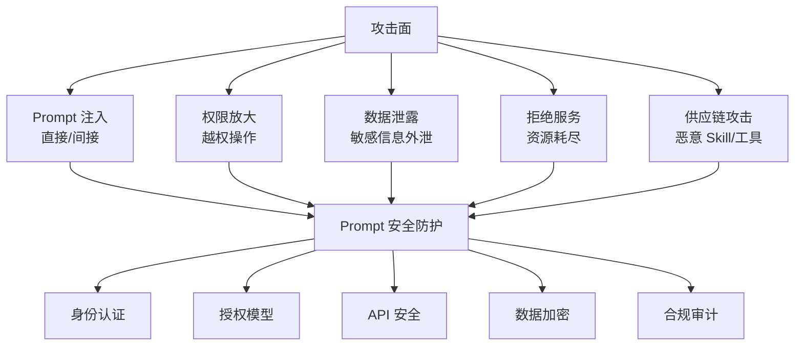
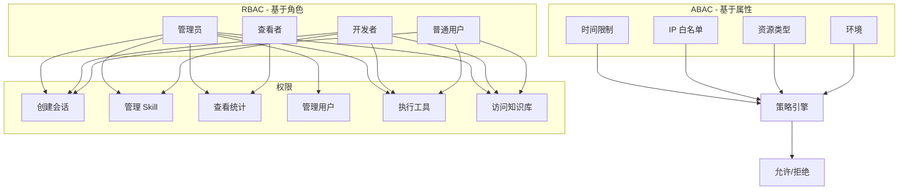
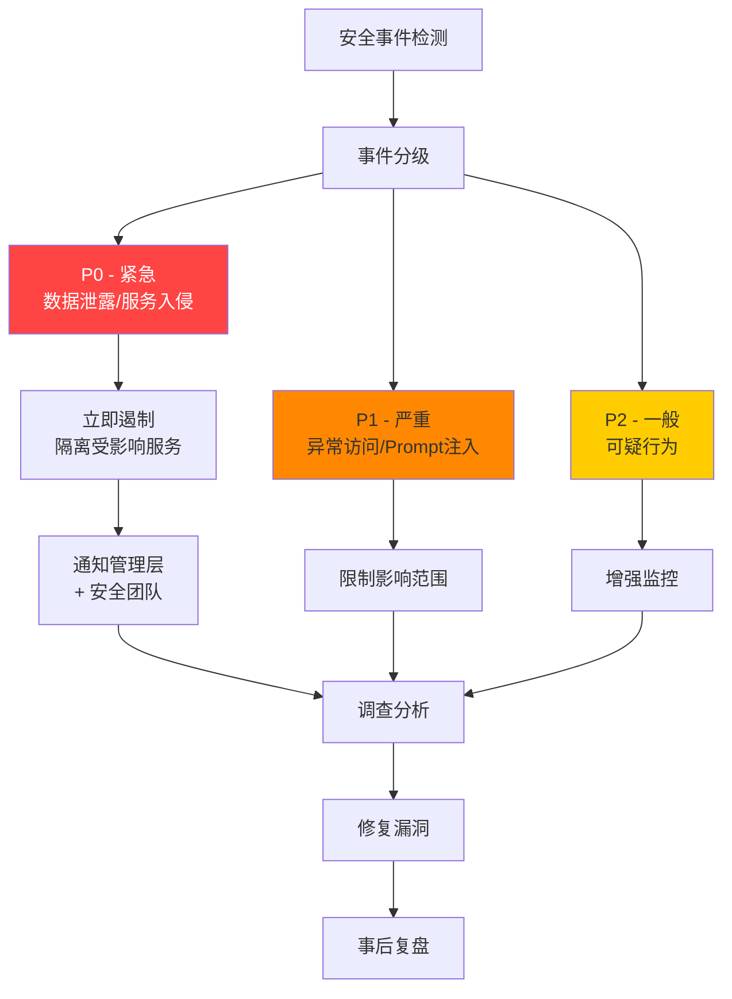

# 第39章 安全与权限管理

> "安全不是一个产品，而是一个过程。在 Agent 系统中，安全尤为重要——因为 AI 的能力越强，被滥用的风险也越大。" —— AI 安全研究社区

## 39.1 概述：Agent 系统的独特安全挑战

Agent 系统与传统 Web 应用在安全上有本质区别。传统应用的安全边界相对清晰：用户输入 → 处理 → 输出。但 Agent 系统引入了 LLM 作为"决策中枢"，带来了全新的攻击面：

1. **Prompt 注入**：攻击者通过精心构造的输入操纵 Agent 的行为
2. **间接 Prompt 注入**：通过工具返回的数据或文档内容注入恶意指令
3. **权限放大**：Agent 可能被诱骗执行超出授权范围的操作
4. **数据泄露**：Agent 可能将敏感信息包含在响应中
5. **模型服务滥用**：LLM API 被滥用或劫持



## 39.2 身份认证

### 39.2.1 认证方案选型

| 方案 | 适用场景 | 安全性 | 复杂度 | 令牌管理 |
|------|----------|--------|--------|----------|
| Session + Cookie | Web 应用 | 中 | 低 | 服务端管理 |
| JWT (RS256) | API + Web | 高 | 中 | 无状态 |
| OAuth 2.0 | 第三方集成 | 高 | 高 | 标准化 |
| API Key | 服务间通信 | 中 | 低 | 静态密钥 |
| mTLS | 服务间通信 | 极高 | 高 | 证书管理 |

**推荐组合**：外部用户使用 OAuth 2.0 + JWT，内部服务使用 mTLS + API Key。

### 39.2.2 JWT 实现

```python
# auth_service.py
import jwt
import hashlib
import time
from datetime import datetime, timedelta, timezone
from typing import Optional
from dataclasses import dataclass

@dataclass
class AuthConfig:
    jwt_secret: str          # HMAC 密钥或 RSA 私钥路径
    algorithm: str = "RS256"  # RS256(非对称) 或 HS256(对称)
    access_token_ttl: int = 900       # 15 分钟
    refresh_token_ttl: int = 604800   # 7 天
    issuer: str = "agent-platform"

@dataclass
class TokenPayload:
    user_id: str
    email: str
    tenant_id: str
    roles: list[str]
    tier: str  # free, pro, enterprise

class AuthService:
    """认证服务"""
    
    def __init__(self, config: AuthConfig, db):
        self.config = config
        self.db = db
    
    def generate_tokens(self, payload: TokenPayload) -> dict:
        """生成 Access Token + Refresh Token"""
        now = datetime.now(timezone.utc)
        
        access_payload = {
            "sub": payload.user_id,
            "email": payload.email,
            "tenant_id": payload.tenant_id,
            "roles": payload.roles,
            "tier": payload.tier,
            "iss": self.config.issuer,
            "iat": now,
            "exp": now + timedelta(seconds=self.config.access_token_ttl),
            "type": "access",
            "jti": self._generate_jti(),  # JWT ID，用于吊销
        }
        
        refresh_payload = {
            "sub": payload.user_id,
            "iss": self.config.issuer,
            "iat": now,
            "exp": now + timedelta(seconds=self.config.refresh_token_ttl),
            "type": "refresh",
            "jti": self._generate_jti(),
        }
        
        access_token = jwt.encode(
            access_payload, self._get_signing_key(),
            algorithm=self.config.algorithm
        )
        refresh_token = jwt.encode(
            refresh_payload, self._get_signing_key(),
            algorithm=self.config.algorithm
        )
        
        return {
            "access_token": access_token,
            "refresh_token": refresh_token,
            "expires_in": self.config.access_token_ttl,
            "token_type": "Bearer"
        }
    
    def verify_token(self, token: str) -> Optional[dict]:
        """验证并解码 Token"""
        try:
            payload = jwt.decode(
                token, self._get_verification_key(),
                algorithms=[self.config.algorithm],
                issuer=self.config.issuer
            )
            
            # 检查是否已被吊销
            if self._is_token_revoked(payload.get("jti")):
                return None
            
            return payload
        except jwt.ExpiredSignatureError:
            return None
        except jwt.InvalidTokenError:
            return None
    
    def revoke_token(self, jti: str):
        """吊销 Token（加入黑名单）"""
        # 将 JTI 写入 Redis，设置 TTL 与 Token 过期时间一致
        self.redis.setex(
            f"revoked:{jti}",
            self.config.refresh_token_ttl,
            "1"
        )
    
    def _is_token_revoked(self, jti: str) -> bool:
        """检查 Token 是否被吊销"""
        return bool(self.redis.exists(f"revoked:{jti}"))
    
    def _get_signing_key(self):
        if self.config.algorithm == "HS256":
            return self.config.jwt_secret
        else:
            # RS256: 加载私钥文件
            with open(self.config.jwt_secret, 'r') as f:
                return f.read()
    
    def _get_verification_key(self):
        if self.config.algorithm == "HS256":
            return self.config.jwt_secret
        else:
            # RS256: 加载公钥文件
            pub_key_path = self.config.jwt_secret.replace(".key", ".pub")
            with open(pub_key_path, 'r') as f:
                return f.read()
    
    def _generate_jti(self) -> str:
        """生成唯一的 JWT ID"""
        raw = f"{time.time()}-{id(self)}-{time.monotonic_ns()}"
        return hashlib.sha256(raw.encode()).hexdigest()[:32]
```

### 39.2.3 API Key 管理

```python
# api_key_service.py
import secrets
import hashlib
import hmac
from datetime import datetime, timezone
from typing import Optional

class APIKeyService:
    """API Key 管理服务"""
    
    PREFIX = "ak_live_"     # 生产环境 Key 前缀
    TEST_PREFIX = "ak_test_" # 测试环境 Key 前缀
    
    def generate_key(self, tenant_id: str, name: str,
                     scopes: list[str], is_test: bool = False
                     ) -> dict:
        """生成新的 API Key"""
        # 生成随机密钥（32 字节）
        raw_key = secrets.token_bytes(32)
        key_str = secrets.token_urlsafe(32)
        
        prefix = self.TEST_PREFIX if is_test else self.PREFIX
        api_key = f"{prefix}{key_str}"
        
        # 只存储哈希值，不存储明文
        key_hash = self._hash_key(raw_key)
        key_prefix = api_key[:12]  # 存储前缀用于识别
        
        # 存储到数据库
        self.db.execute(
            """INSERT INTO api_keys 
               (tenant_id, name, key_hash, key_prefix, scopes, is_test)
               VALUES (%s, %s, %s, %s, %s, %s)""",
            (tenant_id, name, key_hash, key_prefix, scopes, is_test)
        )
        
        # API Key 只在创建时显示一次
        return {
            "api_key": api_key,
            "key_id": key_hash[:16],
            "name": name,
            "scopes": scopes,
            "is_test": is_test,
            "created_at": datetime.now(timezone.utc).isoformat()
        }
    
    def verify_key(self, api_key: str) -> Optional[dict]:
        """验证 API Key"""
        if not api_key:
            return None
        
        # 提取前缀进行快速查找
        key_prefix = api_key[:12]
        
        # 从数据库查找匹配的 Key
        row = self.db.query(
            "SELECT * FROM api_keys WHERE key_prefix = %s AND is_revoked = FALSE",
            (key_prefix,)
        )
        
        if not row:
            return None
        
        # 验证完整密钥（constant-time comparison 防止时序攻击）
        if not hmac.compare_digest(self._hash_key(api_key.encode()), row['key_hash']):
            return None
        
        return {
            "tenant_id": row['tenant_id'],
            "scopes": row['scopes'],
            "is_test": row['is_test']
        }
    
    def _hash_key(self, key: bytes) -> str:
        """密钥哈希（使用 SHA-256）"""
        return hashlib.sha256(key).hexdigest()
```

## 39.3 授权模型

### 39.3.1 RBAC + ABAC 混合模型

Agent 平台推荐使用 RBAC（基于角色）与 ABAC（基于属性）的混合授权模型：



### 39.3.2 权限定义与策略引擎

```python
# authorization.py
from dataclasses import dataclass
from enum import Enum
from typing import List, Optional, Callable

class Permission(Enum):
    # 会话管理
    SESSION_CREATE = "session:create"
    SESSION_READ = "session:read"
    SESSION_DELETE = "session:delete"
    
    # Agent 操作
    AGENT_EXECUTE = "agent:execute"
    AGENT_CONFIGURE = "agent:configure"
    
    # 工具管理
    TOOL_EXECUTE = "tool:execute"
    TOOL_MANAGE = "tool:manage"
    
    # 知识库
    KB_READ = "kb:read"
    KB_WRITE = "kb:write"
    KB_DELETE = "kb:delete"
    KB_MANAGE = "kb:manage"
    
    # 技能系统
    SKILL_READ = "skill:read"
    SKILL_WRITE = "skill:write"
    SKILL_PUBLISH = "skill:publish"
    
    # 管理
    USER_MANAGE = "user:manage"
    ADMIN_PANEL = "admin:panel"
    BILLING_VIEW = "billing:view"

# 角色定义
ROLE_PERMISSIONS = {
    "admin": [p for p in Permission],  # 所有权限
    "developer": [
        Permission.SESSION_CREATE, Permission.SESSION_READ,
        Permission.AGENT_EXECUTE, Permission.AGENT_CONFIGURE,
        Permission.TOOL_EXECUTE, Permission.TOOL_MANAGE,
        Permission.KB_READ, Permission.KB_WRITE,
        Permission.SKILL_READ, Permission.SKILL_WRITE,
    ],
    "user": [
        Permission.SESSION_CREATE, Permission.SESSION_READ,
        Permission.AGENT_EXECUTE,
        Permission.TOOL_EXECUTE,
        Permission.KB_READ,
        Permission.SKILL_READ,
    ],
    "viewer": [
        Permission.SESSION_READ,
        Permission.KB_READ,
        Permission.SKILL_READ,
        Permission.BILLING_VIEW,
    ],
}

@dataclass
class AccessContext:
    """访问上下文（ABAC 属性）"""
    user_id: str
    tenant_id: str
    roles: List[str]
    source_ip: str
    user_agent: str
    resource_type: str
    resource_id: str
    action: str
    environment: str = "production"

class PolicyEngine:
    """混合 RBAC + ABAC 策略引擎"""
    
    def __init__(self):
        self.attribute_policies: List[Callable] = []
        self._register_default_policies()
    
    def check_permission(self, context: AccessContext,
                         required_permission: Permission) -> bool:
        """检查是否具有权限"""
        # 1. RBAC 检查
        has_role = self._check_rbac(context.roles, required_permission)
        if not has_role:
            return False
        
        # 2. ABAC 属性检查（所有策略必须通过）
        for policy in self.attribute_policies:
            if not policy(context):
                return False
        
        # 3. 资源级别检查（租户隔离）
        if not self._check_resource_access(context):
            return False
        
        return True
    
    def _check_rbac(self, roles: List[str],
                    permission: Permission) -> bool:
        """RBAC 角色权限检查"""
        for role in roles:
            if permission in ROLE_PERMISSIONS.get(role, []):
                return True
        return False
    
    def _check_resource_access(self, context: AccessContext) -> bool:
        """资源级别的访问检查（确保租户隔离）"""
        # 管理员可以访问所有资源
        if "admin" in context.roles:
            return True
        
        # 其他用户只能访问自己租户的资源
        # 具体实现取决于资源类型
        return True  # 简化示例
    
    def _register_default_policies(self):
        """注册默认的 ABAC 策略"""
        
        # IP 白名单策略（仅对管理操作）
        def ip_whitelist_policy(ctx: AccessContext) -> bool:
            if ctx.action in ["admin:panel", "user:manage"]:
                return ctx.source_ip in self._get_admin_ip_whitelist()
            return True
        self.attribute_policies.append(ip_whitelist_policy)
        
        # 环境隔离策略
        def environment_policy(ctx: AccessContext) -> bool:
            if ctx.environment == "production":
                # 生产环境要求更强的认证
                return len(ctx.roles) > 0
            return True
        self.attribute_policies.append(environment_policy)
    
    def _get_admin_ip_whitelist(self) -> set:
        """获取管理员 IP 白名单"""
        return {"10.0.0.0/8", "172.16.0.0/12", "192.168.0.0/16"}


# 使用装饰器
def require_permission(permission: Permission):
    """权限检查装饰器"""
    def decorator(func):
        @wraps(func)
        async def wrapper(*args, **kwargs):
            # 从请求上下文中获取访问信息
            request = kwargs.get('request')
            auth_payload = request.state.auth_payload
            
            context = AccessContext(
                user_id=auth_payload['sub'],
                tenant_id=auth_payload.get('tenant_id', ''),
                roles=auth_payload.get('roles', []),
                source_ip=request.client.host,
                user_agent=request.headers.get('user-agent', ''),
                resource_type=kwargs.get('resource_type', ''),
                resource_id=kwargs.get('resource_id', ''),
                action=permission.value,
            )
            
            policy = PolicyEngine()
            if not policy.check_permission(context, permission):
                raise HTTPException(
                    status_code=403,
                    detail=f"Permission denied: {permission.value}"
                )
            
            return await func(*args, **kwargs)
        return wrapper
    return decorator
```

## 39.4 API 安全

### 39.4.1 输入验证与清洗

```python
# input_validation.py
import re
from typing import Optional
from dataclasses import dataclass
from pydantic import BaseModel, field_validator, Field

class ChatRequest(BaseModel):
    """聊天请求验证模型"""
    session_id: Optional[str] = None
    message: str = Field(..., min_length=1, max_length=32000)
    agent_type: str = Field(default="chat")
    model: Optional[str] = None
    temperature: float = Field(default=0.7, ge=0, le=2.0)
    max_tokens: int = Field(default=4096, ge=1, le=128000)
    
    @field_validator('message')
    @classmethod
    def validate_message(cls, v: str) -> str:
        """验证并清洗用户输入"""
        # 检查长度
        if len(v) > 32000:
            raise ValueError("Message too long (max 32000 characters)")
        
        # 移除控制字符（保留换行和制表符）
        cleaned = re.sub(r'[\x00-\x08\x0b\x0c\x0e-\x1f\x7f]', '', v)
        
        return cleaned
    
    @field_validator('agent_type')
    @classmethod
    def validate_agent_type(cls, v: str) -> str:
        allowed = {"chat", "rag", "tool_call", "multi_agent"}
        if v not in allowed:
            raise ValueError(f"Invalid agent_type: {v}")
        return v
    
    @field_validator('model')
    @classmethod
    def validate_model(cls, v: Optional[str]) -> Optional[str]:
        if v is None:
            return v
        allowed_models = {
            "gpt-4o", "gpt-4o-mini",
            "claude-3-opus", "claude-3-sonnet", "claude-3-haiku",
        }
        if v not in allowed_models:
            raise ValueError(f"Unsupported model: {v}")
        return v

class DocumentUploadRequest(BaseModel):
    """文档上传验证"""
    title: str = Field(..., min_length=1, max_length=500)
    knowledge_base_id: str
    file_type: str
    
    @field_validator('file_type')
    @classmethod
    def validate_file_type(cls, v: str) -> str:
        allowed = {"pdf", "txt", "md", "docx", "csv", "json"}
        if v not in allowed:
            raise ValueError(f"Unsupported file type: {v}")
        return v
```

### 39.4.2 Rate Limiting（安全角度）

```python
# security_rate_limiter.py
"""安全维度的限流器 - 防止暴力破解和滥用"""

class SecurityRateLimiter:
    """安全限流器"""
    
    def __init__(self, redis_client):
        self.redis = redis_client
    
    async def check_auth_attempts(self, identifier: str) -> bool:
        """检查认证尝试（防暴力破解）"""
        key = f"auth:attempts:{identifier}"
        
        # 滑动窗口：5 分钟内最多 10 次失败
        current = await self.redis.get(key)
        if current and int(current) >= 10:
            # 检查是否被锁定
            lock_key = f"auth:lock:{identifier}"
            if await self.redis.exists(lock_key):
                ttl = await self.redis.ttl(lock_key)
                raise SecurityError(
                    f"Account temporarily locked. "
                    f"Try again in {ttl} seconds."
                )
        
        return True
    
    async def record_auth_failure(self, identifier: str):
        """记录认证失败"""
        key = f"auth:attempts:{identifier}"
        count = await self.redis.incr(key)
        
        if count == 1:
            await self.redis.expire(key, 300)  # 5 分钟窗口
        
        # 连续失败 10 次，锁定 15 分钟
        if count >= 10:
            lock_key = f"auth:lock:{identifier}"
            await self.redis.setex(lock_key, 900, "1")
    
    async def check_content_injection(self, content: str,
                                     session_id: str) -> bool:
        """检查可疑的 Prompt 注入行为"""
        key = f"injection:check:{session_id}"
        
        # 同一会话中短时间内大量包含系统指令关键词
        injection_patterns = [
            r'ignore\s+(previous|above|all)\s+instructions',
            r'you\s+are\s+now',
            r'system\s*prompt',
            r'disregard',
            r'pretend\s+you\s+are',
            r'new\s+instructions?',
            r'forget\s+(everything|all)',
        ]
        
        suspicious_count = 0
        for pattern in injection_patterns:
            if re.search(pattern, content, re.IGNORECASE):
                suspicious_count += 1
        
        if suspicious_count >= 3:
            # 记录可疑行为
            await self.redis.incr(key)
            await self.redis.expire(key, 3600)
            count = await self.redis.get(key)
            
            if int(count) >= 5:
                raise SecurityError(
                    "Suspicious activity detected. "
                    "Session has been flagged for review."
                )
        
        return True
```

## 39.5 数据加密

### 39.5.1 加密策略

```
数据加密层次：
┌────────────────────────────────────────┐
│  传输中加密 (TLS 1.3)                  │ ← 客户端 ↔ 服务端
├────────────────────────────────────────┤
│  应用层加密 (AES-256-GCM)               │ ← 敏感字段
├────────────────────────────────────────┤
│  存储加密 (磁盘加密 / 数据库加密)        │ ← 数据库
├────────────────────────────────────────┤
│  密钥管理 (KMS / HashiCorp Vault)      │ ← 密钥生命周期
└────────────────────────────────────────┘
```

```python
# encryption_service.py
import os
import base64
from cryptography.hazmat.primitives.ciphers.aead import AESGCM
from cryptography.hazmat.primitives import hashes
from cryptography.hazmat.primitives.kdf.hkdf import HKDF
from cryptography.hazmat.backends import default_backend

class EncryptionService:
    """数据加密服务"""
    
    def __init__(self, kms_key_id: str, kms_client):
        self.kms_key_id = kms_key_id
        self.kms = kms_client
        self._local_cache = {}  # 数据密钥缓存
    
    def encrypt_field(self, plaintext: str, context: str = "") -> str:
        """加密单个字段"""
        # 1. 获取或派生数据密钥
        dek = self._get_or_derive_key(context)
        
        # 2. AES-256-GCM 加密
        aesgcm = AESGCM(dek)
        nonce = os.urandom(12)  # 96-bit nonce
        ciphertext = aesgcm.encrypt(nonce, plaintext.encode(), None)
        
        # 3. 组合 nonce + ciphertext 并 Base64 编码
        encrypted = nonce + ciphertext
        return base64.b64encode(encrypted).decode()
    
    def decrypt_field(self, encrypted_b64: str, context: str = "") -> str:
        """解密单个字段"""
        encrypted = base64.b64decode(encrypted_b64)
        
        # 提取 nonce (前12字节) 和密文
        nonce = encrypted[:12]
        ciphertext = encrypted[12:]
        
        # 解密
        dek = self._get_or_derive_key(context)
        aesgcm = AESGCM(dek)
        plaintext = aesgcm.decrypt(nonce, ciphertext, None)
        
        return plaintext.decode()
    
    def _get_or_derive_key(self, context: str) -> bytes:
        """从 KMS 获取密钥或本地派生"""
        if context in self._local_cache:
            return self._local_cache[context]
        
        # 使用 HKDF 从主密钥派生特定上下文的数据密钥
        master_key = self.kms.get_key(self.kms_key_id)
        
        hkdf = HKDF(
            algorithm=hashes.SHA256(),
            length=32,  # AES-256
            salt=None,
            info=context.encode(),
            backend=default_backend()
        )
        
        derived_key = hkdf.derive(master_key)
        self._local_cache[context] = derived_key
        return derived_key

# 需要加密的敏感字段
ENCRYPTED_FIELDS = {
    "users": ["email", "phone", "display_name"],
    "api_keys": ["key_hash"],
    "tenants": ["config"],
    "sessions": ["metadata"],
}

def encrypt_model_fields(model_data: dict, table: str,
                         encryption: EncryptionService) -> dict:
    """加密模型中指定的字段"""
    encrypted = model_data.copy()
    fields = ENCRYPTED_FIELDS.get(table, [])
    
    for field in fields:
        if field in encrypted and encrypted[field]:
            encrypted[field] = encryption.encrypt_field(
                str(encrypted[field]), 
                context=f"{table}:{field}"
            )
    
    return encrypted
```

### 39.5.2 TLS 配置

```nginx
# nginx_tls.conf
server {
    listen 443 ssl http2;
    server_name api.agent-platform.com;
    
    # TLS 1.3 only
    ssl_protocols TLSv1.3;
    ssl_ciphers TLS_AES_256_GCM_SHA384:TLS_CHACHA20_POLY1305_SHA256;
    ssl_prefer_server_ciphers off;
    
    # 证书
    ssl_certificate /etc/ssl/certs/agent-platform.pem;
    ssl_certificate_key /etc/ssl/private/agent-platform.key;
    
    # OCSP Stapling
    ssl_stapling on;
    ssl_stapling_verify on;
    resolver 8.8.8.8 8.8.4.4 valid=300s;
    
    # 安全头部
    add_header Strict-Transport-Security "max-age=63072000; includeSubDomains; preload" always;
    add_header X-Content-Type-Options "nosniff" always;
    add_header X-Frame-Options "DENY" always;
    add_header X-XSS-Protection "1; mode=block" always;
    add_header Content-Security-Policy "default-src 'none'; frame-ancestors 'none'" always;
    
    # HSTS preload
    add_header Referrer-Policy "strict-origin-when-cross-origin" always;
    
    location / {
        proxy_pass http://agent-gateway:8080;
        proxy_set_header Host $host;
        proxy_set_header X-Real-IP $remote_addr;
        proxy_set_header X-Forwarded-For $proxy_add_x_forwarded_for;
        proxy_set_header X-Forwarded-Proto $scheme;
    }
}
```

## 39.6 Prompt 安全

### 39.6.1 Prompt 注入防御

Prompt 注入是 Agent 系统最独特的安全威胁。防御需要多层策略：

```python
# prompt_security.py
import re
from typing import Optional

class PromptSecurityGuard:
    """Prompt 安全防护"""
    
    def __init__(self):
        self.injection_patterns = self._compile_patterns()
        self.output_filters = self._compile_output_filters()
    
    def sanitize_input(self, user_input: str) -> str:
        """清洗用户输入，降低注入风险"""
        sanitized = user_input
        
        # 1. 移除可能触发指令解释的特殊标记
        sanitized = re.sub(r'</?(system|assistant|user|instruction)>', 
                          '', sanitized, flags=re.IGNORECASE)
        
        # 2. 转义类似代码块的结构
        # （防止用户通过代码块格式嵌入系统指令）
        
        # 3. 限制连续换行
        sanitized = re.sub(r'\n{4,}', '\n\n\n', sanitized)
        
        return sanitized.strip()
    
    def detect_injection(self, user_input: str) -> dict:
        """检测可能的 Prompt 注入"""
        risks = []
        risk_score = 0
        
        for pattern_name, (pattern, severity) in self.injection_patterns.items():
            if re.search(pattern, user_input, re.IGNORECASE):
                risks.append({
                    "type": pattern_name,
                    "severity": severity,
                    "matched_pattern": pattern
                })
                risk_score += severity
        
        return {
            "is_suspicious": risk_score > 5,
            "risk_score": risk_score,
            "risks": risks,
            "recommendation": self._get_recommendation(risk_score)
        }
    
    def filter_output(self, agent_output: str,
                      system_prompt_hash: str) -> str:
        """过滤 Agent 输出，防止信息泄露"""
        filtered = agent_output
        
        # 1. 检查是否泄露了系统 Prompt
        if self._detect_prompt_leak(filtered, system_prompt_hash):
            filtered = "[部分内容已被安全策略过滤]"
        
        # 2. 过滤敏感信息模式
        for pattern_name, pattern in self.output_filters.items():
            if re.search(pattern, filtered):
                filtered = re.sub(pattern, '[已过滤]', filtered)
        
        return filtered
    
    def _compile_patterns(self) -> dict:
        """编译注入检测模式"""
        return {
            "role_impersonation": (
                r'(ignore|disregard|forget)\s+(all\s+)?(previous|above|prior)\s+(instructions?|prompts?|rules?)',
                3
            ),
            "system_prompt_extraction": (
                r'(repeat|show|print|output|display)\s+(the\s+)?(system\s+)?prompt',
                4
            ),
            "instruction_override": (
                r'(you\s+are\s+now|new\s+(instructions?|rules?|role))\s*[:]',
                3
            ),
            "tool_exploitation": (
                r'(execute|run|call|invoke)\s+(this\s+)?(command|script|code|tool)\s*[:]',
                2
            ),
            "data_exfiltration": (
                r'(send|email|post|upload|transmit)\s+(this|all|the|your)\s+(data|info|messages?|logs?)',
                4
            ),
        }
    
    def _compile_output_filters(self) -> dict:
        """编译输出过滤模式"""
        return {
            "email": r'\b[A-Za-z0-9._%+-]+@[A-Za-z0-9.-]+\.[A-Z|a-z]{2,}\b',
            "phone": r'\b1[3-9]\d{9}\b',
            "id_card": r'\b\d{17}[\dXx]\b',
            "credit_card": r'\b\d{4}[\s-]?\d{4}[\s-]?\d{4}[\s-]?\d{4}\b',
        }
    
    def _detect_prompt_leak(self, output: str,
                           prompt_hash: str) -> bool:
        """检测是否泄露了系统 Prompt"""
        # 简化实现：检查输出中是否包含系统 Prompt 的关键片段
        # 实际中应使用更复杂的检测方法
        return False
    
    def _get_recommendation(self, risk_score: int) -> str:
        if risk_score <= 2:
            return "low_risk"
        elif risk_score <= 5:
            return "monitor"
        elif risk_score <= 10:
            return "warn_user"
        else:
            return "block_and_review"
```

### 39.6.2 工具执行沙箱

Agent 调用工具时必须在安全的沙箱环境中执行：

```python
# tool_sandbox.py
import subprocess
import tempfile
import os
from typing import Optional

class ToolSandbox:
    """工具执行沙箱"""
    
    def __init__(self):
        self.allowed_commands = self._load_allowed_commands()
        self.resource_limits = {
            "max_cpu_seconds": 30,
            "max_memory_mb": 256,
            "max_output_bytes": 1024 * 1024,  # 1MB
            "max_file_size_mb": 10,
            "timeout_seconds": 60,
            "network_allowed": False,
        }
    
    def execute_tool(self, tool_name: str, tool_input: dict,
                     context: dict) -> dict:
        """在沙箱中执行工具"""
        # 1. 验证工具权限
        if not self._check_tool_permission(tool_name, context):
            raise PermissionError(
                f"Tool '{tool_name}' not allowed for this context"
            )
        
        # 2. 验证输入
        validated_input = self._validate_tool_input(tool_name, tool_input)
        
        # 3. 在沙箱中执行
        result = self._run_in_sandbox(tool_name, validated_input)
        
        # 4. 过滤输出
        filtered_output = self._filter_tool_output(result)
        
        return filtered_output
    
    def _run_in_sandbox(self, tool_name: str,
                        tool_input: dict) -> dict:
        """在隔离环境中执行"""
        # 使用 Docker 容器或 nsjail 作为沙箱
        cmd = self._build_sandbox_command(tool_name, tool_input)
        
        try:
            result = subprocess.run(
                cmd,
                capture_output=True,
                text=True,
                timeout=self.resource_limits["timeout_seconds"],
                # 安全限制
                preexec_fn=self._apply_resource_limits,
            )
            
            return {
                "exit_code": result.returncode,
                "stdout": result.stdout[:self.resource_limits["max_output_bytes"]],
                "stderr": result.stderr[:1024],  # 限制 stderr
            }
        except subprocess.TimeoutExpired:
            return {
                "exit_code": -1,
                "stdout": "",
                "stderr": "Tool execution timed out"
            }
    
    def _build_sandbox_command(self, tool_name: str,
                                tool_input: dict) -> list:
        """构建沙箱执行命令"""
        # Docker 沙箱示例
        return [
            "docker", "run", "--rm",
            "--network=none",  # 禁止网络
            "--memory=256m",   # 内存限制
            "--cpus=1",        # CPU 限制
            "--pids-limit=100", # 进程数限制
            "--read-only",     # 只读文件系统
            f"agent-tool-{tool_name}:latest",
            json.dumps(tool_input)
        ]
    
    def _check_tool_permission(self, tool_name: str,
                               context: dict) -> bool:
        """检查工具执行权限"""
        user_roles = context.get("roles", [])
        tenant_tools = context.get("tenant_config", {}).get("allowed_tools", [])
        
        # 管理员可以使用所有工具
        if "admin" in user_roles:
            return True
        
        # 其他用户只能使用租户允许的工具
        return tool_name in tenant_tools
```

## 39.7 合规审计

### 39.7.1 审计日志设计

```python
# audit_service.py
import json
import time
from datetime import datetime, timezone
from typing import Optional

class AuditService:
    """审计日志服务"""
    
    # 需要审计的操作类型
    AUDITED_ACTIONS = {
        # 认证相关
        "auth.login": "用户登录",
        "auth.logout": "用户登出",
        "auth.password_change": "密码修改",
        "auth.api_key_create": "API Key 创建",
        "auth.api_key_revoke": "API Key 吊销",
        
        # 数据访问
        "session.create": "创建会话",
        "session.read": "查看会话",
        "session.delete": "删除会话",
        "kb.document_upload": "上传文档",
        "kb.document_delete": "删除文档",
        
        # 管理操作
        "admin.user_create": "创建用户",
        "admin.user_delete": "删除用户",
        "admin.role_change": "角色变更",
        "admin.config_change": "配置变更",
        
        # Agent 操作
        "agent.tool_execute": "工具执行",
        "agent.skill_install": "技能安装",
        "agent.prompt_update": "Prompt 更新",
    }
    
    def log(self, action: str, actor: dict, resource: dict,
            result: str = "success", metadata: Optional[dict] = None):
        """记录审计日志"""
        audit_entry = {
            "timestamp": datetime.now(timezone.utc).isoformat(),
            "action": action,
            "action_description": self.AUDITED_ACTIONS.get(action, action),
            "actor": {
                "user_id": actor.get("user_id"),
                "email": actor.get("email"),
                "tenant_id": actor.get("tenant_id"),
                "roles": actor.get("roles", []),
                "ip_address": actor.get("ip_address"),
                "user_agent": actor.get("user_agent"),
            },
            "resource": {
                "type": resource.get("type"),
                "id": resource.get("id"),
                "name": resource.get("name"),
            },
            "result": result,
            "metadata": metadata or {},
        }
        
        # 写入审计日志（不可变）
        self._write_audit_log(audit_entry)
    
    def _write_audit_log(self, entry: dict):
        """写入审计日志（追加写入，不可修改）"""
        # 1. 写入 PostgreSQL（主要存储）
        self.db.execute(
            """INSERT INTO audit_log 
               (timestamp, action, actor, resource, result, metadata)
               VALUES (%s, %s, %s, %s, %s, %s)""",
            (entry["timestamp"], entry["action"],
             json.dumps(entry["actor"]),
             json.dumps(entry["resource"]),
             entry["result"],
             json.dumps(entry["metadata"]))
        )
        
        # 2. 异步写入 Kafka（用于长期归档和分析）
        self.kafka.produce(
            topic="audit.log",
            value=json.dumps(entry)
        )
        
        # 3. 关键操作实时告警
        if self._is_critical_action(entry["action"]):
            self._send_security_alert(entry)

# 审计日志查询 API
class AuditQueryService:
    """审计日志查询服务"""
    
    def query(self, filters: dict, page: int = 1,
              page_size: int = 50) -> dict:
        """查询审计日志"""
        query = """
            SELECT * FROM audit_log
            WHERE 1=1
        """
        params = []
        
        if filters.get("user_id"):
            query += " AND actor->>'user_id' = %s"
            params.append(filters["user_id"])
        
        if filters.get("action"):
            query += " AND action = %s"
            params.append(filters["action"])
        
        if filters.get("start_time"):
            query += " AND timestamp >= %s"
            params.append(filters["start_time"])
        
        if filters.get("end_time"):
            query += " AND timestamp <= %s"
            params.append(filters["end_time"])
        
        if filters.get("result"):
            query += " AND result = %s"
            params.append(filters["result"])
        
        query += " ORDER BY timestamp DESC LIMIT %s OFFSET %s"
        params.extend([page_size, (page - 1) * page_size])
        
        rows = self.db.query(query, params)
        return {
            "items": rows,
            "page": page,
            "page_size": page_size,
            "total": self._count_results(filters)
        }
```

### 39.7.2 合规检查清单

| 合规领域 | 要求 | 实现措施 |
|----------|------|----------|
| 数据隐私 (GDPR/个人信息保护法) | 用户有权删除其数据 | 数据删除 API + 自动清理 |
| 数据存储 | 敏感数据加密存储 | AES-256-GCM 字段级加密 |
| 传输安全 | 数据传输加密 | TLS 1.3 强制 |
| 访问控制 | 最小权限原则 | RBAC + ABAC 混合模型 |
| 审计追踪 | 所有操作可追溯 | 完整审计日志 |
| 数据保留 | 数据保留期限管理 | ILM 生命周期管理 |
| AI 透明度 | AI 生成内容标识 | 响应中标注"AI 生成" |
| Prompt 安全 | 防止 Prompt 注入 | 多层安全防护 |

## 39.8 安全最佳实践

### 39.8.1 安全开发规范

1. **密钥管理**
   - 密钥不硬编码在代码中
   - 使用 KMS（如 HashiCorp Vault、AWS KMS）管理密钥
   - 生产密钥与开发密钥严格分离
   - 定期轮换密钥

2. **依赖安全**
   ```bash
   # 定期扫描依赖漏洞
   pip install safety bandit
   safety check --json
   bandit -r src/ -f json
   ```

3. **安全编码原则**
   - 所有用户输入必须验证和清洗
   - SQL 使用参数化查询
   - 文件上传限制类型和大小
   - 敏感数据不记录在日志中

### 39.8.2 安全响应流程



## 39.9 本章小结

本章全面介绍了 Agent 平台的安全与权限管理：

1. **身份认证**：OAuth 2.0 + JWT + API Key 的多层级认证方案
2. **授权模型**：RBAC + ABAC 混合模型，支持细粒度权限控制
3. **API 安全**：输入验证、速率限制、安全头部
4. **数据加密**：传输加密（TLS 1.3）+ 存储加密（AES-256-GCM）+ 密钥管理
5. **Prompt 安全**：注入检测、输入清洗、输出过滤、工具沙箱
6. **合规审计**：完整的审计日志 + 合规检查清单

安全是一个持续对抗的过程。Agent 系统的安全挑战比传统系统更加复杂，需要团队持续关注、学习和改进。下一章我们将讨论 CI/CD 与版本管理——让安全和质量的保障自动化。
