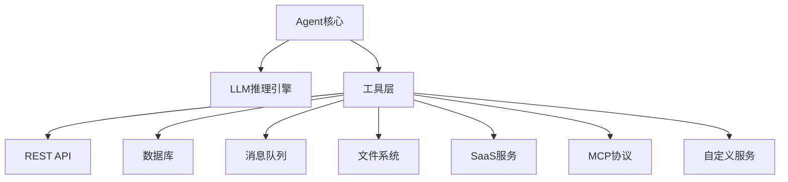

# 第13章：Agent与外部系统集成

## 概述

Agent 的价值不仅在于其推理能力，更在于它能与外部世界交互——调用API、查询数据库、发送消息、操作文件。一个孤立的 Agent 只是一个"聊天机器人"，而一个连接了外部系统的 Agent 才是真正的"数字员工"。本章将系统地讲解 Agent 与各类外部系统集成的方法、模式和最佳实践，涵盖 REST API、数据库、消息队列、MCP 协议和第三方 SaaS 等典型场景。

## 13.1 集成的必要性与挑战

### 13.1.1 为什么Agent需要集成外部系统

Agent 的本质是"LLM大脑 + 工具手脚"。没有外部工具的 Agent 就像一个聪明但没有手脚的学者——知识渊博但无法行动。



典型的集成需求包括：
- **数据获取**：从数据库、搜索引擎、文件系统中获取信息
- **操作执行**：创建工单、发送邮件、更新记录
- **通知推送**：将 Agent 的决策结果通知到 Slack/钉钉/飞书
- **工作流协作**：与 CI/CD 流水线、审批流程集成

### 13.1.2 核心挑战

| 挑战 | 描述 | 典型解决方案 |
|------|------|-------------|
| API多样性 | 不同的认证方式、数据格式、错误码 | 统一适配层 |
| 认证安全 | 凭证管理、Token刷新、权限控制 | Secret Manager + OAuth |
| 数据格式 | JSON/XML/Protobuf，Schema差异 | 数据转换层 |
| 错误处理 | 超时、限流、服务不可用 | 重试 + 熔断 + 降级 |
| 幂等性 | 重复调用导致副作用 | 幂等设计 + 请求去重 |
| 数据一致性 | 分布式事务 | 最终一致性 + 补偿 |

### 13.1.3 集成架构总览

```python
from dataclasses import dataclass, field
from typing import Any, Protocol
from abc import ABC, abstractmethod
from enum import Enum

class IntegrationType(Enum):
    REST_API = "rest_api"
    DATABASE = "database"
    MESSAGE_QUEUE = "message_queue"
    MCP = "mcp"
    SaaS = "saas"
    FILE_SYSTEM = "file_system"

@dataclass
class IntegrationConfig:
    """集成配置"""
    name: str
    type: IntegrationType
    base_url: str | None = None
    auth_type: str = "none"  # none, api_key, oauth2, basic
    timeout: float = 30.0
    retry_count: int = 3
    rate_limit: int = 100  # 每分钟最大请求数

class IntegrationBase(ABC):
    """集成基类：定义统一接口"""
    
    def __init__(self, config: IntegrationConfig):
        self.config = config
        self._circuit_breaker = CircuitBreaker(
            failure_threshold=5,
            recovery_timeout=60
        )
    
    @abstractmethod
    async def connect(self) -> None:
        """建立连接"""
        ...
    
    @abstractmethod
    async def execute(self, action: str, params: dict) -> dict:
        """执行操作"""
        ...
    
    @abstractmethod
    async def health_check(self) -> bool:
        """健康检查"""
        ...
```

## 13.2 REST API集成

### 13.2.1 HTTP客户端设计

```python
import httpx
import asyncio
from typing import Any

class APIIntegration(IntegrationBase):
    """REST API集成"""
    
    def __init__(self, config: IntegrationConfig, credentials: dict):
        super().__init__(config)
        self.credentials = credentials
        self._client: httpx.AsyncClient | None = None
        self._rate_limiter = RateLimiter(config.rate_limit)
    
    async def connect(self) -> None:
        """初始化HTTP客户端"""
        headers = {}
        
        # 根据认证类型设置请求头
        if self.config.auth_type == "api_key":
            key = self.credentials["api_key"]
            header_name = self.credentials.get("header_name", "Authorization")
            prefix = self.credentials.get("prefix", "Bearer")
            headers[header_name] = f"{prefix} {key}"
        elif self.config.auth_type == "basic":
            import base64
            creds = base64.b64encode(
                f"{self.credentials['username']}:{self.credentials['password']}"
                .encode()
            ).decode()
            headers["Authorization"] = f"Basic {creds}"
        
        self._client = httpx.AsyncClient(
            base_url=self.config.base_url,
            headers=headers,
            timeout=httpx.Timeout(self.config.timeout),
        )
    
    async def execute(self, action: str, params: dict) -> dict:
        """执行API调用"""
        await self._rate_limiter.wait()
        
        method = params.pop("method", "GET")
        path = params.pop("path", action)
        
        for attempt in range(self.config.retry_count):
            try:
                response = await self._client.request(
                    method, path, **params
                )
                response.raise_for_status()
                return response.json()
            
            except httpx.HTTPStatusError as e:
                if e.response.status_code == 429:  # Rate limited
                    retry_after = int(e.response.headers.get("Retry-After", "60"))
                    await asyncio.sleep(retry_after)
                    continue
                elif e.response.status_code >= 500:  # Server error
                    await asyncio.sleep(2 ** attempt)  # Exponential backoff
                    continue
                else:
                    raise
    
    async def health_check(self) -> bool:
        try:
            response = await self._client.get("/health")
            return response.status_code == 200
        except Exception:
            return False
```

### 13.2.2 OAuth2集成

```python
from datetime import datetime
import httpx

class OAuth2Manager:
    """OAuth2 Token管理"""
    
    def __init__(self, token_url: str, client_id: str, 
                 client_secret: str, scopes: list[str]):
        self.token_url = token_url
        self.client_id = client_id
        self.client_secret = client_secret
        self.scopes = scopes
        self._token: str | None = None
        self._expires_at: datetime | None = None
    
    async def get_token(self) -> str:
        """获取有效Token（自动刷新）"""
        if self._token and self._expires_at:
            if datetime.now() < self._expires_at:
                return self._token
        
        # 请求新Token
        async with httpx.AsyncClient() as client:
            response = await client.post(
                self.token_url,
                data={
                    "grant_type": "client_credentials",
                    "client_id": self.client_id,
                    "client_secret": self.client_secret,
                    "scope": " ".join(self.scopes),
                }
            )
            token_data = response.json()
            self._token = token_data["access_token"]
            expires_in = token_data.get("expires_in", 3600)
            self._expires_at = datetime.now().timestamp() + expires_in - 300
        
        return self._token

# 使用示例：集成GitHub API
github_oauth = OAuth2Manager(
    token_url="https://github.com/login/oauth/access_token",
    client_id="your_client_id",
    client_secret="your_client_secret",
    scopes=["repo", "read:org"]
)

github_integration = APIIntegration(
    config=IntegrationConfig(
        name="github",
        type=IntegrationType.REST_API,
        base_url="https://api.github.com",
        auth_type="oauth2"
    ),
    credentials={"oauth_manager": github_oauth}
)
```

### 13.2.3 分页处理

```python
async def fetch_all_pages(
    client: httpx.AsyncClient,
    first_url: str,
    page_param: str = "page",
    per_page: int = 100
) -> list[dict]:
    """自动处理分页，获取所有结果"""
    all_results = []
    page = 1
    
    while True:
        response = await client.get(
            first_url, 
            params={page_param: page, "per_page": per_page}
        )
        data = response.json()
        
        if not data:
            break
        
        all_results.extend(data)
        
        # 检查是否还有更多页
        link_header = response.headers.get("Link", "")
        if 'rel="next"' not in link_header:
            break
        
        page += 1
    
    return all_results
```

## 13.3 数据库集成

### 13.3.1 SQL查询Agent

```python
import asyncpg
from pydantic import BaseModel

class SQLQueryAgent:
    """数据库查询Agent"""
    
    def __init__(self, connection_string: str, 
                 read_only: bool = True):
        self.connection_string = connection_string
        self.read_only = read_only
        self.pool: asyncpg.Pool | None = None
    
    async def connect(self):
        self.pool = await asyncpg.create_pool(self.connection_string)
    
    async def get_schema(self, table_name: str | None = None) -> str:
        """获取数据库Schema信息（供LLM理解表结构）"""
        async with self.pool.acquire() as conn:
            if table_name:
                columns = await conn.fetch("""
                    SELECT column_name, data_type, is_nullable
                    FROM information_schema.columns
                    WHERE table_name = $1
                    ORDER BY ordinal_position
                """, table_name)
                return self._format_schema(table_name, columns)
            else:
                tables = await conn.fetch("""
                    SELECT table_name FROM information_schema.tables
                    WHERE table_schema = 'public'
                """)
                schema_parts = []
                for t in tables:
                    cols = await conn.fetch("""
                        SELECT column_name, data_type, is_nullable
                        FROM information_schema.columns
                        WHERE table_name = $1
                        ORDER BY ordinal_position
                    """, t["table_name"])
                    schema_parts.append(
                        self._format_schema(t["table_name"], cols)
                    )
                return "\n\n".join(schema_parts)
    
    async def execute_query(self, sql: str) -> list[dict]:
        """执行SQL查询（只读模式会验证SQL）"""
        if self.read_only:
            normalized = sql.strip().upper()
            if any(normalized.startswith(kw) 
                   for kw in ["INSERT", "UPDATE", "DELETE", "DROP", "ALTER", "CREATE"]):
                raise ValueError("只读模式不允许执行写操作")
        
        async with self.pool.acquire() as conn:
            rows = await conn.fetch(sql)
            return [dict(row) for row in rows]
    
    def _format_schema(self, table: str, columns) -> str:
        lines = [f"表: {table}"]
        for col in columns:
            nullable = "NULL" if col["is_nullable"] == "YES" else "NOT NULL"
            lines.append(f"  - {col['column_name']}: {col['data_type']} {nullable}")
        return "\n".join(lines)

# Agent工具集成
class DatabaseTool:
    def __init__(self, db_agent: SQLQueryAgent):
        self.db = db_agent
    
    async def query(self, question: str, llm) -> str:
        """让LLM根据Schema生成SQL并执行"""
        schema = await self.db.get_schema()
        
        prompt = f"""
        数据库Schema:
        {schema}
        
        用户问题: {question}
        
        请生成SQL查询语句。只返回SQL，不要解释。
        如果问题无法通过SQL回答，返回 "UNANSWERABLE"。
        """
        
        sql = await llm.generate(prompt)
        if sql.strip() == "UNANSWERABLE":
            return "抱歉，该问题无法通过数据库查询回答。"
        
        # 安全检查：防止SQL注入（使用参数化查询更安全）
        try:
            results = await self.db.execute_query(sql)
            if not results:
                return "查询结果为空。"
            return f"查询到 {len(results)} 条记录：\n" + \
                   "\n".join(str(r) for r in results[:20])
        except Exception as e:
            return f"查询执行失败: {e}"
```

### 13.3.2 NoSQL集成

```python
from motor.motor_asyncio import AsyncIOMotorClient

class MongoDBIntegration:
    """MongoDB集成"""
    
    def __init__(self, uri: str, database: str):
        self.client = AsyncIOMotorClient(uri)
        self.db = self.client[database]
    
    async def find(self, collection: str, query: dict,
                   projection: dict | None = None,
                   limit: int = 10) -> list[dict]:
        """查询文档"""
        cursor = self.db[collection].find(query, projection).limit(limit)
        return await cursor.to_list(length=limit)
    
    async def aggregate(self, collection: str, 
                        pipeline: list[dict]) -> list[dict]:
        """聚合查询"""
        cursor = self.db[collection].aggregate(pipeline)
        return await cursor.to_list(length=100)
    
    async def insert(self, collection: str, document: dict) -> str:
        """插入文档"""
        result = await self.db[collection].insert_one(document)
        return str(result.inserted_id)
```

## 13.4 消息队列与事件系统集成

### 13.4.1 Kafka集成

```python
from aiokafka import AIOKafkaProducer, AIOKafkaConsumer
import json

class KafkaIntegration(IntegrationBase):
    """Kafka消息队列集成"""
    
    def __init__(self, config: IntegrationConfig, 
                 bootstrap_servers: str):
        super().__init__(config)
        self.bootstrap_servers = bootstrap_servers
        self._producer: AIOKafkaProducer | None = None
    
    async def connect(self):
        self._producer = AIOKafkaProducer(
            bootstrap_servers=self.bootstrap_servers,
            value_serializer=lambda v: json.dumps(v).encode()
        )
        await self._producer.start()
    
    async def execute(self, action: str, params: dict) -> dict:
        if action == "publish":
            await self._producer.send_and_wait(
                topic=params["topic"],
                value=params["message"]
            )
            return {"status": "published"}
        elif action == "consume":
            results = await self._consume_messages(
                params["topic"], 
                params.get("group_id", "agent-group"),
                max_messages=params.get("max_messages", 10)
            )
            return {"messages": results}
    
    async def _consume_messages(self, topic: str, group_id: str,
                                 max_messages: int) -> list:
        consumer = AIOKafkaConsumer(
            topic,
            bootstrap_servers=self.bootstrap_servers,
            group_id=group_id,
            value_deserializer=lambda m: json.loads(m.decode())
        )
        await consumer.start()
        
        messages = []
        async for msg in consumer:
            messages.append(msg.value)
            if len(messages) >= max_messages:
                break
        
        await consumer.stop()
        return messages
    
    async def health_check(self) -> bool:
        try:
            await self._producer.send_and_wait(
                "__health_check_topic", b"ping"
            )
            return True
        except Exception:
            return False
```

### 13.4.2 异步事件处理模式

```python
import asyncio
from typing import Callable

class EventBus:
    """Agent事件总线"""
    
    def __init__(self):
        self._subscribers: dict[str, list[Callable]] = {}
        self._queue: asyncio.Queue = asyncio.Queue()
        self._running = False
    
    def subscribe(self, event_type: str, handler: Callable):
        if event_type not in self._subscribers:
            self._subscribers[event_type] = []
        self._subscribers[event_type].append(handler)
    
    async def publish(self, event_type: str, data: dict):
        await self._queue.put({"type": event_type, "data": data})
    
    async def start(self):
        self._running = True
        while self._running:
            event = await self._queue.get()
            handlers = self._subscribers.get(event["type"], [])
            for handler in handlers:
                try:
                    await handler(event["data"])
                except Exception as e:
                    print(f"事件处理失败: {event['type']} - {e}")

# 使用：Agent产生的事件可以被其他系统消费
event_bus = EventBus()

@event_bus.subscribe("agent.task_completed")
async def notify_external_system(data: dict):
    """当Agent完成任务时，通知外部系统"""
    await webhook_sender.send(
        url=data["webhook_url"],
        payload={
            "task_id": data["task_id"],
            "result": data["result"],
            "timestamp": datetime.now().isoformat()
        }
    )
```

## 13.5 MCP协议集成

### 13.5.1 MCP协议简介

MCP（Model Context Protocol）是 Anthropic 提出的开放协议，标准化了 LLM/AI 模型与外部工具、数据源的集成方式。它定义了统一的接口规范，让 Agent 可以以标准化的方式发现和使用工具。

```python
# MCP工具的标准接口
class MCPTool:
    """MCP协议工具实现"""
    
    def __init__(self, server_url: str):
        self.server_url = server_url
        self._client = httpx.AsyncClient(base_url=server_url)
    
    async def list_tools(self) -> list[dict]:
        """列出所有可用工具"""
        response = await self._client.get("/tools")
        return response.json()["tools"]
    
    async def call_tool(self, tool_name: str, 
                        arguments: dict) -> dict:
        """调用工具"""
        response = await self._client.post("/tools/call", json={
            "name": tool_name,
            "arguments": arguments
        })
        return response.json()
    
    async def list_resources(self) -> list[dict]:
        """列出可用资源"""
        response = await self._client.get("/resources")
        return response.json()["resources"]
    
    async def read_resource(self, uri: str) -> dict:
        """读取资源内容"""
        response = await self._client.get("/resources/read", params={
            "uri": uri
        })
        return response.json()
```

### 13.5.2 MCP工具集成到Agent

```python
class MCPAgentIntegration:
    """将MCP服务器集成到Agent的工具系统中"""
    
    def __init__(self, mcp_server_urls: list[str]):
        self.mcp_tools: dict[str, MCPTool] = {}
        for url in mcp_server_urls:
            tool = MCPTool(url)
            self.mcp_tools[url] = tool
    
    async def discover_all_tools(self) -> list[dict]:
        """发现所有MCP服务器的工具"""
        all_tools = []
        for url, mcp in self.mcp_tools.items():
            tools = await mcp.list_tools()
            for tool in tools:
                tool["_mcp_server"] = url  # 标记来源
            all_tools.extend(tools)
        return all_tools
    
    async def execute_tool(self, mcp_server: str, 
                           tool_name: str,
                           args: dict) -> dict:
        """通过MCP协议执行工具"""
        return await self.mcp_tools[mcp_server].call_tool(
            tool_name, args
        )

# 使用示例
mcp_integration = MCPAgentIntegration([
    "http://localhost:3001",  # 文件系统MCP服务器
    "http://localhost:3002",  # 数据库MCP服务器
    "http://localhost:3003",  # Web搜索MCP服务器
])

# Agent发现工具
available_tools = await mcp_integration.discover_all_tools()
print(f"发现 {len(available_tools)} 个工具")

# Agent调用工具
result = await mcp_integration.execute_tool(
    mcp_server="http://localhost:3003",
    tool_name="web_search",
    args={"query": "Python Agent frameworks 2024"}
)
```

## 13.6 第三方SaaS集成

### 13.6.1 Slack集成

```python
from slack_bolt.async_app import AsyncApp
from slack_sdk.web.async_client import AsyncWebClient

class SlackIntegration:
    """Slack集成"""
    
    def __init__(self, bot_token: str, signing_secret: str):
        self.app = AsyncApp(signing_secret=signing_secret)
        self.client = AsyncWebClient(token=bot_token)
    
    async def send_message(self, channel: str, text: str,
                          blocks: list[dict] | None = None):
        """发送消息到Slack频道"""
        kwargs = {"channel": channel, "text": text}
        if blocks:
            kwargs["blocks"] = blocks
        return await self.client.chat_postMessage(**kwargs)
    
    async def update_message(self, channel: str, ts: str,
                             text: str, blocks: list[dict] | None = None):
        """更新已有消息"""
        kwargs = {"channel": channel, "ts": ts, "text": text}
        if blocks:
            kwargs["blocks"] = blocks
        return await self.client.chat_update(**kwargs)
    
    def on_message(self, pattern: str | None = None):
        """注册消息处理器"""
        def decorator(handler):
            @self.app.event("message")
            async def handle(event, say):
                if pattern and pattern not in event.get("text", ""):
                    return
                await handler(event, say)
            return handle
        return decorator

# Agent与Slack集成示例
slack = SlackIntegration(bot_token="xoxb-...", signing_secret="...")

@slack.on_message("@agent")
async def handle_agent_mention(event, say):
    """当用户@Agent时触发"""
    user_message = event["text"].replace("@agent", "").strip()
    
    # 调用Agent处理
    agent = get_agent()
    response = await agent.run(user_message)
    
    # 发送结果
    await say(response)
```

### 13.6.2 GitHub集成

```python
class GitHubIntegration:
    """GitHub API集成"""
    
    def __init__(self, token: str):
        self.headers = {
            "Authorization": f"token {token}",
            "Accept": "application/vnd.github.v3+json"
        }
        self.base_url = "https://api.github.com"
    
    async def create_issue(self, owner: str, repo: str,
                          title: str, body: str,
                          labels: list[str] | None = None) -> dict:
        """创建Issue"""
        data = {"title": title, "body": body}
        if labels:
            data["labels"] = labels
        
        async with httpx.AsyncClient() as client:
            response = await client.post(
                f"{self.base_url}/repos/{owner}/{repo}/issues",
                headers=self.headers, json=data
            )
            return response.json()
    
    async def create_pr(self, owner: str, repo: str,
                       title: str, head: str, base: str,
                       body: str) -> dict:
        """创建Pull Request"""
        data = {
            "title": title, "head": head, 
            "base": base, "body": body
        }
        async with httpx.AsyncClient() as client:
            response = await client.post(
                f"{self.base_url}/repos/{owner}/{repo}/pulls",
                headers=self.headers, json=data
            )
            return response.json()
    
    async def review_pr(self, owner: str, repo: str, 
                       pr_number: int, body: str,
                       event: str = "COMMENT") -> dict:
        """PR Review评论"""
        async with httpx.AsyncClient() as client:
            response = await client.post(
                f"{self.base_url}/repos/{owner}/{repo}/pulls/"
                f"{pr_number}/reviews",
                headers=self.headers,
                json={"body": body, "event": event}
            )
            return response.json()
```

## 13.7 集成模式与反模式

### 13.7.1 适配器模式（Adapter Pattern）

```python
class UnifiedToolAdapter:
    """统一工具适配器：将不同来源的工具统一为Agent可用的格式"""
    
    def __init__(self):
        self._adapters: dict[str, Callable] = {}
    
    def register(self, integration_type: str, 
                 adapter: Callable):
        self._adapters[integration_type] = adapter
    
    async def adapt(self, integration: Any) -> dict:
        """将任意集成转换为统一的Tool Schema"""
        adapter = self._adapters.get(integration.config.type)
        if not adapter:
            raise ValueError(
                f"不支持的集成类型: {integration.config.type}"
            )
        return await adapter(integration)

# 适配REST API为Tool
async def adapt_rest_api(integration: APIIntegration) -> dict:
    return {
        "type": "function",
        "function": {
            "name": integration.config.name,
            "description": f"调用 {integration.config.name} API",
            "parameters": {
                "type": "object",
                "properties": {
                    "action": {"type": "string", 
                              "description": "API操作路径"},
                    "params": {"type": "object", 
                              "description": "请求参数"}
                }
            }
        },
        "handler": integration.execute
    }

# 适配数据库为Tool
async def adapt_database(db: SQLQueryAgent) -> dict:
    return {
        "type": "function",
        "function": {
            "name": "database_query",
            "description": "查询数据库获取数据",
            "parameters": {
                "type": "object",
                "properties": {
                    "question": {"type": "string", 
                               "description": "自然语言问题"}
                }
            }
        },
        "handler": lambda params: db.query(params["question"])
    }
```

### 13.7.2 熔断器模式

```python
class CircuitBreaker:
    """熔断器：防止故障传播"""
    
    CLOSED = "closed"    # 正常状态
    OPEN = "open"        # 熔断状态
    HALF_OPEN = "half_open"  # 半开状态（试探）
    
    def __init__(self, failure_threshold: int = 5,
                 recovery_timeout: float = 60.0):
        self.failure_threshold = failure_threshold
        self.recovery_timeout = recovery_timeout
        self.state = self.CLOSED
        self._failure_count = 0
        self._last_failure_time = 0
    
    def can_execute(self) -> bool:
        if self.state == self.CLOSED:
            return True
        elif self.state == self.OPEN:
            if time.time() - self._last_failure_time > self.recovery_timeout:
                self.state = self.HALF_OPEN
                return True
            return False
        else:  # HALF_OPEN
            return True
    
    def record_success(self):
        self._failure_count = 0
        self.state = self.CLOSED
    
    def record_failure(self):
        self._failure_count += 1
        self._last_failure_time = time.time()
        if self._failure_count >= self.failure_threshold:
            self.state = self.OPEN
```

### 13.7.3 限流器

```python
import time

class RateLimiter:
    """令牌桶限流器"""
    
    def __init__(self, max_requests: int, 
                 per_seconds: float = 60.0):
        self.max_requests = max_requests
        self.per_seconds = per_seconds
        self._tokens = max_requests
        self._last_refill = time.time()
        self._lock = asyncio.Lock()
    
    async def wait(self):
        async with self._lock:
            now = time.time()
            elapsed = now - self._last_refill
            
            # 补充令牌
            refill = (elapsed / self.per_seconds) * self.max_requests
            self._tokens = min(self.max_requests, 
                             self._tokens + refill)
            self._last_refill = now
            
            if self._tokens < 1:
                wait_time = (1 - self._tokens) / self.max_requests \
                          * self.per_seconds
                await asyncio.sleep(wait_time)
                self._tokens = 0
            else:
                self._tokens -= 1
```

## 13.8 安全考量

### 13.8.1 凭证管理

```python
import os
from pathlib import Path

class SecretManager:
    """凭证管理"""
    
    def __init__(self):
        self._secrets: dict[str, str] = {}
        self._load_from_env()
    
    def _load_from_env(self):
        """从环境变量加载敏感信息"""
        prefix = "AGENT_SECRET_"
        for key, value in os.environ.items():
            if key.startswith(prefix):
                name = key[len(prefix):].lower()
                self._secrets[name] = value
    
    def get(self, name: str) -> str:
        if name not in self._secrets:
            raise ValueError(f"未找到凭证: {name}")
        return self._secrets[name]
    
    def get masked(self, name: str) -> str:
        """获取脱敏后的凭证"""
        value = self.get(name)
        return value[:4] + "****" + value[-4:]
```

### 13.8.2 输入验证与数据脱敏

```python
import re

class InputValidator:
    """输入验证器"""
    
    # SQL注入检测模式
    SQL_PATTERNS = [
        r"(?i)(DROP|DELETE|TRUNCATE|ALTER|CREATE)\s+TABLE",
        r"(?i)(UNION\s+SELECT|OR\s+1\s*=\s*1)",
        r";\s*(DROP|DELETE|INSERT|UPDATE)",
    ]
    
    # 路径遍历检测
    PATH_TRAVERSAL = r"\.\./|\.\.\\"
    
    @classmethod
    def validate_sql_input(cls, input_str: str) -> bool:
        for pattern in cls.SQL_PATTERNS:
            if re.search(pattern, input_str):
                return False
        return True
    
    @classmethod
    def validate_path(cls, path: str, 
                     allowed_dirs: list[str]) -> bool:
        if re.search(cls.PATH_TRAVERSAL, path):
            return False
        resolved = Path(path).resolve()
        return any(
            str(resolved).startswith(d) 
            for d in allowed_dirs
        )

class DataSanitizer:
    """数据脱敏"""
    
    PII_PATTERNS = {
        "email": r"\b[\w.-]+@[\w.-]+\.\w+\b",
        "phone": r"\b1[3-9]\d{9}\b",
        "id_card": r"\b\d{17}[\dXx]\b",
        "credit_card": r"\b\d{4}[\s-]?\d{4}[\s-]?\d{4}[\s-]?\d{4}\b",
    }
    
    @classmethod
    def sanitize(cls, text: str) -> str:
        """脱敏PII数据"""
        result = text
        for pii_type, pattern in cls.PII_PATTERNS.items():
            result = re.sub(
                pattern, 
                f"[{pii_type}_REDACTED]", 
                result
            )
        return result
```

## 最佳实践

1. **统一接口层**：所有外部集成通过统一的 Tool Adapter 暴露给 Agent，保持接口一致性
2. **故障隔离**：每个集成都配置独立的超时、重试和熔断策略，防止级联故障
3. **凭证零信任**：凭证通过 Secret Manager 管理，绝不硬编码在代码或配置文件中
4. **幂等设计**：所有写操作设计为幂等的，支持安全重试
5. **监控可观测**：每个集成调用记录延迟、成功率、错误类型等指标

## 常见陷阱

1. **同步阻塞**：在 async Agent 中调用同步的第三方 SDK，阻塞事件循环。使用 `asyncio.to_thread()` 包装
2. **超时缺失**：不设置HTTP超时，导致 Agent 在外部服务不可用时无限等待
3. **凭证泄露**：在日志中打印请求体，泄露 API Key 或 Token。使用脱敏日志
4. **忽略速率限制**：高频调用外部 API 导致被封禁。必须实现限流
5. **过度耦合**：Agent 逻辑直接依赖特定 API 的响应格式。通过适配器解耦

## 小结

外部系统集成是 Agent 从"玩具"走向"生产力工具"的关键一步。本章介绍了 REST API、数据库、消息队列、MCP 协议和第三方 SaaS 等典型集成场景的实现方法，以及适配器、熔断器、限流器等核心集成模式。在实际项目中，建议构建统一的集成层，将所有外部系统标准化为 Agent 工具，降低耦合、提升可靠性。

## 延伸阅读

1. **MCP协议规范**: https://modelcontextprotocol.io/
2. **论文**: "Toolformer: Language Models Can Teach Themselves to Use Tools"
3. **书籍**: "Microservices Patterns" (Chris Richardson) — 服务集成的经典模式
4. **OAuth 2.0 规范**: https://oauth.net/2/
5. **GitHub API文档**: https://docs.github.com/en/rest
