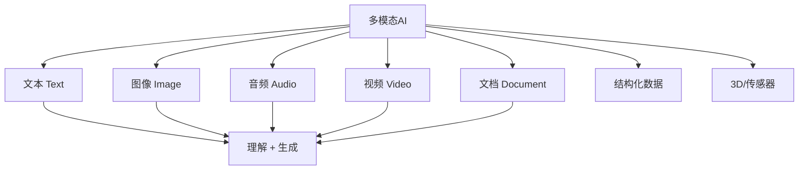
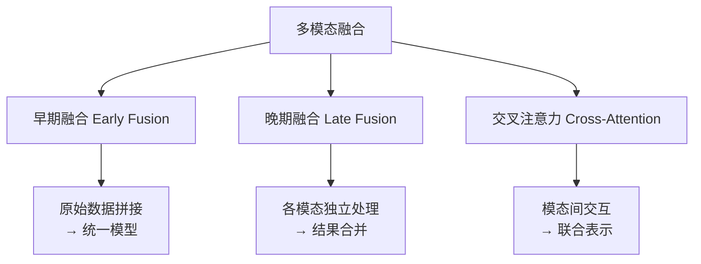

# 第14章：多模态Agent

## 概述

现实世界的信息不只有文本——图像、语音、视频、文档构成了人类感知的完整图景。多模态 Agent（Multimodal Agent）能够像人类一样，同时理解和处理多种类型的信息输入，并生成跨模态的输出。本章将深入讲解多模态 Agent 的架构设计、实现技术和优化策略，涵盖视觉、语音、文档处理等核心模态，以及它们在 Agent 系统中的融合应用。

## 14.1 多模态AI概述

### 14.1.1 什么是多模态

多模态（Multimodal）指系统同时处理两种或两种以上信息模态（Modality）的能力。常见的模态包括：



| 模态 | 输入能力 | 输出能力 | 典型模型 |
|------|---------|---------|---------|
| 文本 | ✅ | ✅ | GPT-4, Claude, Gemini |
| 图像 | ✅ | ✅ | GPT-4V, Gemini Pro Vision |
| 音频 | ✅ | ✅ | Whisper, TTS |
| 视频 | ✅（逐帧） | ⚠️（有限） | Gemini, Video-LLaMA |
| 文档 | ✅ | ✅ | Claude, GPT-4V |
| 代码 | ✅ | ✅ | GPT-4, Claude |

### 14.1.2 多模态Agent的核心价值

```python
class MultimodalAgentUseCases:
    """多模态Agent的典型应用场景"""
    
    use_cases = {
        "文档智能": {
            "input": ["PDF", "图片", "扫描件"],
            "output": ["摘要", "问答", "数据提取", "分类"],
            "example": "上传合同PDF，Agent提取关键条款并生成摘要"
        },
        "视觉质检": {
            "input": ["产品照片", "质检标准"],
            "output": ["缺陷检测", "质检报告", "改进建议"],
            "example": "Agent分析生产线照片，自动识别产品缺陷"
        },
        "内容创作": {
            "input": ["文字描述", "参考图片"],
            "output": ["图片生成", "视频剪辑", "文案"],
            "example": "根据产品描述和品牌指南生成营销素材"
        },
        "无障碍服务": {
            "input": ["图片", "环境音"],
            "output": ["语音描述", "文字转述"],
            "example": "为视障用户描述图片内容"
        },
        "数据分析": {
            "input": ["图表截图", "数据表"],
            "output": ["数据解读", "趋势分析", "报告"],
            "example": "上传销售图表，Agent自动解读趋势并给出建议"
        }
    }
```

## 14.2 视觉Agent

### 14.2.1 图像理解

```python
import base64
from openai import AsyncOpenAI

class VisionAgent:
    """视觉理解Agent"""
    
    def __init__(self, api_key: str):
        self.client = AsyncOpenAI(api_key=api_key)
    
    def _encode_image(self, image_path: str) -> str:
        """将图片编码为base64"""
        with open(image_path, "rb") as f:
            return base64.standard_b64encode(f.read()).decode()
    
    async def analyze_image(self, image_path: str, 
                           prompt: str = "描述这张图片") -> str:
        """分析单张图片"""
        base64_image = self._encode_image(image_path)
        
        response = await self.client.chat.completions.create(
            model="gpt-4o",
            messages=[{
                "role": "user",
                "content": [
                    {"type": "text", "text": prompt},
                    {
                        "type": "image_url",
                        "image_url": {
                            "url": f"data:image/jpeg;base64,{base64_image}"
                        }
                    }
                ]
            }]
        )
        return response.choices[0].message.content
    
    async def compare_images(self, image_paths: list[str],
                            comparison_prompt: str) -> str:
        """对比多张图片"""
        content = [{"type": "text", "text": comparison_prompt}]
        
        for path in image_paths:
            base64_image = self._encode_image(path)
            content.append({
                "type": "image_url",
                "image_url": {
                    "url": f"data:image/jpeg;base64,{base64_image}"
                }
            })
        
        response = await self.client.chat.completions.create(
            model="gpt-4o",
            messages=[{"role": "user", "content": content}]
        )
        return response.choices[0].message.content
```

### 14.2.2 OCR与文档解析

```python
import fitz  # PyMuPDF
from PIL import Image
import io

class DocumentAgent:
    """文档解析Agent"""
    
    def __init__(self, vision_agent: VisionAgent):
        self.vision = vision_agent
    
    def pdf_to_images(self, pdf_path: str, 
                     dpi: int = 200) -> list[str]:
        """将PDF每页转为图片路径"""
        doc = fitz.open(pdf_path)
        image_paths = []
        
        for page_num in range(len(doc)):
            page = doc[page_num]
            mat = fitz.Matrix(dpi / 72, dpi / 72)
            pix = page.get_pixmap(matrix=mat)
            
            img_path = f"/tmp/page_{page_num}.png"
            pix.save(img_path)
            image_paths.append(img_path)
        
        return image_paths
    
    async def extract_text_from_pdf(self, pdf_path: str) -> str:
        """从PDF中提取文本（混合策略）"""
        # 策略1：尝试直接提取文本
        doc = fitz.open(pdf_path)
        text = ""
        for page in doc:
            page_text = page.get_text()
            if page_text.strip():
                text += page_text
        
        if len(text) > 100:
            return text
        
        # 策略2：文本提取不足，使用OCR
        image_paths = self.pdf_to_images(pdf_path)
        ocr_results = []
        for img_path in image_paths:
            result = await self.vision.analyze_image(
                img_path, 
                "请提取这张图片中的所有文字，保持原始格式。"
            )
            ocr_results.append(result)
        
        return "\n\n".join(ocr_results)
    
    async def analyze_document(self, file_path: str, 
                              analysis_type: str = "summary") -> dict:
        """智能文档分析"""
        if file_path.endswith(".pdf"):
            pages = self.pdf_to_images(file_path)
        else:
            pages = [file_path]
        
        results = {}
        for i, page_path in enumerate(pages):
            prompts = {
                "summary": "请总结这一页的主要内容。",
                "key_info": "请提取这一页中的关键信息点。",
                "tables": "请识别并提取这一页中的表格数据，格式化为JSON。",
                "structure": "请分析这一页的文档结构（标题、段落、列表等）。",
            }
            result = await self.vision.analyze_image(
                page_path, prompts.get(analysis_type, prompts["summary"])
            )
            results[f"page_{i}"] = result
        
        return results
```

### 14.2.3 图表分析

```python
class ChartAnalysisAgent:
    """图表分析Agent"""
    
    async def analyze_chart(self, image_path: str) -> dict:
        """分析图表并提取数据"""
        prompt = """
        请分析这张图表，提供以下信息：
        1. 图表类型（折线图、柱状图、饼图等）
        2. 标题和坐标轴标签
        3. 主要趋势和模式
        4. 关键数据点（尽可能精确）
        5. 异常值或显著变化
        
        请以JSON格式返回。
        """
        result = await self.vision.analyze_image(image_path, prompt)
        return json.loads(result)
    
    async def generate_chart_description(self, image_path: str,
                                        language: str = "zh") -> str:
        """为图表生成自然语言描述"""
        prompt = f"""
        请用{language}语言详细描述这张图表，包括：
        - 图表展示的主题
        - 主要数据和趋势
        - 值得注意的关键发现
        描述要专业且易于理解。
        """
        return await self.vision.analyze_image(image_path, prompt)
```

## 14.3 语音Agent

### 14.3.1 语音识别（ASR）

```python
import whisper
import asyncio

class SpeechToTextAgent:
    """语音识别Agent"""
    
    def __init__(self, model_size: str = "base"):
        self.model = whisper.load_model(model_size)
    
    async def transcribe(self, audio_path: str,
                        language: str | None = None) -> str:
        """转录音频文件"""
        loop = asyncio.get_event_loop()
        result = await loop.run_in_executor(
            None,
            lambda: self.model.transcribe(
                audio_path, 
                language=language,
                verbose=False
            )
        )
        return result["text"]
    
    async def transcribe_stream(self, audio_stream: bytes) -> str:
        """转录音频流"""
        # 保存临时文件再转录
        import tempfile
        with tempfile.NamedTemporaryFile(suffix=".wav", delete=False) as f:
            f.write(audio_stream)
            temp_path = f.name
        
        try:
            return await self.transcribe(temp_path)
        finally:
            os.unlink(temp_path)
    
    async def detect_language(self, audio_path: str) -> str:
        """检测音频语言"""
        loop = asyncio.get_event_loop()
        result = await loop.run_in_executor(
            None,
            lambda: self.model.transcribe(audio_path, verbose=False)
        )
        return result["language"]
```

### 14.3.2 语音合成（TTS）

```python
from openai import AsyncOpenAI

class TextToSpeechAgent:
    """语音合成Agent"""
    
    def __init__(self, api_key: str):
        self.client = AsyncOpenAI(api_key=api_key)
    
    async def synthesize(self, text: str, voice: str = "alloy",
                        output_path: str = "output.mp3") -> str:
        """将文本转为语音"""
        response = await self.client.audio.speech.create(
            model="tts-1",
            voice=voice,
            input=text
        )
        
        with open(output_path, "wb") as f:
            for chunk in response.iter_bytes():
                f.write(chunk)
        
        return output_path
    
    async def synthesize_conversation(self, messages: list[dict],
                                       output_dir: str = "conv_audio"
                                       ) -> list[str]:
        """将对话转为语音序列"""
        os.makedirs(output_dir, exist_ok=True)
        audio_files = []
        
        voice_map = {"user": "alloy", "assistant": "nova"}
        
        for i, msg in enumerate(messages):
            role = msg["role"]
            text = msg["content"]
            output_path = f"{output_dir}/{i:03d}_{role}.mp3"
            
            await self.synthesize(
                text, voice=voice_map.get(role, "alloy"),
                output_path=output_path
            )
            audio_files.append(output_path)
        
        return audio_files
```

### 14.3.3 实时语音对话

```python
import websockets
import json

class RealtimeVoiceAgent:
    """实时语音对话Agent"""
    
    def __init__(self, stt: SpeechToTextAgent, 
                 tts: TextToSpeechAgent, 
                 llm: Any):
        self.stt = stt
        self.tts = tts
        self.llm = llm
        self.conversation_history = []
    
    async def handle_audio_stream(self, websocket):
        """处理WebSocket音频流"""
        async for message in websocket:
            audio_data = json.loads(message)["audio"]
            
            # 1. 语音转文字
            text = await self.stt.transcribe_stream(
                bytes.fromhex(audio_data)
            )
            
            # 2. LLM生成回复
            self.conversation_history.append(
                {"role": "user", "content": text}
            )
            reply = await self.llm.chat(self.conversation_history)
            self.conversation_history.append(
                {"role": "assistant", "content": reply}
            )
            
            # 3. 文字转语音
            audio_path = await self.tts.synthesize(reply)
            with open(audio_path, "rb") as f:
                audio_response = f.read()
            
            await websocket.send(json.dumps({
                "audio": audio_response.hex(),
                "text": reply
            }))
```

## 14.4 多模态融合策略

### 14.4.1 融合策略分类



| 策略 | 原理 | 优势 | 劣势 |
|------|------|------|------|
| 早期融合 | 将原始多模态数据拼接后送入模型 | 模态间交互充分 | 计算量大，需要重新训练 |
| 晚期融合 | 各模态独立处理，合并结果 | 实现简单，模块化 | 模态间交互有限 |
| 交叉注意力 | 模态间通过注意力机制交互 | 平衡效果与效率 | 架构复杂 |

### 14.4.2 Agent中的实用融合方案

```python
class MultimodalFusionAgent:
    """多模态融合Agent（晚期融合策略）"""
    
    def __init__(self, vision: VisionAgent, 
                 stt: SpeechToTextAgent,
                 llm: Any):
        self.vision = vision
        self.stt = stt
        self.llm = llm
    
    async def process_multimodal_input(
        self, 
        text: str | None = None,
        image_path: str | None = None,
        audio_path: str | None = None,
        instruction: str = "请综合分析以下信息"
    ) -> str:
        """处理多模态输入并生成综合回答"""
        context_parts = []
        
        # 处理文本模态
        if text:
            context_parts.append(f"文本内容: {text}")
        
        # 处理图像模态
        if image_path:
            image_desc = await self.vision.analyze_image(
                image_path, 
                "详细描述这张图片的内容"
            )
            context_parts.append(f"图像描述: {image_desc}")
        
        # 处理音频模态
        if audio_path:
            transcript = await self.stt.transcribe(audio_path)
            context_parts.append(f"语音转录: {transcript}")
        
        # 综合推理
        full_context = "\n\n".join(context_parts)
        prompt = f"""
        {instruction}
        
        以下是多模态输入信息：
        {full_context}
        
        请综合以上信息给出回答。
        """
        
        return await self.llm.generate(prompt)
```

## 14.5 多模态工具链

### 14.5.1 文件处理工具链

```python
from pathlib import Path
from typing import Literal

class FileProcessingTool:
    """多模态文件处理工具"""
    
    SUPPORTED_FORMATS = {
        "image": [".jpg", ".jpeg", ".png", ".gif", ".webp"],
        "audio": [".mp3", ".wav", ".m4a", ".ogg"],
        "video": [".mp4", ".avi", ".mov"],
        "document": [".pdf", ".docx", ".xlsx", ".pptx"],
        "text": [".txt", ".md", ".csv", ".json"],
    }
    
    def detect_type(self, file_path: str) -> str:
        """检测文件类型"""
        ext = Path(file_path).suffix.lower()
        for file_type, extensions in self.SUPPORTED_FORMATS.items():
            if ext in extensions:
                return file_type
        return "unknown"
    
    async def process(self, file_path: str, 
                     operation: str) -> dict:
        """处理文件"""
        file_type = self.detect_type(file_path)
        
        processors = {
            "image": self._process_image,
            "audio": self._process_audio,
            "document": self._process_document,
            "text": self._process_text,
        }
        
        processor = processors.get(file_type)
        if not processor:
            return {"error": f"不支持的文件类型: {file_type}"}
        
        return await processor(file_path, operation)
    
    async def _process_image(self, path: str, op: str) -> dict:
        """图像处理"""
        if op == "describe":
            return {"description": await self.vision.analyze_image(path)}
        elif op == "ocr":
            return {"text": await self.vision.analyze_image(
                path, "提取图片中的所有文字"
            )}
        elif op == "resize":
            # 使用PIL处理
            img = Image.open(path)
            img.thumbnail((800, 800))
            output = path.replace(".", "_resized.")
            img.save(output)
            return {"output": output}
    
    async def _process_audio(self, path: str, op: str) -> dict:
        """音频处理"""
        if op == "transcribe":
            return {"transcript": await self.stt.transcribe(path)}
        elif op == "detect_language":
            return {"language": await self.stt.detect_language(path)}
```

## 14.6 多模态Agent架构设计

### 14.6.1 完整架构

```python
class ProductionMultimodalAgent:
    """生产级多模态Agent"""
    
    def __init__(self, config: dict):
        self.config = config
        self.vision = VisionAgent(config["openai_key"])
        self.stt = SpeechToTextAgent(config["whisper_model"])
        self.tts = TextToSpeechAgent(config["openai_key"])
        self.llm = get_llm(config["llm_config"])
        self.file_processor = FileProcessingTool()
        self.memory = AgentMemory()
    
    async def handle_request(self, request: dict) -> dict:
        """统一处理多模态请求"""
        # 1. 输入预处理
        preprocessed = await self._preprocess(request)
        
        # 2. 模态路由
        modality = self._route_modality(preprocessed)
        
        # 3. 各模态处理
        results = await self._process_modalities(
            preprocessed, modality
        )
        
        # 4. 融合推理
        answer = await self._fuse_and_reason(results, request)
        
        # 5. 输出后处理
        response = await self._postprocess(answer, request)
        
        return response
    
    async def _preprocess(self, request: dict) -> dict:
        """输入预处理：统一格式化"""
        processed = {
            "text": request.get("text", ""),
            "images": [],
            "audio": [],
            "documents": [],
        }
        
        # 处理文件上传
        for file_info in request.get("files", []):
            file_type = self.file_processor.detect_type(
                file_info["path"]
            )
            if file_type == "image":
                processed["images"].append(file_info["path"])
            elif file_type == "audio":
                processed["audio"].append(file_info["path"])
            elif file_type == "document":
                processed["documents"].append(file_info["path"])
        
        return processed
    
    def _route_modality(self, data: dict) -> str:
        """模态路由：判断主要模态"""
        if data["images"]:
            return "visual"
        elif data["audio"]:
            return "audio"
        elif data["documents"]:
            return "document"
        else:
            return "text_only"
    
    async def _process_modalities(self, data: dict, 
                                   modality: str) -> dict:
        """分模态处理"""
        results = {}
        
        if modality in ("visual", "document"):
            for img_path in data["images"]:
                results[f"image_{img_path}"] = \
                    await self.vision.analyze_image(img_path)
        
        if data["audio"]:
            for audio_path in data["audio"]:
                results[f"audio_{audio_path}"] = \
                    await self.stt.transcribe(audio_path)
        
        if data["documents"]:
            for doc_path in data["documents"]:
                results[f"doc_{doc_path}"] = \
                    await self.file_processor.process(
                        doc_path, "extract"
                    )
        
        return results
```

### 14.6.2 输出合成

```python
class OutputSynthesizer:
    """多模态输出合成器"""
    
    def __init__(self, tts: TextToSpeechAgent):
        self.tts = tts
    
    async def synthesize(self, answer: str, 
                        output_format: str = "text",
                        **kwargs) -> dict:
        """根据请求格式合成输出"""
        if output_format == "text":
            return {"type": "text", "content": answer}
        elif output_format == "audio":
            audio_path = await self.tts.synthesize(answer)
            return {
                "type": "audio", 
                "content": answer,
                "audio_url": audio_path
            }
        elif output_format == "both":
            audio_path = await self.tts.synthesize(answer)
            return {
                "type": "both",
                "text": answer,
                "audio_url": audio_path
            }
```

## 14.7 实战：构建多模态文档分析Agent

```python
class DocumentAnalysisAgent:
    """多模态文档分析Agent"""
    
    def __init__(self):
        self.vision = VisionAgent(api_key=os.environ["OPENAI_API_KEY"])
        self.llm = LLMClient()
    
    async def analyze_contract(self, pdf_path: str) -> dict:
        """分析合同文档"""
        # 1. PDF转图片
        pages = self.pdf_to_images(pdf_path)
        
        # 2. 逐页分析
        page_analyses = []
        for page_path in pages:
            analysis = await self.vision.analyze_image(
                page_path,
                """
                请分析这份合同页面，提取以下信息：
                1. 合同各方（甲方、乙方）
                2. 关键条款（金额、期限、违约责任）
                3. 需要注意的风险点
                以JSON格式返回。
                """
            )
            page_analyses.append(analysis)
        
        # 3. 综合分析
        summary_prompt = f"""
        以下是一份合同的逐页分析结果：
        {json.dumps(page_analyses, ensure_ascii=False, indent=2)}
        
        请综合分析这份合同，提供：
        1. 合同概要
        2. 关键条款总结
        3. 潜在风险提示
        4. 谈判建议
        """
        comprehensive_analysis = await self.llm.generate(summary_prompt)
        
        return {
            "page_analyses": page_analyses,
            "comprehensive_analysis": comprehensive_analysis,
            "total_pages": len(pages)
        }
    
    async def analyze_financial_report(self, pdf_path: str) -> dict:
        """分析财务报告"""
        pages = self.pdf_to_images(pdf_path)
        
        # 重点分析含图表的页面
        data_points = []
        for page_path in pages:
            analysis = await self.vision.analyze_image(
                page_path,
                """
                如果此页包含财务数据或图表：
                1. 识别数据类型（收入、利润、现金流等）
                2. 提取关键数值
                3. 识别趋势（增长/下降/持平）
                4. 标注异常数据点
                
                以JSON格式返回。
                """
            )
            data_points.append(json.loads(analysis))
        
        # 生成分析报告
        report = await self.llm.generate(f"""
        基于以下财务数据提取结果，生成一份简洁的财务分析报告：
        {json.dumps(data_points, ensure_ascii=False)}
        
        报告应包含：
        1. 财务状况概览
        2. 关键财务指标
        3. 趋势分析
        4. 风险与机会
        """)
        
        return {"data_points": data_points, "report": report}
```

## 14.8 性能优化与成本控制

### 14.8.1 模型选择策略

```python
class ModelSelector:
    """根据任务复杂度选择模型"""
    
    def __init__(self):
        self.model_tiers = {
            "simple": {
                "vision": "gpt-4o-mini",
                "cost_per_image": 0.001,
                "suitable_for": ["简单OCR", "文本检测", "分类"]
            },
            "standard": {
                "vision": "gpt-4o",
                "cost_per_image": 0.01,
                "suitable_for": ["图像描述", "图表分析", "文档理解"]
            },
            "complex": {
                "vision": "gpt-4o",
                "cost_per_image": 0.01,
                "suitable_for": ["复杂推理", "多图对比", "合同分析"]
            }
        }
    
    def select_model(self, task_type: str, 
                    complexity: str = "auto") -> str:
        """选择合适的模型"""
        if complexity == "auto":
            # 简单任务用小模型
            simple_tasks = ["ocr", "classify", "detect"]
            if any(t in task_type.lower() for t in simple_tasks):
                complexity = "simple"
            else:
                complexity = "standard"
        
        return self.model_tiers[complexity]["vision"]
```

### 14.8.2 缓存与去重

```python
import hashlib

class MultimodalCache:
    """多模态结果缓存"""
    
    def __init__(self, redis_client):
        self.redis = redis_client
        self.ttl = 3600 * 24  # 24小时缓存
    
    def _compute_hash(self, file_path: str) -> str:
        """计算文件内容哈希"""
        with open(file_path, "rb") as f:
            content = f.read()
        return hashlib.md5(content).hexdigest()
    
    async def get_cached(self, file_path: str, 
                        operation: str) -> str | None:
        """获取缓存结果"""
        file_hash = self._compute_hash(file_path)
        cache_key = f"multimodal:{operation}:{file_hash}"
        return await self.redis.get(cache_key)
    
    async def set_cached(self, file_path: str, 
                        operation: str, result: str):
        """设置缓存"""
        file_hash = self._compute_hash(file_path)
        cache_key = f"multimodal:{operation}:{file_hash}"
        await self.redis.setex(cache_key, self.ttl, result)
```

## 最佳实践

1. **模态路由优化**：在处理前先判断输入模态，避免对文本输入调用视觉模型
2. **渐进式处理**：先用低成本模型快速预判，再决定是否需要高成本精细分析
3. **结果缓存**：对相同文件的分析结果进行缓存，避免重复调用昂贵的视觉模型
4. **错误降级**：视觉模型失败时降级为纯文本处理，保证基本可用
5. **批量处理**：多张图片可以合并为一次API调用，降低延迟和成本

## 常见陷阱

1. **图片过大**：超过模型限制的图片会导致API错误。先压缩到合理尺寸
2. **忽略音频质量**：低质量音频会导致STT结果很差，影响后续处理
3. **过度依赖单一模态**：只看图不看文字，或只看文字不看图，导致信息遗漏
4. **成本失控**：多模态API调用成本远高于纯文本。必须设置预算和缓存
5. **时序信息丢失**：将视频拆成图片处理时，丢失了帧间时序信息

## 小结

多模态 Agent 将 AI 的能力从文本世界扩展到了感知层面。通过视觉、语音、文档等多种模态的融合处理，Agent 能够理解和操作更丰富的信息。本章介绍了各模态的处理技术、融合策略和架构设计。多模态是 Agent 技术发展的重要方向，随着模型能力的持续提升，未来的 Agent 将越来越接近人类的感知能力。

## 延伸阅读

1. **论文**: "GPT-4 Technical Report" — 多模态能力的里程碑
2. **论文**: "LLaVA: Visual Instruction Tuning" — 开源多模态模型
3. **Whisper文档**: https://github.com/openai/whisper
4. **PyMuPDF文档**: https://pymupdf.readthedocs.io/
5. **OpenAI Vision指南**: https://platform.openai.com/docs/guides/vision
