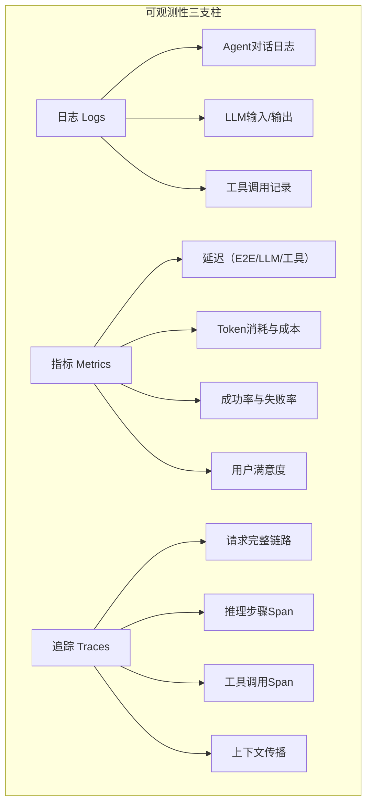

# 第15章：Agent的可观测性

## 概述

传统软件系统的可观测性依赖于确定性的行为——相同输入产生相同输出，日志可以精确还原执行过程。但 Agent 系统天生是非确定性的：LLM 可能对同一输入生成不同的推理路径，工具调用顺序可能变化，甚至在"思考"过程中产生幻觉。这种非确定性使得 Agent 系统的可观测性变得尤为重要且具有挑战性。本章将系统地讲解如何为 Agent 系统构建完整的可观测性体系，涵盖结构化日志、分布式追踪、指标监控、决策可视化和评估反馈。

## 15.1 可观测性的三支柱

### 15.1.1 日志、指标、追踪

可观测性（Observability）的三个核心支柱在 Agent 系统中各有特殊含义：



| 支柱 | 传统系统 | Agent系统 | 特殊挑战 |
|------|---------|----------|---------|
| **日志** | 请求/响应记录 | LLM I/O、推理链、工具调用 | 数据量大，需结构化 |
| **指标** | QPS、延迟、错误率 | Token消耗、推理步骤数、工具命中率 | 成本追踪是新维度 |
| **追踪** | 服务间调用链 | 多步推理链、并行工具调用 | Span嵌套深，持续时间长 |

### 15.1.2 Agent可观测性框架

```python
from dataclasses import dataclass, field
from datetime import datetime
from typing import Any
from enum import Enum
import uuid

class SpanKind(Enum):
    LLM_CALL = "llm_call"
    TOOL_CALL = "tool_call"
    REASONING = "reasoning"
    RETRIEVAL = "retrieval"
    USER_INPUT = "user_input"
    AGENT_OUTPUT = "agent_output"

@dataclass
class Span:
    """追踪单元"""
    trace_id: str
    span_id: str = field(default_factory=lambda: str(uuid.uuid4())[:8])
    parent_id: str | None = None
    kind: SpanKind = SpanKind.REASONING
    name: str = ""
    start_time: datetime = field(default_factory=datetime.now)
    end_time: datetime | None = None
    attributes: dict[str, Any] = field(default_factory=dict)
    events: list[dict] = field(default_factory=list)
    status: str = "ok"  # ok, error
    
    @property
    def duration_ms(self) -> float:
        if self.end_time:
            return (self.end_time - self.start_time).total_seconds() * 1000
        return 0

class Tracer:
    """简易追踪器"""
    
    def __init__(self):
        self._traces: dict[str, list[Span]] = {}
    
    def start_trace(self) -> str:
        trace_id = str(uuid.uuid4())[:16]
        self._traces[trace_id] = []
        return trace_id
    
    def start_span(self, trace_id: str, kind: SpanKind,
                   name: str, parent_id: str | None = None) -> Span:
        span = Span(
            trace_id=trace_id, kind=kind, name=name,
            parent_id=parent_id
        )
        self._traces[trace_id].append(span)
        return span
    
    def end_span(self, span: Span, status: str = "ok"):
        span.end_time = datetime.now()
        span.status = status
    
    def get_trace(self, trace_id: str) -> list[Span]:
        return self._traces.get(trace_id, [])
```

## 15.2 Agent系统可观测性挑战

### 15.2.1 非确定性

```python
class NonDeterminismTracker:
    """非确定性追踪器"""
    
    def __init__(self):
        self._replay_store: dict[str, dict] = {}
    
    async def record_execution(self, trace_id: str, 
                               input_data: dict,
                               execution_log: list[dict],
                               output: Any):
        """记录完整执行过程，支持回放"""
        record = {
            "trace_id": trace_id,
            "input": input_data,
            "execution_log": execution_log,
            "output": output,
            "timestamp": datetime.now().isoformat()
        }
        self._replay_store[trace_id] = record
    
    async def replay(self, trace_id: str, 
                     agent: Any) -> dict:
        """回放执行过程（使用缓存结果）"""
        record = self._replay_store.get(trace_id)
        if not record:
            raise ValueError(f"未找到执行记录: {trace_id}")
        
        # 模拟执行，但不实际调用LLM
        mock_results = {}
        for step in record["execution_log"]:
            if step["type"] == "llm_call":
                mock_results[step["span_id"]] = step["output"]
        
        return {
            "original_output": record["output"],
            "mock_available": len(mock_results),
            "steps": len(record["execution_log"])
        }
```

### 15.2.2 LLM黑盒问题

LLM 是一个巨大的神经网络，我们无法直接观察其内部推理过程。但可以通过以下手段间接"照亮"黑盒：

```python
class LLMCallInspector:
    """LLM调用检查器"""
    
    def __init__(self, tracer: Tracer):
        self.tracer = tracer
    
    async def inspected_call(self, trace_id: str,
                             llm: Any, messages: list[dict],
                             **kwargs) -> dict:
        """带完整检查的LLM调用"""
        # 记录输入
        span = self.tracer.start_span(
            trace_id, SpanKind.LLM_CALL, "llm_inference"
        )
        span.attributes.update({
            "model": kwargs.get("model", "unknown"),
            "input_messages": len(messages),
            "input_tokens_est": sum(
                len(m.get("content", "").split()) 
                for m in messages
            ) * 1.3,  # 粗略估算
            "temperature": kwargs.get("temperature", 0.0),
        })
        
        try:
            # 执行调用
            response = await llm.chat(messages, **kwargs)
            
            # 记录输出
            span.attributes.update({
                "output_tokens": response.usage.completion_tokens
                    if hasattr(response, "usage") else 0,
                "total_tokens": response.usage.total_tokens
                    if hasattr(response, "usage") else 0,
                "finish_reason": response.choices[0].finish_reason
                    if hasattr(response, "choices") else "unknown",
                "tool_calls": len(response.choices[0].message.tool_calls)
                    if (hasattr(response, "choices") and 
                        hasattr(response.choices[0].message, "tool_calls"))
                    else 0,
            })
            
            self.tracer.end_span(span)
            return response
        
        except Exception as e:
            span.events.append({
                "name": "error",
                "timestamp": datetime.now().isoformat(),
                "attributes": {"error": str(e)}
            })
            self.tracer.end_span(span, status="error")
            raise
```

## 15.3 结构化日志

### 15.3.1 Agent专用日志格式

```python
import json
import logging
from typing import Any

class AgentJSONFormatter(logging.Formatter):
    """Agent专用的JSON日志格式化器"""
    
    def format(self, record: logging.LogRecord) -> str:
        log_entry = {
            "timestamp": datetime.now().isoformat(),
            "level": record.levelname,
            "logger": record.name,
            "message": record.getMessage(),
        }
        
        # 添加Agent特有字段
        if hasattr(record, "trace_id"):
            log_entry["trace_id"] = record.trace_id
        if hasattr(record, "span_id"):
            log_entry["span_id"] = record.span_id
        if hasattr(record, "agent_step"):
            log_entry["agent_step"] = record.agent_step
        if hasattr(record, "token_usage"):
            log_entry["token_usage"] = record.token_usage
        if hasattr(record, "cost_usd"):
            log_entry["cost_usd"] = record.cost_usd
        
        # 额外字段
        if hasattr(record, "extra_fields"):
            log_entry.update(record.extra_fields)
        
        return json.dumps(log_entry, ensure_ascii=False)

class AgentLogger:
    """Agent日志记录器"""
    
    def __init__(self, agent_name: str):
        self.logger = logging.getLogger(f"agent.{agent_name}")
        self.logger.setLevel(logging.DEBUG)
        
        handler = logging.StreamHandler()
        handler.setFormatter(AgentJSONFormatter())
        self.logger.addHandler(handler)
        
        self._trace_id: str | None = None
        self._step_counter = 0
    
    def set_trace(self, trace_id: str):
        self._trace_id = trace_id
        self._step_counter = 0
    
    def log_llm_call(self, messages: list[dict], 
                     response: dict, duration_ms: float,
                     model: str = "unknown"):
        self._step_counter += 1
        self.logger.info(
            f"LLM调用: model={model}, "
            f"input_msgs={len(messages)}, "
            f"duration={duration_ms:.0f}ms",
            extra={
                "trace_id": self._trace_id,
                "agent_step": self._step_counter,
                "extra_fields": {
                    "type": "llm_call",
                    "model": model,
                    "input_messages": len(messages),
                    "duration_ms": duration_ms,
                    "output_tokens": response.get("usage", {}).get("completion_tokens", 0),
                    "total_tokens": response.get("usage", {}).get("total_tokens", 0),
                }
            }
        )
    
    def log_tool_call(self, tool_name: str, args: dict,
                      result: Any, duration_ms: float,
                      success: bool = True):
        self._step_counter += 1
        self.logger.info(
            f"工具调用: {tool_name}, "
            f"duration={duration_ms:.0f}ms, "
            f"success={success}",
            extra={
                "trace_id": self._trace_id,
                "agent_step": self._step_counter,
                "extra_fields": {
                    "type": "tool_call",
                    "tool_name": tool_name,
                    "args_keys": list(args.keys()),
                    "duration_ms": duration_ms,
                    "success": success,
                    "result_size": len(str(result)) if result else 0,
                }
            }
        )
    
    def log_decision(self, reasoning: str, action: str):
        self._step_counter += 1
        self.logger.info(
            f"决策: {action}",
            extra={
                "trace_id": self._trace_id,
                "agent_step": self._step_counter,
                "extra_fields": {
                    "type": "decision",
                    "reasoning": reasoning[:500],
                    "action": action,
                }
            }
        )
```

### 15.3.2 LLM I/O日志

```python
class LLMIORecorder:
    """LLM输入输出记录器"""
    
    def __init__(self, storage_backend):
        self.storage = storage_backend
    
    async def record(self, trace_id: str, step: int,
                     input_messages: list[dict],
                     output: dict, metadata: dict = None):
        """完整记录LLM交互"""
        record = {
            "trace_id": trace_id,
            "step": step,
            "timestamp": datetime.now().isoformat(),
            "input": self._sanitize_messages(input_messages),
            "output": {
                "content": output.get("content", ""),
                "tool_calls": output.get("tool_calls", []),
                "finish_reason": output.get("finish_reason"),
            },
            "metadata": metadata or {},
        }
        await self.storage.save(record)
    
    def _sanitize_messages(self, messages: list[dict]) -> list[dict]:
        """脱敏处理"""
        sanitized = []
        for msg in messages:
            clean_msg = {"role": msg["role"]}
            content = msg.get("content", "")
            # 截断过长的内容
            if len(content) > 10000:
                clean_msg["content"] = content[:10000] + "...[TRUNCATED]"
            else:
                clean_msg["content"] = content
            sanitized.append(clean_msg)
        return sanitized
```

## 15.4 分布式追踪

### 15.4.1 OpenTelemetry集成

```python
from opentelemetry import trace
from opentelemetry.sdk.trace import TracerProvider
from opentelemetry.sdk.trace.export import BatchSpanProcessor
from opentelemetry.exporter.otlp.proto.grpc.trace_exporter import (
    OTLPSpanExporter
)
from opentelemetry.trace.propagation.tracecontext import (
    TraceContextTextMapPropagator
)

class AgentTracer:
    """基于OpenTelemetry的Agent追踪"""
    
    def __init__(self, service_name: str = "agent-service",
                 otlp_endpoint: str = "localhost:4317"):
        # 初始化TracerProvider
        provider = TracerProvider()
        exporter = OTLPSpanExporter(endpoint=otlp_endpoint)
        provider.add_span_processor(BatchSpanProcessor(exporter))
        trace.set_tracer_provider(provider)
        
        self.tracer = trace.get_tracer(service_name)
        self.propagator = TraceContextTextMapPropagator()
    
    def trace_agent_execution(self, agent_func):
        """装饰器：追踪Agent执行"""
        async def wrapper(user_input: str, **kwargs) -> str:
            with self.tracer.start_as_current_span(
                "agent.execution"
            ) as span:
                span.set_attribute("agent.input", user_input[:500])
                span.set_attribute("agent.type", kwargs.get("agent_type", "default"))
                
                try:
                    result = await agent_func(user_input, **kwargs)
                    span.set_attribute("agent.output_length", len(result))
                    span.set_attribute("agent.status", "success")
                    return result
                except Exception as e:
                    span.set_attribute("agent.status", "error")
                    span.set_attribute("agent.error", str(e))
                    span.record_exception(e)
                    raise
        
        return wrapper
    
    def trace_llm_call(self):
        """上下文管理器：追踪LLM调用"""
        return self.tracer.start_as_current_span(
            "agent.llm_call",
            attributes={"component": "llm"}
        )
    
    def trace_tool_call(self, tool_name: str):
        """上下文管理器：追踪工具调用"""
        return self.tracer.start_as_current_span(
            f"agent.tool_call.{tool_name}",
            attributes={
                "component": "tool",
                "tool.name": tool_name,
            }
        )
```

### 15.4.2 Token使用追踪

```python
class TokenTracker:
    """Token使用追踪器"""
    
    def __init__(self):
        self._usage: dict[str, dict] = {}  # trace_id -> usage
    
    def record(self, trace_id: str, model: str,
               prompt_tokens: int, completion_tokens: int):
        if trace_id not in self._usage:
            self._usage[trace_id] = {
                "models": {},
                "total_prompt_tokens": 0,
                "total_completion_tokens": 0,
                "total_tokens": 0,
                "estimated_cost_usd": 0.0,
            }
        
        usage = self._usage[trace_id]
        usage["total_prompt_tokens"] += prompt_tokens
        usage["total_completion_tokens"] += completion_tokens
        usage["total_tokens"] += prompt_tokens + completion_tokens
        
        # 估算成本
        cost = self._estimate_cost(model, prompt_tokens, completion_tokens)
        usage["estimated_cost_usd"] += cost
        
        if model not in usage["models"]:
            usage["models"][model] = {"calls": 0, "tokens": 0, "cost": 0.0}
        usage["models"][model]["calls"] += 1
        usage["models"][model]["tokens"] += prompt_tokens + completion_tokens
        usage["models"][model]["cost"] += cost
    
    def _estimate_cost(self, model: str, prompt: int, 
                       completion: int) -> float:
        """根据模型估算成本（美元）"""
        pricing = {
            "gpt-4o": (2.5/1M, 10/1M),
            "gpt-4o-mini": (0.15/1M, 0.6/1M),
            "gpt-4-turbo": (10/1M, 30/1M),
            "claude-3-5-sonnet": (3/1M, 15/1M),
            "claude-3-haiku": (0.25/1M, 1.25/1M),
        }
        if model in pricing:
            p, c = pricing[model]
            return prompt * p + completion * c
        return prompt * 0.003/1M + completion * 0.015/1M
    
    def get_usage(self, trace_id: str) -> dict:
        return self._usage.get(trace_id, {})
```

## 15.5 指标与监控

### 15.5.1 Agent核心指标

```python
from dataclasses import dataclass, field
from collections import deque
import time

@dataclass
class AgentMetrics:
    """Agent核心指标收集器"""
    
    # 延迟指标
    e2e_latencies: deque = field(
        default_factory=lambda: deque(maxlen=1000)
    )
    llm_latencies: deque = field(
        default_factory=lambda: deque(maxlen=1000)
    )
    tool_latencies: deque = field(
        default_factory=lambda: deque(maxlen=1000)
    )
    
    # 成功率指标
    total_requests: int = 0
    successful_requests: int = 0
    failed_requests: int = 0
    
    # Token与成本
    total_tokens: int = 0
    total_cost_usd: float = 0.0
    
    # 推理步骤
    step_counts: deque = field(
        default_factory=lambda: deque(maxlen=1000)
    )
    
    def record_e2e_latency(self, latency_ms: float):
        self.e2e_latencies.append(latency_ms)
    
    def record_llm_latency(self, latency_ms: float):
        self.llm_latencies.append(latency_ms)
    
    def record_tool_latency(self, latency_ms: float):
        self.tool_latencies.append(latency_ms)
    
    def record_request(self, success: bool):
        self.total_requests += 1
        if success:
            self.successful_requests += 1
        else:
            self.failed_requests += 1
    
    def record_tokens(self, tokens: int, cost: float):
        self.total_tokens += tokens
        self.total_cost_usd += cost
    
    def record_steps(self, count: int):
        self.step_counts.append(count)
    
    def get_summary(self) -> dict:
        """获取指标摘要"""
        def avg(deque_val):
            return sum(deque_val) / len(deque_val) if deque_val else 0
        
        def p95(deque_val):
            if not deque_val:
                return 0
            sorted_vals = sorted(deque_val)
            idx = int(len(sorted_vals) * 0.95)
            return sorted_vals[min(idx, len(sorted_vals)-1)]
        
        return {
            "requests": {
                "total": self.total_requests,
                "success_rate": (
                    self.successful_requests / self.total_requests * 100
                ) if self.total_requests > 0 else 0,
            },
            "latency_ms": {
                "e2e_avg": avg(self.e2e_latencies),
                "e2e_p95": p95(self.e2e_latencies),
                "llm_avg": avg(self.llm_latencies),
                "tool_avg": avg(self.tool_latencies),
            },
            "tokens_and_cost": {
                "total_tokens": self.total_tokens,
                "total_cost_usd": round(self.total_cost_usd, 4),
                "avg_tokens_per_request": (
                    self.total_tokens / self.total_requests
                ) if self.total_requests > 0 else 0,
            },
            "agent_efficiency": {
                "avg_steps": avg(self.step_counts),
                "max_steps": max(self.step_counts) if self.step_counts else 0,
            }
        }
```

### 15.5.2 Prometheus集成

```python
from prometheus_client import Counter, Histogram, Gauge, start_http_server

class AgentPrometheusMetrics:
    """Agent Prometheus指标"""
    
    def __init__(self, port: int = 8000):
        start_http_server(port)
        
        self.request_total = Counter(
            "agent_requests_total",
            "Total agent requests",
            ["agent_type", "status"]
        )
        self.e2e_latency = Histogram(
            "agent_e2e_latency_seconds",
            "End-to-end latency",
            ["agent_type"],
            buckets=[0.5, 1, 2, 5, 10, 30, 60]
        )
        self.llm_latency = Histogram(
            "agent_llm_latency_seconds",
            "LLM call latency",
            ["model"]
        )
        self.tool_latency = Histogram(
            "agent_tool_latency_seconds",
            "Tool call latency",
            ["tool_name"]
        )
        self.token_usage = Counter(
            "agent_token_usage_total",
            "Token usage",
            ["model", "type"]  # type: prompt/completion
        )
        self.cost_usd = Counter(
            "agent_cost_usd_total",
            "Estimated cost in USD",
            ["model"]
        )
        self.active_requests = Gauge(
            "agent_active_requests",
            "Currently active requests"
        )
        self.step_count = Histogram(
            "agent_step_count",
            "Number of reasoning steps per request",
            buckets=[1, 2, 3, 5, 10, 15, 20]
        )
```

## 15.6 Agent决策可视化

### 15.6.1 思维链可视化

```python
class ChainOfThoughtVisualizer:
    """思维链可视化"""
    
    def __init__(self, tracer: Tracer):
        self.tracer = tracer
    
    def visualize_trace(self, trace_id: str) -> str:
        """将追踪数据可视化为Mermaid流程图"""
        spans = self.tracer.get_trace(trace_id)
        if not spans:
            return "无追踪数据"
        
        lines = ["graph TD"]
        node_map = {}
        
        for i, span in enumerate(spans):
            node_id = f"step{i}"
            label = span.name
            
            if span.kind == SpanKind.LLM_CALL:
                label = f"🧠 LLM: {span.attributes.get('model', '')}"
            elif span.kind == SpanKind.TOOL_CALL:
                label = f"🔧 工具: {span.name}"
            elif span.kind == SpanKind.REASONING:
                label = f"💭 推理: {span.name[:30]}"
            
            # 添加耗时
            if span.duration_ms:
                label += f" ({span.duration_ms:.0f}ms)"
            
            # 状态标记
            if span.status == "error":
                label += " ❌"
            
            lines.append(f'    {node_id}["{label}"]')
            
            # 连接父子节点
            if span.parent_id and span.parent_id in node_map:
                lines.append(f'    {node_map[span.parent_id]} --> {node_id}')
            elif i > 0:
                lines.append(f'    step{i-1} --> {node_id}')
            
            node_map[span.span_id] = node_id
        
        return "\n".join(lines)
    
    def to_text_timeline(self, trace_id: str) -> str:
        """文本时间线"""
        spans = self.tracer.get_trace(trace_id)
        lines = [f"📋 追踪 ID: {trace_id}", "=" * 60]
        
        for i, span in enumerate(spans):
            icon = {
                SpanKind.LLM_CALL: "🧠",
                SpanKind.TOOL_CALL: "🔧",
                SpanKind.REASONING: "💭",
            }.get(span.kind, "📌")
            
            status_icon = "✅" if span.status == "ok" else "❌"
            lines.append(
                f"  [{i+1}] {icon} {span.name} "
                f"{span.duration_ms:.0f}ms {status_icon}"
            )
            if span.events:
                for event in span.events:
                    lines.append(f"       └─ {event.get('name', '')}")
        
        return "\n".join(lines)
```

### 15.6.2 工具调用图

```python
class ToolCallGraphBuilder:
    """工具调用依赖图"""
    
    def build(self, trace_id: str, 
              tracer: Tracer) -> dict:
        spans = tracer.get_trace(trace_id)
        
        nodes = []
        edges = []
        tool_spans = [s for s in spans if s.kind == SpanKind.TOOL_CALL]
        
        for span in tool_spans:
            nodes.append({
                "id": span.span_id,
                "name": span.name,
                "duration_ms": span.duration_ms,
                "status": span.status,
                "args": span.attributes.get("args", {}),
            })
            
            if span.parent_id:
                edges.append({
                    "from": span.parent_id,
                    "to": span.span_id,
                })
        
        return {"nodes": nodes, "edges": edges}
```

## 15.7 评估与反馈循环

### 15.7.1 人类反馈（HITL）

```python
class HumanFeedbackCollector:
    """人类反馈收集器"""
    
    def __init__(self, storage):
        self.storage = storage
    
    async def collect_feedback(self, trace_id: str,
                               rating: int,  # 1-5
                               comment: str = "",
                               correction: str = ""):
        """收集用户反馈"""
        feedback = {
            "trace_id": trace_id,
            "rating": rating,
            "comment": comment,
            "correction": correction,
            "timestamp": datetime.now().isoformat()
        }
        await self.storage.save(feedback)
    
    async def get_quality_metrics(self, 
                                   period_days: int = 7) -> dict:
        """计算质量指标"""
        feedbacks = await self.storage.query(
            period=period_days
        )
        
        if not feedbacks:
            return {}
        
        ratings = [f["rating"] for f in feedbacks]
        return {
            "avg_rating": sum(ratings) / len(ratings),
            "satisfaction_rate": (
                sum(1 for r in ratings if r >= 4) / len(ratings) * 100
            ),
            "total_feedbacks": len(feedbacks),
            "with_corrections": sum(
                1 for f in feedbacks if f.get("correction")
            ),
        }
```

### 15.7.2 自动评估管道

```python
class AgentEvaluationPipeline:
    """Agent自动评估管道"""
    
    def __init__(self, llm, evaluator_llm=None):
        self.llm = llm
        self.evaluator = evaluator_llm or llm
    
    async def evaluate(self, test_cases: list[dict]) -> dict:
        """批量评估Agent"""
        results = []
        
        for case in test_cases:
            # 执行Agent
            agent_output = await self._run_agent(case)
            
            # 评估质量
            score = await self._evaluate_quality(
                case["expected"], agent_output, case["criteria"]
            )
            
            results.append({
                "case_id": case["id"],
                "input": case["input"],
                "expected": case["expected"],
                "actual": agent_output,
                "score": score,
            })
        
        return self._aggregate_results(results)
    
    async def _evaluate_quality(self, expected: str, actual: str,
                                criteria: list[str]) -> float:
        """使用LLM评估输出质量"""
        prompt = f"""
        请评估以下Agent输出的质量：
        
        预期输出: {expected}
        实际输出: {actual}
        评估标准: {', '.join(criteria)}
        
        请给出0-1之间的分数，其中1表示完全符合预期。
        只返回数字。
        """
        response = await self.evaluator.generate(prompt)
        try:
            return float(response.strip())
        except ValueError:
            return 0.0
    
    def _aggregate_results(self, results: list[dict]) -> dict:
        scores = [r["score"] for r in results]
        return {
            "total_cases": len(results),
            "avg_score": sum(scores) / len(scores),
            "pass_rate": sum(1 for s in scores if s >= 0.8) / len(scores),
            "fail_cases": [r for r in results if r["score"] < 0.6],
        }
```

## 15.8 可观测性平台搭建

### 15.8.1 Grafana Dashboard配置

```python
# dashboard_config.py
DASHBOARD_CONFIG = {
    "dashboard": {
        "title": "Agent 可观测性",
        "panels": [
            {
                "title": "请求量与成功率",
                "type": "timeseries",
                "targets": [
                    {
                        "expr": "rate(agent_requests_total[5m])",
                        "legendFormat": "{{agent_type}} - {{status}}"
                    }
                ]
            },
            {
                "title": "端到端延迟 P95",
                "type": "gauge",
                "targets": [
                    {
                        "expr": "histogram_quantile(0.95, rate(agent_e2e_latency_seconds_bucket[5m]))"
                    }
                ]
            },
            {
                "title": "Token消耗趋势",
                "type": "timeseries",
                "targets": [
                    {
                        "expr": "rate(agent_token_usage_total[5m])",
                        "legendFormat": "{{model}} - {{type}}"
                    }
                ]
            },
            {
                "title": "预估成本",
                "type": "stat",
                "targets": [
                    {
                        "expr": "sum(increase(agent_cost_usd_total[24h]))"
                    }
                ]
            },
            {
                "title": "推理步骤分布",
                "type": "histogram",
                "targets": [
                    {
                        "expr": "agent_step_count_bucket"
                    }
                ]
            },
        ]
    }
}
```

### 15.8.2 告警规则

```python
ALERT_RULES = {
    "high_latency": {
        "expr": "histogram_quantile(0.95, rate(agent_e2e_latency_seconds_bucket[5m])) > 30",
        "for": "5m",
        "labels": {"severity": "warning"},
        "annotations": {
            "summary": "Agent端到端延迟过高",
            "description": "P95延迟超过30秒"
        }
    },
    "high_error_rate": {
        "expr": 'rate(agent_requests_total{status="error"}[5m]) / rate(agent_requests_total[5m]) > 0.1',
        "for": "2m",
        "labels": {"severity": "critical"},
        "annotations": {
            "summary": "Agent错误率过高",
            "description": "错误率超过10%"
        }
    },
    "cost_spike": {
        "expr": "increase(agent_cost_usd_total[1h]) > 10",
        "for": "1m",
        "labels": {"severity": "warning"},
        "annotations": {
            "summary": "Agent成本异常",
            "description": "1小时内成本超过$10"
        }
    },
    "token_budget_exceeded": {
        "expr": "sum(increase(agent_token_usage_total[24h])) > 10000000",
        "for": "5m",
        "labels": {"severity": "critical"},
        "annotations": {
            "summary": "Token消耗超预算",
            "description": "24小时Token消耗超过1000万"
        }
    }
}
```

## 最佳实践

1. **从第一天就接入追踪**：不要等到出问题才加可观测性，新项目一开始就集成 OpenTelemetry
2. **结构化日志优先**：JSON格式的结构化日志是后续分析和告警的基础
3. **成本实时追踪**：LLM调用成本是Agent系统最大的运营风险，必须实时监控
4. **保存完整执行记录**：每次Agent执行的完整追踪记录（包括LLM I/O）是调试和优化的宝贵数据
5. **建立评估基线**：定义核心场景的评估指标和基线分数，持续追踪改进

## 常见陷阱

1. **日志过于冗长**：记录完整的LLM输入输出会导致日志量爆炸。使用脱敏和截断
2. **只看平均不看分布**：延迟分布比平均值更有意义。关注 P95/P99 而非平均值
3. **忽略成本维度**：很多团队只监控性能，忽略LLM成本，导致月末账单惊人
4. **追踪信息不完整**：缺少上下文传播（trace_id跨服务传递），导致无法还原完整链路
5. **告警疲劳**：设置过多低质量告警，导致真正重要的问题被忽略

## 小结

可观测性是 Agent 系统从实验室走向生产的关键基础设施。通过结构化日志、分布式追踪、指标监控、决策可视化和评估反馈五大体系，开发者可以对 Agent 的行为进行全面洞察。Agent 系统的非确定性决定了可观测性不是可选的，而是必须的——没有可观测性，就无法可靠地运营 Agent 系统。

## 延伸阅读

1. **OpenTelemetry文档**: https://opentelemetry.io/docs/
2. **Prometheus文档**: https://prometheus.io/docs/
3. **Grafana文档**: https://grafana.com/docs/
4. **LangSmith**: https://smith.langchain.com/ — LangChain的可观测平台
5. **Weights & Biases Weave**: https://wandb.ai/weave — LLM应用追踪
6. **论文**: "Evaluation of Large Language Model Agents" — Agent评估方法论
