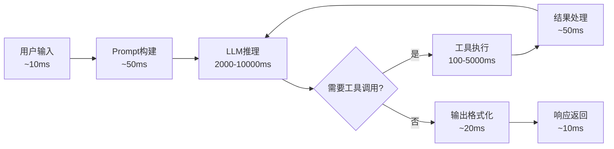

# 第24章：性能调优

## 概述

Agent 系统的性能瓶颈与传统软件有本质不同——它不仅涉及代码执行效率，更核心的是 LLM 推理时间、Token 消耗和多步推理的累积延迟。一个需要 5 次 LLM 调用和 3 次工具执行的 Agent 任务，即使每次调用只有 2 秒，端到端延迟也高达 16 秒。本章将系统讲解 Agent 性能优化的全链路方法，从 LLM 推理优化到并发调度，从缓存策略到基础设施优化，帮助你将 Agent 响应时间从"分钟级"压缩到"秒级"。

## 24.1 Agent系统性能概述

### 24.1.1 延迟来源分析

一次典型的 Agent 请求延迟由多个环节叠加而成：



| 环节 | 典型延迟 | 占比 | 优化空间 |
|------|---------|------|---------|
| LLM推理 | 1-10秒 | 60-80% | 模型选择、Prompt优化 |
| 工具执行 | 0.1-5秒 | 10-30% | 并发、缓存 |
| 上下文构建 | 0.05-0.5秒 | 2-5% | 预构建、增量更新 |
| 网络传输 | 0.01-0.5秒 | 1-5% | 连接池、CDN |
| 后处理 | 0.01-0.1秒 | <1% | 流式输出 |

### 24.1.2 性能优化决策树

```python
def diagnose_performance_issue(metrics: dict) -> list[str]:
    """性能问题诊断"""
    recommendations = []
    
    e2e_latency = metrics.get("e2e_latency_ms", 0)
    llm_latency = metrics.get("llm_latency_ms", 0)
    tool_latency = metrics.get("tool_latency_ms", 0)
    steps = metrics.get("avg_steps", 0)
    
    # 诊断LLM延迟
    if llm_latency > 5000:
        recommendations.append(
            "🔍 LLM延迟过高(>5s): 考虑使用更快的模型或优化Prompt长度"
        )
    if llm_latency / e2e_latency > 0.8:
        recommendations.append(
            "🔍 LLM占总延迟>80%: 优先优化LLM调用"
        )
    
    # 诊断工具延迟
    if tool_latency > 2000:
        recommendations.append(
            "🔍 工具延迟过高(>2s): 检查工具实现，添加缓存"
        )
    
    # 诊断推理步数
    if steps > 10:
        recommendations.append(
            "🔍 平均推理步数过多(>10): 优化规划策略，减少不必要的循环"
        )
    
    # 诊断Token使用
    tokens_per_request = metrics.get("avg_tokens", 0)
    if tokens_per_request > 10000:
        recommendations.append(
            "🔍 Token消耗过高(>10K/请求): 压缩上下文，使用更精确的Prompt"
        )
    
    return recommendations
```

## 24.2 LLM推理优化

### 24.2.1 模型选择策略

```python
from dataclasses import dataclass

@dataclass
class ModelProfile:
    name: str
    max_tokens: int
    input_cost_per_1m: float  # 美元/百万Token
    output_cost_per_1m: float
    avg_latency_ms: float  # 典型延迟
    quality_score: float  # 1-10

MODELS = {
    "gpt-4o": ModelProfile("gpt-4o", 128000, 2.5, 10.0, 2500, 9.5),
    "gpt-4o-mini": ModelProfile("gpt-4o-mini", 128000, 0.15, 0.6, 800, 7.5),
    "claude-3.5-sonnet": ModelProfile("claude-3.5-sonnet", 200000, 3.0, 15.0, 3000, 9.0),
    "claude-3-haiku": ModelProfile("claude-3-haiku", 200000, 0.25, 1.25, 600, 7.0),
}

class ModelRouter:
    """智能模型路由：根据任务复杂度选择模型"""
    
    def __init__(self):
        self.complexity_keywords = {
            "high": ["分析", "推理", "规划", "设计", "优化", "评估", "对比"],
            "low": ["翻译", "摘要", "提取", "分类", "格式化", "简单查询"],
        }
    
    def select_model(self, task: str, budget: float = None,
                    max_latency_ms: float = None) -> str:
        """选择最优模型"""
        # 评估任务复杂度
        complexity = self._assess_complexity(task)
        
        # 筛选候选模型
        candidates = []
        for name, profile in MODELS.items():
            if max_latency_ms and profile.avg_latency_ms > max_latency_ms:
                continue
            if budget:
                estimated_cost = profile.input_cost_per_1m * 0.004  # ~4K tokens
                if estimated_cost > budget:
                    continue
            candidates.append((name, profile))
        
        # 根据复杂度选择
        if complexity == "high":
            # 高复杂度：选质量最高的
            candidates.sort(key=lambda x: x[1].quality_score, reverse=True)
        elif complexity == "low":
            # 低复杂度：选最快的
            candidates.sort(key=lambda x: x[1].avg_latency_ms)
        else:
            # 中等：选性价比最高的
            candidates.sort(
                key=lambda x: x[1].quality_score / x[1].avg_latency_ms,
                reverse=True
            )
        
        return candidates[0][0] if candidates else "gpt-4o-mini"
    
    def _assess_complexity(self, task: str) -> str:
        high_count = sum(1 for kw in self.complexity_keywords["high"] 
                        if kw in task)
        low_count = sum(1 for kw in self.complexity_keywords["low"] 
                       if kw in task)
        if high_count >= 2:
            return "high"
        elif low_count >= 2:
            return "low"
        return "medium"
```

### 24.2.2 Prompt压缩

```python
class PromptCompressor:
    """Prompt压缩器"""
    
    def __init__(self, llm):
        self.llm = llm
    
    async def compress(self, prompt: str, 
                      target_ratio: float = 0.5) -> str:
        """压缩Prompt，保留核心信息"""
        compression_prompt = f"""
        请压缩以下文本，保留所有关键信息，去除冗余描述。
        目标：压缩到原文本的 {int(target_ratio * 100)}% 长度。
        
        原始文本:
        {prompt}
        
        压缩后的文本:
        """
        result = await self.llm.generate(compression_prompt)
        return result
    
    def remove_redundant_instructions(self, system_prompt: str) -> str:
        """移除冗余指令"""
        # 常见冗余模式
        redundant_patterns = [
            "请务必", "一定要", "千万不要",
            "你是一个专业的", "作为一个AI助手",
        ]
        cleaned = system_prompt
        for pattern in redundant_patterns:
            cleaned = cleaned.replace(pattern, "")
        return cleaned.strip()
    
    def tokenize_efficiently(self, messages: list[dict]) -> list[dict]:
        """Token高效的消息格式"""
        optimized = []
        for msg in messages:
            content = msg["content"]
            # 移除多余空格和换行
            content = " ".join(content.split())
            optimized.append({"role": msg["role"], "content": content})
        return optimized
```

### 24.2.3 上下文窗口管理

```python
class ContextWindowManager:
    """上下文窗口管理器"""
    
    def __init__(self, max_tokens: int = 128000,
                 reserve_for_output: int = 4096):
        self.max_tokens = max_tokens
        self.reserve = reserve_for_output
        self.available = max_tokens - reserve_for_output
    
    def fit_messages(self, messages: list[dict],
                    model_context_limit: int) -> list[dict]:
        """确保消息在上下文窗口内"""
        total_tokens = sum(
            self._estimate_tokens(msg["content"]) 
            for msg in messages
        )
        
        if total_tokens <= self.available:
            return messages
        
        # 裁剪策略：保留系统消息 + 最近的消息
        system_msgs = [m for m in messages if m["role"] == "system"]
        other_msgs = [m for m in messages if m["role"] != "system"]
        
        # 计算系统消息占用
        system_tokens = sum(
            self._estimate_tokens(m["content"]) 
            for m in system_msgs
        )
        remaining = self.available - system_tokens
        
        # 从最近的消息开始保留
        fitted = list(system_msgs)
        for msg in reversed(other_msgs):
            msg_tokens = self._estimate_tokens(msg["content"])
            if remaining >= msg_tokens:
                fitted.insert(len(system_msgs), msg)
                remaining -= msg_tokens
            else:
                break
        
        return fitted
    
    def _estimate_tokens(self, text: str) -> int:
        """粗略估算Token数"""
        return len(text) // 3  # 中文约1字=2-3Token
```

## 24.3 并发与异步

### 24.3.1 并发工具调用

```python
import asyncio
from typing import Any

class ConcurrentToolExecutor:
    """并发工具执行器"""
    
    def __init__(self, max_concurrent: int = 5):
        self.semaphore = asyncio.Semaphore(max_concurrent)
        self._results: dict[str, Any] = {}
    
    async def execute_tools(self, tool_calls: list[dict]) -> dict:
        """并发执行多个工具调用"""
        tasks = []
        for call in tool_calls:
            task = asyncio.create_task(
                self._execute_with_semaphore(call)
            )
            tasks.append(task)
        
        results = await asyncio.gather(*tasks, return_exceptions=True)
        
        output = {}
        for call, result in zip(tool_calls, results):
            call_id = call.get("id", call["name"])
            if isinstance(result, Exception):
                output[call_id] = {"error": str(result)}
            else:
                output[call_id] = result
        
        return output
    
    async def _execute_with_semaphore(self, call: dict) -> Any:
        async with self.semaphore:
            tool = self.get_tool(call["name"])
            return await tool.execute(**call["arguments"])

# 使用示例：Agent规划后并发执行
async def agent_execute_plan(agent, plan: list[dict]) -> str:
    executor = ConcurrentToolExecutor(max_concurrent=5)
    
    # 分析依赖关系，找到可并行的工具调用
    parallel_groups = analyze_dependencies(plan)
    
    for group in parallel_groups:
        if len(group) > 1:
            # 并行执行无依赖的工具
            results = await executor.execute_tools(group)
        else:
            # 串行执行有依赖的工具
            call = group[0]
            tool = agent.get_tool(call["name"])
            results = {call["id"]: await tool.execute(**call["arguments"])}
        
        agent.update_context(results)
    
    return await agent.synthesize()
```

### 24.3.2 流式响应

```python
from openai import AsyncOpenAI

class StreamingAgent:
    """流式响应Agent"""
    
    def __init__(self, api_key: str):
        self.client = AsyncOpenAI(api_key=api_key)
    
    async def stream_response(self, messages: list[dict],
                              callback=None):
        """流式生成响应"""
        stream = await self.client.chat.completions.create(
            model="gpt-4o",
            messages=messages,
            stream=True
        )
        
        full_response = ""
        async for chunk in stream:
            delta = chunk.choices[0].delta
            if delta.content:
                full_response += delta.content
                if callback:
                    await callback(delta.content)
        
        return full_response

# WebSocket流式推送
async def websocket_stream(websocket, agent, user_input: str):
    async def send_chunk(chunk: str):
        await websocket.send_json({"type": "chunk", "content": chunk})
    
    # 先发送思考过程（如果Agent有规划步骤）
    plan = await agent.plan(user_input)
    await websocket.send_json({"type": "plan", "content": plan})
    
    # 流式发送最终回答
    result = await agent.stream_response(user_input, callback=send_chunk)
    await websocket.send_json({"type": "done", "content": result})
```

### 24.3.3 预取与预热

```python
class AgentPrefetcher:
    """Agent预取器"""
    
    def __init__(self, agent):
        self.agent = agent
        self._prefetch_cache: dict[str, Any] = {}
    
    async def prefetch_likely_tools(self, query: str):
        """根据查询预判可能需要的工具结果"""
        # 使用轻量模型预测
        prediction = await self._predict_tool_needs(query)
        
        for tool_name, args in prediction.get("likely_tools", []):
            key = f"{tool_name}:{json.dumps(args, sort_keys=True)}"
            if key not in self._prefetch_cache:
                try:
                    tool = self.agent.get_tool(tool_name)
                    result = await tool.execute(**args)
                    self._prefetch_cache[key] = result
                except Exception:
                    pass  # 预取失败不影响主流程
    
    def get_prefetched(self, tool_name: str, args: dict) -> Any | None:
        """获取预取结果"""
        key = f"{tool_name}:{json.dumps(args, sort_keys=True)}"
        return self._prefetch_cache.get(key)
```

## 24.4 缓存策略

### 24.4.1 语义缓存

```python
import numpy as np
from sklearn.metrics.pairwise import cosine_similarity

class SemanticCache:
    """语义缓存：相似的查询复用结果"""
    
    def __init__(self, similarity_threshold: float = 0.95,
                 ttl_seconds: int = 3600):
        self.threshold = similarity_threshold
        self.ttl = ttl_seconds
        self._entries: list[dict] = []
        self._embedder = get_embedder()
    
    async def get(self, query: str) -> dict | None:
        """查询缓存"""
        query_embedding = await self._embedder.embed(query)
        
        for entry in self._entries:
            # 检查TTL
            if time.time() - entry["timestamp"] > self.ttl:
                continue
            
            # 计算语义相似度
            similarity = cosine_similarity(
                [query_embedding], [entry["embedding"]]
            )[0][0]
            
            if similarity >= self.threshold:
                entry["hit_count"] += 1
                return {
                    "result": entry["result"],
                    "similarity": similarity,
                    "cached": True
                }
        
        return None
    
    async def set(self, query: str, result: Any):
        """存入缓存"""
        embedding = await self._embedder.embed(query)
        self._entries.append({
            "query": query,
            "embedding": embedding,
            "result": result,
            "timestamp": time.time(),
            "hit_count": 0,
        })
```

### 24.4.2 Prompt缓存

```python
class PromptCache:
    """Prompt缓存：避免重复构建相同的Prompt"""
    
    def __init__(self, redis_client=None):
        self.redis = redis_client
        self._local_cache: dict[str, str] = {}
    
    def _compute_key(self, messages: list[dict], 
                     model: str) -> str:
        content = json.dumps(messages, sort_keys=True, ensure_ascii=False)
        return f"prompt_cache:{model}:{hashlib.md5(content.encode()).hexdigest()}"
    
    async def get(self, messages: list[dict], 
                  model: str) -> str | None:
        key = self._compute_key(messages, model)
        
        # 先查本地缓存
        if key in self._local_cache:
            return self._local_cache[key]
        
        # 再查Redis
        if self.redis:
            result = await self.redis.get(key)
            if result:
                self._local_cache[key] = result
                return result
        
        return None
    
    async def set(self, messages: list[dict], model: str,
                  response: str, ttl: int = 300):
        key = self._compute_key(messages, model)
        self._local_cache[key] = response
        
        if self.redis:
            await self.redis.setex(key, ttl, response)
```

### 24.4.3 工具结果缓存

```python
class ToolResultCache:
    """工具结果缓存"""
    
    def __init__(self, ttl_map: dict[str, int] | None = None):
        self._cache: dict[str, dict] = {}
        self.ttl_map = ttl_map or {
            "default": 300,         # 5分钟
            "search": 1800,         # 30分钟
            "database": 60,         # 1分钟
            "weather": 600,         # 10分钟
        }
    
    def get(self, tool_name: str, args: dict) -> Any | None:
        key = self._make_key(tool_name, args)
        entry = self._cache.get(key)
        
        if entry and time.time() - entry["time"] < entry["ttl"]:
            entry["hits"] += 1
            return entry["data"]
        return None
    
    def set(self, tool_name: str, args: dict, result: Any):
        key = self._make_key(tool_name, args)
        ttl = self.ttl_map.get(tool_name, self.ttl_map["default"])
        self._cache[key] = {
            "data": result,
            "time": time.time(),
            "ttl": ttl,
            "hits": 0,
        }
    
    def _make_key(self, tool_name: str, args: dict) -> str:
        args_str = json.dumps(args, sort_keys=True)
        return f"{tool_name}:{hashlib.md5(args_str.encode()).hexdigest()}"
```

## 24.5 Token使用优化

### 24.5.1 上下文裁剪

```python
class ContextTrimmer:
    """上下文裁剪器"""
    
    async def trim(self, messages: list[dict], 
                  max_tokens: int) -> list[dict]:
        """智能裁剪上下文"""
        current_tokens = sum(
            self._count_tokens(m["content"]) for m in messages
        )
        
        if current_tokens <= max_tokens:
            return messages
        
        # 策略1：压缩旧的对话轮次
        messages = await self._compress_old_turns(messages, max_tokens)
        
        # 策略2：如果还不够，移除最早的对话
        while self._total_tokens(messages) > max_tokens:
            # 保留system消息和最近3轮
            system = [m for m in messages if m["role"] == "system"]
            user_assistant = [m for m in messages if m["role"] != "system"]
            
            if len(user_assistant) <= 6:
                break
            
            # 移除最早的一轮
            user_assistant = user_assistant[2:]
            messages = system + user_assistant
        
        return messages
    
    async def _compress_old_turns(self, messages: list[dict],
                                   max_tokens: int) -> list[dict]:
        """压缩旧的对话轮次为摘要"""
        system = [m for m in messages if m["role"] == "system"]
        turns = self._group_into_turns(messages)
        
        if len(turns) <= 3:
            return messages
        
        # 保留最近2轮完整，压缩更早的
        old_turns = turns[:-2]
        recent_turns = turns[-2:]
        
        compressed_summary = await self._summarize_turns(old_turns)
        
        result = list(system)
        result.append({
            "role": "system",
            "content": f"以下是对话的先前摘要：\n{compressed_summary}"
        })
        result.extend(recent_turns)
        
        return result
```

### 24.5.2 滑动窗口策略

```python
class SlidingWindowContext:
    """滑动窗口上下文管理"""
    
    def __init__(self, window_size: int = 10,
                 summary_threshold: int = 6):
        self.window_size = window_size
        self.summary_threshold = summary_threshold
        self._all_messages: list[dict] = []
        self._summary: str = ""
    
    def add(self, message: dict):
        self._all_messages.append(message)
    
    def get_context(self) -> list[dict]:
        """获取当前上下文（滑动窗口 + 摘要）"""
        if len(self._all_messages) <= self.window_size:
            return list(self._all_messages)
        
        # 超出窗口的部分用摘要替代
        recent = self._all_messages[-self.window_size:]
        
        result = []
        if self._summary:
            result.append({
                "role": "system",
                "content": f"对话摘要：{self._summary}"
            })
        result.extend(recent)
        return result
    
    async def update_summary(self, llm):
        """更新摘要"""
        if len(self._all_messages) <= self.summary_threshold:
            return
        
        messages_to_summarize = self._all_messages[:-self.summary_threshold]
        self._summary = await llm.generate(
            f"请简洁地总结以下对话内容：\n"
            f"{json.dumps(messages_to_summarize, ensure_ascii=False)}"
        )
```

## 24.6 工具调用优化

### 24.6.1 并行调用策略

```python
class ToolCallOptimizer:
    """工具调用优化器"""
    
    def analyze_dependencies(self, tool_calls: list[dict]) -> list[list[dict]]:
        """分析工具调用依赖关系，生成并行执行组"""
        if not tool_calls:
            return []
        
        # 构建依赖图
        dep_graph = {}
        for call in tool_calls:
            call_id = call["id"]
            deps = call.get("depends_on", [])
            dep_graph[call_id] = {
                "call": call,
                "deps": deps,
            }
        
        # 拓扑排序，分层
        groups = []
        remaining = set(dep_graph.keys())
        
        while remaining:
            # 找出无依赖的调用
            ready = {
                cid for cid in remaining 
                if not dep_graph[cid]["deps"] or
                all(d not in remaining for d in dep_graph[cid]["deps"])
            }
            
            if not ready:
                # 有循环依赖，强制执行
                ready = {next(iter(remaining))}
            
            group = [dep_graph[cid]["call"] for cid in ready]
            groups.append(group)
            remaining -= ready
        
        return groups
```

### 24.6.2 轻量工具替代

```python
class LightweightToolRegistry:
    """轻量工具注册：为常用操作提供快速替代"""
    
    def __init__(self):
        self._fast_tools: dict[str, Callable] = {}
    
    def register_fast(self, tool_name: str, 
                      fast_impl: Callable,
                      condition: Callable = None):
        """注册快速替代实现"""
        self._fast_tools[tool_name] = {
            "impl": fast_impl,
            "condition": condition or (lambda args: True),
        }
    
    def get_tool(self, tool_name: str, 
                 args: dict) -> Callable | None:
        """判断是否可以使用轻量替代"""
        entry = self._fast_tools.get(tool_name)
        if entry and entry["condition"](args):
            return entry["impl"]
        return None

# 示例：日期查询用本地函数替代API
registry = LightweightToolRegistry()
registry.register_fast(
    "get_current_date",
    lambda args: {"date": datetime.now().strftime("%Y-%m-%d")},
    condition=lambda args: args.get("timezone") is None
)
```

## 24.7 基础设施优化

### 24.7.1 连接池

```python
import httpx

class AgentConnectionPool:
    """Agent HTTP连接池"""
    
    def __init__(self, max_connections: int = 100,
                 max_keepalive: int = 20):
        self.client = httpx.AsyncClient(
            limits=httpx.Limits(
                max_connections=max_connections,
                max_keepalive_connections=max_keepalive,
                keepalive_expiry=30
            ),
            timeout=httpx.Timeout(30.0, connect=5.0),
            http2=True  # 启用HTTP/2
        )
    
    async def close(self):
        await self.client.aclose()
```

### 24.7.2 GPU资源管理

```python
class GPULocalInferenceManager:
    """本地GPU推理管理"""
    
    def __init__(self, model_name: str, device: str = "auto"):
        import torch
        self.device = device if device != "auto" else (
            "cuda" if torch.cuda.is_available() else "cpu"
        )
        self.model = None
        self.model_name = model_name
    
    async def load_model(self):
        """懒加载模型"""
        if self.model is None:
            from transformers import AutoModelForCausalLM, AutoTokenizer
            self.tokenizer = AutoTokenizer.from_pretrained(self.model_name)
            self.model = AutoModelForCausalLM.from_pretrained(
                self.model_name,
                torch_dtype="auto",
                device_map=self.device
            )
    
    def is_available(self) -> bool:
        """检查GPU是否可用"""
        import torch
        return torch.cuda.is_available()
    
    def memory_usage(self) -> dict:
        """GPU内存使用情况"""
        import torch
        if torch.cuda.is_available():
            return {
                "allocated_gb": torch.cuda.memory_allocated() / 1e9,
                "reserved_gb": torch.cuda.memory_reserved() / 1e9,
                "total_gb": torch.cuda.get_device_properties(0).total_mem / 1e9,
            }
        return {"status": "no_gpu"}
```

## 24.8 性能基准测试

### 24.8.1 延迟基准

```python
import time
import statistics

class AgentBenchmark:
    """Agent性能基准测试"""
    
    async def run_latency_test(self, agent, test_cases: list[dict],
                                warmup: int = 3) -> dict:
        """延迟基准测试"""
        results = {}
        
        for case_name, case_input in test_cases.items():
            latencies = []
            
            # 预热
            for _ in range(warmup):
                await agent.run(case_input)
            
            # 正式测试
            for _ in range(10):
                start = time.perf_counter()
                await agent.run(case_input)
                latency = (time.perf_counter() - start) * 1000
                latencies.append(latency)
            
            results[case_name] = {
                "mean_ms": statistics.mean(latencies),
                "median_ms": statistics.median(latencies),
                "p95_ms": sorted(latencies)[int(len(latencies) * 0.95)],
                "min_ms": min(latencies),
                "max_ms": max(latencies),
                "std_ms": statistics.stdev(latencies),
            }
        
        return results
```

## 24.9 性能监控与持续优化

### 24.9.1 性能预算

```python
@dataclass
class PerformanceBudget:
    """性能预算"""
    e2e_latency_p95_ms: float = 15000
    llm_latency_p95_ms: float = 8000
    tool_latency_p95_ms: float = 3000
    max_tokens_per_request: int = 50000
    max_cost_per_request_usd: float = 0.50
    max_steps_per_request: int = 15

class BudgetEnforcer:
    """预算执行器"""
    
    def __init__(self, budget: PerformanceBudget):
        self.budget = budget
    
    def check(self, metrics: dict) -> list[str]:
        """检查是否超出预算"""
        violations = []
        
        if metrics.get("e2e_p95", 0) > self.budget.e2e_latency_p95_ms:
            violations.append(
                f"E2E延迟P95({metrics['e2e_p95']:.0f}ms) "
                f"超出预算({self.budget.e2e_latency_p95_ms}ms)"
            )
        if metrics.get("cost_per_request", 0) > self.budget.max_cost_per_request_usd:
            violations.append(
                f"单次请求成本(${metrics['cost_per_request']:.3f}) "
                f"超出预算(${self.budget.max_cost_per_request_usd})"
            )
        
        return violations
```

### 24.9.2 自动降级

```python
class GracefulDegradation:
    """优雅降级"""
    
    def __init__(self, agent):
        self.agent = agent
    
    async def run_with_degradation(self, task: str,
                                    timeout_ms: float = 30000) -> str:
        """带降级的执行"""
        try:
            # 尝试完整执行
            result = await asyncio.wait_for(
                self.agent.run(task),
                timeout=timeout_ms / 1000
            )
            return result
        except asyncio.TimeoutError:
            # 降级1：使用更快的模型
            try:
                self.agent.set_model("gpt-4o-mini")
                result = await asyncio.wait_for(
                    self.agent.run(task),
                    timeout=timeout_ms / 1000
                )
                return result
            except (asyncio.TimeoutError, Exception):
                # 降级2：返回预设回复
                return self._fallback_response(task)
        except Exception:
            # 降级3：缓存或预设
            return self._fallback_response(task)
    
    def _fallback_response(self, task: str) -> str:
        return f"抱歉，处理您的请求时遇到了问题。请稍后重试。\n任务ID: {hash(task) % 100000:05d}"
```

## 最佳实践

1. **测量优先**：在优化前先建立性能基线，没有数据的优化是盲目的
2. **LLM是最大瓶颈**：60-80%的延迟来自LLM推理，优先优化模型选择和Prompt
3. **能缓存就缓存**：语义缓存、工具结果缓存、Prompt缓存可以大幅减少重复计算
4. **并发无依赖的工具**：分析依赖关系，最大化并行执行
5. **设置性能预算**：明确各环节的延迟和成本预算，超出时自动降级

## 常见陷阱

1. **过早优化**：在功能不稳定时做性能优化，浪费精力。先正确，再快速
2. **忽略冷启动**：首次请求延迟特别高（模型加载、连接建立）。考虑预热
3. **缓存不一致**：缓存了过期的工具结果。设置合理的TTL和失效策略
4. **并发过多**：无限制并发可能导致API限流或资源耗尽。使用信号量控制
5. **只优化延迟忽略成本**：用最大模型虽然快了，但成本可能不可接受

## 小结

Agent 系统性能优化是一个系统工程，需要从 LLM 推理、工具调用、并发调度、缓存策略、Token管理和基础设施等多个层面协同优化。核心原则是：**测量→定位瓶颈→针对性优化→验证效果→持续监控**。记住，最快的代码是不需要执行的代码——缓存和预取是 Agent 性能优化的利器。

## 延伸阅读

1. **OpenAI Prompt Engineering Guide**: https://platform.openai.com/docs/guides/prompt-engineering
2. **论文**: "Prompt Compression" — Prompt压缩技术
3. **论文**: "GPTCache" — 语义缓存框架
4. **文章**: "Optimizing LLM Applications for Production" — 生产级LLM优化
5. **工具**: vLLM, TGI — 高性能LLM推理引擎
